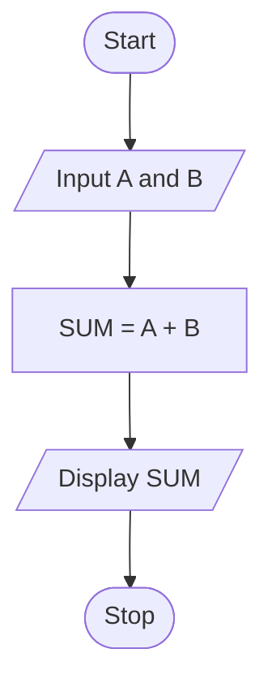
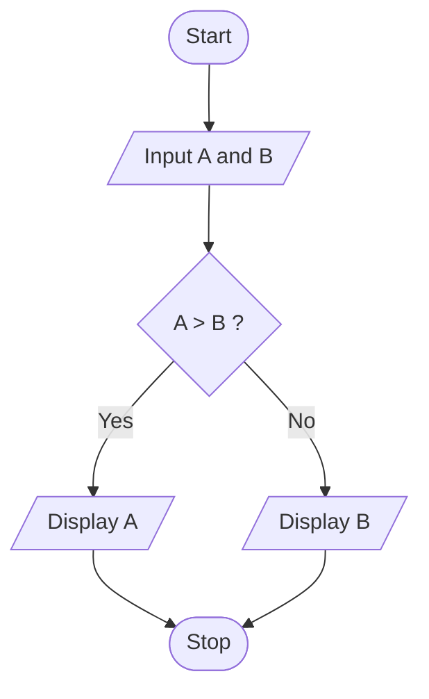
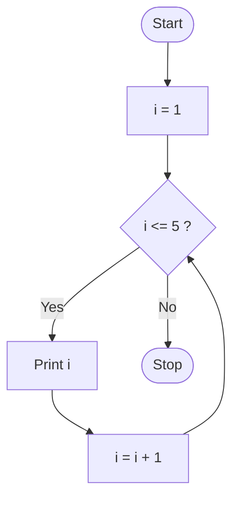
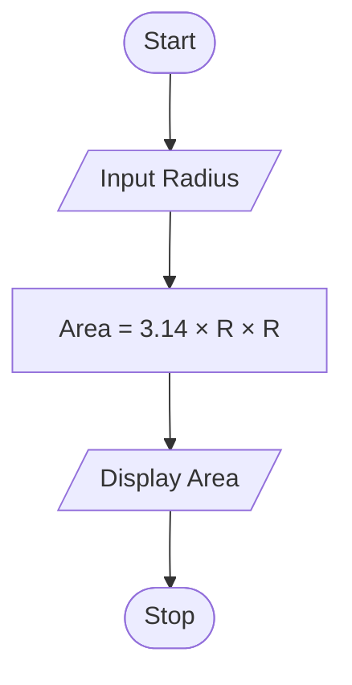
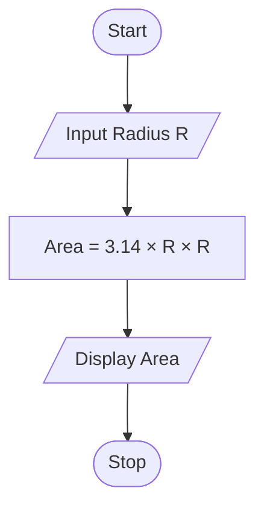
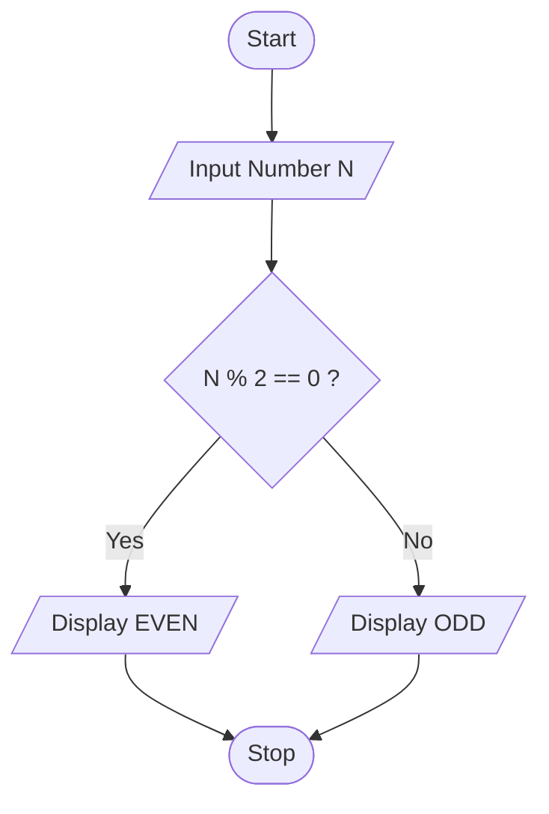

# 📚 BCA Semester - 1

## 💻 Problem Solving Methodologies & Programming in C

> **Subject Code:** BCA-101  
> **Course:** Bachelor of Computer Applications (BCA)  
> **Semester:** 1

---

# 📑 Unit 1 : Introduction of C Language

## *Introduction of C Language*

- Introduction to Programming
- Various Computer Languages
- History & Overview of C Language
- Difference between Traditional C and Modern C
- C Character Set
- C Tokens
  - Keywords
  - Constants
  - Strings
  - Identifiers & Variables
  - Operators
- Operators & Hierarchy of Operators
- Data Types in C
- Type Casting & Type Conversion
- Pre-Processors in C

## *Introduction To Logic Development Tools*

- Introduction of Logic & Basics of Algorithm
- Basics of Flow Chart
- Dry-Run and its Use
- Other Logic Development Techniques
  - Algorithm Based Programming
  - Flowchart Based Programming

---

# Introduction to Programming

## Definition

Programming is the process of designing, writing, testing, and maintaining a set of instructions that tells a computer how to perform specific tasks. These instructions are written in a programming language that the computer can understand and execute.

A computer cannot perform any task on its own. It requires a sequence of instructions called a **program**. The process of creating these programs is known as **programming**.

---

## Why Programming is Important?

Programming is used to:

- Develop software applications
- Create websites and web applications
- Develop mobile applications
- Process and analyze data
- Control hardware devices
- Automate repetitive tasks
- Create games and multimedia applications
- Develop artificial intelligence systems

Without programming, computers would not be able to perform useful operations.

---

## Basic Components of Programming

### 1. Problem Analysis

Before writing a program, the programmer must understand the problem clearly.

**Example:**
If the task is to calculate the average marks of students, the programmer must know:
- Input required (marks)
- Processing required (sum and average)
- Output required (average marks)

---

### 2. Algorithm

An algorithm is a step-by-step procedure to solve a problem.

**Example: Algorithm to Find Sum of Two Numbers**

1. Start
2. Read two numbers
3. Add the numbers
4. Display the result
5. Stop

---

### 3. Flowchart

A flowchart is a graphical representation of an algorithm using symbols.

Common symbols:

| Symbol | Purpose |
|----------|----------|
| Oval | Start/Stop |
| Rectangle | Process |
| Parallelogram | Input/Output |
| Diamond | Decision |
| Arrow | Flow of Control |

---

### 4. Coding

Coding is the process of converting an algorithm into a programming language such as C, C++, Java, or Python.

**Example (C Program):**

```c
#include<stdio.h>

int main()
{
    int a = 10;
    int b = 20;

    printf("Sum = %d", a + b);

    return 0;
}
```

---

### 5. Testing and Debugging

After writing a program, it is tested to identify and remove errors.

#### Types of Errors

##### Syntax Error

Occurs when programming rules are violated.

```c
printf("Hello World")
```

Missing semicolon causes a syntax error.

---

##### Runtime Error

Occurs while the program is running.

**Example:**

Division by zero.

---

##### Logical Error

Program runs successfully but produces incorrect output.

**Example:**

Using subtraction instead of addition.

---

## Characteristics of a Good Program

A good program should be:

- Correct
- Efficient
- Readable
- Reliable
- Maintainable
- Reusable
- User-Friendly

---

## Programming Development Cycle

The programming development cycle consists of:

1. Problem Identification
2. Problem Analysis
3. Algorithm Design
4. Flowchart Preparation
5. Coding
6. Compilation
7. Testing
8. Debugging
9. Documentation
10. Maintenance

---

## Advantages of Programming

- Automates tasks
- Saves time and effort
- Increases accuracy
- Improves productivity
- Enables software development
- Helps solve complex problems

---

## Applications of Programming

Programming is used in:

- Banking Systems
- Educational Software
- Healthcare Systems
- E-Commerce Websites
- Mobile Applications
- Video Games
- Scientific Research
- Artificial Intelligence
- Robotics
- Cloud Computing

---

## Conclusion

Programming is the process of creating instructions that enable computers to perform specific tasks. It plays a vital role in software development, automation, scientific research, business applications, and modern technology. Understanding programming fundamentals is the first step toward becoming a successful software developer.

---

# Various Computer Languages

## Introduction

A computer language is a medium of communication between a programmer and a computer. It consists of a set of rules, symbols, keywords, and syntax used to write programs.

Since computers understand only machine-level instructions, various programming languages have been developed to make programming easier and more efficient.

---

## Classification of Computer Languages

Computer languages are generally classified into three categories:

1. Machine Language
2. Assembly Language
3. High-Level Language

---

## 1. Machine Language

### Definition

Machine language is the lowest-level programming language consisting of binary digits (0 and 1).

The computer directly understands and executes machine language instructions without any translator.

### Example

```text
10110000 01100001
```

---

### Characteristics

- Written in binary form
- Directly executed by the CPU
- Hardware dependent
- Difficult for humans to understand

---

### Advantages

- Fast execution
- No translator required
- Efficient memory usage

---

### Disadvantages

- Difficult to write
- Difficult to debug
- Difficult to maintain
- Machine dependent

---

## 2. Assembly Language

### Definition

Assembly language uses mnemonic codes instead of binary instructions.

It is easier than machine language but still closely related to hardware.

### Example

```assembly
MOV A, B
ADD A, C
```

---

### Characteristics

- Uses symbolic instructions
- Requires an assembler
- Machine dependent
- Faster than high-level languages

---

### Advantages

- Easier than machine language
- Efficient execution
- Better hardware control

---

### Disadvantages

- Machine dependent
- Complex for large programs
- Requires knowledge of computer architecture

---

## 3. High-Level Language

### Definition

High-level languages use English-like statements, making them easier to learn, write, and understand.

These languages require a compiler or interpreter to convert source code into machine code.

### Examples

- C
- C++
- Java
- Python
- C#
- JavaScript

---

### Example

```c
#include<stdio.h>

int main()
{
    printf("Hello World");
    return 0;
}
```

---

### Characteristics

- Easy to learn
- Portable
- User-friendly
- Machine independent

---

### Advantages

- Easy coding
- Easy debugging
- Faster development
- Better readability
- Easier maintenance

---

### Disadvantages

- Slower execution compared to low-level languages
- Requires translators
- Less hardware control

---

## Comparison of Computer Languages

| Feature | Machine Language | Assembly Language | High-Level Language |
|----------|-----------------|------------------|--------------------|
| Representation | Binary Digits | Mnemonic Codes | English-like Statements |
| Ease of Use | Very Difficult | Difficult | Easy |
| Speed | Very Fast | Fast | Comparatively Slower |
| Translator | Not Required | Assembler | Compiler/Interpreter |
| Portability | No | No | Yes |
| Hardware Dependency | High | High | Low |

---

## Generations of Programming Languages

### First Generation Language (1GL)

- Machine Language
- Binary Instructions

### Second Generation Language (2GL)

- Assembly Language
- Mnemonic Instructions

### Third Generation Language (3GL)

- C, C++, Java, Python
- Procedural Languages

### Fourth Generation Language (4GL)

- SQL
- Database-Oriented Languages

### Fifth Generation Language (5GL)

- Artificial Intelligence Languages
- Logic-Based Programming

---

## Translators Used in Programming

### Compiler

Converts the entire program into machine code at once.

**Examples:**
- C Compiler
- C++ Compiler

---

### Interpreter

Converts and executes one statement at a time.

**Examples:**
- Python
- JavaScript

---

### Assembler

Converts assembly language into machine language.

---

# History & Overview of C Language

## Introduction

C is a general-purpose, procedural, and structured programming language. It is one of the most popular programming languages in the world and is widely used for system programming, application development, embedded systems, operating systems, and software development.

C is often called the **"Mother of Programming Languages"** because many modern programming languages such as C++, Java, C#, JavaScript, PHP, and Python have been influenced by C.

---

## History of C Language

### Early Programming Languages

Before C was developed, programmers used languages such as:

- Machine Language
- Assembly Language
- FORTRAN
- COBOL
- ALGOL
- BCPL

These languages had limitations related to portability, flexibility, and ease of programming.

---

### Development of BCPL

In 1967, **:contentReference[oaicite:0]{index=0}** developed **BCPL (Basic Combined Programming Language)** for system programming.

BCPL was simple and efficient but lacked advanced features.

---

### Development of B Language

In 1970, **:contentReference[oaicite:1]{index=1}** developed the **B Language** at :contentReference[oaicite:2]{index=2}.

B language was derived from BCPL and was mainly used for developing system software.

However, B language had limitations because it did not support data types effectively.

---

### Birth of C Language

In 1972, **:contentReference[oaicite:3]{index=3}** developed the **C Programming Language** at :contentReference[oaicite:4]{index=4}.

C was developed as an improvement over B language and introduced many powerful features such as:

- Data Types
- Operators
- Structured Programming
- Functions
- Pointers

These features made programming more efficient and flexible.

---

### UNIX and C Language

One of the major reasons for the popularity of C was the development of the **:contentReference[oaicite:5]{index=5} Operating System**.

Most parts of UNIX were rewritten in C language, demonstrating that C could be used for system programming effectively.

This greatly increased the popularity of C throughout the world.

---

## Standardization of C

As C became popular, different versions of C appeared. To maintain consistency, standard versions were introduced.

### K&R C (1978)

Published by:

- :contentReference[oaicite:6]{index=6}
- :contentReference[oaicite:7]{index=7}

The book **:contentReference[oaicite:8]{index=8}** became the standard reference for C programming.

This version is commonly known as **Traditional C** or **K&R C**.

---

### ANSI C (C89)

In 1989, the **:contentReference[oaicite:9]{index=9}** standardized C.

This version became known as:

- ANSI C
- C89

Benefits:

- Standard syntax
- Better portability
- Consistent compiler behavior

---

### C90

In 1990, the **:contentReference[oaicite:10]{index=10}** adopted ANSI C as an international standard known as C90.

---

### C99

Released in 1999 with improvements such as:

- New Data Types
- Inline Functions
- Single Line Comments (`//`)
- Variable Declaration Anywhere

---

### C11

Released in 2011 with features including:

- Multithreading Support
- Improved Type Checking
- Better Security Features

---

### C18

Released in 2018 mainly for bug fixes and standard improvements.

---

## Overview of C Language

### Definition

C is a high-level, structured, procedural programming language used to develop software and system applications.

It provides low-level memory access while maintaining high-level programming capabilities.

---

## Features of C Language

### 1. Simple Language

C contains a small number of keywords and simple syntax, making it easy to learn.

---

### 2. Structured Language

Programs can be divided into functions and modules, improving readability and maintenance.

---

### 3. Portable

Programs written in C can run on different platforms with minimal modifications.

---

### 4. Efficient and Fast

C programs execute quickly and consume less memory.

---

### 5. Rich Library Functions

C provides many built-in functions through header files.

Examples:

```c
printf()
scanf()
strlen()
sqrt()
```

---

### 6. Supports Pointers

Pointers allow direct memory access and efficient memory management.

---

### 7. Extensible

Users can create their own functions and libraries.

---

### 8. Middle-Level Language

C combines features of both:

- High-Level Languages
- Low-Level Languages

Therefore, it is called a **Middle-Level Language**.

---

## Applications of C Language

C is widely used in:

### System Software

- Operating Systems
- Device Drivers

### Application Software

- Text Editors
- Media Players

### Embedded Systems

- Microcontrollers
- IoT Devices

### Database Systems

- Database Engines

### Networking Software

- Network Utilities
- Communication Tools

### Compiler Development

- Programming Language Compilers

---

## Advantages of C Language

- Easy to learn
- Fast execution
- Portable
- Efficient memory usage
- Structured programming support
- Rich library functions
- Suitable for system programming

---

## Limitations of C Language

- No Object-Oriented Programming
- No Automatic Garbage Collection
- Limited Runtime Checking
- No Exception Handling

---

## Conclusion

C language was developed by Dennis Ritchie in 1972 at Bell Laboratories. It became highly popular due to its efficiency, portability, and ability to develop system software such as UNIX. Even today, C remains one of the most important programming languages and serves as the foundation for many modern languages.

---

# Difference Between Traditional C and Modern C

## Introduction

C language has evolved significantly over time. The earliest version of C is known as **Traditional C (K&R C)**, while newer standardized versions such as **ANSI C, C99, C11, and C18** are collectively referred to as **Modern C**.

Modern C provides better safety, portability, readability, and programming features compared to Traditional C.

---

## Traditional C (K&R C)

### Definition

Traditional C refers to the original version of C described in the book:

**:contentReference[oaicite:11]{index=11}**

written by:

- :contentReference[oaicite:12]{index=12}
- :contentReference[oaicite:13]{index=13}

This version existed before ANSI standardization.

### Characteristics

- No official standard
- Limited type checking
- Function prototypes generally not used
- Less portable
- Fewer language features
- Compiler-dependent behavior

---

## Modern C

### Definition

Modern C refers to standardized versions of C:

- ANSI C (C89)
- C90
- C99
- C11
- C18

These versions provide a standard set of rules followed by modern compilers.

### Characteristics

- Standardized language
- Better portability
- Stronger type checking
- Improved syntax
- Enhanced library support
- Additional language features

---

## Comparison Between Traditional C and Modern C

| Feature | Traditional C (K&R C) | Modern C |
|----------|----------------------|----------|
| Standardization | No Official Standard | ANSI/ISO Standard |
| Function Prototypes | Generally Not Used | Supported |
| Type Checking | Limited | Better Type Checking |
| Portability | Less Portable | Highly Portable |
| Comments | `/* */` Only | `/* */` and `//` |
| Variable Declaration | Beginning of Block Only | Anywhere Inside Block |
| Library Support | Limited | Extensive |
| Security Features | Less Secure | More Secure |
| Compiler Compatibility | Compiler Dependent | Standardized |
| Code Maintenance | Difficult | Easier |

---

## Example of Traditional C

```c
main()
{
    printf("Hello World");
}
```

Problems:

- No return type specified
- No function prototype
- Less strict compiler checking

---

## Example of Modern C

```c
#include<stdio.h>

int main()
{
    printf("Hello World");
    return 0;
}
```

Advantages:

- Proper return type
- Standard syntax
- Better portability
- Better compiler validation

---

## Advantages of Modern C Over Traditional C

- Improved readability
- Better error detection
- Enhanced portability
- Stronger type safety
- More language features
- Better maintenance
- Standardized development

---

# C Character Set

## Introduction

A **Character Set** is a collection of valid characters that can be used to write a C program. Every keyword, variable name, constant, operator, and statement in C is formed using characters from the C character set.

C language recognizes the following categories of characters.

---

## 1. Alphabets

C supports uppercase and lowercase English letters.

### Uppercase Letters

```text
A B C D E F G H I J K L M
N O P Q R S T U V W X Y Z
```

### Lowercase Letters

```text
a b c d e f g h i j k l m
n o p q r s t u v w x y z
```

**Example**

```c
int age;
char Name;
```

---

## 2. Digits

Digits from 0 to 9 are allowed.

```text
0 1 2 3 4 5 6 7 8 9
```

**Example**

```c
int marks = 90;
```

---

## 3. Special Characters

Special symbols used in C programs.

```text
+  -  *  /  %  =  <  >
(  )  {  }  [  ]
;  ,  .  :  '  "
#  &  !  ?  ^
```

**Example**

```c
a = b + c;
```

---

## 4. White Space Characters

Used to improve readability.

- Space
- Tab (`\t`)
- New Line (`\n`)
- Carriage Return (`\r`)

**Example**

```c
int a = 10;
int b = 20;
```

---

## Importance of Character Set

- Forms the basic building blocks of C programs.
- Used to create variables, constants, operators, and keywords.
- Helps the compiler understand program instructions.

---

# C Tokens

## Introduction

The smallest individual unit of a C program is called a **Token**.

A C program is made up of different tokens.

### Types of Tokens

1. Keywords
2. Identifiers
3. Variables
4. Constants
5. Strings
6. Operators

---

# 1. Keywords

## Definition

Keywords are reserved words that have predefined meanings in C.

These words cannot be used as variable names.

---

## Common Keywords

```c
int
float
char
double
if
else
for
while
switch
break
continue
return
void
```

---

## Example

```c
int age = 20;
float salary = 25000.50;
```

Here:

- `int` → Keyword
- `float` → Keyword

---

# 2. Identifiers

## Definition

Identifiers are names given to variables, functions, arrays, structures, etc.

---

## Syntax

```text
identifier_name
```

---

## Rules for Identifiers

✅ Can contain letters, digits, and underscore.

✅ Must begin with a letter or underscore.

✅ Cannot contain spaces.

✅ Cannot be a keyword.

---

## Valid Identifiers

```c
student
student_name
rollNo
_marks
```

---

## Invalid Identifiers

```c
1name
student name
float
```

---

## Example

```c
int studentAge = 18;
```

`studentAge` is an identifier.

---

# 3. Variables

## Definition

A variable is a named memory location used to store data.

---

## Syntax

```c
data_type variable_name;
```

---

## Example

```c
int age;
float salary;
char grade;
```

---

## Variable Initialization

```c
int age = 20;
```

---

## Complete Program Example

```c
#include<stdio.h>

int main()
{
    int age = 20;

    printf("Age = %d", age);

    return 0;
}
```

---

# 4. Constants

## Definition

Constants are fixed values that do not change during program execution.

---

## Types of Constants

### Integer Constants

```c
10
25
500
```

---

### Floating Constants

```c
10.5
25.75
3.14
```

---

### Character Constants

```c
'A'
'B'
'Z'
```

---

### String Constants

```c
"Hello"
"Welcome"
"C Language"
```

---

## Example

```c
int age = 20;
float pi = 3.14;
```

---

# 5. Strings

## Definition

A string is a collection of characters enclosed within double quotation marks.

---

## Syntax

```c
"Text"
```

---

## Examples

```c
"Hello"
"Programming"
"Welcome to C"
```

---

## Program Example

```c
#include<stdio.h>

int main()
{
    char name[] = "Rohan";

    printf("%s", name);

    return 0;
}
```

---

# 6. Operators

## Definition

Operators are symbols used to perform operations on operands.

---

## Syntax

```c
operand operator operand
```

---

## Example

```c
a + b
```

Here:

- a → Operand
- + → Operator
- b → Operand

---

# Operators in C

## 1. Arithmetic Operators

Used for mathematical calculations.

| Operator | Meaning | Example |
|----------|----------|----------|
| + | Addition | a + b |
| - | Subtraction | a - b |
| * | Multiplication | a * b |
| / | Division | a / b |
| % | Modulus | a % b |

---

### Example Program

```c
#include<stdio.h>

int main()
{
    int a = 20;
    int b = 10;

    printf("Addition = %d\n", a + b);
    printf("Subtraction = %d\n", a - b);
    printf("Multiplication = %d\n", a * b);
    printf("Division = %d\n", a / b);
    printf("Modulus = %d\n", a % b);

    return 0;
}
```

---

## 2. Relational Operators

Used for comparison.

| Operator | Meaning |
|----------|----------|
| == | Equal To |
| != | Not Equal To |
| > | Greater Than |
| < | Less Than |
| >= | Greater Than Equal To |
| <= | Less Than Equal To |

---

### Example

```c
int a = 10;
int b = 20;

printf("%d", a < b);
```

Output:

```text
1
```

---

## 3. Logical Operators

Used to combine conditions.

| Operator | Meaning |
|----------|----------|
| && | Logical AND |
| \|\| | Logical OR |
| ! | Logical NOT |

---

### Example

```c
int age = 20;

if(age > 18 && age < 60)
{
    printf("Eligible");
}
```

---

## 4. Assignment Operators

| Operator | Example |
|----------|----------|
| = | a = 5 |
| += | a += 5 |
| -= | a -= 5 |
| *= | a *= 5 |
| /= | a /= 5 |

---

### Example

```c
int a = 10;

a += 5;

printf("%d", a);
```

Output:

```text
15
```

---

## 5. Increment and Decrement Operators

| Operator | Meaning |
|----------|----------|
| ++ | Increment |
| -- | Decrement |

---

### Example

```c
int a = 10;

a++;

printf("%d", a);
```

Output:

```text
11
```

---

## 6. Conditional Operator

### Syntax

```c
condition ? expression1 : expression2;
```

### Example

```c
int a = 10;
int b = 20;

int max = (a > b) ? a : b;

printf("%d", max);
```

---

## 7. Bitwise Operators

| Operator | Meaning |
|----------|----------|
| & | AND |
| \| | OR |
| ^ | XOR |
| ~ | NOT |
| << | Left Shift |
| >> | Right Shift |

---

### Example

```c
int a = 5;
int b = 3;

printf("%d", a & b);
```

---

# Hierarchy (Precedence) of Operators

## Definition

Operator hierarchy determines the order in which operations are performed when multiple operators appear in an expression.

Operators with higher precedence are evaluated before operators with lower precedence.

---

## Important Precedence Table

| Priority | Operators |
|-----------|-----------|
| 1 | () |
| 2 | ++ -- |
| 3 | * / % |
| 4 | + - |
| 5 | < <= > >= |
| 6 | == != |
| 7 | && |
| 8 | \|\| |
| 9 | ?: |
| 10 | = += -= *= /= |

---

## Example 1

```c
int result = 10 + 5 * 2;
```

Evaluation:

```text
10 + (5 * 2)
10 + 10
20
```

Output:

```text
20
```

---

## Example 2

```c
int result = (10 + 5) * 2;
```

Evaluation:

```text
(10 + 5) * 2
15 * 2
30
```

Output:

```text
30
```

---

## Program Demonstrating Operator Hierarchy

```c
#include<stdio.h>

int main()
{
    int result;

    result = 10 + 5 * 2;

    printf("Result = %d", result);

    return 0;
}
```

### Output

```text
Result = 20
```

---
# Data Types in C

## Introduction

A **Data Type** specifies the type of data that a variable can store. It tells the compiler:

- What kind of value will be stored.
- How much memory should be allocated.
- What operations can be performed on the data.

Every variable in C must be declared with a data type before it is used.

---

## Syntax

```c
data_type variable_name;
```

### Example

```c
int age;
float salary;
char grade;
```

---

# Why Data Types are Required?

Data types help:

- Allocate memory efficiently.
- Improve program performance.
- Prevent invalid operations.
- Ensure correct data storage.

---

# Classification of Data Types in C

Data types in C are mainly classified into:

1. Basic (Primary) Data Types
2. Derived Data Types
3. User-Defined Data Types
4. Void Data Type

---

# 1. Basic (Primary) Data Types

These are built-in data types provided by C.

| Data Type | Description | Example |
|------------|-------------|----------|
| int | Integer Numbers | 10, 25 |
| char | Single Character | 'A', 'B' |
| float | Decimal Numbers | 10.5 |
| double | Large Decimal Numbers | 10.123456 |
| void | No Value | Function Return Type |

---

## Integer Data Type (int)

Used to store whole numbers.

### Syntax

```c
int variable_name;
```

### Example

```c
int age = 20;
int marks = 95;
```

### Program

```c
#include<stdio.h>

int main()
{
    int age = 20;

    printf("Age = %d", age);

    return 0;
}
```

### Output

```text
Age = 20
```

---

## Character Data Type (char)

Used to store a single character.

### Syntax

```c
char variable_name;
```

### Example

```c
char grade = 'A';
```

### Program

```c
#include<stdio.h>

int main()
{
    char grade = 'A';

    printf("Grade = %c", grade);

    return 0;
}
```

### Output

```text
Grade = A
```

---

## Float Data Type (float)

Used to store decimal values.

### Syntax

```c
float variable_name;
```

### Example

```c
float price = 99.99;
```

### Program

```c
#include<stdio.h>

int main()
{
    float price = 99.99;

    printf("Price = %.2f", price);

    return 0;
}
```

### Output

```text
Price = 99.99
```

---

## Double Data Type (double)

Used for storing large decimal values with greater precision.

### Syntax

```c
double variable_name;
```

### Example

```c
double pi = 3.1415926535;
```

### Program

```c
#include<stdio.h>

int main()
{
    double pi = 3.1415926535;

    printf("%lf", pi);

    return 0;
}
```

### Output

```text
3.141593
```

---

# Type Modifiers

Type modifiers change the size or range of data types.

| Modifier | Example |
|-----------|----------|
| short | short int |
| long | long int |
| signed | signed int |
| unsigned | unsigned int |

---

### Example

```c
unsigned int age = 25;
long int population = 1000000;
```

---

# 2. Derived Data Types

Derived from basic data types.

Examples:

- Arrays
- Pointers
- Functions

### Array Example

```c
int marks[5];
```

### Pointer Example

```c
int *ptr;
```

---

# 3. User-Defined Data Types

Created by programmers.

Examples:

- struct
- union
- enum
- typedef

### Structure Example

```c
struct Student
{
    int rollNo;
    char name[20];
};
```

---

# 4. Void Data Type

The void data type represents the absence of value.

### Example

```c
void display()
{
    printf("Hello");
}
```

---

# Format Specifiers for Data Types

| Data Type | Format Specifier |
|------------|------------------|
| int | %d |
| char | %c |
| float | %f |
| double | %lf |
| string | %s |

---

# Type Casting & Type Conversion

## Introduction

Sometimes a program requires converting one data type into another data type.

This process is known as **Type Conversion** or **Type Casting**.

---

# Type Conversion

## Definition

Automatic conversion of one data type into another by the compiler is called **Type Conversion**.

It is also known as **Implicit Type Conversion**.

---

## Example

```c
int a = 10;
float b;

b = a;
```

### Explanation

```text
Integer 10
      ↓
Float 10.000000
```

The compiler automatically converts the integer value into a float.

---

## Program

```c
#include<stdio.h>

int main()
{
    int a = 10;
    float b;

    b = a;

    printf("%f", b);

    return 0;
}
```

### Output

```text
10.000000
```

---

# Type Casting

## Definition

Manual conversion of one data type into another by the programmer is called **Type Casting**.

It is also known as **Explicit Type Conversion**.

---

## Syntax

```c
(data_type) expression
```

---

## Example

```c
float result;

result = (float)5 / 2;
```

---

### Explanation

Without type casting:

```c
5 / 2
```

Output:

```text
2
```

Because integer division occurs.

---

With type casting:

```c
(float)5 / 2
```

Output:

```text
2.500000
```

---

## Program

```c
#include<stdio.h>

int main()
{
    float result;

    result = (float)5 / 2;

    printf("%f", result);

    return 0;
}
```

### Output

```text
2.500000
```

---

# Example of Type Casting from Float to Integer

```c
float price = 99.99;

int value = (int)price;
```

### Result

```text
99.99 → 99
```

Decimal part is removed.

---

## Difference Between Type Conversion and Type Casting

| Type Conversion | Type Casting |
|----------------|--------------|
| Automatic | Manual |
| Done by Compiler | Done by Programmer |
| Implicit Conversion | Explicit Conversion |
| No Special Syntax | Requires Cast Operator |
| Less Control | More Control |

---

# Pre-Processors in C

## Introduction

A **Preprocessor** is a program that processes source code before the actual compilation begins.

Preprocessor directives start with the `#` symbol.

The preprocessor executes these directives before passing the code to the compiler.

---

## Characteristics of Preprocessor Directives

- Begin with `#`
- Executed before compilation
- Do not end with semicolon (`;`)
- Used for file inclusion, macros, and conditional compilation

---

## Syntax

```c
#directive
```

---

# Common Preprocessor Directives

| Directive | Purpose |
|------------|----------|
| #include | Include Header Files |
| #define | Define Constants/Macros |
| #undef | Undefine Macros |
| #if | Conditional Compilation |
| #ifdef | Check Macro Defined |
| #ifndef | Check Macro Not Defined |
| #else | Alternative Condition |
| #endif | End Condition |

---

# 1. #include Directive

Used to include header files.

## Syntax

```c
#include<header_file>
```

or

```c
#include "file_name"
```

---

## Example

```c
#include<stdio.h>
```

Here:

- `stdio.h` is a header file.
- Contains declarations of input/output functions.

---

## Program

```c
#include<stdio.h>

int main()
{
    printf("Hello World");

    return 0;
}
```

---

# 2. #define Directive

Used to define constants and macros.

## Syntax

```c
#define name value
```

---

## Example

```c
#define PI 3.14
```

---

## Program

```c
#include<stdio.h>

#define PI 3.14

int main()
{
    float area;

    area = PI * 5 * 5;

    printf("%f", area);

    return 0;
}
```

---

# Macro Example

## Syntax

```c
#define MACRO(parameters) expression
```

---

## Example

```c
#define SQUARE(x) ((x) * (x))
```

---

## Program

```c
#include<stdio.h>

#define SQUARE(x) ((x) * (x))

int main()
{
    printf("%d", SQUARE(5));

    return 0;
}
```

### Output

```text
25
```

---

# 3. Conditional Compilation

Allows compiling specific portions of code based on conditions.

---

## Example

```c
#define TEST

#ifdef TEST

printf("Testing Mode");

#endif
```

---

# 4. #ifndef Directive

Checks whether a macro is not defined.

### Example

```c
#ifndef VALUE
#define VALUE 100
#endif
```

---

# Advantages of Preprocessors

- Reduces code repetition
- Improves readability
- Makes programs easier to maintain
- Supports conditional compilation
- Simplifies file inclusion

---

# Introduction To Logic Development Tools

Logic Development Tools are techniques used to analyze a problem and design a solution before writing the actual program code.

These tools help programmers:

- Understand the problem clearly.
- Design an efficient solution.
- Reduce coding errors.
- Improve program readability.
- Simplify testing and debugging.

The most commonly used logic development tools are:

1. Algorithm
2. Flowchart
3. Dry Run
4. Pseudocode

---

# Introduction of Logic & Basics of Algorithm

## What is Logic?

Logic is a step-by-step thinking process used to solve a problem systematically.

Before writing any program, a programmer must think about:

- What input is required?
- What processing is required?
- What output is expected?

This thinking process is known as **Program Logic**.

---

## Example of Logic

### Problem

Find the sum of two numbers.

### Logic

```text
1. Accept two numbers.
2. Add both numbers.
3. Display the result.
```

---

# What is an Algorithm?

## Definition

An Algorithm is a finite sequence of well-defined steps used to solve a specific problem.

It acts as a blueprint of a program.

Before coding, programmers usually design an algorithm to understand the solution clearly.

---

## Characteristics of a Good Algorithm

### 1. Finiteness

Algorithm must terminate after a finite number of steps.

### 2. Definiteness

Every step should be clear and unambiguous.

### 3. Input

An algorithm may accept zero or more inputs.

### 4. Output

It should produce at least one output.

### 5. Effectiveness

Each step should be practical and executable.

---

# General Structure of Algorithm

```text
Step 1 : Start
Step 2 : Input Data
Step 3 : Process Data
Step 4 : Display Result
Step 5 : Stop
```

---

# Example 1: Algorithm to Add Two Numbers

```text
Algorithm : Addition

Step 1 : Start
Step 2 : Read A and B
Step 3 : SUM = A + B
Step 4 : Display SUM
Step 5 : Stop
```

---

# Example 2: Algorithm to Find Largest Number

```text
Algorithm : Largest Number

Step 1 : Start
Step 2 : Read A and B
Step 3 : If A > B
            Display A
         Else
            Display B
Step 4 : Stop
```

---

# Advantages of Algorithm

- Easy to understand
- Language independent
- Easy debugging
- Helps in program planning
- Easy modification

---

# Limitations of Algorithm

- Time-consuming for complex problems
- Becomes lengthy for large programs
- No visual representation

---

# Basics of Flow Chart

## Definition

A Flowchart is a graphical representation of an algorithm.

It uses standard symbols connected by arrows to show the sequence of operations.

Flowcharts help programmers visualize the logic before coding.

---

# Why Flowcharts are Used?

- Better understanding of logic
- Easy communication among developers
- Easy debugging
- Easy maintenance
- Visual representation of problem-solving process

---

# Common Flowchart Symbols

| Symbol | Name | Purpose |
|----------|----------|----------|
| Oval | Terminal | Start / Stop |
| Rectangle | Process | Calculation / Processing |
| Parallelogram | Input / Output | Read or Display Data |
| Diamond | Decision | Condition Checking |
| Arrow | Flow Line | Direction of Control |

---

# Flowchart Symbol Diagram

```text
 ┌───────────┐
 │   START   │
 └───────────┘
       │
       ▼
 ┌───────────┐
 │  INPUT    │
 └───────────┘
       │
       ▼
 ┌───────────┐
 │ PROCESS   │
 └───────────┘
       │
       ▼
 ┌───────────┐
 │  OUTPUT   │
 └───────────┘
       │
       ▼
 ┌───────────┐
 │   STOP    │
 └───────────┘
```

---

# Mermaid Flowchart Diagram

## Flowchart for Addition of Two Numbers



---

# Visual Representation

```text
      ┌─────────┐
      │ START   │
      └────┬────┘
           │
           ▼
    ┌─────────────┐
    │ Input A,B   │
    └─────┬───────┘
          │
          ▼
    ┌─────────────┐
    │ SUM=A+B     │
    └─────┬───────┘
          │
          ▼
    ┌─────────────┐
    │ Display SUM │
    └─────┬───────┘
          │
          ▼
      ┌─────────┐
      │ STOP    │
      └─────────┘
```

---

# Decision Making Flowchart

## Problem

Find the largest number between A and B.

---

## Mermaid Diagram



---

## Visual Representation

```text
           ┌─────────┐
           │ START   │
           └────┬────┘
                │
                ▼
       ┌────────────────┐
       │ Input A and B  │
       └───────┬────────┘
               │
               ▼
         ┌──────────┐
         │ A > B ?  │
         └───┬───┬──┘
           Yes   No
            │     │
            ▼     ▼
      ┌────────┐ ┌────────┐
      │Print A │ │Print B │
      └────┬───┘ └───┬────┘
           │         │
           └────┬────┘
                ▼
          ┌─────────┐
          │  STOP   │
          └─────────┘
```

---

# Loop Flowchart Example

## Problem

Print numbers from 1 to 5.

---

## Mermaid Diagram



---

# Visual Representation

```text
        ┌─────────┐
        │ START   │
        └────┬────┘
             │
             ▼
        ┌─────────┐
        │ i = 1   │
        └────┬────┘
             │
             ▼
       ┌───────────┐
       │ i <= 5 ?  │◄───────┐
       └───┬───┬───┘        │
         Yes   No           │
          │     │           │
          ▼     ▼           │
    ┌────────┐ ┌─────────┐  │
    │Print i │ │  STOP   │  │
    └────┬───┘ └─────────┘  │
         │                  │
         ▼                  │
    ┌────────┐              │
    │ i=i+1  │──────────────┘
    └────────┘
```

---

# Advantages of Flowcharts

- Easy to understand
- Better visualization
- Simplifies debugging
- Easy communication
- Helps in documentation
- Useful for large projects

---

# Limitations of Flowcharts

- Time-consuming to draw
- Difficult to modify large flowcharts
- Complex diagrams become confusing
- Requires standard symbols

---

# Difference Between Algorithm and Flowchart

| Algorithm | Flowchart |
|------------|------------|
| Written in steps | Graphical representation |
| Easy to write | Easy to visualize |
| Less attractive | More attractive |
| Suitable for small problems | Suitable for complex problems |
| Text-based | Diagram-based |

---

# Dry-Run and Its Use

## Introduction

A **Dry-Run** is the process of manually executing a program, algorithm, or flowchart step-by-step without running it on a computer.

It is used to check the correctness of logic and to identify errors before actual implementation.

In a dry-run, the programmer traces the values of variables and observes how the program behaves for a given input.

---

## Definition

> A Dry-Run is a manual testing technique in which a programmer executes a program or algorithm step-by-step on paper to verify its correctness.

---

# Why is Dry-Run Important?

Dry-run helps programmers to:

- Understand program logic.
- Verify algorithm correctness.
- Detect logical errors.
- Predict output before execution.
- Improve debugging skills.
- Reduce coding mistakes.

---

# Steps of Dry-Run

1. Read the algorithm or program.
2. Assume input values.
3. Execute each statement manually.
4. Track variable values.
5. Record intermediate results.
6. Verify final output.

---

# Example 1: Dry-Run of Addition Program

## Program

```c
#include<stdio.h>

int main()
{
    int a = 10;
    int b = 20;
    int sum;

    sum = a + b;

    printf("%d", sum);

    return 0;
}
```

---

## Dry-Run Table

| Step | a | b | sum |
|--------|----|----|------|
| Initial | 10 | 20 | - |
| sum=a+b | 10 | 20 | 30 |
| Output | 10 | 20 | 30 |

---

## Output

```text
30
```

---

# Example 2: Dry-Run of Largest Number Program

## Algorithm

```text
Step 1 : Read A and B
Step 2 : If A > B
            Display A
         Else
            Display B
```

---

## Input

```text
A = 15
B = 10
```

---

## Dry-Run Table

| Step | A | B | Condition |
|--------|----|----|------------|
| Input | 15 | 10 | - |
| Check | 15 | 10 | 15 > 10 (True) |
| Output | 15 | 10 | Display 15 |

---

## Result

```text
15
```

---

# Example 3: Dry-Run of Loop

## Program

```c
int i;

for(i=1; i<=5; i++)
{
    printf("%d ", i);
}
```

---

## Dry-Run Table

| Iteration | i | Condition |
|------------|----|------------|
| 1 | 1 | True |
| 2 | 2 | True |
| 3 | 3 | True |
| 4 | 4 | True |
| 5 | 5 | True |
| 6 | 6 | False |

---

## Output

```text
1 2 3 4 5
```

---

# Advantages of Dry-Run

- No computer required.
- Helps identify logical errors.
- Improves understanding of code.
- Useful during interviews and exams.
- Reduces debugging time.

---

# Limitations of Dry-Run

- Time-consuming for large programs.
- Difficult for complex algorithms.
- Human mistakes may occur while tracing.

---

# Applications of Dry-Run

- Program testing
- Algorithm verification
- Flowchart validation
- Logic checking
- Interview problem solving

---

# Other Logic Development Techniques

## Introduction

Before writing a program, programmers use various techniques to develop and verify logic.

These techniques help in:

- Understanding problems
- Designing solutions
- Reducing errors
- Improving efficiency

Common logic development techniques include:

1. Algorithm
2. Flowchart
3. Pseudocode
4. Decision Table
5. Decision Tree

---

# 1. Algorithm Based Programming

## Definition

Algorithm-based programming involves designing a step-by-step solution before writing the actual code.

The algorithm acts as a blueprint for the program.

---

## General Algorithm Structure

```text
Start
Input
Process
Output
Stop
```

---

## Example: Algorithm to Find Area of Circle

```text
Algorithm : Area of Circle

Step 1 : Start
Step 2 : Read Radius (R)
Step 3 : Area = 3.14 × R × R
Step 4 : Display Area
Step 5 : Stop
```

---

## Advantages of Algorithm-Based Programming

- Easy to understand.
- Language independent.
- Easy debugging.
- Easy modification.
- Helps in planning.

---

## Disadvantages of Algorithm-Based Programming

- Time-consuming for large systems.
- No graphical representation.
- Lengthy for complex problems.

---

# Algorithm Diagram



---

# 2. Flowchart Based Programming

## Definition

Flowchart-based programming uses graphical symbols to represent program logic before coding.

The flowchart visually describes the sequence of operations and decisions.

---

## Standard Flowchart Symbols

| Symbol | Meaning |
|----------|----------|
| Oval | Start / Stop |
| Rectangle | Process |
| Parallelogram | Input / Output |
| Diamond | Decision |
| Arrow | Flow Direction |

---

## Example: Flowchart for Area of Circle

### Mermaid Diagram



---

## Visual Flowchart

```text
      ┌─────────┐
      │ START   │
      └────┬────┘
           │
           ▼
    ┌─────────────┐
    │ Input R     │
    └─────┬───────┘
          │
          ▼
    ┌─────────────┐
    │ Area=3.14   │
    │ × R × R     │
    └─────┬───────┘
          │
          ▼
    ┌─────────────┐
    │Display Area │
    └─────┬───────┘
          │
          ▼
      ┌─────────┐
      │ STOP    │
      └─────────┘
```

---

# Example: Flowchart for Even/Odd Number



---

# Comparison: Algorithm vs Flowchart

| Feature | Algorithm | Flowchart |
|------------|------------|------------|
| Representation | Text-Based | Diagram-Based |
| Understanding | Moderate | Easy |
| Preparation Time | Less | More |
| Modification | Easy | Difficult |
| Visualization | No | Yes |
| Suitable For | Small Problems | Complex Problems |

---


