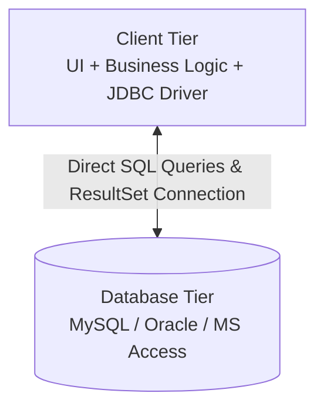
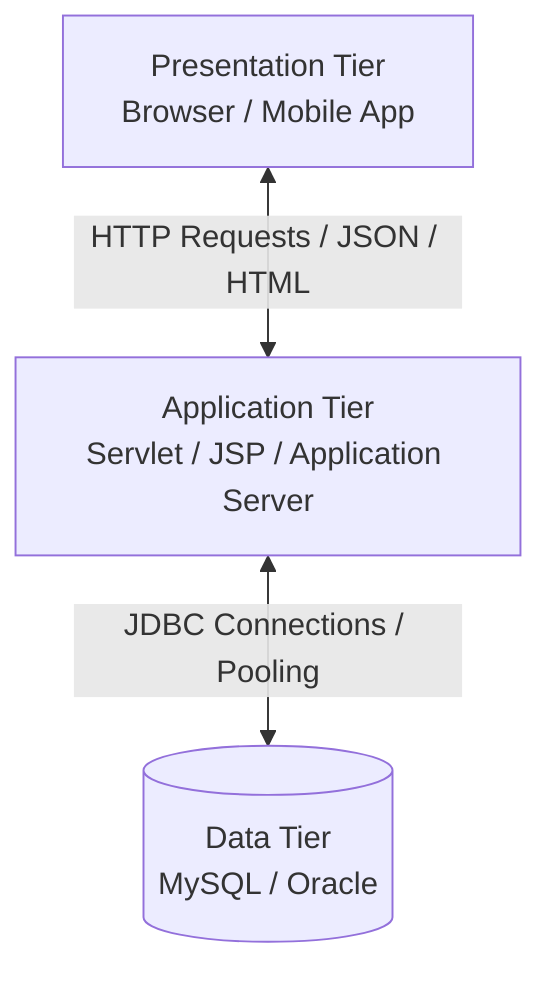
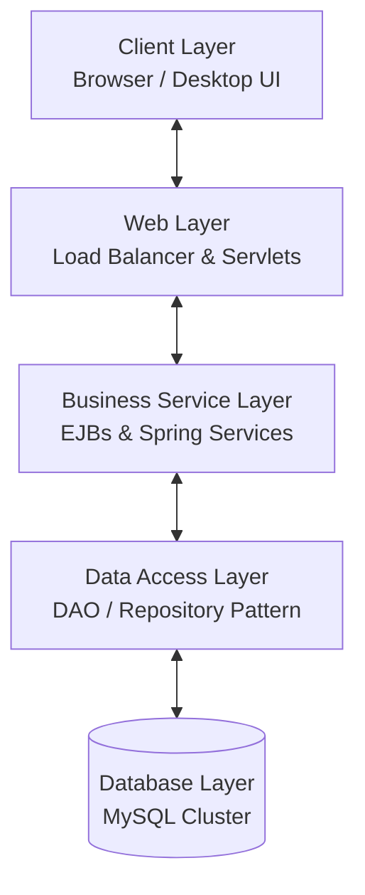
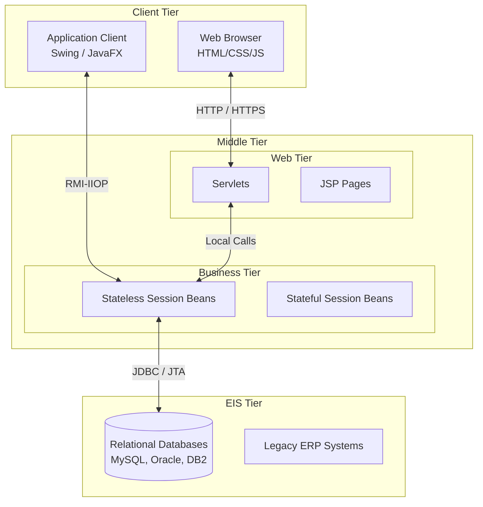
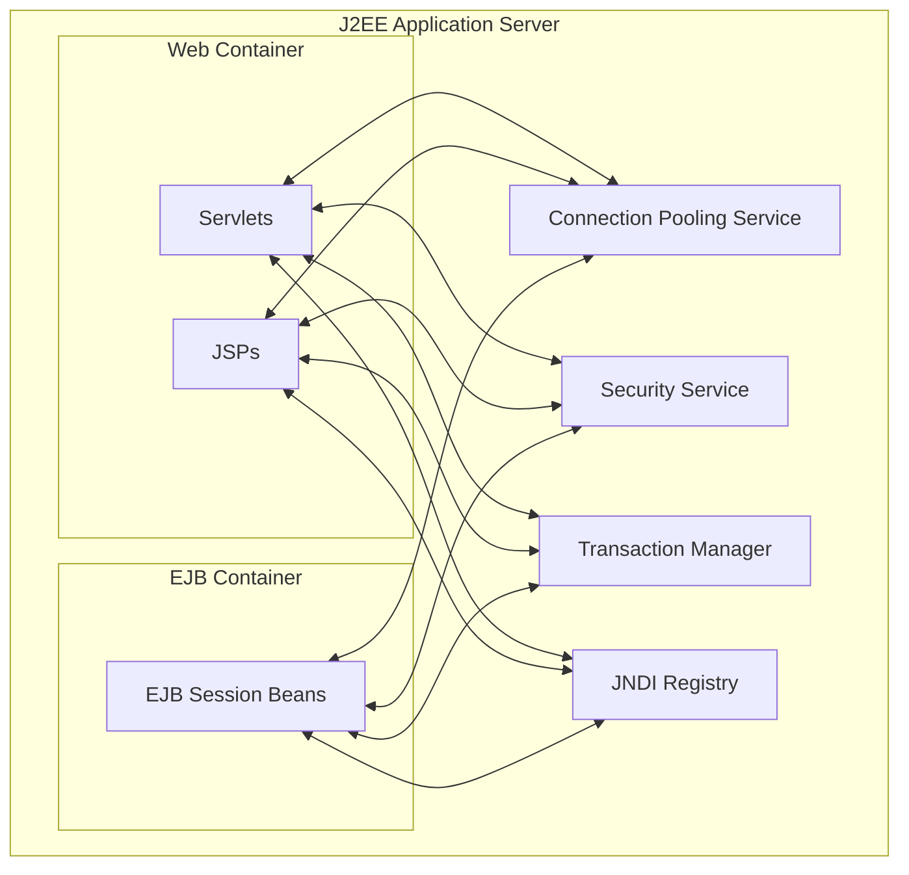
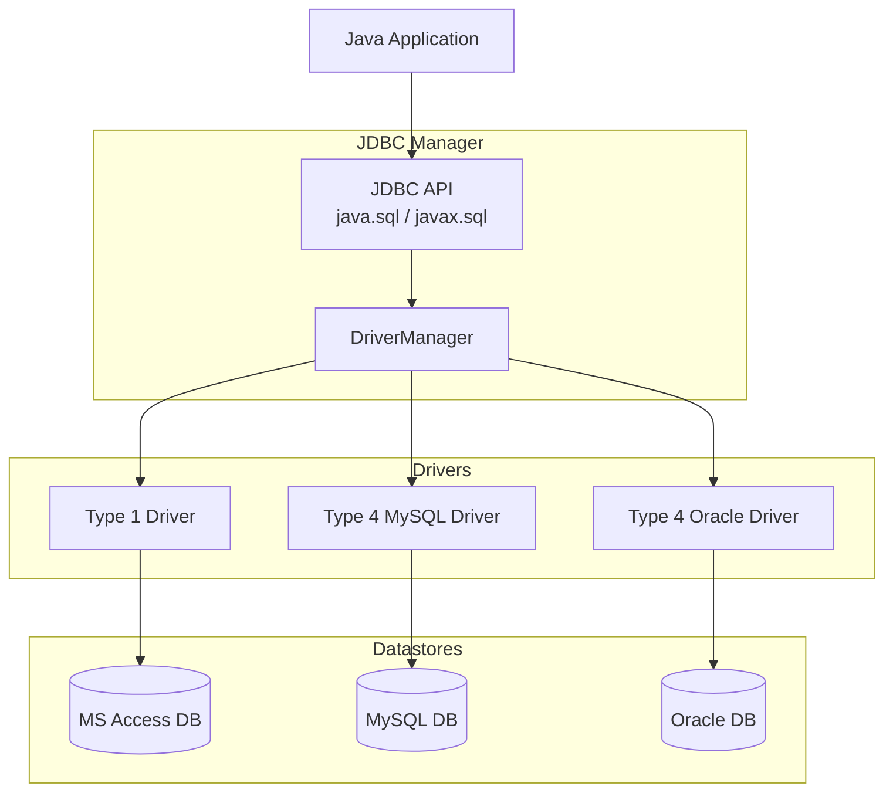
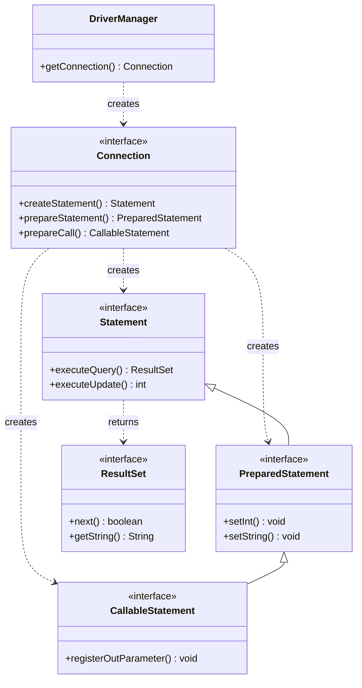

# 📚 BCA Semester - 1

## 💻 Advanced Java and J2EE 
> **Subject Code:** BCA-101  
> **Course:** Bachelor of Computer Applications (BCA)  
> **Semester:** 5

---

# 📑 Unit 1 : Introduction to J2EE

## *Topics*
- Introduction to J2EE
- Enterprise Architecture Styles
  - Two-Tier Architecture
  - Three-Tier Architecture
  - N-Tier Architecture
- J2EE Architecture
- The J2EE Platform
- Introduction to J2EE APIs
  - Servlet
  - JSP
  - EJB
  - JMS
- Introduction to Containers
- Introduction of JDBC
- JDBC Architecture
- Data Types in JDBC
- Database Exception Handling
- JDBC Introduction and Need for JDBC
- Types of JDBC Drivers
- JDBC API for Database Connectivity
  - java.sql Package
- JDBC Statements
  - Statement
  - PreparedStatement
  - CallableStatement
- ResultSetMetaData
- DatabaseMetaData
- Connecting with Databases
  - MySQL
  - Access
  - Oracle

---

# Introduction to J2EE

## What is J2EE?

**J2EE (Java 2 Platform, Enterprise Edition)**, now known as Jakarta EE, is a set of specifications, APIs, and runtime environments developed by Sun Microsystems (now Oracle) for building multi-tiered, large-scale, secure, distributed, and network-centric enterprise applications. 

Unlike standard desktop applications (Java SE), J2EE targets server-side applications that support hundreds or thousands of concurrent users, handle complex transactions, integrate with legacy databases, and run in distributed environments.

## Features of J2EE

- **Platform Independence**: Inherits Java's "Write Once, Run Anywhere" (WORA) capability, allowing J2EE applications to run on any server environment that supports the J2EE specifications.
- **Component-Based Architecture**: J2EE divides application logic into reusable components (like Servlets, JSPs, and EJBs) that reside on different tiers.
- **Enterprise-Level Security**: Provides a robust security model out-of-the-box, including declarative security configurations, role-based access control (RBAC), and SSL encryption support.
- **Transaction Management**: Integrates transaction services (Java Transaction API - JTA) to manage complex operations across multiple databases and applications, ensuring ACID properties.
- **Distributed Computing Support**: Leverages RMI (Remote Method Invocation) and IIOP protocols to enable components on different physical servers to communicate seamlessly.
- **Database Connectivity**: Employs JDBC (Java Database Connectivity) and JPA (Java Persistence API) to provide reliable, standard database integration.
- **Scalability and Reliability**: Designed to handle load balancing, thread pooling, and clustering through enterprise containers.

## Need for J2EE

Traditional client-server applications (such as desktop applications communicating directly with a database) face significant challenges in an enterprise environment:
1. **Concurrency**: Desktop databases cannot handle millions of simultaneous transactions without performance degradation.
2. **Maintenance**: Business logic embedded in client applications is difficult to update since updates must be deployed to every single user machine.
3. **Security**: Allowing direct client access to databases exposes connection strings and structural schemas, creating security vulnerabilities.
4. **Integration**: Enterprise operations require integrating heterogeneous systems (e.g., MySQL, Oracle database, mainframe systems, and messaging brokers).

J2EE solves these issues by placing a middle tier (Web and Business layers) to intercept client requests, execute centralized business logic, enforce secure role checks, manage database connections efficiently via connection pools, and orchestrate complex enterprise messaging.

## Advantages of J2EE

1. **Faster Development Cycles**: Pre-built services (security, transaction, and thread management) allow developers to focus entirely on writing business logic.
2. **Flexible Deployment (Vendor Independence)**: Because J2EE is a standard specification, applications can be deployed on a wide range of compliant application servers (such as IBM WebSphere, Oracle WebLogic, WildFly, or Apache GlassFish) without changing the core codebase.
3. **Optimized Resource Management**: Containers handle system resource allocation, thread pooling, connection pooling, and bean instances dynamically.
4. **High Scalability**: Supports vertical scaling (upgrading server hardware) and horizontal scaling (clustering multiple servers with load balancers) without architecture redesigns.
5. **Decoupled System Tiers**: Allows teams to develop the front-end interface, business logic, and database layer independently.

---

# Enterprise Architecture Styles

Enterprise application architectures define how client applications, processing servers, and databases interact. They are categorized based on the separation of these concerns.

## Two-Tier Architecture

### Definition
In a **Two-Tier Architecture**, the system is split into two components: the client application and the database server. The client application runs the User Interface (UI) and all the Business Logic, and directly connects to the Database Tier using JDBC.

### Architecture Diagram


### Components
1. **Client Tier**:
   - Manages input fields, forms, and tables.
   - Computes calculations, handles validation rules, and constructs SQL queries.
   - Maintains connection credentials and drives the connection.
2. **Database Tier**:
   - Executes incoming SQL queries, indexes tables, maintains constraints, and returns raw data rows.

### Complete Java Example of a Two-Tier Setup
This standalone application handles UI presentation, validation, business rules, and database communication all within a single class, representing a traditional Two-Tier structure.

```java
package com.bca.twotier;

import java.sql.Connection;
import java.sql.DriverManager;
import java.sql.PreparedStatement;
import java.sql.ResultSet;
import java.sql.SQLException;
import java.util.Scanner;

public class TwoTierApp {
    // Database credentials embedded directly in client app
    private static final String DB_URL = "jdbc:mysql://localhost:3306/college_db";
    private static final String DB_USER = "root";
    private static final String DB_PASS = "password";

    public static void main(String[] args) {
        Scanner scanner = new Scanner(System.in);
        System.out.println("=== Student Enrollment System (2-Tier Architecture) ===");
        System.out.print("Enter Student ID: ");
        int id = scanner.nextInt();
        scanner.nextLine(); // Consume newline character

        System.out.print("Enter Student Name: ");
        String name = scanner.nextLine();

        // 1. Business Logic / Validation executed directly in the Client
        if (name == null || name.trim().isEmpty()) {
            System.err.println("Validation Error: Name cannot be blank!");
            return;
        }

        // 2. Direct Database Connectivity from Client
        String insertSQL = "INSERT INTO students (id, name) VALUES (?, ?)";
        String selectSQL = "SELECT * FROM students WHERE id = ?";

        try (Connection conn = DriverManager.getConnection(DB_URL, DB_USER, DB_PASS)) {
            // Disable auto-commit for transaction logic controlled on client
            conn.setAutoCommit(false);

            try (PreparedStatement insertStmt = conn.prepareStatement(insertSQL)) {
                insertStmt.setInt(1, id);
                insertStmt.setString(2, name);
                int rows = insertStmt.executeUpdate();
                System.out.println("Client Logic: Row inserted. Rows affected: " + rows);
                conn.commit(); // Commit transaction
            } catch (SQLException e) {
                conn.rollback();
                throw e;
            }

            // Retrieve and display record
            try (PreparedStatement selectStmt = conn.prepareStatement(selectSQL)) {
                selectStmt.setInt(1, id);
                try (ResultSet rs = selectStmt.executeQuery()) {
                    if (rs.next()) {
                        System.out.println("\n--- Query Output ---");
                        System.out.println("Student ID: " + rs.getInt("id"));
                        System.out.println("Student Name: " + rs.getString("name"));
                    }
                }
            }
        } catch (SQLException e) {
            System.err.println("Database Exception occurred: " + e.getMessage());
            e.printStackTrace();
        } finally {
            scanner.close();
        }
    }
}
```

### Advantages
- Simple to build and deploy for small-scale applications.
- Extremely low response times due to direct communication (no intermediate server hops).
- Cost-effective setup with fewer physical servers.

### Disadvantages
- **Poor Scalability**: Every client maintains a dedicated connection to the database. Databases quickly run out of available socket descriptors.
- **Security Vulnerabilities**: Database credentials and schemas must be distributed to each client machine.
- **High Maintenance Cost**: Any changes to validation rules, business logic, or database structure require deploying a new client executable to all client machines.

---

## Three-Tier Architecture

### Definition
In a **Three-Tier Architecture**, a middle tier (called the Application Server or Web Server) is introduced between the Client Tier (Presentation) and the Database Tier (Data Storage). The client application sends UI events to the middle tier, which processes the business rules and interacts with the database.

### Architecture Diagram


### Components
1. **Presentation Tier (Client/Browser)**: Formats inputs, manages button clicks, displays HTML/JSON payloads, and sends HTTP requests. Examples: Google Chrome, Android App.
2. **Application Tier (Business Logic Layer)**: Runs Servlets, JSP pages, or Spring Controllers. It intercepts requests, validates sessions, runs domain logic, and routes transactions.
3. **Data Tier (Storage Layer)**: Relational Database Management Systems (RDBMS) or NoSQL databases. Handles raw query optimization, index configurations, and persistent tables.

### Advantages
- **Robust Security**: The client never directly touches the database. All operations must pass through validation logic on the application server.
- **High Maintainability**: Updating business logic, adding rules, or switching target database servers is done entirely on the central application tier. Clients are unaffected.
- **Scalability (Connection Pooling)**: The middle tier uses connection pooling, sharing a small pool of database connections among thousands of clients.

### Disadvantages
- Higher complexity and development overhead.
- Increased latency due to data traversing an additional server layer.
- Increased deployment complexity and server infrastructure costs.

---

## N-Tier Architecture

### Definition
An **N-Tier Architecture** generalizes the Three-Tier style by dividing the application tier into multiple, highly specialized layers (e.g., Presentation Layer, Web Controller Layer, Business Service Layer, Data Access Objects Layer, Microservices Layer, and Enterprise Integration Systems).

### Architecture Diagram


### Components
1. **Client Layer**: Manages views, styles, and front-end rendering engines.
2. **Presentation/Web Layer**: Receives HTTP parameters, handles session management, and coordinates page routing.
3. **Business/Service Layer**: Encapsulates enterprise rules, transaction boundaries, and orchestration of sub-services.
4. **Data Access Layer (DAO)**: Translates database rows into Java Objects (Entities) using ORM tools or DAO patterns.
5. **Database Layer**: Enterprise clusters hosting raw database engines.

### Advantages
- Highly modular; different development teams can own individual layers.
- Individual tiers can be scaled independently (e.g., running 5 web servers, 10 business servers, and a master-slave database cluster).
- Reusable services: A single Business Service Layer can serve a web client, a mobile client, and third-party partner integrations.

### Disadvantages
- High deployment and debugging complexity.
- Hard to trace exceptions as they bubble up across many layers.
- High hardware overhead and server license costs.

---

## Architecture Styles Comparison Matrix

| Feature | Two-Tier | Three-Tier | N-Tier |
|:---|:---|:---|:---|
| **Structure** | Client ↔ DB | Client ↔ App Server ↔ DB | Client ↔ Web ↔ Business ↔ DAO ↔ DB |
| **Logic Location** | Client Side | App Server Side | Segmented into Dedicated Layers |
| **Scalability** | Low | High | Excellent / Elastic |
| **Security** | Low (Credentials on Client) | High (Firewall around DB) | Maximum (Per-layer security policies) |
| **Maintenance** | Difficult (Deploy to all clients) | Easy (Centralized update) | Highly Modulated |
| **Setup Cost** | Very Low | Moderate | High (Needs load balancers & clusters) |

---

# J2EE Architecture

The J2EE platform follows an N-Tier architecture model where application components are deployed across different systems.



## Tiers of J2EE Architecture

### 1. Client Tier
Runs on the client machine (desktop, browser, mobile). It translates user inputs into requests and renders server outputs.
- **Web Clients**: Thin clients consisting of dynamic HTML pages rendered by web browsers. They use HTTP/HTTPS to communicate with the Web Container.
- **Application Clients**: Thick clients written in Java (using Swing, JavaFX, or command-line apps) that run inside an Application Client Container, allowing direct remote access to EJBs using RMI-IIOP.

### 2. Web Tier
Runs on the middle tier inside a Web Container. It processes incoming requests, tracks client sessions, and prepares the final interface layout.
- **Servlets**: Java classes that handle HTTP request-response patterns dynamically.
- **JSP (JavaServer Pages)**: Template files that mix HTML with Java expressions to simplify UI rendering.

### 3. Business Tier
Runs on the middle tier inside an EJB Container. It forms the core engine of the enterprise application, executing transactions and business workflows.
- **Session Beans**: Handle client-specific processes (can be stateful, stateless, or singleton).
- **Message-Driven Beans (MDB)**: Process asynchronous message packets dispatched from message queues.

### 4. EIS Tier (Enterprise Information System Tier)
The database and repository layer, handling persistent data records.
- **Relational Databases (RDBMS)**: Storing structured datasets (MySQL, Oracle, PostgreSQL).
- **Enterprise Resource Planning (ERP)**: Integrating third-party SAP, mainframe systems, or CRM systems.

---

# The J2EE Platform

The J2EE Platform provides a complete specification defining how middleware platforms run, deploy, and manage distributed components. The core of the J2EE platform is defined by standard component specifications, container environments, and standard J2EE APIs.

## Key APIs & Technologies inside J2EE

| J2EE API / Tech | Package Namespace | Primary Purpose |
|:---|:---|:---|
| **Servlet** | `javax.servlet` & `javax.servlet.http` | Intercept HTTP requests and produce dynamic responses. |
| **JSP** | `javax.servlet.jsp` | Template-driven markup page rendering. |
| **EJB** | `javax.ejb` | Distributed enterprise business logic component framework. |
| **JDBC** | `java.sql` & `javax.sql` | Connect, execute SQL queries, and manage database pools. |
| **JMS** | `javax.jms` | Reliable, asynchronous message queue and publish/subscribe client API. |
| **JNDI** | `javax.naming` | Directory lookup for database resources, mail sessions, and remote beans. |
| **JTA** | `javax.transaction` | Manage distributed transactions across heterogeneous datasources. |
| **JavaMail** | `javax.mail` | Send and receive SMTP, IMAP, and POP3 emails. |

---

# Introduction to J2EE APIs (with Full, Runnable Code Examples)

This section provides complete, runnable Java code examples for the main J2EE APIs, showing how they operate in enterprise applications.

---

## 1. Servlet

A **Servlet** is a Java class that extends `HttpServlet`, compiled and executed by a Web Container to generate dynamic HTML responses.

### Lifecycle of a Servlet
1. **Loading and Instantiation**: The container loads the servlet class and instantiates it.
2. **Initialization (`init()`)**: The container calls the `init()` method once to initialize configuration parameters.
3. **Request Handling (`service()`)**: For every client request, the container spawns a thread and invokes the `service()` method, which routes requests to `doGet()`, `doPost()`, etc.
4. **Destruction (`destroy()`)**: The container invokes `destroy()` before garbage collecting the servlet instance to release resources.

### Complete Java Code: `RegistrationServlet.java`
This servlet processes a form submission, performs business validation, and generates a dynamic HTML response page.

```java
package com.bca.servlet;

import java.io.IOException;
import java.io.PrintWriter;
import javax.servlet.ServletException;
import javax.servlet.annotation.WebServlet;
import javax.servlet.http.HttpServlet;
import javax.servlet.http.HttpServletRequest;
import javax.servlet.http.HttpServletResponse;

// Annotation configuration replacing web.xml servlet mappings
@WebServlet(name = "RegistrationServlet", urlPatterns = {"/register"})
public class RegistrationServlet extends HttpServlet {
    private static final long serialVersionUID = 1L;

    @Override
    public void init() throws ServletException {
        // Run once during servlet instantiation
        System.out.println("RegistrationServlet has been initialized!");
    }

    @Override
    protected void doGet(HttpServletRequest request, HttpServletResponse response) 
            throws ServletException, IOException {
        // Serve a registration form when accessed via GET request
        response.setContentType("text/html;charset=UTF-8");
        try (PrintWriter out = response.getWriter()) {
            out.println("<!DOCTYPE html>");
            out.println("<html>");
            out.println("<head><title>Student Registration</title></head>");
            out.println("<body>");
            out.println("<h2>Registration Form</h2>");
            out.println("<form action='register' method='POST'>");
            out.println("Name: <input type='text' name='studentName'/><br/><br/>");
            out.println("Email: <input type='email' name='studentEmail'/><br/><br/>");
            out.println("<input type='submit' value='Register'/>");
            out.println("</form>");
            out.println("</body>");
            out.println("</html>");
        }
    }

    @Override
    protected void doPost(HttpServletRequest request, HttpServletResponse response) 
            throws ServletException, IOException {
        // Process form parameters when submitted via POST request
        String name = request.getParameter("studentName");
        String email = request.getParameter("studentEmail");

        response.setContentType("text/html;charset=UTF-8");
        try (PrintWriter out = response.getWriter()) {
            out.println("<!DOCTYPE html>");
            out.println("<html>");
            out.println("<head><title>Registration Result</title></head>");
            out.println("<body>");
            
            // Business logic & validation
            if (name == null || name.trim().isEmpty() || email == null || email.trim().isEmpty()) {
                out.println("<h3 style='color:red;'>Error: Name and Email cannot be empty!</h3>");
                out.println("<a href='register'>Try Again</a>");
            } else {
                out.println("<h3 style='color:green;'>Registration Successful!</h3>");
                out.println("<p>Welcome, " + name + "</p>");
                out.println("<p>Registered Email: " + email + "</p>");
            }
            
            out.println("</body>");
            out.println("</html>");
        }
    }

    @Override
    public void destroy() {
        // Run once prior to removing servlet from container
        System.out.println("RegistrationServlet has been destroyed!");
    }
}
```

### Corresponding `web.xml` Configuration (Alternative to Annotation)
If you do not use `@WebServlet`, you must register your servlet in the `/WEB-INF/web.xml` deployment descriptor:

```xml
<?xml version="1.0" encoding="UTF-8"?>
<web-app xmlns="http://xmlns.jcp.org/xml/ns/javaee"
         xmlns:xsi="http://www.w3.org/2001/XMLSchema-instance"
         xsi:schemaLocation="http://xmlns.jcp.org/xml/ns/javaee 
                             http://xmlns.jcp.org/xml/ns/javaee/web-app_3_1.xsd"
         version="3.1">

    <servlet>
        <servlet-name>RegistrationServlet</servlet-name>
        <servlet-class>com.bca.servlet.RegistrationServlet</servlet-class>
    </servlet>

    <servlet-mapping>
        <servlet-name>RegistrationServlet</servlet-name>
        <url-pattern>/register</url-pattern>
    </servlet-mapping>

</web-app>
```

---

## 2. JSP (JavaServer Pages)

**JSP** is a presentation technology built on top of Servlets. JSPs are text documents written with HTML markup intermixed with JSP elements, scripting tags, action tags, and Expression Language (EL).

When a JSP is requested:
1. The Web Container translates the `.jsp` page into a Java source file (which implements `HttpJspPage`).
2. The Web Container compiles the generated source file into a servlet `.class` file.
3. The Web Container executes the compiled servlet class to handle client requests.

### Complete Code: `studentPortal.jsp`
This script showcases the main JSP tags: directives, declarations, scriptlets, expressions, and the use of action tags.

```jsp
<%@ page language="java" contentType="text/html; charset=UTF-8" pageEncoding="UTF-8"%>
<%@ page import="java.util.Date" %>
<!DOCTYPE html>
<html>
<head>
    <meta charset="UTF-8">
    <title>JSP Student Portal</title>
</head>
<body>

    <h1>Welcome to the BCA Student Portal</h1>

    <!-- 1. JSP Declaration Tag: Declares page-level variables or helper methods -->
    <%! 
        private int visitCount = 0; 
        
        public synchronized int incrementVisit() {
            return ++visitCount;
        }
    %>

    <!-- 2. JSP Scriptlet Tag: Contains standard Java statements execution -->
    <%
        String username = request.getParameter("user");
        if (username == null || username.trim().isEmpty()) {
            username = "Guest User";
        }
        
        Date today = new Date();
        int activeVisits = incrementVisit();
    %>

    <!-- 3. JSP Expression Tag: Directly writes output to the client -->
    <p>Logged in as: <strong><%= username %></strong></p>
    <p>Current Server Timestamp: <strong><%= today.toString() %></strong></p>
    <p>This portal page instance has been loaded <strong><%= activeVisits %></strong> times during this container lifespan.</p>

    <!-- 4. JSP Action Tag: Using JavaBeans dynamically inside JSP -->
    <jsp:useBean id="studentBean" class="com.bca.jsp.StudentBean" scope="request" />
    <jsp:setProperty name="studentBean" property="name" value="Rahul Sharma" />
    <jsp:setProperty name="studentBean" property="course" value="BCA Semester 5" />

    <h3>Student Details loaded from Bean:</h3>
    <ul>
        <li>Name: <jsp:getProperty name="studentBean" property="name" /></li>
        <li>Course: <jsp:getProperty name="studentBean" property="course" /></li>
    </ul>

</body>
</html>
```

### Helper Student Bean class for JSP (`StudentBean.java`)
```java
package com.bca.jsp;

import java.io.Serializable;

public class StudentBean implements Serializable {
    private static final long serialVersionUID = 1L;
    private String name;
    private String course;

    public StudentBean() {
        // No-arg constructor required for JSP Beans
    }

    public String getName() {
        return name;
    }

    public void setName(String name) {
        this.name = name;
    }

    public String getCourse() {
        return course;
    }

    public void setCourse(String course) {
        this.course = course;
    }
}
```

---

## 3. EJB (Enterprise JavaBeans)

**EJB** is a component architecture for building distributed business logic components. The EJB Container handles transactions, persistence, security, and lifecycle events automatically.
- **Session Beans**: Represent business workflows.
  - *Stateless*: No state is maintained between client invocations.
  - *Stateful*: State is preserved across multiple requests from the same client.
  - *Singleton*: A single shared instance per application.
- **Message-Driven Beans**: Handle asynchronous messaging.

### Complete EJB Implementation Code

#### Step A: Remote Business Interface (`Calculator.java`)
```java
package com.bca.ejb;

import javax.ejb.Remote;

@Remote
public interface Calculator {
    int add(int a, int b);
    int subtract(int a, int b);
}
```

#### Step B: EJB Bean Class implementation (`CalculatorBean.java`)
```java
package com.bca.ejb;

import javax.ejb.Stateless;

@Stateless(name = "CalculatorBean")
public class CalculatorBean implements Calculator {

    @Override
    public int add(int a, int b) {
        System.out.println("EJB executing addition: " + a + " + " + b);
        return a + b;
    }

    @Override
    public int subtract(int a, int b) {
        System.out.println("EJB executing subtraction: " + a + " - " + b);
        return a - b;
    }
}
```

#### Step C: JNDI Client Program invoking EJB (`EJBClient.java`)
```java
package com.bca.ejb;

import java.util.Properties;
import javax.naming.Context;
import javax.naming.InitialContext;
import javax.naming.NamingException;

public class EJBClient {
    public static void main(String[] args) {
        try {
            // Set up JNDI properties to connect to EJB Container
            Properties props = new Properties();
            props.put(Context.INITIAL_CONTEXT_FACTORY, "org.wildfly.naming.client.WildFlyInitialContextFactory");
            props.put(Context.PROVIDER_URL, "http-remoting://localhost:8080");

            Context context = new InitialContext(props);
            
            // JNDI Lookup syntax for EJB Bean (Wildfly app server syntax)
            String jndiLookupName = "ejb:/EJB-App/CalculatorBean!com.bca.ejb.Calculator";
            
            System.out.println("Looking up EJB Calculator bean...");
            Calculator calc = (Calculator) context.lookup(jndiLookupName);
            
            // Invoke business methods
            int sum = calc.add(15, 25);
            int diff = calc.subtract(50, 18);
            
            System.out.println("EJB Addition Result: " + sum);
            System.out.println("EJB Subtraction Result: " + diff);
            
            context.close();
        } catch (NamingException e) {
            System.err.println("JNDI Naming Lookup failed: " + e.getMessage());
            e.printStackTrace();
        }
    }
}
```

---

## 4. JMS (Java Message Service)

**JMS** is an API that allows Java applications to create, send, receive, and read messages asynchronously.
- **Point-to-Point (Queue)**: Messages are sent to a queue. Only one receiver processes the message, and it is removed from the queue.
- **Publish-Subscribe (Topic)**: Messages are sent to a topic. All active subscribers receive a copy of the message.

### Complete Point-to-Point Queue Sender Code

```java
package com.bca.jms;

import javax.annotation.Resource;
import javax.jms.Connection;
import javax.jms.ConnectionFactory;
import javax.jms.MessageProducer;
import javax.jms.Queue;
import javax.jms.Session;
import javax.jms.TextMessage;

public class QueueSender {
    // Inject connection factories and queues registered in the application server
    @Resource(mappedName = "java:/ConnectionFactory")
    private static ConnectionFactory connectionFactory;

    @Resource(mappedName = "java:/queue/studentRegistrationQueue")
    private static Queue queue;

    public static void main(String[] args) {
        if (connectionFactory == null || queue == null) {
            System.err.println("JMS Resources not injected! Make sure you are running in an EJB Container.");
            return;
        }

        try (Connection conn = connectionFactory.createConnection();
             Session session = conn.createSession(false, Session.AUTO_ACKNOWLEDGE)) {
             
            // Create a message producer bound to the queue
            MessageProducer producer = session.createProducer(queue);
            
            // Build text message
            TextMessage message = session.createTextMessage();
            message.setText("PAYLOAD: Enroll student ID 205 in Advanced Java class.");
            
            System.out.println("JMS Sender: Dispatching message to queue...");
            producer.send(message);
            System.out.println("JMS Sender: Message dispatched successfully!");
            
        } catch (Exception e) {
            System.err.println("JMS Sender encountered an error: " + e.getMessage());
            e.printStackTrace();
        }
    }
}
```

### Complete Point-to-Point Queue Receiver Code

```java
package com.bca.jms;

import javax.annotation.Resource;
import javax.jms.Connection;
import javax.jms.ConnectionFactory;
import javax.jms.MessageConsumer;
import javax.jms.Queue;
import javax.jms.Session;
import javax.jms.TextMessage;

public class QueueReceiver {

    @Resource(mappedName = "java:/ConnectionFactory")
    private static ConnectionFactory connectionFactory;

    @Resource(mappedName = "java:/queue/studentRegistrationQueue")
    private static Queue queue;

    public static void main(String[] args) {
        if (connectionFactory == null || queue == null) {
            System.err.println("JMS Resources not injected!");
            return;
        }

        try (Connection conn = connectionFactory.createConnection();
             Session session = conn.createSession(false, Session.AUTO_ACKNOWLEDGE)) {
            
            // Create consumer
            MessageConsumer consumer = session.createConsumer(queue);
            
            // Start the connection to deliver messages
            conn.start();
            System.out.println("JMS Receiver: Listening for incoming messages (blocking for 10 seconds)...");
            
            // Read message with a 10000ms timeout
            TextMessage msg = (TextMessage) consumer.receive(10000);
            
            if (msg != null) {
                System.out.println("JMS Receiver Success. Received Message: " + msg.getText());
            } else {
                System.out.println("JMS Receiver: Timeout reached. No messages found in the queue.");
            }
            
        } catch (Exception e) {
            System.err.println("JMS Receiver encountered an error: " + e.getMessage());
            e.printStackTrace();
        }
    }
}
```

---

# Introduction to Containers (J2EE)

In J2EE, a **Container** is a specialized runtime environment that sits between J2EE components and the underlying operating system. It handles system-level services, allowing developers to focus entirely on writing business logic.



## Types of Containers in J2EE

1. **Web Container (Servlet Container)**:
   - Manages the execution of Servlets, JSP pages, and static assets.
   - Handles HTTP request parsing, session tracking, dynamic HTML generation, and page compilation.
   - Examples: Apache Tomcat, Jetty.
2. **EJB Container**:
   - Manages Enterprise JavaBeans (EJBs).
   - Handles transactions, thread management, instance pooling, state management, and security checks.
3. **Application Client Container**:
   - Manages standalone client applications.
   - Provides JVM environments with JNDI access to remote EJBs, security systems, and J2EE resources.
4. **Applet Container**:
   - Managed runtime client environment running within web browsers to execute legacy Applets.

## Container Services

J2EE containers provide several built-in services out-of-the-box:
- **Lifecycle Management**: Automatically creates, initializes, and destroys instances of servlets, JSPs, or beans.
- **Transaction Management**: Manages transaction boundaries (commit, rollback) declaratively using XML descriptors or Java annotations (`@TransactionAttribute`).
- **Security Services**: Restricts access to specific servlet URLs or EJB methods using declarative configurations.
- **Resource Management**: Manages resources like database connection pools and JMS message queues.
- **JNDI Lookup Services**: Provides a naming directory for components to lookup database schemas, mail sessions, or other enterprise resources.

---

# Introduction to JDBC

## What is JDBC?

**JDBC (Java Database Connectivity)** is a standard Java API (part of the Java SE Platform) that allows Java programs to connect to database management systems (DBMS), execute SQL statements, and process query results.

It consists of a set of classes and interfaces written in Java that provide a uniform interface for developers, regardless of the underlying database engine (MySQL, Oracle, SQL Server, etc.).

## Need for JDBC

Prior to JDBC, database vendors used proprietary C/C++ libraries (such as Oracle OCI or Microsoft ODBC) to communicate with their databases. This created several issues:
1. **Vendor Lock-in**: Changing database systems required rewriting the application's data access layer.
2. **Platform Dependency**: ODBC and native vendor libraries were platform-dependent, conflicting with Java's "Write Once, Run Anywhere" philosophy.
3. **Complex API Calls**: Programming with native database APIs was complex, error-prone, and lacked object-oriented design.

JDBC addresses these challenges by:
- Defining standard Java classes (`DriverManager`, `Connection`, `Statement`, `ResultSet`) that work with any database system.
- Standardizing SQL communication: Developers write SQL queries in Java, and the JDBC driver translates them into database-specific commands.

---

# JDBC Architecture

JDBC Architecture follows a **Two-Layer Communication Model**: the **JDBC API** and the **JDBC Driver API**.



## Components of JDBC Architecture

1. **Java Application**: Sends SQL requests to the JDBC API and processes the returned results.
2. **JDBC API (`java.sql` and `javax.sql`)**: Provides the classes and interfaces (such as `Connection`, `Statement`, and `ResultSet`) used to manage database queries from Java.
3. **JDBC Driver Manager (`DriverManager` class)**: Loads database-specific drivers and matches database URLs to establish connections.
4. **JDBC Driver**: Translates standard JDBC method calls into database-specific protocol commands.

---

# Types of JDBC Drivers

JDBC drivers translate generic Java database queries into database-specific protocols. They are categorized into four types:

## 1. Type 1: JDBC-ODBC Bridge Driver

### Concept
Translates JDBC API calls into Microsoft **ODBC (Open Database Connectivity)** driver calls.

```text
Java Application 
      ↓ (JDBC Calls)
JDBC-ODBC Bridge Driver (Type 1)
      ↓ (ODBC Calls)
ODBC Driver
      ↓ (Database Calls)
Database Server
```

### Advantages
- Useful when a database has an ODBC driver but no native JDBC driver (e.g., early versions of MS Access).

### Disadvantages
- **Poor Performance**: Translates calls twice (JDBC to ODBC, then ODBC to native database calls).
- **Not Portable**: Requires installing and configuring ODBC drivers on the client machine.
- **Deprecated**: Removed in Java 8 and no longer supported.

---

## 2. Type 2: Native-API Driver

### Concept
Translates JDBC API calls into native database client C/C++ API calls (such as Oracle OCI libraries).

```text
Java Application
      ↓ (JDBC Calls)
Native-API Driver (Type 2)
      ↓ (C/C++ API Calls)
Native Client Binaries (e.g., oci.dll)
      ↓ (Database Protocol)
Database Server
```

### Advantages
- Higher performance than Type 1 drivers as it bypasses the ODBC translation layer.

### Disadvantages
- **Not Portable**: Requires installing vendor-specific database client libraries on the client machine.
- **Development Overhead**: Bugs in client C-libraries can crash the Java application process.

---

## 3. Type 3: Network Protocol Driver

### Concept
Uses a middleware server to translate JDBC API calls into a database-independent network protocol, which the middleware server then translates into the database's native protocol.

```text
Java Application 
      ↓ (JDBC Net-API Calls)
Network Protocol Driver (Type 3)
      ↓ (Middleware Protocol)
Middleware Server (App Server)
      ↓ (Database Protocol)
Database Server
```

### Advantages
- **High Flexibility**: The client application does not need database-specific drivers, simplifying client-side deployments.
- **Centralized Security**: Allows logging, firewall configurations, and security audits to be configured on a single middleware server.

### Disadvantages
- Requires deploying and maintaining a middleware server.
- Increased network latency.

---

## 4. Type 4: Thin Driver (Pure Java Driver)

### Concept
A pure Java driver that connects directly to the database server using network sockets and the database's native protocol.

```text
Java Application
      ↓ (JDBC Calls)
Type 4 Thin Driver (Pure Java)
      ↓ (Direct Network Protocol Socket)
Database Server
```

### Advantages
- **Highest Performance**: Connects directly to the database, bypassing middle-tier translation layers.
- **Fully Portable**: No client-side software configuration or middleware server installation is required. Just package the driver JAR file with the application.
- **Standard Choice**: The standard driver type used in modern enterprise Java applications.

### Disadvantages
- Requires a separate, database-specific driver library for each database engine.

---

## Driver Types Comparison Matrix

| Criteria | Type 1 (Bridge) | Type 2 (Native-API) | Type 3 (Net-Protocol) | Type 4 (Thin) |
|:---|:---|:---|:---|:---|
| **Language** | Native + Java | Native + Java | Pure Java | Pure Java |
| **Direct connection?** | No (via ODBC) | No (via Client Library) | No (via Middleware) | Yes (direct socket) |
| **Performance** | Low | Moderate | Moderate | High |
| **Client Software Needed** | ODBC Manager & Driver | Vendor Native Libraries | None | None |
| **Portability** | Low | Low | High | Excellent |

---

# Data Types in JDBC

When storing or retrieving data using JDBC, data types must be mapped between Java's object model and the database's SQL format. The `java.sql.Types` class defines standard SQL constants used to handle this mapping.

## JDBC Data Type Mapping Table

| SQL Data Type | JDBC Enum (`java.sql.Types`) | Java Data Type | ResultSet Getter Method |
|:---|:---|:---|:---|
| `CHAR`, `VARCHAR` | `VARCHAR`, `CHAR` | `java.lang.String` | `getString()` |
| `INTEGER`, `INT` | `INTEGER` | `int` | `getInt()` |
| `BIGINT` | `BIGINT` | `long` | `getLong()` |
| `DOUBLE`, `FLOAT` | `DOUBLE`, `FLOAT` | `double`, `float` | `getDouble()`, `getFloat()` |
| `DECIMAL`, `NUMERIC`| `DECIMAL`, `NUMERIC` | `java.math.BigDecimal` | `getBigDecimal()` |
| `BOOLEAN`, `BIT` | `BOOLEAN`, `BIT` | `boolean` | `getBoolean()` |
| `DATE` | `DATE` | `java.sql.Date` | `getDate()` |
| `TIME` | `TIME` | `java.sql.Time` | `getTime()` |
| `TIMESTAMP` | `TIMESTAMP` | `java.sql.Timestamp` | `getTimestamp()` |
| `BLOB` | `BLOB` | `java.sql.Blob` or `byte[]` | `getBlob()` / `getBytes()` |
| `CLOB` | `CLOB` | `java.sql.Clob` or `String` | `getClob()` / `getString()` |

---

## Handling Large Objects (BLOB & CLOB)

- **BLOB (Binary Large Object)**: Used to store binary files like images, PDF documents, or audio clips.
- **CLOB (Character Large Object)**: Used to store large text blocks, such as XML files or long document descriptions.

### Complete Code: Writing and Reading BLOB Files

This program shows how to write a binary file (an image) to a database and retrieve it using a `PreparedStatement`.

#### Step A: Database Table Definition
```sql
CREATE TABLE media_vault (
    id INT PRIMARY KEY,
    filename VARCHAR(100),
    file_data LONGBLOB
);
```

#### Step B: Java Program
```java
package com.bca.jdbc;

import java.io.File;
import java.io.FileInputStream;
import java.io.FileOutputStream;
import java.io.InputStream;
import java.sql.Connection;
import java.sql.DriverManager;
import java.sql.PreparedStatement;
import java.sql.ResultSet;

public class BlobDemo {
    private static final String URL = "jdbc:mysql://localhost:3306/college_db";
    private static final String USER = "root";
    private static final String PASS = "password";

    public static void main(String[] args) {
        int recordId = 101;
        File inputImage = new File("d:/Materials/input_logo.png");
        File outputImage = new File("d:/Materials/retrieved_logo.png");

        try {
            Class.forName("com.mysql.cj.jdbc.Driver");
        } catch (ClassNotFoundException e) {
            System.err.println("JDBC Driver not found on classpath!");
            return;
        }

        // 1. Insert BLOB File into Database
        String insertSQL = "INSERT INTO media_vault(id, filename, file_data) VALUES(?, ?, ?)";
        try (Connection conn = DriverManager.getConnection(URL, USER, PASS);
             PreparedStatement ps = conn.prepareStatement(insertSQL)) {

            ps.setInt(1, recordId);
            ps.setString(2, inputImage.getName());

            // Stream file content into JDBC parameter
            try (FileInputStream fis = new FileInputStream(inputImage)) {
                ps.setBinaryStream(3, fis, (int) inputImage.length());
                System.out.println("Uploading image file to database vault...");
                int affectedRows = ps.executeUpdate();
                System.out.println("File inserted. Affected rows: " + affectedRows);
            }
        } catch (Exception e) {
            System.err.println("Upload failed: " + e.getMessage());
            e.printStackTrace();
        }

        // 2. Read BLOB File from Database
        String selectSQL = "SELECT filename, file_data FROM media_vault WHERE id = ?";
        try (Connection conn = DriverManager.getConnection(URL, USER, PASS);
             PreparedStatement ps = conn.prepareStatement(selectSQL)) {

            ps.setInt(1, recordId);
            try (ResultSet rs = ps.executeQuery()) {
                if (rs.next()) {
                    String filename = rs.getString("filename");
                    System.out.println("Retrieving file: " + filename);
                    
                    // Retrieve input stream from ResultSet and write out to disk
                    try (InputStream is = rs.getBinaryStream("file_data");
                         FileOutputStream fos = new FileOutputStream(outputImage)) {
                        
                        byte[] buffer = new byte[4096];
                        int bytesRead;
                        while ((bytesRead = is.read(buffer)) != -1) {
                            fos.write(buffer, 0, bytesRead);
                        }
                        System.out.println("File successfully downloaded to: " + outputImage.getAbsolutePath());
                    }
                } else {
                    System.out.println("Record not found!");
                }
            }
        } catch (Exception e) {
            System.err.println("Download failed: " + e.getMessage());
            e.printStackTrace();
        }
    }
}
```

---

# Database Exception Handling

JDBC methods throw `SQLException` when database errors occur (such as syntax errors, network disconnections, or constraint violations).

The `SQLException` class provides several methods for debugging database issues:
- **`getMessage()`**: Returns a detailed error description.
- **`getErrorCode()`**: Returns a vendor-specific database error code.
- **`getSQLState()`**: Returns a standardized SQL state code (based on X/Open or SQL:2003 specifications).
- **`getNextException()`**: Retrieves chained exceptions for detailed debugging.

## Complete Exception Handling Program

This program demonstrates how to extract error codes, handle transaction rollbacks, print chained exceptions, and process database warnings.

```java
package com.bca.jdbc;

import java.sql.Connection;
import java.sql.DriverManager;
import java.sql.PreparedStatement;
import java.sql.SQLException;
import java.sql.SQLWarning;

public class ExceptionHandlingDemo {
    private static final String URL = "jdbc:mysql://localhost:3306/college_db";
    private static final String USER = "root";
    private static final String PASS = "password";

    public static void main(String[] args) {
        Connection conn = null;
        PreparedStatement ps = null;
        
        try {
            Class.forName("com.mysql.cj.jdbc.Driver");
            conn = DriverManager.getConnection(URL, USER, PASS);
            
            // Check for connection warnings
            checkWarnings(conn.getWarnings());
            
            conn.setAutoCommit(false); // Begin Transaction context

            // Intentional constraint violation: inserting a duplicate value into a Primary Key column
            String query = "INSERT INTO students (id, name) VALUES (1, 'Duplicate ID Student')";
            ps = conn.prepareStatement(query);
            ps.executeUpdate();
            
            conn.commit();
            System.out.println("Transaction committed successfully!");
            
        } catch (ClassNotFoundException e) {
            System.err.println("Driver Class not found: " + e.getMessage());
        } catch (SQLException ex) {
            System.err.println("=== SQLException Intercepted ===");
            
            // Rollback transaction in case of error
            if (conn != null) {
                try {
                    System.err.println("Rolling back transaction...");
                    conn.rollback();
                } catch (SQLException rollbackEx) {
                    System.err.println("Rollback failed: " + rollbackEx.getMessage());
                }
            }

            // Loop through the SQLException chain
            SQLException currentEx = ex;
            while (currentEx != null) {
                System.err.println("Error Message: " + currentEx.getMessage());
                System.err.println("SQL State Code: " + currentEx.getSQLState());
                System.err.println("Vendor Error Code: " + currentEx.getErrorCode());
                
                // Get next exception in the chain
                currentEx = currentEx.getNextException();
            }
        } finally {
            // Clean up resources in reverse order of creation
            if (ps != null) {
                try { ps.close(); } catch (SQLException e) { /* ignore */ }
            }
            if (conn != null) {
                try { conn.close(); } catch (SQLException e) { /* ignore */ }
            }
        }
    }

    // Helper method to process non-fatal database warnings
    private static void checkWarnings(SQLWarning warning) {
        while (warning != null) {
            System.out.println("=== SQLWarning Received ===");
            System.out.println("Warning Message: " + warning.getMessage());
            System.out.println("Warning SQL State: " + warning.getSQLState());
            System.out.println("Warning Error Code: " + warning.getErrorCode());
            warning = warning.getNextWarning();
        }
    }
}
```

---

# JDBC API for Database Connectivity (`java.sql` Package)

The **`java.sql` package** (complemented by `javax.sql` for advanced features) contains the interfaces and classes that enable database connectivity in Java.



## Key Interfaces in `java.sql`

- **`Driver`**: Handles the communication with the database server.
- **`Connection`**: Represents a physical session with the database. Used to create SQL execution statements and manage transaction boundaries.
- **`Statement`**: Used to execute static SQL queries and return their results.
- **`PreparedStatement`**: Represents a precompiled SQL statement. Used to execute parameterized queries, which helps prevent SQL Injection.
- **`CallableStatement`**: Extends `PreparedStatement` to support executing database stored procedures.
- **`ResultSet`**: Represents a database result set generated by executing a query. Maintains a cursor pointing to the current row of data.
- **`ResultSetMetaData`**: Provides metadata about the columns in a `ResultSet` (such as column names, data types, and nullability).
- **`DatabaseMetaData`**: Provides comprehensive information about the database system (such as database engine version, supported features, and table structures).

---

# Connecting with Databases (MySQL, MS Access, Oracle)

This section shows how to connect to different database engines.

## 1. MySQL Database Connection

MySQL requires the **MySQL Connector/J** driver jar (class name: `com.mysql.cj.jdbc.Driver`).

```java
package com.bca.jdbc;

import java.sql.Connection;
import java.sql.DriverManager;
import java.sql.ResultSet;
import java.sql.Statement;

public class MySQLConnectionDemo {
    private static final String URL = "jdbc:mysql://localhost:3306/college_db?useSSL=false&serverTimezone=UTC";
    private static final String USER = "root";
    private static final String PASS = "password";

    public static void main(String[] args) {
        try {
            // Load MySQL Driver
            Class.forName("com.mysql.cj.jdbc.Driver");
            
            System.out.println("Connecting to MySQL Database...");
            try (Connection conn = DriverManager.getConnection(URL, USER, PASS);
                 Statement stmt = conn.createStatement();
                 ResultSet rs = stmt.executeQuery("SELECT * FROM students")) {
                
                System.out.println("Connection established! Printing Student Records:");
                while (rs.next()) {
                    System.out.println("ID: " + rs.getInt("id") + ", Name: " + rs.getString("name"));
                }
            }
        } catch (Exception e) {
            System.err.println("MySQL Connection error: " + e.getMessage());
            e.printStackTrace();
        }
    }
}
```

---

## 2. Oracle Database Connection

Oracle requires the **`ojdbc.jar`** driver (class name: `oracle.jdbc.driver.OracleDriver`).

```java
package com.bca.jdbc;

import java.sql.Connection;
import java.sql.DriverManager;
import java.sql.ResultSet;
import java.sql.Statement;

public class OracleConnectionDemo {
    // Port 1521 is standard for Oracle SQL, 'xe' is standard express edition SID
    private static final String URL = "jdbc:oracle:thin:@localhost:1521:xe";
    private static final String USER = "system";
    private static final String PASS = "oracle";

    public static void main(String[] args) {
        try {
            // Load Oracle Driver
            Class.forName("oracle.jdbc.driver.OracleDriver");
            
            System.out.println("Connecting to Oracle Database...");
            try (Connection conn = DriverManager.getConnection(URL, USER, PASS);
                 Statement stmt = conn.createStatement();
                 ResultSet rs = stmt.executeQuery("SELECT id, name FROM students")) {
                
                System.out.println("Oracle Connection established!");
                while (rs.next()) {
                    System.out.println("ID: " + rs.getInt("id") + ", Name: " + rs.getString("name"));
                }
            }
        } catch (Exception e) {
            System.err.println("Oracle Connection error: " + e.getMessage());
            e.printStackTrace();
        }
    }
}
```

---

## 3. Microsoft Access Database Connection

Microsoft Access connection methods:
1. **Legacy Method (JDBC-ODBC Bridge)**: Deprecated and removed in modern Java.
2. **Modern Method (UCanAccess Driver)**: A pure Java Type 4 driver used to connect to MS Access databases (`.mdb` or `.accdb` files) without setting up ODBC data sources.

### Complete Code: Connecting to MS Access using UCanAccess

```java
package com.bca.jdbc;

import java.sql.Connection;
import java.sql.DriverManager;
import java.sql.ResultSet;
import java.sql.Statement;

public class AccessConnectionDemo {
    // Path to the MS Access database file on disk
    private static final String DB_FILE_PATH = "d:/Materials/college.accdb";
    private static final String URL = "jdbc:ucanaccess://" + DB_FILE_PATH;

    public static void main(String[] args) {
        try {
            // Load the UCanAccess driver class
            Class.forName("net.ucanaccess.jdbc.UcanaccessDriver");
            
            System.out.println("Connecting to MS Access Database via UCanAccess...");
            try (Connection conn = DriverManager.getConnection(URL);
                 Statement stmt = conn.createStatement();
                 ResultSet rs = stmt.executeQuery("SELECT * FROM students")) {
                
                System.out.println("MS Access Connection established!");
                while (rs.next()) {
                    System.out.println("ID: " + rs.getInt("id") + ", Name: " + rs.getString("name"));
                }
            }
        } catch (Exception e) {
            System.err.println("MS Access Connection failed: " + e.getMessage());
            e.printStackTrace();
        }
    }
}
```

---

# JDBC Statements

JDBC provides three interfaces for executing SQL statements: **`Statement`**, **`PreparedStatement`**, and **`CallableStatement`**.

---

## 1. Statement

Used to execute simple, static SQL queries without parameters. It is best suited for executing DDL statements (like `CREATE TABLE`) or simple queries that do not accept user input.

### Complete CRUD Example using `Statement`

```java
package com.bca.jdbc;

import java.sql.Connection;
import java.sql.DriverManager;
import java.sql.ResultSet;
import java.sql.SQLException;
import java.sql.Statement;

public class StatementDemo {
    private static final String URL = "jdbc:mysql://localhost:3306/college_db";
    private static final String USER = "root";
    private static final String PASS = "password";

    public static void main(String[] args) {
        try {
            Class.forName("com.mysql.cj.jdbc.Driver");
        } catch (ClassNotFoundException e) {
            System.err.println("Driver Class not found.");
            return;
        }

        try (Connection conn = DriverManager.getConnection(URL, USER, PASS);
             Statement stmt = conn.createStatement()) {

            // 1. DDL: Create Table
            String createTableSQL = "CREATE TABLE IF NOT EXISTS inventory (" +
                    "item_id INT PRIMARY KEY, " +
                    "item_name VARCHAR(50), " +
                    "quantity INT)";
            stmt.executeUpdate(createTableSQL);
            System.out.println("Table 'inventory' verified/created.");

            // 2. Insert Records
            String insertSQL = "INSERT INTO inventory (item_id, item_name, quantity) VALUES (1, 'Notebooks', 150)";
            int rowsAdded = stmt.executeUpdate(insertSQL);
            System.out.println("Record Inserted. Rows affected: " + rowsAdded);

            // 3. Read Records
            String selectSQL = "SELECT * FROM inventory";
            try (ResultSet rs = stmt.executeQuery(selectSQL)) {
                System.out.println("\n--- Inventory Details ---");
                while (rs.next()) {
                    System.out.println("ID: " + rs.getInt("item_id") +
                            ", Name: " + rs.getString("item_name") +
                            ", Qty: " + rs.getInt("quantity"));
                }
            }

            // 4. Update Records
            String updateSQL = "UPDATE inventory SET quantity = 200 WHERE item_id = 1";
            int rowsUpdated = stmt.executeUpdate(updateSQL);
            System.out.println("\nRecord Updated. Rows affected: " + rowsUpdated);

            // 5. Delete Records
            String deleteSQL = "DELETE FROM inventory WHERE item_id = 1";
            int rowsDeleted = stmt.executeUpdate(deleteSQL);
            System.out.println("Record Deleted. Rows affected: " + rowsDeleted);

        } catch (SQLException e) {
            System.err.println("SQL execution failed: " + e.getMessage());
            e.printStackTrace();
        }
    }
}
```

---

## 2. PreparedStatement

A **PreparedStatement** represents a precompiled SQL statement. The database compiles and caches the SQL template, allowing queries to be executed multiple times with different parameters.

### Why use `PreparedStatement`?
1. **Prevents SQL Injection**: Parameters are treated as data values rather than executable SQL code.
2. **Improved Performance**: The database compiles the SQL statement once, saving processing time on subsequent executions.
3. **Supports Batch Operations**: Allows grouping multiple updates together and executing them in a single batch.

---

### Complete Code: Parameterized CRUD & Batch Execution

This program shows how to write a parameterized query and run a batch insert using a `PreparedStatement`.

```java
package com.bca.jdbc;

import java.sql.Connection;
import java.sql.DriverManager;
import java.sql.PreparedStatement;
import java.sql.ResultSet;
import java.sql.SQLException;

public class PreparedStatementDemo {
    private static final String URL = "jdbc:mysql://localhost:3306/college_db";
    private static final String USER = "root";
    private static final String PASS = "password";

    public static void main(String[] args) {
        try {
            Class.forName("com.mysql.cj.jdbc.Driver");
        } catch (ClassNotFoundException e) {
            System.err.println("Driver Class not found.");
            return;
        }

        try (Connection conn = DriverManager.getConnection(URL, USER, PASS)) {
            
            // 1. Secure Insert using Parameterized query
            String insertSQL = "INSERT INTO students (id, name) VALUES (?, ?)";
            try (PreparedStatement ps = conn.prepareStatement(insertSQL)) {
                ps.setInt(1, 201);
                ps.setString(2, "Amit Patel");
                int rows = ps.executeUpdate();
                System.out.println("Inserted student. Rows affected: " + rows);
            }

            // 2. Select using Parameters
            String selectSQL = "SELECT * FROM students WHERE id = ?";
            try (PreparedStatement ps = conn.prepareStatement(selectSQL)) {
                ps.setInt(1, 201);
                try (ResultSet rs = ps.executeQuery()) {
                    if (rs.next()) {
                        System.out.println("Query Result - Student Name: " + rs.getString("name"));
                    }
                }
            }

            // 3. Batch Update Execution
            System.out.println("\nExecuting Batch Insert...");
            String batchSQL = "INSERT INTO students (id, name) VALUES (?, ?)";
            try (PreparedStatement ps = conn.prepareStatement(batchSQL)) {
                conn.setAutoCommit(false); // Enable manual transaction controls

                // First Batch Parameter set
                ps.setInt(1, 301);
                ps.setString(2, "Alice");
                ps.addBatch();

                // Second Batch Parameter set
                ps.setInt(1, 302);
                ps.setString(2, "Bob");
                ps.addBatch();

                // Third Batch Parameter set
                ps.setInt(1, 303);
                ps.setString(2, "Charlie");
                ps.addBatch();

                // Execute the batch
                int[] affectedRecords = ps.executeBatch();
                conn.commit(); // Commit batch transaction

                System.out.println("Batch execution finished. Status return count size: " + affectedRecords.length);
                for (int i = 0; i < affectedRecords.length; i++) {
                    System.out.println("Batch Query index " + i + " result code: " + affectedRecords[i]);
                }
            } catch (SQLException ex) {
                conn.rollback(); // Rollback in case of batch failure
                throw ex;
            }

        } catch (SQLException e) {
            System.err.println("Database error occurred: " + e.getMessage());
            e.printStackTrace();
        }
    }
}
```

---

## 3. CallableStatement

Used to execute database **Stored Procedures** and **Functions**. Stored procedures are precompiled SQL scripts stored and executed on the database server.
- **IN Parameter**: Passes data from the Java application to the stored procedure.
- **OUT Parameter**: Returns data from the stored procedure back to the Java application.
- **INOUT Parameter**: Passes data to the stored procedure, which can then modify and return the updated value.

---

### Complete Code: Executing Stored Procedures

This example shows how to register OUT parameters and retrieve values from a stored procedure using a `CallableStatement`.

#### Step A: Creating Stored Procedures in MySQL
Run the following SQL script to create two stored procedures:

```sql
DELIMITER $$

-- Procedure 1: Retrieves student details by ID
CREATE PROCEDURE get_student_details(
    IN stud_id INT,
    OUT stud_name VARCHAR(100),
    OUT stud_course VARCHAR(50)
)
BEGIN
    SELECT name, 'BCA' INTO stud_name, stud_course FROM students WHERE id = stud_id;
END$$

-- Procedure 2: Accepts and updates a counter
CREATE PROCEDURE increment_counter(
    INOUT current_counter INT
)
BEGIN
    SET current_counter = current_counter + 1;
END$$

DELIMITER ;
```

#### Step B: Java Program
```java
package com.bca.jdbc;

import java.sql.CallableStatement;
import java.sql.Connection;
import java.sql.DriverManager;
import java.sql.SQLException;
import java.sql.Types;

public class CallableStatementDemo {
    private static final String URL = "jdbc:mysql://localhost:3306/college_db";
    private static final String USER = "root";
    private static final String PASS = "password";

    public static void main(String[] args) {
        try {
            Class.forName("com.mysql.cj.jdbc.Driver");
        } catch (ClassNotFoundException e) {
            System.err.println("Driver Class not found.");
            return;
        }

        try (Connection conn = DriverManager.getConnection(URL, USER, PASS)) {
            
            // 1. Invoking get_student_details (IN and OUT Parameters)
            String callDetailsSQL = "{call get_student_details(?, ?, ?)}";
            try (CallableStatement cs = conn.prepareCall(callDetailsSQL)) {
                
                // Bind IN Parameter
                cs.setInt(1, 201); // Student ID
                
                // Register OUT Parameters with their database types
                cs.registerOutParameter(2, Types.VARCHAR); // Student Name
                cs.registerOutParameter(3, Types.VARCHAR); // Course Name
                
                System.out.println("Executing Stored Procedure 'get_student_details'...");
                cs.execute();
                
                // Retrieve the OUT parameter values
                String name = cs.getString(2);
                String course = cs.getString(3);
                
                System.out.println("Output from Stored Procedure:");
                System.out.println("Student Name: " + name);
                System.out.println("Course: " + course);
            }

            System.out.println("\n-------------------------------------\n");

            // 2. Invoking increment_counter (INOUT Parameter)
            String callCounterSQL = "{call increment_counter(?)}";
            try (CallableStatement cs = conn.prepareCall(callCounterSQL)) {
                
                int initialCounter = 50;
                
                // Bind INOUT Parameter value
                cs.setInt(1, initialCounter);
                
                // Register the parameter as an OUT parameter
                cs.registerOutParameter(1, Types.INTEGER);
                
                System.out.println("Executing Stored Procedure 'increment_counter'...");
                System.out.println("Counter value before call: " + initialCounter);
                cs.execute();
                
                // Retrieve the updated value
                int updatedCounter = cs.getInt(1);
                System.out.println("Counter value returned from procedure: " + updatedCounter);
            }

        } catch (SQLException e) {
            System.err.println("Stored procedure invocation failed: " + e.getMessage());
            e.printStackTrace();
        }
    }
}
```

---

# ResultSetMetaData and DatabaseMetaData

Metadata provides information about data structures or database environments. JDBC defines two main metadata interfaces: **`ResultSetMetaData`** and **`DatabaseMetaData`**.

---

## 1. ResultSetMetaData

Used to get information about the columns of a `ResultSet` (such as column names, data types, and sizes). This interface is useful for building dynamic reporting interfaces or table viewers when the table structure is not known in advance.

### Complete Java Program

This program retrieves structural details (such as column count and data types) from a table dynamically.

```java
package com.bca.metadata;

import java.sql.Connection;
import java.sql.DriverManager;
import java.sql.ResultSet;
import java.sql.ResultSetMetaData;
import java.sql.Statement;

public class ResultSetMetaDataDemo {
    private static final String URL = "jdbc:mysql://localhost:3306/college_db";
    private static final String USER = "root";
    private static final String PASS = "password";

    public static void main(String[] args) {
        String query = "SELECT * FROM students";

        try {
            Class.forName("com.mysql.cj.jdbc.Driver");
        } catch (ClassNotFoundException e) {
            System.err.println("Driver Class not found.");
            return;
        }

        try (Connection conn = DriverManager.getConnection(URL, USER, PASS);
             Statement stmt = conn.createStatement();
             ResultSet rs = stmt.executeQuery(query)) {

            // Get ResultSetMetaData instance
            ResultSetMetaData rsmd = rs.getMetaData();

            // Retrieve column count
            int columnCount = rsmd.getColumnCount();
            System.out.println("=== Table Column Metadata ===");
            System.out.println("Total Columns: " + columnCount);
            System.out.println("-----------------------------------------------------------------------------");
            System.out.printf("%-15s %-15s %-15s %-10s %-10s\n", "Column Name", "Java Class", "SQL Type Name", "Size", "Nullable");
            System.out.println("-----------------------------------------------------------------------------");

            // Extract structural metadata for each column (indexes are 1-based)
            for (int i = 1; i <= columnCount; i++) {
                String columnName = rsmd.getColumnName(i);
                String columnClassName = rsmd.getColumnClassName(i);
                String columnTypeName = rsmd.getColumnTypeName(i);
                int precision = rsmd.getPrecision(i);
                int isNullableCode = rsmd.isNullable(i);
                
                String nullableStatus = "UNKNOWN";
                if (isNullableCode == ResultSetMetaData.columnNullable) {
                    nullableStatus = "YES";
                } else if (isNullableCode == ResultSetMetaData.columnNoNulls) {
                    nullableStatus = "NO";
                }

                System.out.printf("%-15s %-15s %-15s %-10d %-10s\n", 
                        columnName, columnClassName, columnTypeName, precision, nullableStatus);
            }
            System.out.println("-----------------------------------------------------------------------------");

        } catch (Exception e) {
            System.err.println("Metadata collection failed: " + e.getMessage());
            e.printStackTrace();
        }
    }
}
```

---

## 2. DatabaseMetaData

Provides information about the database system itself (such as supported SQL syntax, active connections, and database engine versions).

### Complete Java Program

This program extracts database configuration details, lists tables, and retrieves primary key configurations.

```java
package com.bca.metadata;

import java.sql.Connection;
import java.sql.DatabaseMetaData;
import java.sql.DriverManager;
import java.sql.ResultSet;

public class DatabaseMetaDataDemo {
    private static final String URL = "jdbc:mysql://localhost:3306/college_db";
    private static final String USER = "root";
    private static final String PASS = "password";

    public static void main(String[] args) {
        try {
            Class.forName("com.mysql.cj.jdbc.Driver");
        } catch (ClassNotFoundException e) {
            System.err.println("Driver Class not found.");
            return;
        }

        try (Connection conn = DriverManager.getConnection(URL, USER, PASS)) {
            
            // Get DatabaseMetaData instance
            DatabaseMetaData dbmd = conn.getMetaData();

            System.out.println("=== Database Engine Metadata ===");
            System.out.println("Database Engine: " + dbmd.getDatabaseProductName());
            System.out.println("Database Version: " + dbmd.getDatabaseProductVersion());
            System.out.println("JDBC Driver Version: " + dbmd.getDriverVersion());
            System.out.println("Database Connection User: " + dbmd.getUserName());
            System.out.println("Read-Only Mode?: " + dbmd.isReadOnly());
            System.out.println("Supports Batch Updates?: " + dbmd.supportsBatchUpdates());
            System.out.println("Supports Transactions?: " + dbmd.supportsTransactions());

            System.out.println("\n=== Listing Tables in Database Schema ===");
            // Retrieve tables in catalog context
            try (ResultSet rs = dbmd.getTables(null, null, "%", new String[]{"TABLE"})) {
                while (rs.next()) {
                    String tableName = rs.getString("TABLE_NAME");
                    String tableType = rs.getString("TABLE_TYPE");
                    System.out.println("Table Name: " + tableName + " [Type: " + tableType + "]");
                }
            }

            System.out.println("\n=== Table Key Structural Metadata (Table: students) ===");
            // Retrieve Primary Keys of 'students' table
            try (ResultSet rs = dbmd.getPrimaryKeys(null, null, "students")) {
                while (rs.next()) {
                    String columnName = rs.getString("COLUMN_NAME");
                    String pkName = rs.getString("PK_NAME");
                    short keySeq = rs.getShort("KEY_SEQ");
                    System.out.println("Primary Key Column: " + columnName + " [PK Constraint: " + pkName + ", Sequence Index: " + keySeq + "]");
                }
            }

        } catch (Exception e) {
            System.err.println("Database metadata query error: " + e.getMessage());
            e.printStackTrace();
        }
    }
}
```

---

## Key Differences Summary

| Criteria | `ResultSetMetaData` | `DatabaseMetaData` |
|:---|:---|:---|
| **Scope** | Scope is limited to the columns returned by a query. | Scope covers the entire database instance, drivers, and schema structure. |
| **Instantiation** | Obtained from a `ResultSet` object: `rs.getMetaData()`. | Obtained from a `Connection` object: `conn.getMetaData()`. |
| **Common Use Case** | Used to build dynamic tables or parse query results. | Used to audit database capabilities or list tables and relationships. |
