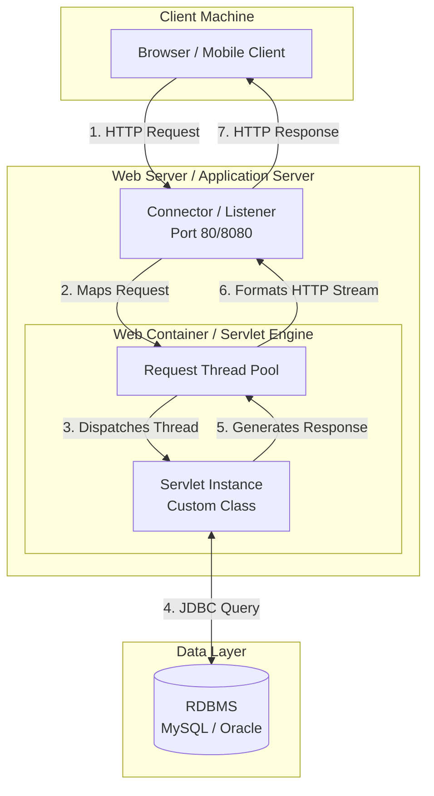
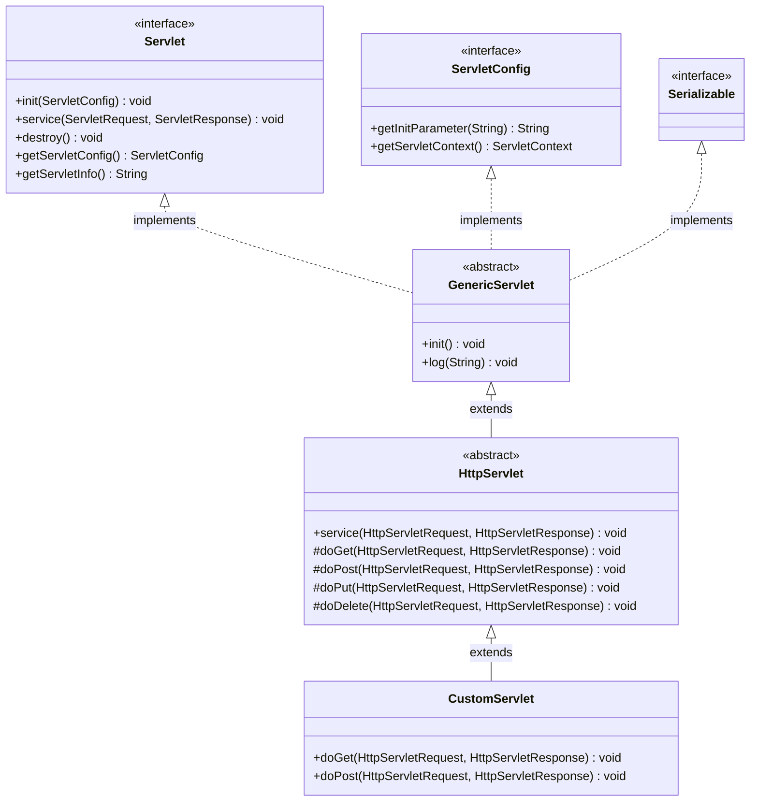
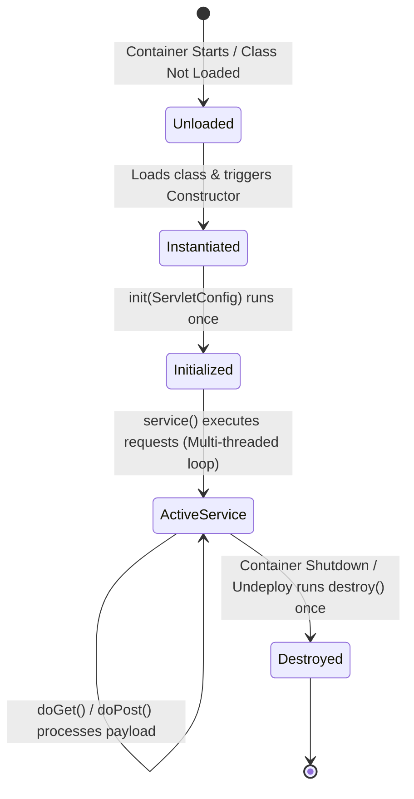
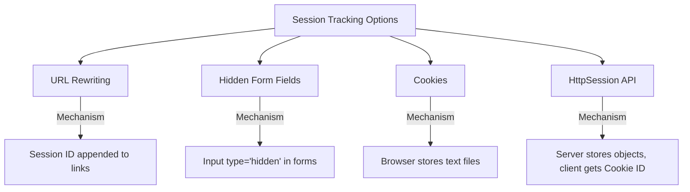
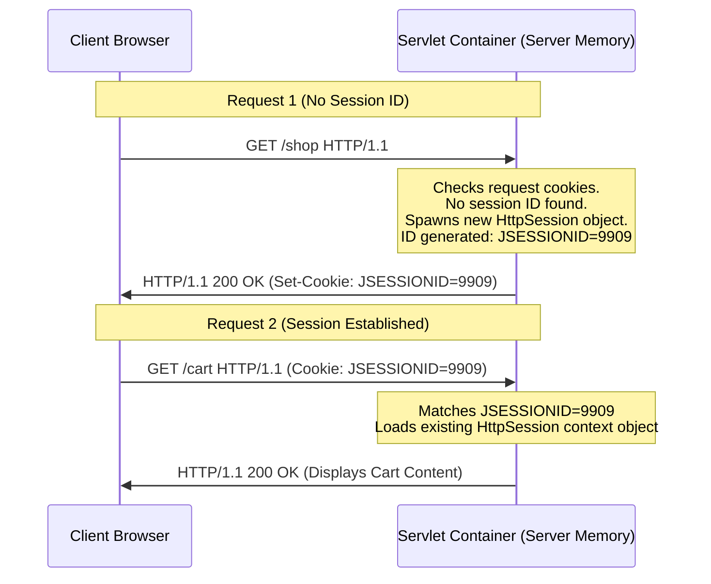
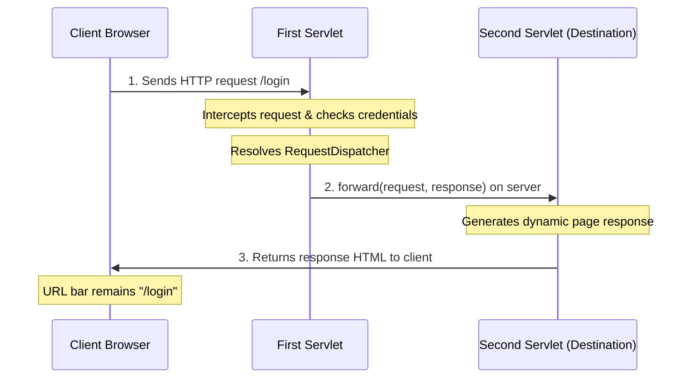
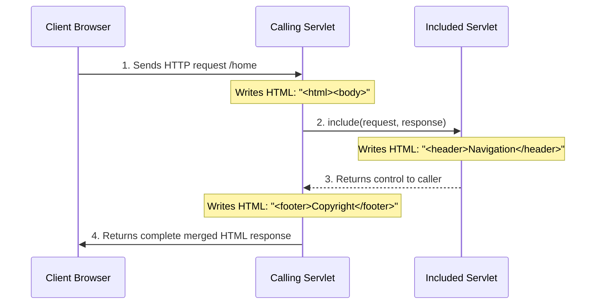
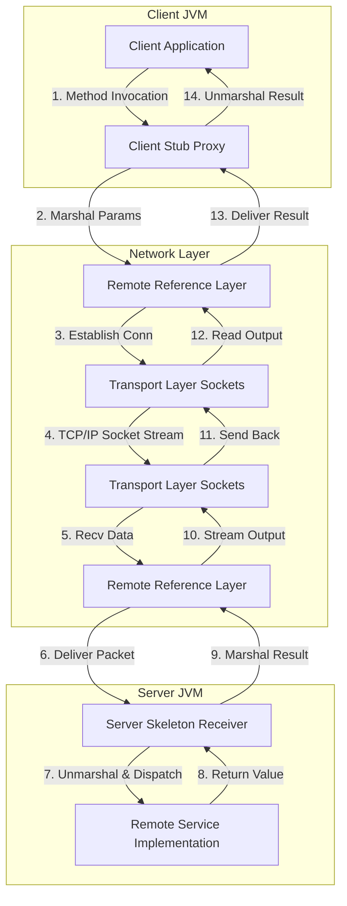
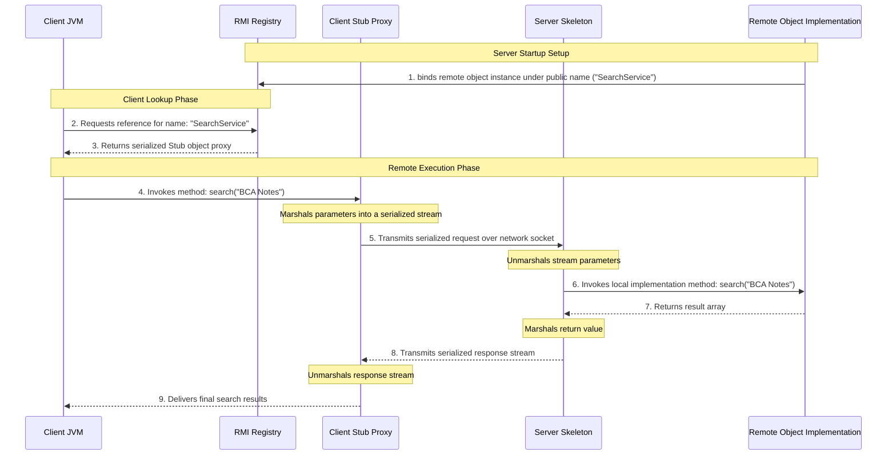

# 📚 BCA Semester - 1

## 💻 Advanced Java and J2EE 
> **Subject Code:** BCA-101  
> **Course:** Bachelor of Computer Applications (BCA)  
> **Semester:** 5

---

# 📑 Unit 2 : J2EE (Servlets & RMI)

## *Topics*
- Servlet Introduction
- Architecture of a Servlet
- Servlet API
  - javax.servlet
  - javax.servlet.http
- Servlet Life Cycle
- Developing and Deploying Servlets
- Handling Servlet Requests and Responses
- Session Tracking Approaches
  - URL Rewriting
  - Hidden Form Fields
  - Cookies
  - HttpSession (Session API)
- Servlet Collaboration
- Servlet with JDBC
- RMI Overview
- RMI Architecture
- Stub and Skeleton

---

# Servlet Introduction

A **Servlet** is a server-side Java component that runs inside a Web Container (Servlet Engine) of an Application Server or Web Server. It intercepts incoming client requests (typically HTTP requests from web browsers), processes business logic, interacts with databases, and generates dynamic web responses (such as HTML, JSON, XML, or binary data streams).

## CGI vs Java Servlets

Before Servlets, **CGI (Common Gateway Interface)** was the standard technology used to generate dynamic web content. In CGI, every client request causes the web server to spawn a completely new operating system process. This creates several performance and scalability challenges:

- **Heavyweight Process Overhead**: Spawning a new OS process for each request consumes high CPU cycles and RAM.
- **Limited Scalability**: If 1,000 users access a CGI script concurrently, the server must run 1,000 separate processes, which can cause the operating system to run out of memory or crash.
- **Resource Locking**: Database connections cannot be easily pooled across multiple OS processes.
- **Platform Dependency**: CGI scripts are often written in platform-dependent shell scripts or compiled C/C++ applications.

**Java Servlets** address these limitations:
- **Thread-Based Model**: A Servlet runs as a lightweight thread inside the single Java Virtual Machine (JVM) process of the Web Container. One Servlet instance handles all requests concurrently using separate threads.
- **Resource Sharing**: Since threads share the JVM memory space, resources like database connection pools can be shared across all request-handling threads.
- **Platform Independence**: Servlets inherit Java's Write Once, Run Anywhere (WORA) model.
- **Automatic Lifecycle Management**: The Web Container manages the initialization, execution, and cleanup of Servlets, reducing development overhead.

### Comparison Table: CGI vs Servlets

| Feature | CGI (Common Gateway Interface) | Java Servlets |
|:---|:---|:---|
| **Execution Model** | Spawns a new OS process for each request. | Spawns a lightweight thread within the JVM. |
| **Performance** | Low performance due to process creation overhead. | High performance due to thread reuse and caching. |
| **Memory Consumption** | High (each process has its own address space). | Low (threads share a common memory space). |
| **Scalability** | Poor (limits concurrent users). | Excellent (handles thousands of requests concurrently). |
| **Database Access** | Difficult to configure connection pooling. | Supports standard JDBC connection pooling. |
| **Platform Portability** | Highly platform-dependent. | Fully platform-independent. |

---

# Architecture of a Servlet

Servlet architecture defines how the client, web server, servlet container, and database interact using a request-response model.



## Detailed Processing Flow

1. **Client Request**: A user submits a form or enters a URL in their browser (Client). The browser sends an HTTP request over TCP/IP to the Web Server.
2. **Server Mapping**: The Web Server receives the raw HTTP request. If the request points to static resources (such as an `.html` file, `.css` stylesheet, or image), the Web Server serves the file directly. If the request points to a dynamic URL mapped to a servlet, the Web Server forwards the request payload to the **Servlet Container** (e.g., Apache Tomcat).
3. **Thread Dispatching**: The Servlet Container checks its memory to see if an instance of the requested Servlet class exists.
   - If no instance exists, the Container loads the class, instantiates it using the constructor, and calls its `init()` method once.
   - If an instance is already initialized, the Container takes a thread from its managed Thread Pool.
4. **Context Creation**: The Container wraps the HTTP request headers and body parameters into an `HttpServletRequest` object, and creates a blank `HttpServletResponse` object.
5. **Execution**: The Container calls the servlet's `service(request, response)` method. The thread executes the business logic inside the servlet instance.
6. **Database Operation**: If database interaction is required, the servlet calls a Data Access Object (DAO) to query the database using JDBC.
7. **Response Marshalling**: The servlet writes output HTML markup or JSON payloads to the `PrintWriter` stream obtained from the `HttpServletResponse` object.
8. **Client Response**: The thread finishes execution. The Container converts the `HttpServletResponse` object into an HTTP response stream, sends it back to the Web Server, and releases the thread back to the pool. The Web Server delivers the response back to the client browser.

---

# Servlet API (`javax.servlet` & `javax.servlet.http`)

The Java Servlet API consists of two core packages:
- **`javax.servlet`**: Contains generic interfaces and classes that are independent of any specific network protocol (e.g., HTTP, FTP, SMTP).
- **`javax.servlet.http`**: Extends `javax.servlet` classes to provide specific support for the HTTP protocol.

## UML Class & Interface Hierarchy

The diagram below shows the relationships between the core classes and interfaces of the Servlet API.



---

## 1. `javax.servlet` Package Details

### `Servlet` Interface
The root interface of the Servlet API. Any class that wants to run as a servlet must implement this interface, either directly or by extending a helper class. It defines the three lifecycle methods: `init()`, `service()`, and `destroy()`.

### `GenericServlet` Abstract Class
An abstract class that implements the `Servlet`, `ServletConfig`, and `Serializable` interfaces. It provides default implementations for all lifecycle methods except `service()`. This class is useful for building protocol-independent servlets.

### `ServletRequest` Interface
Provides methods to retrieve client request parameters, attributes, content lengths, content types, input streams, and server details.

### `ServletResponse` Interface
Provides methods to send responses to the client, such as setting the content length, character encoding, content type, and retrieving the output print writer stream.

### `ServletConfig` Interface
A configuration object used by the Servlet Container to pass initialization parameters to a specific servlet during startup.

### `ServletContext` Interface
A shared context object representing the web application environment. It allows servlets to access global context parameters, communicate with other servlets, and access local web resources. Only one `ServletContext` object exists per web application deployment.

---

## 2. `javax.servlet.http` Package Details

### `HttpServlet` Abstract Class
An abstract class that extends `GenericServlet` and implements the HTTP protocol. It overrides the generic `service()` method and routes HTTP requests to specific handler methods based on the request method (e.g., `doGet()`, `doPost()`, `doPut()`, `doDelete()`).

### `HttpServletRequest` Interface
Extends `ServletRequest` to provide HTTP-specific methods, including cookie parsing, session retrieval, request URI parsing, and HTTP header retrieval.

### `HttpServletResponse` Interface
Extends `ServletResponse` to provide HTTP-specific response options, such as modifying status codes (e.g., 200 OK, 404 Not Found), setting response headers, and managing cookies.

### `HttpSession` Interface
Provides methods to identify a user across multiple page requests and store temporary user information (such as shopping cart contents or user credentials).

### `Cookie` Class
Represents an HTTP cookie: a small text file sent by a servlet to the client's browser, stored on the client machine, and returned to the server with subsequent requests.

---

# Servlet Life Cycle

The lifecycle of a servlet defines how the Servlet Container manages the creation, initialization, execution, and cleanup of a servlet instance.



## Lifecycle Phases

### Phase 1: Loading and Instantiation
The Servlet Container loads the servlet class definition using its classloader. This occurs:
- When the web server starts up (if the servlet is configured with `<load-on-startup>` in `web.xml` or using the `loadOnStartup` attribute in `@WebServlet`).
- When the servlet is first requested by a client.

After loading the class, the Container instantiates the servlet using its no-argument constructor.

### Phase 2: Initialization (`init()` Method)
After instantiating the servlet, the Container invokes its `init(ServletConfig)` method once. This method is used to initialize resources, such as database connections or global configuration parameters, before the servlet handles client requests.

If the initialization fails, the servlet throws a `ServletException` and the Container discards the instance.

```java
// Method signature in Servlet Interface
public void init(ServletConfig config) throws ServletException;
```

---

### Phase 3: Request Processing (`service()` Method)
For every client request mapped to the servlet, the Container:
1. Spawns a new thread or retrieves an existing thread from its thread pool.
2. Invokes the servlet's `service(ServletRequest, ServletResponse)` method.
3. If the servlet extends `HttpServlet`, the `service()` method casts the request and response objects to their HTTP-specific types and routes the request to the appropriate handler method:
   - `doGet()`: Handles HTTP GET requests (retrieving data).
   - `doPost()`: Handles HTTP POST requests (submitting form data).
   - `doPut()`: Handles HTTP PUT requests (updating resources).
   - `doDelete()`: Handles HTTP DELETE requests (deleting resources).

Multiple client threads can execute the `service()` method of a single servlet instance concurrently. Developers must ensure that servlets are thread-safe by avoiding the use of shared instance variables.

```java
public void service(ServletRequest request, ServletResponse response) 
    throws ServletException, IOException;
```

---

### Phase 4: Destruction (`destroy()` Method)
Before removing a servlet instance from service (e.g., when the server stops, restarts, or the application is undeployed), the Container invokes the servlet's `destroy()` method once. This method is used to release active resources, such as closing open databases, saving application state to disk, and stopping background threads.

After `destroy()` completes, the servlet instance is garbage collected.

```java
public void destroy();
```

---

# Developing and Deploying Servlets

Deploying a Java Web application requires configuring a structured folder layout.

## Standard Web Application Directory Structure

```text
MyBillingApp/
├── css/
│   └── main.css
├── js/
│   └── script.js
├── index.html
├── WEB-INF/
│   ├── web.xml
│   ├── classes/
│   │   └── com/
│   │       └── bca/
│   │           └── servlet/
│   │               └── OrderServlet.class
│   └── lib/
│       ├── mysql-connector-j.jar
│       └── jstl.jar
```

- **Root Folder (`MyBillingApp/`)**: Stores public files, such as HTML pages, CSS stylesheets, JavaScript files, and JSP pages, which are directly accessible by clients.
- **`WEB-INF/`**: A private directory. Files stored here cannot be accessed directly by clients.
- **`web.xml`**: The Web Application Deployment Descriptor, containing servlet registrations, URL mappings, security filters, and session timeout configurations.
- **`classes/`**: Stores compiled Java class files (`.class`), maintaining their package structure.
- **`lib/`**: Stores third-party JAR libraries (such as database drivers or utility packages) required by the web application.

---

## Deploying Servlets: `web.xml` vs `@WebServlet` Annotation

### Option A: Traditional `web.xml` Deployment Descriptor
In this approach, you register the servlet class and map it to a URL pattern using XML tags in the `web.xml` file.

```xml
<?xml version="1.0" encoding="UTF-8"?>
<web-app xmlns="http://xmlns.jcp.org/xml/ns/javaee"
         xmlns:xsi="http://www.w3.org/2001/XMLSchema-instance"
         xsi:schemaLocation="http://xmlns.jcp.org/xml/ns/javaee 
                             http://xmlns.jcp.org/xml/ns/javaee/web-app_3_1.xsd"
         version="3.1">

    <!-- Register Servlet Class -->
    <servlet>
        <servlet-name>OrderServiceServlet</servlet-name>
        <servlet-class>com.bca.servlet.OrderServlet</servlet-class>
        
        <!-- Initialization Parameters -->
        <init-param>
            <param-name>taxRate</param-name>
            <param-value>0.18</param-value>
        </init-param>
    </servlet>

    <!-- Map Servlet to a URL pattern -->
    <servlet-mapping>
        <servlet-name>OrderServiceServlet</servlet-name>
        <url-pattern>/checkout</url-pattern>
    </servlet-mapping>

</web-app>
```

---

### Option B: Modern Annotation-Based Configuration (`@WebServlet`)
In Servlet 3.0 and later, you can configure servlets using annotations directly on the Java class, eliminating the need for XML configuration in the `web.xml` file.

```java
package com.bca.servlet;

import java.io.IOException;
import java.io.PrintWriter;
import javax.servlet.ServletConfig;
import javax.servlet.ServletException;
import javax.servlet.annotation.WebInitParam;
import javax.servlet.annotation.WebServlet;
import javax.servlet.http.HttpServlet;
import javax.servlet.http.HttpServletRequest;
import javax.servlet.http.HttpServletResponse;

@WebServlet(
    name = "OrderServiceServlet",
    urlPatterns = {"/checkout", "/placeOrder"},
    initParams = {
        @WebInitParam(name = "taxRate", value = "0.18")
    },
    loadOnStartup = 1
)
public class OrderServlet extends HttpServlet {
    private static final long serialVersionUID = 1L;
    private double taxRate;

    @Override
    public void init(ServletConfig config) throws ServletException {
        super.init(config);
        // Retrieve init-param value
        String taxStr = config.getInitParameter("taxRate");
        this.taxRate = Double.parseDouble(taxStr);
    }

    @Override
    protected void doGet(HttpServletRequest request, HttpServletResponse response) 
            throws ServletException, IOException {
        response.setContentType("text/html");
        try (PrintWriter out = response.getWriter()) {
            out.println("<h3>Tax Rate Configured: " + (taxRate * 100) + "%</h3>");
        }
    }
}
```

---

# Handling Servlet Requests and Responses

Servlets process incoming client requests and generate outgoing responses using `HttpServletRequest` and `HttpServletResponse` objects.

## Complete Code: `FormHandlerServlet.java`

This servlet processes a form submission, reads single and multiple parameter values, extracts HTTP request headers, and writes a dynamic HTML response back to the client.

```java
package com.bca.servlet;

import java.io.IOException;
import java.io.PrintWriter;
import java.util.Enumeration;
import javax.servlet.ServletException;
import javax.servlet.annotation.WebServlet;
import javax.servlet.http.HttpServlet;
import javax.servlet.http.HttpServletRequest;
import javax.servlet.http.HttpServletResponse;

@WebServlet(name = "FormHandlerServlet", urlPatterns = {"/submitFeedback"})
public class FormHandlerServlet extends HttpServlet {
    private static final long serialVersionUID = 1L;

    @Override
    protected void doPost(HttpServletRequest request, HttpServletResponse response) 
            throws ServletException, IOException {
        
        // 1. Set request character encoding for correct parameter parsing
        request.setCharacterEncoding("UTF-8");

        // 2. Retrieve form parameter values
        String username = request.getParameter("username");
        String email = request.getParameter("email");
        String rating = request.getParameter("rating");
        
        // Retrieve multiple selected values (checkboxes)
        String[] subjects = request.getParameterValues("selectedSubjects");

        // 3. Set response parameters
        response.setContentType("text/html;charset=UTF-8");
        response.setCharacterEncoding("UTF-8");
        
        // Add a custom response header for tracking/security
        response.setHeader("X-Processed-By", "BCA-Servlet-Engine");

        try (PrintWriter out = response.getWriter()) {
            out.println("<!DOCTYPE html>");
            out.println("<html>");
            out.println("<head><title>Form Processing Result</title></head>");
            out.println("<body style='font-family: Arial, sans-serif; margin: 30px;'>");
            out.println("<h2>Feedback Processed Successfully</h2>");
            
            // Display parameters
            out.println("<p><strong>Student Name:</strong> " + escapeHtml(username) + "</p>");
            out.println("<p><strong>Email Address:</strong> " + escapeHtml(email) + "</p>");
            out.println("<p><strong>Rating:</strong> " + rating + " / 5</p>");
            
            out.println("<p><strong>Interested Subjects:</strong></p><ul>");
            if (subjects != null && subjects.length > 0) {
                for (String subject : subjects) {
                    out.println("<li>" + escapeHtml(subject) + "</li>");
                }
            } else {
                out.println("<li>No subjects selected</li>");
            }
            out.println("</ul>");

            // 4. Extract and display incoming HTTP Request Headers
            out.println("<hr/><h3>Incoming Request Headers:</h3>");
            out.println("<table border='1' cellpadding='5' style='border-collapse: collapse;'>");
            out.println("<tr bgcolor='#f2f2f2'><th>Header Name</th><th>Header Value</th></tr>");
            
            Enumeration<String> headerNames = request.getHeaderNames();
            while (headerNames.hasMoreElements()) {
                String headerName = headerNames.nextElement();
                String headerValue = request.getHeader(headerName);
                out.println("<tr><td>" + headerName + "</td><td>" + headerValue + "</td></tr>");
            }
            out.println("</table>");

            out.println("</body>");
            out.println("</html>");
        }
    }

    // Helper method to prevent HTML injection XSS vulnerabilities
    private String escapeHtml(String input) {
        if (input == null) return "";
        return input.replace("&", "&amp;")
                    .replace("<", "&lt;")
                    .replace(">", "&gt;")
                    .replace("\"", "&quot;");
    }
}
```

---

# Session Tracking Approaches

HTTP is a stateless protocol: every request sent by a client to a server is treated as an independent connection. The server does not retain any context or state from previous requests.

To maintain user state (such as user authentication sessions or shopping carts) across multiple requests, developers use session tracking.



---

## 1. URL Rewriting

### Concept
The Servlet Container appends the session identifier to all links generated by the application (e.g., `/dashboard;jsessionid=xyz123`). When the user clicks a link, the browser returns the session ID in the URL.

### Advantages
- Works even if the client browser has cookies disabled.
- Fully supported by all standard web browsers.

### Disadvantages
- Exposes session IDs in the browser address bar and web logs, creating security vulnerabilities.
- Links must be dynamically generated and encoded by the server using `response.encodeURL()`. If a link is not encoded, the session state is lost.
- Restricted to dynamic page navigation; static HTML links cannot be rewritten dynamically.

### Complete Java Code: `UrlRewritingServlet.java`

```java
package com.bca.session;

import java.io.IOException;
import java.io.PrintWriter;
import javax.servlet.ServletException;
import javax.servlet.annotation.WebServlet;
import javax.servlet.http.HttpServlet;
import javax.servlet.http.HttpServletRequest;
import javax.servlet.http.HttpServletResponse;

@WebServlet(name = "UrlRewritingServlet", urlPatterns = {"/urlSession"})
public class UrlRewritingServlet extends HttpServlet {
    private static final long serialVersionUID = 1L;

    @Override
    protected void doGet(HttpServletRequest request, HttpServletResponse response) 
            throws ServletException, IOException {
        
        // Retrieve temporary session identifier passed via URL parameters
        String customerId = request.getParameter("customerRef");
        if (customerId == null) {
            customerId = "CUST_999"; // Default fallback
        }

        response.setContentType("text/html;charset=UTF-8");
        try (PrintWriter out = response.getWriter()) {
            out.println("<html><body>");
            out.println("<h2>Session Tracking via URL Rewriting</h2>");
            out.println("<p>Active Customer Reference: <strong>" + customerId + "</strong></p>");

            // Encode destination link using response.encodeURL()
            String rawLink = "urlSession?customerRef=" + customerId + "&step=2";
            String rewrittenLink = response.encodeURL(rawLink);

            out.println("<p>Standard URL: <code>" + rawLink + "</code></p>");
            out.println("<p>Rewritten URL: <code>" + rewrittenLink + "</code></p>");
            out.println("<br/><a href='" + rewrittenLink + "'>Navigate to Step 2 (Maintains State)</a>");
            out.println("</body></html>");
        }
    }
}
```

---

## 2. Hidden Form Fields

### Concept
Session parameters are stored inside standard HTML forms using hidden input fields (`<input type="hidden" name="sessionId" value="xyz123"/>`). When the user submits the form, the browser returns the session data in the request body.

### Advantages
- Works even if the client browser has cookies disabled.
- The session data is not visible in the browser's address bar.

### Disadvantages
- Requires all page-to-page navigation to be performed using form submissions (POST requests). Clicking standard text links will lose the session state.
- Increases network traffic since the session data is sent with every form submission.

### Complete Java Code: `HiddenFormFieldsServlet.java`

```java
package com.bca.session;

import java.io.IOException;
import java.io.PrintWriter;
import javax.servlet.ServletException;
import javax.servlet.annotation.WebServlet;
import javax.servlet.http.HttpServlet;
import javax.servlet.http.HttpServletRequest;
import javax.servlet.http.HttpServletResponse;

@WebServlet(name = "HiddenFormFieldsServlet", urlPatterns = {"/hiddenFields"})
public class HiddenFormFieldsServlet extends HttpServlet {
    private static final long serialVersionUID = 1L;

    @Override
    protected void doGet(HttpServletRequest request, HttpServletResponse response) 
            throws ServletException, IOException {
        
        // Generate a mock session token
        String userToken = "TOKEN_889988_BCA";

        response.setContentType("text/html;charset=UTF-8");
        try (PrintWriter out = response.getWriter()) {
            out.println("<html><body>");
            out.println("<h2>Session Tracking via Hidden Form Fields</h2>");
            out.println("<p>Active Session Token: <strong>" + userToken + "</strong></p>");

            // Generate an HTML form containing the hidden field
            out.println("<form action='hiddenFields' method='POST'>");
            out.println("<input type='hidden' name='session_token' value='" + userToken + "' />");
            out.println("Enter Profile Status: <input type='text' name='status' /><br/><br/>");
            out.println("<input type='submit' value='Submit (Saves State)'/>");
            out.println("</form>");
            out.println("</body></html>");
        }
    }

    @Override
    protected void doPost(HttpServletRequest request, HttpServletResponse response) 
            throws ServletException, IOException {
        
        // Retrieve the hidden form field value
        String sessionToken = request.getParameter("session_token");
        String status = request.getParameter("status");

        response.setContentType("text/html;charset=UTF-8");
        try (PrintWriter out = response.getWriter()) {
            out.println("<html><body>");
            out.println("<h2>POST Result</h2>");
            out.println("<p>Retrieved Token from Hidden Field: <strong>" + sessionToken + "</strong></p>");
            out.println("<p>Profile Status Saved: " + status + "</p>");
            out.println("<a href='hiddenFields'>Back to Setup</a>");
            out.println("</body></html>");
        }
    }
}
```

---

## 3. Cookies

### Concept
The server sends a small key-value text file (a cookie) to the client's browser using the `Set-Cookie` HTTP header. The browser stores this file locally on the client's machine and automatically includes it in the request headers of subsequent requests to the same server.

- **Non-Persistent (Session) Cookies**: Stored in the browser's temporary memory. They are deleted automatically when the user closes the browser.
- **Persistent Cookies**: Stored on the client's local storage disk. They remain valid until a specified expiration date (`setMaxAge()`).

### Advantages
- The server does not need to rewrite links or construct hidden forms to maintain state.
- Supports storing persistent data (such as user preferences or shopping carts) across browser restarts.

### Disadvantages
- Can be disabled by users in browser settings.
- Security vulnerabilities: Cookies can be intercepted or modified if not encrypted (e.g., using the `Secure` and `HttpOnly` attributes).
- Storage limit: Browsers limit cookie sizes to 4KB.

### Complete Java Code: `CookieSessionServlet.java`

```java
package com.bca.session;

import java.io.IOException;
import java.io.PrintWriter;
import javax.servlet.ServletException;
import javax.servlet.annotation.WebServlet;
import javax.servlet.http.Cookie;
import javax.servlet.http.HttpServlet;
import javax.servlet.http.HttpServletRequest;
import javax.servlet.http.HttpServletResponse;

@WebServlet(name = "CookieSessionServlet", urlPatterns = {"/cookieSession"})
public class CookieSessionServlet extends HttpServlet {
    private static final long serialVersionUID = 1L;

    @Override
    protected void doGet(HttpServletRequest request, HttpServletResponse response) 
            throws ServletException, IOException {
        
        String action = request.getParameter("action");
        response.setContentType("text/html;charset=UTF-8");
        PrintWriter out = response.getWriter();

        out.println("<html><body>");

        if ("create".equalsIgnoreCase(action)) {
            // 1. Create cookies
            Cookie userCookie = new Cookie("username", "Rahul");
            Cookie themeCookie = new Cookie("theme", "dark");

            // Set cookie age to 24 hours (persistent cookie)
            userCookie.setMaxAge(24 * 60 * 60);
            
            // Set cookie attributes for security
            userCookie.setHttpOnly(true);

            // Add cookies to the HTTP response header
            response.addCookie(userCookie);
            response.addCookie(themeCookie);

            out.println("<h2>Success: Cookies created and sent to browser!</h2>");
            out.println("<p>Reload this page without parameters to read them.</p>");

        } else {
            out.println("<h2>Reading Active Cookies:</h2>");
            
            // 2. Read cookies from the HTTP request header
            Cookie[] cookies = request.getCookies();
            boolean cookiesFound = false;

            if (cookies != null) {
                for (Cookie c : cookies) {
                    out.println("<p>Cookie Name: <code>" + c.getName() + "</code>, Value: <strong>" + c.getValue() + "</strong></p>");
                    cookiesFound = true;
                }
            }

            if (!cookiesFound) {
                out.println("<p style='color:red;'>No cookies found on browser client!</p>");
                out.println("<a href='cookieSession?action=create'>Click here to create cookies first</a>");
            }
        }

        out.println("<br/><a href='cookieSession'>Refresh Page</a>");
        out.println("</body></html>");
    }
}
```

---

## 4. HttpSession (Session API)

### Concept
The standard session tracking approach in J2EE. The Servlet Container stores session data objects in server memory and assigns a unique session ID to each user. The Container sends this ID back to the client using a session cookie (typically named `JSESSIONID`). The client returns this cookie with subsequent requests, and the Container matches the ID to retrieve the user's session data from memory.

If the client has cookies disabled, the Container can fall back to using URL rewriting automatically.



### Advantages
- **Highly Secure**: User session data is stored in server memory. Only the session ID is sent to the client browser.
- **Support for Java Objects**: Can store any Java object (such as lists or custom beans) in the session, whereas cookies can only store string values.

### Disadvantages
- Storing session data in server memory increases server resource consumption.
- Requires configuring session replication to support clustering and load balancing.

### Complete Java Code: `HttpSessionServlet.java`

```java
package com.bca.session;

import java.io.IOException;
import java.io.PrintWriter;
import java.util.ArrayList;
import java.util.List;
import javax.servlet.ServletException;
import javax.servlet.annotation.WebServlet;
import javax.servlet.http.HttpServlet;
import javax.servlet.http.HttpServletRequest;
import javax.servlet.http.HttpServletResponse;
import javax.servlet.http.HttpSession;

@WebServlet(name = "HttpSessionServlet", urlPatterns = {"/cart"})
public class HttpSessionServlet extends HttpServlet {
    private static final long serialVersionUID = 1L;

    @Override
    @SuppressWarnings("unchecked")
    protected void doGet(HttpServletRequest request, HttpServletResponse response) 
            throws ServletException, IOException {
        
        // 1. Get or create a session for the user
        HttpSession session = request.getSession(true);
        
        // 2. Retrieve session attributes
        List<String> cart = (List<String>) session.getAttribute("shopping_cart");
        if (cart == null) {
            cart = new ArrayList<>();
            session.setAttribute("shopping_cart", cart);
        }

        String item = request.getParameter("item");
        String clear = request.getParameter("clear");

        if (clear != null) {
            // Invalidate the session and clear all attributes
            session.invalidate();
            response.sendRedirect("cart");
            return;
        }

        if (item != null && !item.trim().isEmpty()) {
            cart.add(item);
        }

        response.setContentType("text/html;charset=UTF-8");
        try (PrintWriter out = response.getWriter()) {
            out.println("<html><body>");
            out.println("<h2>Session Tracking via HttpSession API</h2>");
            out.println("<p>Session ID: <code>" + session.getId() + "</code></p>");
            out.println("<p>Session Created Timestamp: " + new java.util.Date(session.getCreationTime()) + "</p>");
            
            out.println("<h3>Shopping Cart:</h3>");
            if (cart.isEmpty()) {
                out.println("<p>Your cart is empty.</p>");
            } else {
                out.println("<ul>");
                for (String cartItem : cart) {
                    out.println("<li>" + cartItem + "</li>");
                }
                out.println("</ul>");
            }

            out.println("<hr/>");
            out.println("<h3>Add Item:</h3>");
            out.println("<form action='cart' method='GET'>");
            out.println("<input type='text' name='item' /> ");
            out.println("<input type='submit' value='Add to Cart' />");
            out.println("</form>");

            out.println("<a href='cart?clear=true'>Empty Cart (Invalidate Session)</a>");
            out.println("</body></html>");
        }
    }
}
```

---

# Servlet Collaboration

Servlet Collaboration is the process by which multiple servlets share request processing tasks. This is typically achieved using the **`RequestDispatcher`** interface.

## RequestDispatcher Methods

The `RequestDispatcher` interface defines two methods to route requests:

### `forward(ServletRequest request, ServletResponse response)`
- Transfers control of the request from the current servlet to another resource (a servlet, JSP page, or HTML file) on the server.
- The destination resource generates the final response. The original servlet cannot write any output after calling `forward()`.
- The redirection is handled entirely on the server. The client's browser is unaware of the transfer, and the URL in the address bar remains unchanged.

### `include(ServletRequest request, ServletResponse response)`
- Imports the response content of another resource into the calling servlet's response stream.
- The calling servlet can write output before and after invoking `include()`.
- Useful for modularizing layout elements, such as headers, navigation bars, and footers.

---

## Request Routing Diagrams

### `RequestDispatcher.forward()` Flow



### `RequestDispatcher.include()` Flow



---

## Comparison Table: `forward()` vs `sendRedirect()`

| Feature | `RequestDispatcher.forward()` | `HttpServletResponse.sendRedirect()` |
|:---|:---|:---|
| **Mechanism** | Handled entirely on the server side. | Handled on the client side (HTTP status code 302). |
| **Request Scope** | Reuses the original request and response objects. | Creates a completely new request. Original parameters are lost. |
| **Browser URL** | The URL in the address bar remains unchanged. | The URL in the address bar changes to the new destination. |
| **Destination** | Can only route to resources within the same web application. | Can route to external domains (e.g., `https://google.com`). |
| **Performance** | Faster (no network round-trips). | Slower (requires an additional client-to-server request). |

---

## Complete Collaboration Program

This example consists of four servlets collaborating to authenticate a user:
- `LoginServlet.java`: The controller. It validates credentials and forwards the request on success, or includes a failure message and re-displays the form on failure.
- `WelcomeServlet.java`: The destination page. It displays a welcome message.
- `HeaderServlet.java` & `FooterServlet.java`: Shared layout components included in the responses of the other servlets.

### 1. `HeaderServlet.java`
```java
package com.bca.collaboration;

import java.io.IOException;
import java.io.PrintWriter;
import javax.servlet.ServletException;
import javax.servlet.annotation.WebServlet;
import javax.servlet.http.HttpServlet;
import javax.servlet.http.HttpServletRequest;
import javax.servlet.http.HttpServletResponse;

@WebServlet(name = "HeaderServlet", urlPatterns = {"/header"})
public class HeaderServlet extends HttpServlet {
    private static final long serialVersionUID = 1L;

    @Override
    protected void doGet(HttpServletRequest request, HttpServletResponse response) 
            throws ServletException, IOException {
        PrintWriter out = response.getWriter();
        out.println("<div style='background-color:#007bff; color:white; padding:15px; text-align:center;'>");
        out.println("  <h1>BCA Enterprise Application portal</h1>");
        out.println("  <a href='login.html' style='color:white; margin:10px;'>Home</a> | ");
        out.println("  <a href='cart' style='color:white; margin:10px;'>Cart</a>");
        out.println("</div>");
        out.println("<hr/>");
    }

    @Override
    protected void doPost(HttpServletRequest request, HttpServletResponse response) 
            throws ServletException, IOException {
        doGet(request, response);
    }
}
```

### 2. `FooterServlet.java`
```java
package com.bca.collaboration;

import java.io.IOException;
import java.io.PrintWriter;
import javax.servlet.ServletException;
import javax.servlet.annotation.WebServlet;
import javax.servlet.http.HttpServlet;
import javax.servlet.http.HttpServletRequest;
import javax.servlet.http.HttpServletResponse;

@WebServlet(name = "FooterServlet", urlPatterns = {"/footer"})
public class FooterServlet extends HttpServlet {
    private static final long serialVersionUID = 1L;

    @Override
    protected void doGet(HttpServletRequest request, HttpServletResponse response) 
            throws ServletException, IOException {
        PrintWriter out = response.getWriter();
        out.println("<hr/>");
        out.println("<div style='text-align:center; padding:10px; color:#6c757d; font-size:12px;'>");
        out.println("  <p>&copy; 2026 BCA Department. All rights reserved.</p>");
        out.println("</div>");
    }

    @Override
    protected void doPost(HttpServletRequest request, HttpServletResponse response) 
            throws ServletException, IOException {
        doGet(request, response);
    }
}
```

### 3. `LoginServlet.java`
```java
package com.bca.collaboration;

import java.io.IOException;
import java.io.PrintWriter;
import javax.servlet.RequestDispatcher;
import javax.servlet.ServletException;
import javax.servlet.annotation.WebServlet;
import javax.servlet.http.HttpServlet;
import javax.servlet.http.HttpServletRequest;
import javax.servlet.http.HttpServletResponse;

@WebServlet(name = "LoginServlet", urlPatterns = {"/loginPortal"})
public class LoginServlet extends HttpServlet {
    private static final long serialVersionUID = 1L;

    @Override
    protected void doPost(HttpServletRequest request, HttpServletResponse response) 
            throws ServletException, IOException {
        
        String passkey = request.getParameter("passkey");
        response.setContentType("text/html;charset=UTF-8");
        PrintWriter out = response.getWriter();

        out.println("<html><body>");
        
        // 1. Include the Header layout component
        RequestDispatcher headerDispatcher = request.getRequestDispatcher("/header");
        headerDispatcher.include(request, response);

        // Mock authentication check
        if ("bca123".equals(passkey)) {
            // 2. Forward to the Welcome servlet on authentication success
            RequestDispatcher welcomeDispatcher = request.getRequestDispatcher("/welcomePortal");
            welcomeDispatcher.forward(request, response);
        } else {
            // 3. Display an error message and re-display the login form on failure
            out.println("<div style='color:red; font-weight:bold; margin:15px;'>");
            out.println("  Invalid Passkey entered! Please try again.");
            out.println("</div>");
            
            // Re-render the form
            out.println("<form action='loginPortal' method='POST' style='margin:15px;'>");
            out.println("  Enter Passkey: <input type='password' name='passkey' /> ");
            out.println("  <input type='submit' value='Login' />");
            out.println("</form>");

            // 4. Include the Footer layout component
            RequestDispatcher footerDispatcher = request.getRequestDispatcher("/footer");
            footerDispatcher.include(request, response);
        }

        out.println("</body></html>");
    }
}
```

### 4. `WelcomeServlet.java`
```java
package com.bca.collaboration;

import java.io.IOException;
import java.io.PrintWriter;
import javax.servlet.RequestDispatcher;
import javax.servlet.ServletException;
import javax.servlet.annotation.WebServlet;
import javax.servlet.http.HttpServlet;
import javax.servlet.http.HttpServletRequest;
import javax.servlet.http.HttpServletResponse;

@WebServlet(name = "WelcomeServlet", urlPatterns = {"/welcomePortal"})
public class WelcomeServlet extends HttpServlet {
    private static final long serialVersionUID = 1L;

    @Override
    protected void doPost(HttpServletRequest request, HttpServletResponse response) 
            throws ServletException, IOException {
        
        response.setContentType("text/html;charset=UTF-8");
        PrintWriter out = response.getWriter();

        // WelcomeServlet generates the response body
        out.println("<div style='margin:20px;'>");
        out.println("  <h2>Authentication Successful!</h2>");
        out.println("  <p>Welcome to the BCA Advanced Java Dashboard.</p>");
        out.println("  <p>You now have access to Unit 2 resource repositories.</p>");
        out.println("</div>");

        // Include the Footer layout component
        RequestDispatcher footerDispatcher = request.getRequestDispatcher("/footer");
        footerDispatcher.include(request, response);
    }
}
```

---

# Servlet with JDBC (Dynamic Web Database Application)

A common use case for Servlets is to connect to a database using JDBC to dynamically generate web pages based on query results.

This example implements a dynamic student record search application.

## 1. Database Table DDL Script

Run the following SQL script to create the database table and populate it with sample data:

```sql
CREATE DATABASE IF NOT EXISTS college_db;
USE college_db;

CREATE TABLE IF NOT EXISTS students (
    id INT PRIMARY KEY,
    name VARCHAR(100),
    email VARCHAR(100),
    course VARCHAR(50)
);

INSERT INTO students (id, name, email, course) VALUES 
(101, 'Amit Patel', 'amit.patel@bca.edu', 'BCA Semester 5'),
(102, 'Pooja Shah', 'pooja.shah@bca.edu', 'BCA Semester 5'),
(103, 'Rahul Sharma', 'rahul.sharma@bca.edu', 'BCA Semester 3')
ON DUPLICATE KEY UPDATE name=name;
```

---

## 2. Student Data Access Object (`StudentDAO.java`)

A helper class that encapsulates database interactions using JDBC.

```java
package com.bca.jdbcweb;

import java.sql.Connection;
import java.sql.DriverManager;
import java.sql.PreparedStatement;
import java.sql.ResultSet;
import java.sql.SQLException;

public class StudentDAO {
    private final String dbUrl = "jdbc:mysql://localhost:3306/college_db";
    private final String dbUser = "root";
    private final String dbPass = "password";

    public StudentDAO() {
        try {
            // Load the MySQL JDBC driver class
            Class.forName("com.mysql.cj.jdbc.Driver");
        } catch (ClassNotFoundException e) {
            System.err.println("Database driver loading failed: " + e.getMessage());
        }
    }

    // Retrieve student details by ID
    public Student findStudentById(int id) throws SQLException {
        String query = "SELECT * FROM students WHERE id = ?";
        try (Connection conn = DriverManager.getConnection(dbUrl, dbUser, dbPass);
             PreparedStatement ps = conn.prepareStatement(query)) {
            
            ps.setInt(1, id);
            try (ResultSet rs = ps.executeQuery()) {
                if (rs.next()) {
                    Student s = new Student();
                    s.setId(rs.getInt("id"));
                    s.setName(rs.getString("name"));
                    s.setEmail(rs.getString("email"));
                    s.setCourse(rs.getString("course"));
                    return s;
                }
            }
        }
        return null; // Student not found
    }
}
```

---

## 3. Student Data Model Class (`Student.java`)

A standard JavaBean class representing a student record.

```java
package com.bca.jdbcweb;

import java.io.Serializable;

public class Student implements Serializable {
    private static final long serialVersionUID = 1L;
    private int id;
    private String name;
    private String email;
    private String course;

    public Student() {}

    public int getId() { return id; }
    public void setId(int id) { this.id = id; }

    public String getName() { return name; }
    public void setName(String name) { this.name = name; }

    public String getEmail() { return email; }
    public void setEmail(String email) { this.email = email; }

    public String getCourse() { return course; }
    public void setCourse(String course) { this.course = course; }
}
```

---

## 4. Student Search Servlet (`StudentLookupServlet.java`)

Retrieves user input from the search form, queries the database using the `StudentDAO` class, and dynamically renders the results in an HTML table.

```java
package com.bca.jdbcweb;

import java.io.IOException;
import java.io.PrintWriter;
import java.sql.SQLException;
import javax.servlet.ServletException;
import javax.servlet.annotation.WebServlet;
import javax.servlet.http.HttpServlet;
import javax.servlet.http.HttpServletRequest;
import javax.servlet.http.HttpServletResponse;

@WebServlet(name = "StudentLookupServlet", urlPatterns = {"/searchStudent"})
public class StudentLookupServlet extends HttpServlet {
    private static final long serialVersionUID = 1L;
    private StudentDAO studentDAO;

    @Override
    public void init() throws ServletException {
        // Instantiate the DAO helper class once when the servlet initializes
        this.studentDAO = new StudentDAO();
    }

    @Override
    protected void doGet(HttpServletRequest request, HttpServletResponse response) 
            throws ServletException, IOException {
        
        response.setContentType("text/html;charset=UTF-8");
        PrintWriter out = response.getWriter();

        out.println("<html>");
        out.println("<head><title>Student Search Portal</title></head>");
        out.println("<body style='font-family: Arial, sans-serif; margin: 30px;'>");
        out.println("<h2>Student Database Lookup Portal</h2>");

        // Render the search form
        out.println("<form action='searchStudent' method='GET'>");
        out.println("  Enter Student ID: <input type='text' name='searchId' /> ");
        out.println("  <input type='submit' value='Search' />");
        out.println("</form>");
        out.println("<hr/>");

        String searchIdStr = request.getParameter("searchId");
        if (searchIdStr != null && !searchIdStr.trim().isEmpty()) {
            try {
                int id = Integer.parseInt(searchIdStr);
                
                // Query database
                Student student = studentDAO.findStudentById(id);

                if (student != null) {
                    // Display results in an HTML table
                    out.println("<h3>Record Found:</h3>");
                    out.println("<table border='1' cellpadding='8' style='border-collapse: collapse; width: 50%;'>");
                    out.println("<tr bgcolor='#f2f2f2'><th>Field</th><th>Value</th></tr>");
                    out.println("<tr><td><strong>ID</strong></td><td>" + student.getId() + "</td></tr>");
                    out.println("<tr><td><strong>Name</strong></td><td>" + student.getName() + "</td></tr>");
                    out.println("<tr><td><strong>Email</strong></td><td>" + student.getEmail() + "</td></tr>");
                    out.println("<tr><td><strong>Course</strong></td><td>" + student.getCourse() + "</td></tr>");
                    out.println("</table>");
                } else {
                    out.println("<p style='color:red;'>No record found for Student ID: " + id + "</p>");
                }
                
            } catch (NumberFormatException e) {
                out.println("<p style='color:red;'>Error: Please enter a valid integer for Student ID.</p>");
            } catch (SQLException e) {
                out.println("<p style='color:red;'>Database access error: " + e.getMessage() + "</p>");
                e.printStackTrace();
            }
        }

        out.println("</body></html>");
    }
}
```

---

# RMI (Remote Method Invocation) Overview

**RMI (Remote Method Invocation)** is a Java API that enables distributed applications to invoke methods on objects running in another Java Virtual Machine (JVM), which may reside on a different physical server. RMI is the Java-specific implementation of Remote Procedure Calls (RPC).

## Features of RMI

- **Object-Oriented**: RMI supports passing full Java objects as parameters and return values, rather than basic data types.
- **Type-Safe**: Remote interfaces enforce compile-time type checking.
- **Distributed garbage collection (DGC)**: Automatically manages the lifecycles of remote objects across different JVMs.
- **Inherits Java Security**: Integrates with the Java Security Manager to define permission policies for class loading over network channels.

---

# RMI Architecture

RMI applications use a multi-layered architecture to manage remote network calls.



## Layers of RMI Architecture

### 1. Application Layer
Contains the client application invoking the remote method and the server application implementing the remote service.

---

### 2. Stub and Skeleton Layer
This layer acts as the interface between the Application layer and the rest of the RMI system.
- **Stub (Client-Side Proxy)**: Intercepts local method calls from the client, converts (marshals) the parameters into a serialized network stream, and forwards the request to the Remote Reference Layer.
- **Skeleton (Server-Side Helper)**: Receives the serialized request from the Remote Reference Layer, converts (unmarshals) the parameters, and invokes the actual method implementation on the server object.

*Note: In modern Java (JDK 5.0 and later), skeletons are generated dynamically using reflection. Skeletons are no longer required to be generated manually using the legacy `rmic` compiler tool.*

---

### 3. Remote Reference Layer (RRL)
Manages reference semantics between the client and server. It resolves remote object locations, establishes unicast (point-to-point) connections, and manages remote connection references.

---

### 4. Transport Layer
The lowest layer in the RMI architecture. It manages TCP/IP network sockets, sets up listening channels, and handles stream serialization.

---

# RMI Invocation Process Flow

This sequence diagram shows the step-by-step process of resolving remote object references and executing remote method invocations.



---

# Complete, Runnable RMI Application

This example implements a complete RMI application that allows clients to query student details remotely. It consists of:
- **`SearchService.java`**: The remote interface.
- **`SearchServiceImpl.java`**: The remote interface implementation class.
- **`RMIServer.java`**: The server program that registers the remote object.
- **`RMIClient.java`**: The client program that locates the remote object and invokes its methods.

---

## 1. Define the Remote Interface (`SearchService.java`)

The remote interface must extend the `java.rmi.Remote` interface. All method declarations must declare throwing a `java.rmi.RemoteException`.

```java
package com.bca.rmi;

import java.rmi.Remote;
import java.rmi.RemoteException;

public interface SearchService extends Remote {
    // Remote method to query student details by name
    String searchStudentByName(String name) throws RemoteException;
}
```

---

## 2. Implement the Remote Interface (`SearchServiceImpl.java`)

The implementation class extends `java.rmi.server.UnicastRemoteObject` to declare it as a remote listener object, and implements the remote interface.

```java
package com.bca.rmi;

import java.rmi.RemoteException;
import java.rmi.server.UnicastRemoteObject;
import java.util.HashMap;
import java.util.Map;

public class SearchServiceImpl extends UnicastRemoteObject implements SearchService {
    private static final long serialVersionUID = 1L;
    private final Map<String, String> studentDatabase;

    // The constructor must declare throwing RemoteException
    public SearchServiceImpl() throws RemoteException {
        super();
        // Populate mock database
        studentDatabase = new HashMap<>();
        studentDatabase.put("Rahul", "ID: 101, Email: rahul@bca.edu, Class: Sem 5");
        studentDatabase.put("Pooja", "ID: 102, Email: pooja@bca.edu, Class: Sem 5");
        studentDatabase.put("Amit", "ID: 103, Email: amit@bca.edu, Class: Sem 3");
    }

    @Override
    public String searchStudentByName(String name) throws RemoteException {
        System.out.println("RMI Server processing lookup request for name: " + name);
        if (studentDatabase.containsKey(name)) {
            return studentDatabase.get(name);
        }
        return "Error: Student '" + name + "' not found in registry.";
    }
}
```

---

## 3. Create the Server (`RMIServer.java`)

The server creates an instance of the remote object implementation, starts the RMI registry, and registers (binds) the object instance in the registry.

```java
package com.bca.rmi;

import java.rmi.registry.LocateRegistry;
import java.rmi.registry.Registry;

public class RMIServer {
    public static void main(String[] args) {
        try {
            // 1. Create and start RMI Registry on the default port (1099)
            System.out.println("Starting RMI Registry on port 1099...");
            Registry registry = LocateRegistry.createRegistry(1099);

            // 2. Instantiate the remote service implementation class
            SearchService searchService = new SearchServiceImpl();

            // 3. Bind the remote object to the registry under a public name
            registry.rebind("SearchService", searchService);
            
            System.out.println("SearchService bound in registry. RMI Server is running...");
        } catch (Exception e) {
            System.err.println("RMI Server failed to start: " + e.getMessage());
            e.printStackTrace();
        }
    }
}
```

---

## 4. Create the Client (`RMIClient.java`)

The client application accesses the RMI registry, retrieves the remote object proxy (stub) by name, and invokes the remote method.

```java
package com.bca.rmi;

import java.rmi.registry.LocateRegistry;
import java.rmi.registry.Registry;
import java.util.Scanner;

public class RMIClient {
    public static void main(String[] args) {
        try {
            // 1. Locate the RMI registry running on localhost at port 1099
            System.out.println("Locating RMI Registry...");
            Registry registry = LocateRegistry.getRegistry("localhost", 1099);

            // 2. Look up the remote object stub by name
            System.out.println("Looking up 'SearchService' in registry...");
            SearchService service = (SearchService) registry.lookup("SearchService");

            // 3. Invoke methods on the remote object stub
            Scanner scanner = new Scanner(System.in);
            System.out.print("\nEnter Student Name to search: ");
            String searchName = scanner.nextLine();

            System.out.println("Invoking remote lookup method...");
            String result = service.searchStudentByName(searchName);
            
            System.out.println("\n--- Remote RMI Execution Result ---");
            System.out.println(result);
            System.out.println("------------------------------------");
            
            scanner.close();
        } catch (Exception e) {
            System.err.println("RMI Client lookup failed: " + e.getMessage());
            e.printStackTrace();
        }
    }
}
```
