# 📚 BCA Semester - 1

## 💻 Advanced Java and J2EE

> **Subject Code:** BCA-101  
> **Course:** Bachelor of Computer Applications (BCA)  
> **Semester:** 5

---

# 📑 Unit 3 : Introduction to JSP and JSP Basics

## _Topics_

- Introduction to JSP and JSP Basics
- JSP vs. Servlet
- JSP Architecture
- Life cycle of JSP
- JSP Elements: Directive Elements, Scripting Elements, Action Elements
  - Directives Elements (page, include)
  - Scripting Elements (Declaration, scriptlet, expression)
  - Action Elements (JSP:param, JSP:include, JSP:Forward, JSP:plugin)
- JSP Implicit Objects
- Including and Forwarding from JSP Pages
  - include Action
  - forward Action
- Working with Session & Cookie in JSP
- Error Handling and Exception Handling with JSP
- JDBC with JSP
- Introduction to JavaBean
- JavaBean Properties
- JavaBean Methods

# Introduction to JSP and JSP Basics

## What is JSP?

**JSP (JavaServer Pages)** is a server-side technology developed by Sun Microsystems that helps developers create dynamic web pages using Java. JSP allows HTML code and Java code to be written together in a single file, making web application development easier and faster.

JSP files have the **.jsp** extension and are executed on a web server such as Apache Tomcat.

### Definition

JSP is a technology used to create dynamic web content by embedding Java code into HTML pages.

### Why JSP?

Before JSP, developers mainly used Servlets to generate dynamic web pages. Writing HTML inside Java code was difficult and made applications hard to maintain. JSP solves this problem by allowing Java code to be embedded directly into HTML.

### Features of JSP

- Server-side technology
- Platform independent
- Easy integration with Java
- Supports reusable components
- Simplifies web page development
- Automatically converted into Servlets by the server
- Supports MVC architecture

---

## JSP Architecture

### Working Process

1. Client sends a request for a JSP page.
2. Web server receives the request.
3. JSP container translates the JSP page into a Servlet.
4. Servlet is compiled into bytecode.
5. Servlet executes and generates dynamic content.
6. Response is sent back to the browser.

### Flow Diagram

```text
Browser
   |
   v
JSP Request
   |
   v
Web Server
   |
   v
JSP Container
   |
   v
JSP --> Servlet --> Compilation
   |
   v
Generated Response
   |
   v
Browser
```

---

## JSP Life Cycle

A JSP page goes through several stages:

### 1. Translation Phase

JSP file is converted into a Servlet.

### 2. Compilation Phase

Generated Servlet is compiled into bytecode.

### 3. Initialization Phase

The `jspInit()` method is executed once.

### 4. Request Processing Phase

The `_jspService()` method processes each request.

### 5. Destruction Phase

The `jspDestroy()` method is executed before removing the JSP page.

### Life Cycle Methods

```java
jspInit()
_jspService()
jspDestroy()
```

---

## Basic JSP Syntax

### JSP Scriptlet Tag

Used to write Java code inside JSP.

```jsp
<%
    int num = 10;
    out.println(num);
%>
```

### Output

```text
10
```

---

### JSP Expression Tag

Used to display values directly.

```jsp
<%= "Hello JSP" %>
```

### Output

```text
Hello JSP
```

---

### JSP Declaration Tag

Used to declare variables and methods.

```jsp
<%!
    int count = 0;

    public int square(int n){
        return n*n;
    }
%>
```

---

## JSP Directives

Directives provide instructions to the JSP container.

### Page Directive

```jsp
<%@ page language="java" %>
```

### Include Directive

```jsp
<%@ include file="header.jsp" %>
```

### Taglib Directive

```jsp
<%@ taglib prefix="c"
uri="http://java.sun.com/jsp/jstl/core" %>
```

---

## JSP Comments

### HTML Comment

```html
<!-- Visible in Browser Source -->
```

### JSP Comment

```jsp
<%-- Not Visible in Browser Source --%>
```

---

## Implicit Objects in JSP

JSP provides predefined objects automatically.

| Object      | Description                |
| ----------- | -------------------------- |
| request     | Client request information |
| response    | Response object            |
| session     | User session data          |
| application | Application-wide data      |
| out         | Sends output to browser    |
| config      | Servlet configuration      |
| page        | Current JSP page           |
| pageContext | Accesses page attributes   |
| exception   | Exception handling         |

### Example

```jsp
<%
    out.println(request.getRemoteAddr());
%>
```

---

## Simple JSP Program

### hello.jsp

```jsp
<html>
<head>
    <title>JSP Example</title>
</head>
<body>

<h2>Welcome to JSP</h2>

<%
    String name = "Rohan";
%>

<p>Hello <%= name %></p>

</body>
</html>
```

### Output

```text
Welcome to JSP
Hello Rohan
```

---

## Advantages of JSP

- Easy to develop dynamic web pages
- Separation of presentation and business logic
- Reusable components
- Faster development
- Supports Java APIs
- Platform independent
- Automatically manages Servlets

---

## Limitations of JSP

- Mixing Java and HTML can reduce readability
- Large JSP pages become difficult to maintain
- Requires web server and JSP container
- Debugging may be difficult in complex applications

---

# JSP vs Servlet

## Introduction

Both JSP and Servlet are Java technologies used for creating dynamic web applications. JSP is mainly used for presentation (UI), while Servlets are mainly used for business logic and request processing.

---

## What is a Servlet?

A **Servlet** is a Java class that runs on a web server and handles client requests and responses.

### Example Servlet

```java
import java.io.*;
import jakarta.servlet.*;
import jakarta.servlet.http.*;

public class HelloServlet extends HttpServlet {

    protected void doGet(HttpServletRequest request,
                         HttpServletResponse response)
                         throws IOException {

        PrintWriter out = response.getWriter();

        out.println("<h1>Hello Servlet</h1>");
    }
}
```

---

## Comparison Between JSP and Servlet

| Feature           | JSP                       | Servlet              |
| ----------------- | ------------------------- | -------------------- |
| Full Form         | JavaServer Pages          | Java Servlet         |
| Extension         | .jsp                      | .java                |
| Purpose           | Presentation Layer        | Business Logic Layer |
| Coding Style      | HTML with Java            | Java with HTML       |
| Development Speed | Faster                    | Slower               |
| Maintenance       | Easier                    | More Difficult       |
| Compilation       | Converted to Servlet      | Directly Compiled    |
| Execution         | Runs as Servlet           | Runs directly        |
| UI Development    | Easy                      | Difficult            |
| Performance       | Slightly Slower Initially | Faster Initially     |
| MVC Role          | View                      | Controller           |

---

## JSP Example

```jsp
<html>
<body>

<h2>Student Information</h2>

<%
    String student = "Rohan";
%>

Name : <%= student %>

</body>
</html>
```

---

## Servlet Example

```java
PrintWriter out = response.getWriter();

out.println("<html>");
out.println("<body>");
out.println("<h2>Student Information</h2>");
out.println("Name : Rohan");
out.println("</body>");
out.println("</html>");
```

### Observation

In Servlet, writing HTML inside Java code becomes lengthy and difficult.

In JSP, HTML is written normally and only required Java code is embedded, making development easier.

---

## JSP and Servlet in MVC Architecture

```text
User
  |
  v
Controller (Servlet)
  |
  v
Model (Java Classes)
  |
  v
View (JSP)
  |
  v
Response to User
```

### Role of Servlet

- Handles requests
- Processes business logic
- Interacts with database
- Controls application flow

### Role of JSP

- Displays data
- Creates user interface
- Shows output to users

---

## When to Use JSP?

Use JSP when:

- Designing web pages
- Displaying data
- Creating forms
- Building user interfaces

---

## When to Use Servlet?

Use Servlet when:

- Processing requests
- Performing validations
- Handling business logic
- Managing sessions
- Controlling application flow

---

## Best Practice

Modern Java web applications follow:

```text
Servlet = Controller
Java Classes = Model
JSP = View
```

This follows the MVC (Model-View-Controller) design pattern and makes applications scalable, maintainable, and easy to manage.

---

# JSP Architecture

## Introduction

JSP (JavaServer Pages) is a server-side technology used to create dynamic web applications. JSP pages are not executed directly by the server. Instead, the JSP Engine translates the JSP page into a Servlet, compiles it, and then executes it to generate a response for the client.

In simple words:

```text
JSP = HTML + Java
```

Internally:

```text
JSP → Servlet → Class File → Execution
```

This entire process is known as the JSP Architecture.

---

# JSP Architecture Diagram

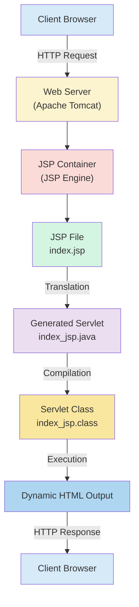

---

# Detailed JSP Architecture Flow

## Step 1: Client Sends Request

User enters URL:

```text
http://localhost:8080/project/index.jsp
```

Browser sends an HTTP Request.

```text
Browser
    │
    ▼
Request index.jsp
```

---

## Step 2: Web Server Receives Request

The Apache Tomcat server receives the request.

```text
Request Received
```

Tomcat identifies that the requested resource is a JSP page.

```text
index.jsp
```

The request is forwarded to the JSP Container.

---

## Step 3: JSP Container Checks JSP

The JSP Container performs checks:

```text
✓ JSP already compiled?

✓ JSP modified?

✓ Servlet available?
```

If the JSP page is being requested for the first time, translation begins.

---

## Step 4: JSP Translation

Example JSP:

```jsp
<html>
<body>

<h1>Hello JSP</h1>

</body>
</html>
```

Generated Servlet:

```java
public class index_jsp extends HttpServlet
{
    public void _jspService(...)
    {
        out.write("<html>");
        out.write("<body>");
        out.write("<h1>Hello JSP</h1>");
        out.write("</body>");
        out.write("</html>");
    }
}
```

Generated file:

```text
index_jsp.java
```

---

## Step 5: Compilation

Servlet source file:

```text
index_jsp.java
```

Compiled into:

```text
index_jsp.class
```

using the Java Compiler.

---

## Step 6: Servlet Execution

The Servlet class executes.

```java
_jspService()
```

method generates dynamic output.

Example:

```jsp
Current Time:

<%= new java.util.Date() %>
```

Output:

```html
Current Time: Sun Jun 07 10:45:22 IST 2026
```

---

## Step 7: Response Returned

Generated HTML:

```html
<h1>Hello JSP</h1>
```

is sent back to the browser.

```text
Server
   │
   ▼
HTML Response
   │
   ▼
Browser Display
```

---

# Complete JSP Processing Architecture

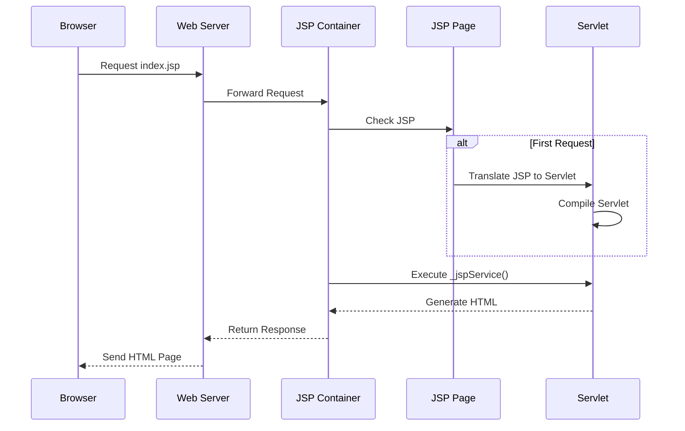

---

# Real-Life Example

Consider an E-Commerce Website.

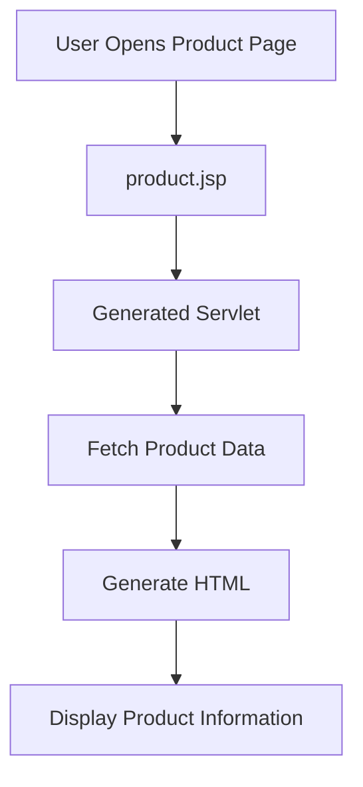

---

# Advantages of JSP Architecture

- Automatic Servlet Generation
- Easy UI Development
- Platform Independent
- Reusable Components
- Faster Development
- Better Separation of Presentation Layer
- Supports MVC Architecture

---

# JSP Life Cycle

## Introduction

Every JSP page passes through several phases from creation to destruction.

Internally, JSP behaves like a Servlet. Therefore, its life cycle is similar to the Servlet Life Cycle.

---

# JSP Life Cycle Diagram

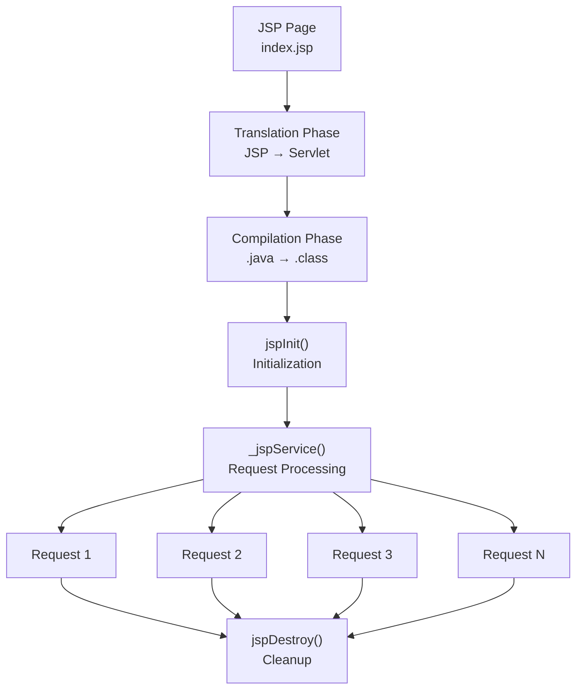

---

# Complete JSP Life Cycle Flow


---

# JSP Life Cycle Phases

## 1. Translation Phase

JSP is converted into a Servlet.

```text
home.jsp
```

↓

```text
home_jsp.java
```

Occurs:

```text
Only Once
```

unless JSP is modified.

---

## 2. Compilation Phase

Generated Servlet:

```text
home_jsp.java
```

↓

```text
home_jsp.class
```

Creates executable bytecode.

---

## 3. Initialization Phase

Method:

```java
jspInit()
```

Purpose:

- Allocate Resources
- Open Database Connections
- Initialize Variables

Example:

```jsp
<%!
public void jspInit()
{
    System.out.println("JSP Initialized");
}
%>
```

Important:

```text
Called Only Once
```

---

## 4. Request Processing Phase

Method:

```java
_jspService()
```

Purpose:

- Process Request
- Execute Java Code
- Generate Dynamic Content
- Send Response

Example:

```jsp
<%= new java.util.Date() %>
```

Every browser refresh executes:

```java
_jspService()
```

again.

Important:

```text
Called For Every Request
```

---

## 5. Destruction Phase

Method:

```java
jspDestroy()
```

Purpose:

- Release Resources
- Close Connections
- Cleanup Memory

Example:

```jsp
<%!
public void jspDestroy()
{
    System.out.println("JSP Destroyed");
}
%>
```

Important:

```text
Called Only Once
```

before JSP is unloaded.

---

# JSP Life Cycle Summary Diagram

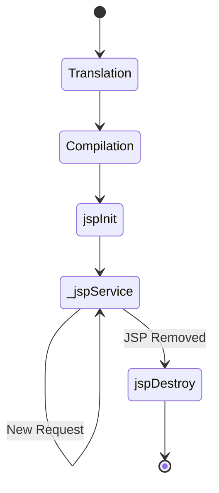

---

# JSP Life Cycle Methods Summary

| Method         | Called By | Frequency     | Purpose            |
| -------------- | --------- | ------------- | ------------------ |
| jspInit()      | Container | Once          | Initialization     |
| \_jspService() | Container | Every Request | Request Processing |
| jspDestroy()   | Container | Once          | Resource Cleanup   |

---

# JSP Elements

## Introduction

JSP (JavaServer Pages) provides special elements that allow developers to control page behavior, write Java code, and perform actions during request processing.

JSP Elements are divided into three main categories:

```text
1. Directive Elements
2. Scripting Elements
3. Action Elements
```

---

# JSP Elements Overview

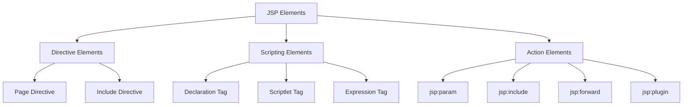

---

# 1. Directive Elements

## Introduction

Directives provide instructions to the JSP Container regarding how the JSP page should be processed.

Directives do not generate output directly.

### Syntax

```jsp
<%@ directive attribute="value" %>
```

---

# Types of Directives

```text
1. Page Directive
2. Include Directive
3. Taglib Directive
```

(As per syllabus, Page and Include are important.)

---

# Page Directive

## Definition

The Page Directive defines page-level information and instructions for the JSP container.

### Syntax

```jsp
<%@ page attribute="value" %>
```

---

## Common Attributes

| Attribute   | Purpose                   |
| ----------- | ------------------------- |
| language    | Programming language used |
| import      | Import Java packages      |
| contentType | Response MIME type        |
| session     | Enable/Disable session    |
| errorPage   | Error handling page       |
| isErrorPage | Defines error page        |

---

## Example 1: Language Attribute

```jsp
<%@ page language="java" %>
```

### Explanation

Specifies Java as the scripting language.

---

## Example 2: Import Attribute

```jsp
<%@ page import="java.util.Date" %>

Current Date:

<%= new Date() %>
```

### Output

```text
Current Date:
Sun Jun 07 2026
```

---

## Example 3: Content Type

```jsp
<%@ page contentType="text/html" %>
```

### Purpose

Specifies browser response type.

---

## Example 4: Session Attribute

```jsp
<%@ page session="true" %>
```

### Purpose

Enables session tracking.

---

# Include Directive

## Definition

The Include Directive includes the content of another file during JSP translation time.

### Syntax

```jsp
<%@ include file="filename.jsp" %>
```

---

## Working

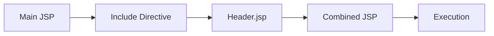

---

## Example

### header.jsp

```html
<h1>My Website</h1>
<hr />
```

---

### index.jsp

```jsp
<%@ include file="header.jsp" %>

<h2>Home Page</h2>
```

---

### Output

```html
My Website ------------------ Home Page
```

---

## Advantages

- Code Reusability
- Easy Maintenance
- Shared Header/Footer
- Faster Development

---

# 2. Scripting Elements

## Introduction

Scripting Elements allow Java code to be written inside JSP pages.

Types:

```text
1. Declaration Tag
2. Scriptlet Tag
3. Expression Tag
```

---

# Scripting Elements Diagram

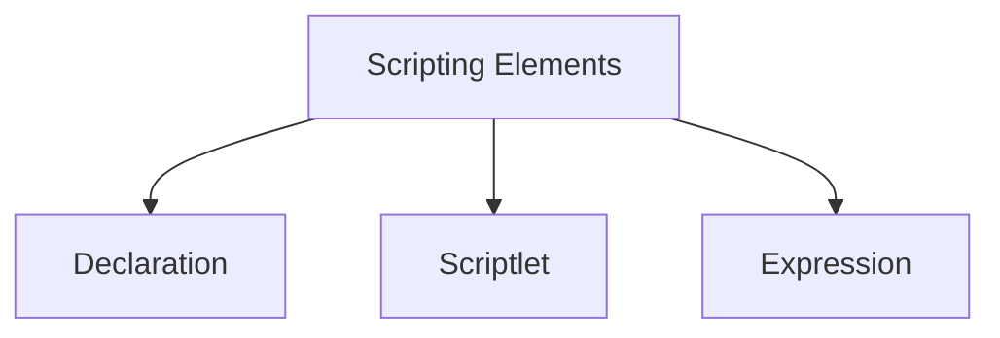

---

# Declaration Tag

## Definition

Declaration tag is used to declare variables and methods that become class-level members of the generated Servlet.

### Syntax

```jsp
<%! declaration %>
```

---

## Example 1: Variable Declaration

```jsp
<%!
int count = 100;
%>
```

---

## Example 2: Method Declaration

```jsp
<%!
public int square(int n)
{
    return n*n;
}
%>

Square = <%= square(5) %>
```

### Output

```text
Square = 25
```

---

## Characteristics

- Declares variables
- Declares methods
- Class-level scope
- Executed once during Servlet creation

---

# Scriptlet Tag

## Definition

Scriptlet is used to write Java statements inside JSP pages.

### Syntax

```jsp
<%
Java Statements
%>
```

---

## Example

```jsp
<%
int a = 10;
int b = 20;

out.println(a+b);
%>
```

### Output

```text
30
```

---

## Example Using Loop

```jsp
<%
for(int i=1;i<=5;i++)
{
    out.println(i+"<br>");
}
%>
```

### Output

```text
1
2
3
4
5
```

---

## Characteristics

- Used for Java logic
- Executes on every request
- Local scope

---

# Expression Tag

## Definition

Expression Tag displays the value directly in the browser.

### Syntax

```jsp
<%= expression %>
```

---

## Example

```jsp
<%= "Welcome JSP" %>
```

### Output

```text
Welcome JSP
```

---

## Example

```jsp
<%= 10+20 %>
```

### Output

```text
30
```

---

## Example

```jsp
<%= new java.util.Date() %>
```

### Output

```text
Sun Jun 07 2026
```

---

## Characteristics

- No semicolon required
- Automatically prints output
- Easier than out.println()

---

# Comparison of Scripting Elements

| Feature   | Declaration               | Scriptlet  | Expression     |
| --------- | ------------------------- | ---------- | -------------- |
| Syntax    | `<%! %>`                  | `<% %>`    | `<%= %>`       |
| Purpose   | Declare Variables/Methods | Java Logic | Display Output |
| Output    | No                        | No         | Yes            |
| Scope     | Class Level               | Local      | Local          |
| Semicolon | Required                  | Required   | Not Required   |

---

# 3. Action Elements

## Introduction

Action Elements are XML-based tags used to perform tasks during request processing.

### Syntax

```jsp
<jsp:actionName />
```

---

# Action Elements Diagram

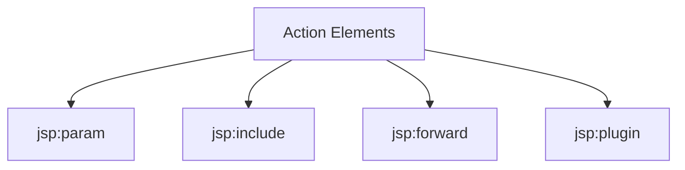

---

# jsp:param

## Definition

Used to pass parameters to another resource.

### Syntax

```jsp
<jsp:param
name="parameterName"
value="parameterValue"/>
```

---

## Example

```jsp
<jsp:include page="profile.jsp">

<jsp:param
name="username"
value="Rohan"/>

</jsp:include>
```

---

### profile.jsp

```jsp
Username:
<%= request.getParameter("username") %>
```

### Output

```text
Username: Rohan
```

---

# jsp:include

## Definition

Includes another resource during request processing.

### Syntax

```jsp
<jsp:include page="file.jsp"/>
```

---

## Difference from Include Directive

| Include Directive | jsp:include     |
| ----------------- | --------------- |
| Translation Time  | Request Time    |
| Static Include    | Dynamic Include |
| Faster            | Flexible        |

---

## Example

```jsp
<jsp:include page="header.jsp"/>
```

---

# jsp:forward

## Definition

Transfers the request from one JSP page to another page or Servlet.

### Syntax

```jsp
<jsp:forward page="target.jsp"/>
```

---

## Working

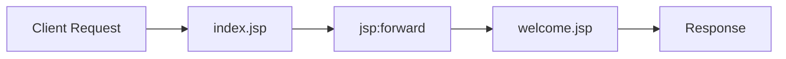

---

## Example

### index.jsp

```jsp
<jsp:forward page="welcome.jsp"/>
```

---

### welcome.jsp

```jsp
<h2>Welcome User</h2>
```

---

### Output

```text
Welcome User
```

---

## Advantages

- Page Redirection
- Request Transfer
- Navigation Control

---

# jsp:plugin

## Definition

Used to embed Java Applets or JavaBeans into a JSP page.

### Syntax

```jsp
<jsp:plugin
type="applet"
code="Demo.class"
width="300"
height="300">
</jsp:plugin>
```

---

## Example

```jsp
<jsp:plugin
type="applet"
code="Calculator.class"
width="400"
height="300">
</jsp:plugin>
```

---

## Purpose

- Embed Java Components
- Execute Applets in Browser

### Note

```text
Modern browsers no longer support Java Applets.
jsp:plugin is mostly of historical importance.
```

---

# Real-Life Example of JSP Elements

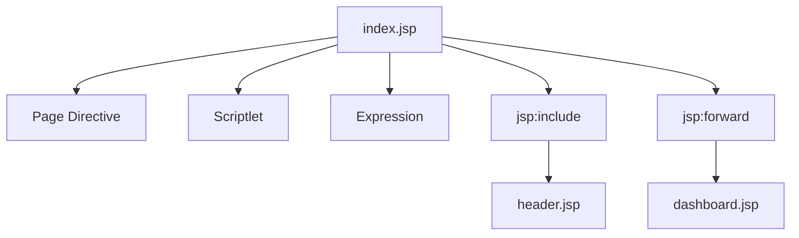

---

# Interview Questions

## Q1. Which directive is used to include another file?

**Answer**

```jsp
<%@ include file="header.jsp" %>
```

---

## Q2. Which scripting element displays output?

**Answer**

```jsp
<%= expression %>
```

---

## Q3. Which action element transfers control to another page?

**Answer**

```jsp
<jsp:forward page="target.jsp"/>
```

---

## Q4. Difference between Include Directive and jsp:include?

**Answer**

```text
Include Directive → Translation Time

jsp:include → Request Time
```

---

# Conclusion

JSP Elements are the building blocks of JSP pages.

```text
Directive Elements
    ├── page
    └── include

Scripting Elements
    ├── declaration
    ├── scriptlet
    └── expression

Action Elements
    ├── jsp:param
    ├── jsp:include
    ├── jsp:forward
    └── jsp:plugin
```

# JSP Implicit Objects

## Introduction

JSP provides several built-in objects automatically. These objects are called **Implicit Objects** because developers can use them directly without creating or initializing them.

When a JSP page is converted into a Servlet, the JSP Container automatically creates these objects and makes them available inside the `_jspService()` method.

### Why Implicit Objects?

Without implicit objects, developers would need to manually create objects for:

- Request handling
- Response handling
- Session management
- Application management
- Output generation

JSP automatically provides them.

---

# JSP Implicit Objects Diagram

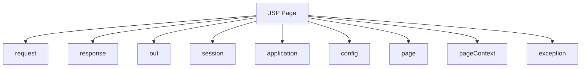

---

# List of JSP Implicit Objects

| Object      | Class Type          | Purpose                |
| ----------- | ------------------- | ---------------------- |
| request     | HttpServletRequest  | Handles client request |
| response    | HttpServletResponse | Sends response         |
| out         | JspWriter           | Prints output          |
| session     | HttpSession         | Manages user session   |
| application | ServletContext      | Application-wide data  |
| config      | ServletConfig       | Servlet configuration  |
| page        | Object              | Current JSP page       |
| pageContext | PageContext         | Access all JSP objects |
| exception   | Throwable           | Error handling         |

---

# 1. request Object

## Definition

The `request` object contains information sent by the client to the server.

### Class

```java
HttpServletRequest
```

---

## Uses

- Read form data
- Read URL parameters
- Read headers
- Read cookies

---

## Example

### URL

```text
http://localhost:8080/demo/index.jsp?name=Rohan
```

### JSP Code

```jsp
<%
String name = request.getParameter("name");
%>

Name:
<%= name %>
```

### Output

```text
Name: Rohan
```

---

## Common Methods

| Method          | Purpose             |
| --------------- | ------------------- |
| getParameter()  | Get parameter value |
| getHeader()     | Get header          |
| getMethod()     | HTTP method         |
| getRemoteAddr() | Client IP           |
| getCookies()    | Cookies             |

---

# 2. response Object

## Definition

The response object is used to send data back to the browser.

### Class

```java
HttpServletResponse
```

---

## Example

```jsp
<%
response.setContentType("text/html");
%>
```

---

## Redirect Example

```jsp
<%
response.sendRedirect("home.jsp");
%>
```

---

## Common Methods

| Method           | Purpose          |
| ---------------- | ---------------- |
| sendRedirect()   | Redirect page    |
| setContentType() | Set content type |
| addCookie()      | Add cookie       |
| setHeader()      | Set header       |

---

# 3. out Object

## Definition

The `out` object is used to send output to the browser.

### Class

```java
JspWriter
```

---

## Example

```jsp
<%
out.println("Welcome JSP");
%>
```

### Output

```text
Welcome JSP
```

---

## Methods

| Method    | Purpose            |
| --------- | ------------------ |
| print()   | Print value        |
| println() | Print with newline |
| flush()   | Clear buffer       |
| close()   | Close stream       |

---

# 4. session Object

## Definition

The session object stores data for a specific user throughout multiple requests.

### Class

```java
HttpSession
```

---

## Working


---

## Example

### Store Data

```jsp
<%
session.setAttribute("username","Rohan");
%>
```

---

### Retrieve Data

```jsp
<%= session.getAttribute("username") %>
```

### Output

```text
Rohan
```

---

## Common Methods

| Method            | Purpose         |
| ----------------- | --------------- |
| setAttribute()    | Store value     |
| getAttribute()    | Retrieve value  |
| invalidate()      | Destroy session |
| removeAttribute() | Remove data     |

---

# 5. application Object

## Definition

Stores data accessible throughout the entire web application.

### Class

```java
ServletContext
```

---

## Example

```jsp
<%
application.setAttribute("company","ABC Ltd");
%>
```

---

Retrieve:

```jsp
<%= application.getAttribute("company") %>
```

Output:

```text
ABC Ltd
```

---

## Scope

```text
Entire Application
```

---

# 6. config Object

## Definition

Contains Servlet configuration information.

### Class

```java
ServletConfig
```

---

## Example

```jsp
<%= config.getServletName() %>
```

Output:

```text
index_jsp
```

---

# 7. page Object

## Definition

Represents the current JSP page instance.

### Class

```java
Object
```

Equivalent to:

```java
this
```

---

## Example

```jsp
<%= page %>
```

---

# 8. pageContext Object

## Definition

Provides access to all JSP scopes and implicit objects.

### Class

```java
PageContext
```

---

## Scope Levels

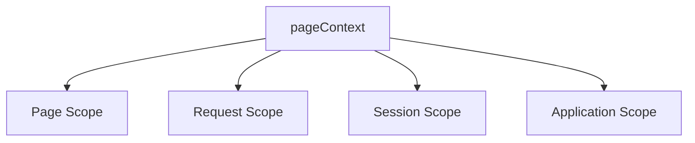

---

## Example

```jsp
<%
pageContext.setAttribute("city","Rajkot");
%>

<%= pageContext.getAttribute("city") %>
```

Output:

```text
Rajkot
```

---

# 9. exception Object

## Definition

Used for error handling in JSP pages.

### Class

```java
Throwable
```

---

## Example

### error.jsp

```jsp
<%@ page isErrorPage="true" %>

Error:

<%= exception.getMessage() %>
```

---

# Summary Table

| Object      | Scope              |
| ----------- | ------------------ |
| request     | Current Request    |
| response    | Current Response   |
| out         | Output Stream      |
| session     | User Session       |
| application | Entire Application |
| config      | Servlet Config     |
| page        | Current Page       |
| pageContext | All Scopes         |
| exception   | Error Page         |

---

# Including and Forwarding from JSP Pages

## Introduction

JSP provides mechanisms to:

```text
1. Include another resource
2. Forward request to another resource
```

These features help in:

- Code Reusability
- Modular Development
- Navigation Control
- MVC Architecture

---

# Including vs Forwarding

| Feature             | Including      | Forwarding           |
| ------------------- | -------------- | -------------------- |
| Purpose             | Insert content | Transfer request     |
| Control Returns     | Yes            | No                   |
| Output Combined     | Yes            | No                   |
| Browser URL Changes | No             | No                   |
| Resource Execution  | Both Execute   | Only Target Executes |

---

# Including from JSP Pages

## Definition

Including means inserting content from another resource into the current page.

There are two types:

```text
1. Include Directive
2. jsp:include Action
```

---

# Include Directive

## Syntax

```jsp
<%@ include file="header.jsp" %>
```

---

## Working

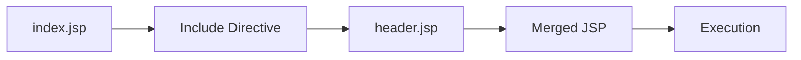

---

## Example

### header.jsp

```html
<h1>My Website</h1>
<hr />
```

---

### index.jsp

```jsp
<%@ include file="header.jsp" %>

<h2>Home Page</h2>
```

---

### Output

```html
My Website Home Page
```

---

# jsp:include Action

## Syntax

```jsp
<jsp:include page="header.jsp"/>
```

---

## Working

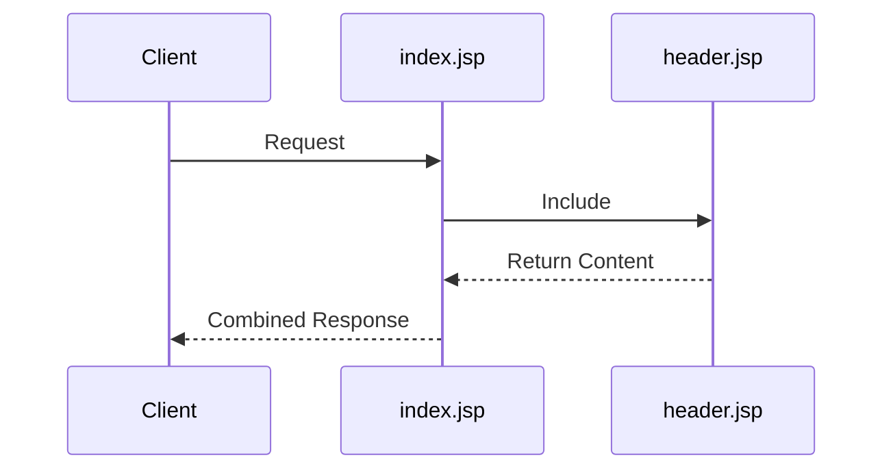

---

## Example

```jsp
<jsp:include page="header.jsp"/>
```

---

# Difference Between Include Directive and jsp:include

| Include Directive | jsp:include     |
| ----------------- | --------------- |
| Translation Time  | Request Time    |
| Static Include    | Dynamic Include |
| Faster            | Flexible        |
| File Merged       | Output Included |

---

# Forwarding from JSP Pages

## Definition

Forwarding transfers a request from one resource to another resource.

After forwarding:

```text
Current JSP Stops Execution
```

and control moves to the target resource.

---

# jsp:forward Syntax

```jsp
<jsp:forward page="home.jsp"/>
```

---

# Working Diagram


---

# Example

### index.jsp

```jsp
<jsp:forward page="welcome.jsp"/>
```

---

### welcome.jsp

```html
<h2>Welcome User</h2>
```

---

### Output

```html
Welcome User
```

---

# Forwarding with Parameters

## Example

```jsp
<jsp:forward page="profile.jsp">

<jsp:param
name="username"
value="Rohan"/>

</jsp:forward>
```

---

### profile.jsp

```jsp
Username:
<%= request.getParameter("username") %>
```

Output:

```text
Username: Rohan
```

---

# Real-Life Login Example

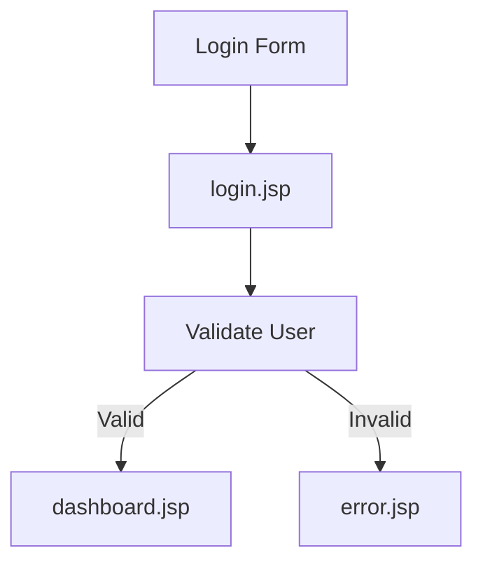

---

# Interview Questions

## Q1. Which implicit object handles client requests?

```java
request
```

---

## Q2. Which implicit object stores user session data?

```java
session
```

---

## Q3. Difference between include and forward?

```text
Include → Adds Content

Forward → Transfers Request
```

---

## Q4. Which action tag forwards control?

```jsp
<jsp:forward page="home.jsp"/>
```

---

# JSP Include Action

## Introduction

The **jsp:include** action is used to include the output of another resource (JSP, Servlet, or HTML file) into the current JSP page during request processing.

Unlike the Include Directive (`<%@ include %>`), the Include Action works at runtime.

### Syntax

```jsp
<jsp:include page="resource.jsp" />
```

---

# How jsp:include Works

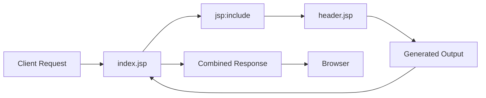

---

## Example 1

### header.jsp

```html
<h1>My Website</h1>
<hr />
```

---

### index.jsp

```jsp
<jsp:include page="header.jsp"/>

<h2>Home Page</h2>
```

---

### Output

```html
My Website ------------------ Home Page
```

---

# Including Dynamic Content

### date.jsp

```jsp
Current Time:

<%= new java.util.Date() %>
```

---

### index.jsp

```jsp
<jsp:include page="date.jsp"/>
```

---

### Output

```text
Current Time:
Sun Jun 07 2026 10:30 AM
```

Every request generates a new date and time.

---

# Passing Parameters using jsp:param

### index.jsp

```jsp
<jsp:include page="profile.jsp">

<jsp:param
name="username"
value="Rohan"/>

</jsp:include>
```

---

### profile.jsp

```jsp
Welcome

<%= request.getParameter("username") %>
```

---

### Output

```text
Welcome Rohan
```

---

# Advantages of Include Action

- Dynamic inclusion
- Reusable pages
- Runtime execution
- Easy maintenance
- Supports parameter passing

---

# Include Directive vs Include Action

| Feature           | Include Directive | Include Action  |
| ----------------- | ----------------- | --------------- |
| Syntax            | `<%@ include %>`  | `<jsp:include>` |
| Execution Time    | Translation Time  | Request Time    |
| Dynamic Content   | No                | Yes             |
| Parameter Passing | No                | Yes             |
| Flexibility       | Less              | More            |

---

# JSP Forward Action

## Introduction

The **jsp:forward** action transfers the current request from one JSP page to another JSP page, Servlet, or HTML page.

After forwarding:

```text
Current JSP stops execution.
```

Control moves completely to the target resource.

---

# Syntax

```jsp
<jsp:forward page="target.jsp"/>
```

---

# Working of Forward Action

```mermaid
flowchart LR

A[Client Request]

--> B[index.jsp]

--> C[jsp:forward]

--> D[welcome.jsp]

--> E[Response]

--> F[Browser]
```

---

# Example

### index.jsp

```jsp
<jsp:forward page="welcome.jsp"/>
```

---

### welcome.jsp

```html
<h2>Welcome User</h2>
```

---

### Output

```html
Welcome User
```

---

# Forwarding with Parameters

### login.jsp

```jsp
<jsp:forward page="profile.jsp">

<jsp:param
name="user"
value="Rohan"/>

</jsp:forward>
```

---

### profile.jsp

```jsp
User Name:

<%= request.getParameter("user") %>
```

---

### Output

```text
User Name: Rohan
```

---

# Real-Life Login Example

```mermaid
flowchart TD

A[Login Form]

--> B[Validate User]

B -->|Success| C[Dashboard.jsp]

B -->|Failure| D[Error.jsp]
```

---

# Advantages of Forward Action

- Request transfer
- Navigation control
- MVC architecture support
- Faster than redirect
- Maintains request data

---

# Include vs Forward

| Feature               | Include     | Forward          |
| --------------------- | ----------- | ---------------- |
| Purpose               | Add Content | Transfer Request |
| Original JSP Executes | Yes         | No               |
| Target JSP Executes   | Yes         | Yes              |
| Output Combined       | Yes         | No               |
| Request Shared        | Yes         | Yes              |
| Browser URL Changes   | No          | No               |

---

# Working with Session in JSP

## Introduction

A Session is used to store user-specific data across multiple requests.

HTTP is stateless, so sessions help maintain user information while navigating between pages.

---

# Session Architecture

```mermaid
flowchart LR

A[User Login]

--> B[Session Created]

--> C[Store User Data]

--> D[Multiple Requests]

--> E[Logout]

--> F[Session Destroyed]
```

---

# Session Object

JSP provides an implicit object:

```java
session
```

Class:

```java
HttpSession
```

---

# Creating Session Data

### login.jsp

```jsp
<%
session.setAttribute(
"username",
"Rohan"
);
%>
```

---

# Retrieving Session Data

### profile.jsp

```jsp
Username:

<%= session.getAttribute("username") %>
```

---

### Output

```text
Username: Rohan
```

---

# Removing Session Attribute

```jsp
<%
session.removeAttribute("username");
%>
```

---

# Invalidating Session

```jsp
<%
session.invalidate();
%>
```

---

# Session Methods

| Method            | Purpose               |
| ----------------- | --------------------- |
| setAttribute()    | Store data            |
| getAttribute()    | Retrieve data         |
| removeAttribute() | Remove data           |
| invalidate()      | Destroy session       |
| getId()           | Session ID            |
| getCreationTime() | Session creation time |

---

# Example: Login Session

### login.jsp

```jsp
<%
String user = "Rohan";

session.setAttribute(
"user",
user
);
%>

Login Successful
```

---

### dashboard.jsp

```jsp
Welcome

<%= session.getAttribute("user") %>
```

---

### Output

```text
Welcome Rohan
```

---

# Session Tracking Flow

```mermaid
sequenceDiagram

participant User
participant Browser
participant Server

User->>Server: Login

Server->>Browser: Session ID

Browser->>Server: Request + Session ID

Server->>Browser: User Data

Browser->>Server: Another Request

Server->>Browser: Same Session
```

---

# Working with Cookies in JSP

## Introduction

Cookies are small text files stored on the client's browser.

Cookies help store user preferences and tracking information.

---

# Cookie Architecture

```mermaid
flowchart LR

A[Server]

--> B[Create Cookie]

--> C[Browser Stores Cookie]

--> D[Next Request]

--> E[Cookie Sent Back]

--> F[Server Reads Cookie]
```

---

# Creating Cookie

### Syntax

```java
Cookie cookie =
new Cookie(
"name",
"value"
);

response.addCookie(cookie);
```

---

# Example

```jsp
<%
Cookie cookie =
new Cookie(
"username",
"Rohan"
);

response.addCookie(cookie);
%>
```

---

# Reading Cookie

```jsp
<%
Cookie cookies[] =
request.getCookies();

for(Cookie c : cookies)
{
    out.println(
    c.getName()
    + "=" +
    c.getValue()
    );
}
%>
```

---

# Output

```text
username=Rohan
```

---

# Setting Cookie Expiry

```jsp
<%
Cookie cookie =
new Cookie(
"user",
"Rohan"
);

cookie.setMaxAge(3600);

response.addCookie(cookie);
%>
```

---

### Meaning

```text
3600 Seconds
= 1 Hour
```

---

# Deleting Cookie

```jsp
<%
Cookie cookie =
new Cookie(
"user",
""
);

cookie.setMaxAge(0);

response.addCookie(cookie);
%>
```

---

# Cookie Methods

| Method      | Purpose      |
| ----------- | ------------ |
| getName()   | Cookie name  |
| getValue()  | Cookie value |
| setValue()  | Change value |
| setMaxAge() | Set expiry   |
| getMaxAge() | Get expiry   |

---

# Session vs Cookie

| Feature     | Session            | Cookie         |
| ----------- | ------------------ | -------------- |
| Stored At   | Server             | Client Browser |
| Security    | High               | Lower          |
| Size Limit  | Large              | Small          |
| Performance | Slower             | Faster         |
| Lifetime    | Until Session Ends | Until Expiry   |
| Access      | Server Side        | Client Side    |

---

# Real-Life Example

```mermaid
flowchart TD

A[User Login]

--> B[Session Stores User]

--> C[Cookie Stores Remember Me]

--> D[User Revisits Website]

--> E[Cookie Identifies User]

--> F[Session Restored]
```

---

# Interview Questions

## Q1. Which action tag includes another resource?

```jsp
<jsp:include page="header.jsp"/>
```

---

## Q2. Which action tag transfers control?

```jsp
<jsp:forward page="home.jsp"/>
```

---

## Q3. Which implicit object manages sessions?

```java
session
```

---

## Q4. Which class is used for cookies?

```java
Cookie
```

---

## Q5. Where are cookies stored?

```text
Client Browser
```

---

# Conclusion

JSP provides powerful mechanisms for page communication and user tracking.

```text
jsp:include
    → Includes another resource

jsp:forward
    → Transfers request

Session
    → Stores user data on server

Cookie
    → Stores user data on client browser
```

These concepts are fundamental for developing dynamic and interactive JSP-based web applications.

# Error Handling and Exception Handling in JSP

## Introduction

Errors are common in web applications. JSP provides mechanisms to detect, handle, and display errors gracefully without crashing the application.

Error handling improves:

- User Experience
- Application Stability
- Debugging
- Security

---

# Types of Errors in JSP

```mermaid
flowchart TD

A[JSP Errors]

A --> B[Compilation Errors]

A --> C[Runtime Errors]

A --> D[Logical Errors]

A --> E[Exception Errors]
```

---

## 1. Compilation Errors

Occur when JSP is translated into a Servlet.

### Example

```jsp
<%
int a =
%>
```

### Reason

```text
Missing Value
```

---

## 2. Runtime Errors

Occur while executing JSP code.

### Example

```jsp
<%
int x = 10/0;
%>
```

### Error

```text
ArithmeticException
```

---

## 3. Logical Errors

Program runs successfully but produces incorrect output.

### Example

```jsp
<%
int result = 10 - 5;
%>
```

Expected:

```text
50
```

Actual:

```text
5
```

---

## What is an Exception?

An Exception is an abnormal event that interrupts normal program execution.

Examples:

```text
ArithmeticException

NullPointerException

NumberFormatException

ArrayIndexOutOfBoundsException

SQLException
```

---

# JSP Exception Handling Architecture

```mermaid
flowchart LR

A[JSP Page]

--> B[Exception Occurs]

--> C[Container Detects Error]

--> D[Error Page]

--> E[User Friendly Message]
```

---

# Using errorPage Attribute

## Definition

The `errorPage` attribute specifies the JSP page that handles exceptions.

### Syntax

```jsp
<%@ page errorPage="error.jsp" %>
```

---

## Example

### index.jsp

```jsp
<%@ page errorPage="error.jsp" %>

<%
int result = 10/0;
%>
```

---

### error.jsp

```jsp
<%@ page isErrorPage="true" %>

<h2>Error Occurred</h2>

<%= exception.getMessage() %>
```

---

### Output

```text
Error Occurred

/ by zero
```

---

# Error Handling Flow

```mermaid
flowchart TD

A[index.jsp]

--> B[Exception Generated]

--> C[errorPage Attribute]

--> D[error.jsp]

--> E[Display Error]
```

---

# isErrorPage Attribute

## Definition

Allows access to the implicit exception object.

### Syntax

```jsp
<%@ page isErrorPage="true" %>
```

---

## Example

```jsp
<%= exception %>
```

---

## Exception Object

Class:

```java
Throwable
```

Used only inside error pages.

---

# Common Exception Handling Example

```jsp
<%@ page errorPage="error.jsp" %>

<%
String value = null;

out.println(value.length());
%>
```

---

### Output

```text
NullPointerException
```

handled by:

```jsp
error.jsp
```

---

# Advantages of JSP Error Handling

- User-friendly messages
- Better debugging
- Application stability
- Centralized error management

---

# JDBC with JSP

## Introduction

JDBC (Java Database Connectivity) is a Java API used to connect Java applications with databases.

Using JDBC, JSP pages can:

- Insert Data
- Update Data
- Delete Data
- Retrieve Data

from databases like:

- MySQL
- Oracle
- PostgreSQL
- SQL Server

---

# JDBC Architecture

```mermaid
flowchart LR

A[JSP Page]

--> B[JDBC API]

--> C[JDBC Driver]

--> D[Database]

D --> C

C --> B

B --> A
```

---

# JDBC Components

| Component         | Purpose               |
| ----------------- | --------------------- |
| DriverManager     | Manages Drivers       |
| Connection        | Database Connection   |
| Statement         | SQL Execution         |
| PreparedStatement | Parameterized Queries |
| ResultSet         | Stores Retrieved Data |

---

# JDBC Steps

```mermaid
flowchart TD

A[Load Driver]

--> B[Create Connection]

--> C[Create Statement]

--> D[Execute Query]

--> E[Process Result]

--> F[Close Connection]
```

---

# Step 1: Import JDBC Package

```jsp
<%@ page import="java.sql.*" %>
```

---

# Step 2: Load Driver

```java
Class.forName(
"com.mysql.cj.jdbc.Driver"
);
```

---

# Step 3: Create Connection

```java
Connection con =
DriverManager.getConnection(
"jdbc:mysql://localhost:3306/studentdb",
"root",
"password"
);
```

---

# Step 4: Create Statement

```java
Statement stmt =
con.createStatement();
```

---

# Step 5: Execute Query

```java
ResultSet rs =
stmt.executeQuery(
"SELECT * FROM students"
);
```

---

# Step 6: Process Result

```java
while(rs.next())
{
    out.println(
    rs.getString("name")
    );
}
```

---

# Complete JDBC Example

```jsp
<%@ page import="java.sql.*" %>

<%

Class.forName(
"com.mysql.cj.jdbc.Driver"
);

Connection con =
DriverManager.getConnection(
"jdbc:mysql://localhost:3306/studentdb",
"root",
"password"
);

Statement stmt =
con.createStatement();

ResultSet rs =
stmt.executeQuery(
"SELECT * FROM students"
);

while(rs.next())
{
%>

<p>
<%= rs.getInt("id") %>
-
<%= rs.getString("name") %>
</p>

<%
}

con.close();

%>
```

---

# Insert Record Example

```jsp
<%

PreparedStatement ps =
con.prepareStatement(
"INSERT INTO students(name) VALUES(?)"
);

ps.setString(1,"Rohan");

ps.executeUpdate();

%>
```

---

# JDBC Operations

```mermaid
flowchart TD

A[JDBC]

A --> B[Insert]

A --> C[Update]

A --> D[Delete]

A --> E[Select]
```

---

# Advantages of JDBC

- Database Independent
- Secure Data Access
- Supports Transactions
- Easy Integration with JSP

---

# Introduction to JavaBean

## What is JavaBean?

A JavaBean is a reusable Java class that follows specific conventions.

It is used to store and transfer data between JSP pages and Java programs.

---

# JavaBean Architecture

```mermaid
flowchart LR

A[JSP Page]

--> B[JavaBean]

--> C[Database]

C --> B

B --> A
```

---

# JavaBean Rules

A JavaBean must:

### 1. Implement Serializable

```java
implements Serializable
```

---

### 2. Have Default Constructor

```java
public StudentBean()
{
}
```

---

### 3. Have Private Variables

```java
private String name;
```

---

### 4. Have Getter and Setter Methods

```java
getName()

setName()
```

---

# JavaBean Structure

```mermaid
flowchart TD

A[JavaBean]

A --> B[Private Properties]

A --> C[Default Constructor]

A --> D[Getter Methods]

A --> E[Setter Methods]
```

---

# JavaBean Example

## StudentBean.java

```java
package beans;

public class StudentBean
{
    private String name;

    public StudentBean()
    {

    }

    public String getName()
    {
        return name;
    }

    public void setName(String name)
    {
        this.name = name;
    }
}
```

---

# Using JavaBean in JSP

## Create Bean

```jsp
<jsp:useBean
id="student"
class="beans.StudentBean"
/>
```

---

# Set Property

```jsp
<jsp:setProperty
name="student"
property="name"
value="Rohan"
/>
```

---

# Get Property

```jsp
<jsp:getProperty
name="student"
property="name"
/>
```

---

# Complete Example

```jsp
<jsp:useBean
id="student"
class="beans.StudentBean"
/>

<jsp:setProperty
name="student"
property="name"
value="Rohan"
/>

Student Name:

<jsp:getProperty
name="student"
property="name"
/>
```

---

### Output

```text
Student Name: Rohan
```

---

# JavaBean Tags

| Tag             | Purpose      |
| --------------- | ------------ |
| jsp:useBean     | Create Bean  |
| jsp:setProperty | Set Property |
| jsp:getProperty | Get Property |

---

# Working of JavaBean

```mermaid
sequenceDiagram

participant JSP
participant Bean

JSP->>Bean: Create Bean

JSP->>Bean: Set Property

Bean-->>JSP: Store Data

JSP->>Bean: Get Property

Bean-->>JSP: Return Value
```

---

# Advantages of JavaBean

- Reusable Components
- Encapsulation
- Easy Maintenance
- Better MVC Support
- Clean Separation of Logic and Presentation

---

# JDBC vs JavaBean

| Feature          | JDBC            | JavaBean        |
| ---------------- | --------------- | --------------- |
| Purpose          | Database Access | Data Storage    |
| Package          | java.sql        | User Defined    |
| Handles Database | Yes             | No              |
| Reusable         | Limited         | Highly Reusable |
| MVC Role         | Model Layer     | Model Layer     |

---

# Interview Questions

## Q1. Which attribute specifies an error page?

```jsp
errorPage
```

---

## Q2. Which attribute allows use of exception object?

```jsp
isErrorPage="true"
```

---

## Q3. Which JDBC class establishes database connection?

```java
DriverManager
```

---

## Q4. Which JDBC object stores query results?

```java
ResultSet
```

---

## Q5. Which JSP tag creates a JavaBean?

```jsp
<jsp:useBean>
```

---

## Q6. What are the three JavaBean tags?

```jsp
jsp:useBean

jsp:setProperty

jsp:getProperty
```

---

# JavaBean Properties

## Introduction

A JavaBean stores data using variables called **Properties**.

A Property represents the state or characteristics of a JavaBean object.

Examples:

```text
Student Bean
-------------
id
name
email
course
```

Here:

```text
id
name
email
course
```

are JavaBean Properties.

---

# JavaBean Property Structure

A JavaBean Property consists of:

```text
1. Private Variable
2. Getter Method
3. Setter Method
```

---

# Property Architecture

```mermaid
flowchart TD

A[JavaBean Property]

A --> B[Private Variable]

A --> C[Getter Method]

A --> D[Setter Method]
```

---

# Example of Property

```java
private String name;
```

Property Name:

```text
name
```

---

# Getter and Setter

```java
public String getName()
{
    return name;
}

public void setName(String name)
{
    this.name = name;
}
```

---

# Complete JavaBean Example

```java
public class StudentBean
{
    private String name;

    public StudentBean()
    {

    }

    public String getName()
    {
        return name;
    }

    public void setName(String name)
    {
        this.name = name;
    }
}
```

---

# How Property Works

```mermaid
sequenceDiagram

participant JSP
participant Bean

JSP->>Bean: setName("Rohan")

Bean-->>Bean: Store Value

JSP->>Bean: getName()

Bean-->>JSP: Rohan
```

---

# Types of JavaBean Properties

```text
1. Simple Property
2. Indexed Property
3. Boolean Property
```

---

# 1. Simple Property

Stores a single value.

### Example

```java
private String name;
```

Getter:

```java
public String getName()
{
    return name;
}
```

Setter:

```java
public void setName(String name)
{
    this.name = name;
}
```

---

# Example Output

```java
StudentBean s =
new StudentBean();

s.setName("Rohan");

System.out.println(
s.getName()
);
```

Output:

```text
Rohan
```

---

# 2. Indexed Property

Stores multiple values using an array.

### Example

```java
private String subjects[];
```

Getter:

```java
public String[] getSubjects()
{
    return subjects;
}
```

Setter:

```java
public void setSubjects(
String subjects[]
)
{
    this.subjects = subjects;
}
```

---

# Example

```java
String sub[] =
{
    "Java",
    "JSP",
    "Servlet"
};
```

---

# Indexed Property Diagram

```mermaid
flowchart LR

A[subjects]

--> B[Java]

--> C[JSP]

--> D[Servlet]
```

---

# 3. Boolean Property

Stores True or False values.

### Example

```java
private boolean active;
```

Getter:

```java
public boolean isActive()
{
    return active;
}
```

Setter:

```java
public void setActive(
boolean active
)
{
    this.active = active;
}
```

---

# Example

```java
bean.setActive(true);
```

Output:

```text
true
```

---

# Property Naming Rules

| Property | Getter     | Setter      |
| -------- | ---------- | ----------- |
| name     | getName()  | setName()   |
| age      | getAge()   | setAge()    |
| email    | getEmail() | setEmail()  |
| active   | isActive() | setActive() |

---

# JavaBean Property Access in JSP

## Creating Bean

```jsp
<jsp:useBean
id="student"
class="beans.StudentBean"
/>
```

---

## Setting Property

```jsp
<jsp:setProperty
name="student"
property="name"
value="Rohan"
/>
```

---

## Getting Property

```jsp
<jsp:getProperty
name="student"
property="name"
/>
```

---

# Property Flow

```mermaid
flowchart TD

A[JSP]

--> B[setProperty]

--> C[JavaBean Property]

--> D[getProperty]

--> E[Display Value]
```

---

# Example

### StudentBean.java

```java
public class StudentBean
{
    private String name;

    public String getName()
    {
        return name;
    }

    public void setName(String name)
    {
        this.name = name;
    }
}
```

---

### JSP Page

```jsp
<jsp:useBean
id="student"
class="beans.StudentBean"
/>

<jsp:setProperty
name="student"
property="name"
value="Rohan"
/>

Name:

<jsp:getProperty
name="student"
property="name"
/>
```

Output:

```text
Name: Rohan
```

---

# JavaBean Methods

## Introduction

Methods are functions inside a JavaBean that perform operations on data.

Methods help:

- Process Data
- Calculate Values
- Validate Information
- Return Results

---

# JavaBean Methods Architecture

```mermaid
flowchart TD

A[JavaBean]

A --> B[Properties]

A --> C[Methods]

C --> D[Business Logic]

C --> E[Calculations]

C --> F[Validation]
```

---

# Types of Methods

```text
1. Getter Methods
2. Setter Methods
3. Custom Methods
```

---

# 1. Getter Methods

Used to retrieve property values.

### Example

```java
public String getName()
{
    return name;
}
```

---

# 2. Setter Methods

Used to assign property values.

### Example

```java
public void setName(String name)
{
    this.name = name;
}
```

---

# Getter and Setter Working

```mermaid
sequenceDiagram

participant JSP
participant Bean

JSP->>Bean: setName("Rohan")

Bean-->>Bean: Store Value

JSP->>Bean: getName()

Bean-->>JSP: Rohan
```

---

# 3. Custom Methods

Custom methods perform additional tasks.

### Example

```java
public int square(int n)
{
    return n*n;
}
```

---

# Example Bean

```java
public class CalculatorBean
{
    public int square(int n)
    {
        return n*n;
    }
}
```

---

# Using Custom Method

```java
CalculatorBean c =
new CalculatorBean();

System.out.println(
c.square(5)
);
```

Output:

```text
25
```

---

# Example: StudentBean with Method

```java
public class StudentBean
{
    private int marks;

    public int getMarks()
    {
        return marks;
    }

    public void setMarks(int marks)
    {
        this.marks = marks;
    }

    public String getResult()
    {
        if(marks >= 35)
            return "Pass";
        else
            return "Fail";
    }
}
```

---

# Working Example

```java
StudentBean s =
new StudentBean();

s.setMarks(80);

System.out.println(
s.getResult()
);
```

Output:

```text
Pass
```

---

# Method Categories

```mermaid
flowchart TD

A[JavaBean Methods]

A --> B[Getter Methods]

A --> C[Setter Methods]

A --> D[Custom Methods]

D --> E[Validation]

D --> F[Calculation]

D --> G[Business Logic]
```

---

# Real-Life Example

## EmployeeBean

```java
public class EmployeeBean
{
    private double salary;

    public double getSalary()
    {
        return salary;
    }

    public void setSalary(double salary)
    {
        this.salary = salary;
    }

    public double calculateBonus()
    {
        return salary * 0.10;
    }
}
```

---

## Output

```java
Salary = 50000

Bonus = 5000
```

---

# Advantages of JavaBean Methods

- Encapsulation
- Code Reusability
- Easy Maintenance
- Better Security
- Business Logic Separation

---

# Properties vs Methods

| Feature       | Properties | Methods              |
| ------------- | ---------- | -------------------- |
| Purpose       | Store Data | Perform Operations   |
| Example       | name, age  | getName(), setName() |
| Data          | Yes        | No                   |
| Logic         | No         | Yes                  |
| Encapsulation | Supported  | Supported            |

---

# Complete JavaBean Structure

```mermaid
flowchart TD

A[JavaBean]

A --> B[Private Properties]

A --> C[Constructor]

A --> D[Getter Methods]

A --> E[Setter Methods]

A --> F[Custom Methods]
```

---

# Interview Questions

## Q1. What is a JavaBean Property?

```text
A private variable accessed using getter and setter methods.
```

---

## Q2. Which method retrieves a property value?

```java
Getter Method
```

---

## Q3. Which method assigns a property value?

```java
Setter Method
```

---

## Q4. What is a Boolean Property getter called?

```java
isPropertyName()
```

Example:

```java
isActive()
```

---

## Q5. Can JavaBeans contain custom methods?

```text
Yes
```

Custom methods are used for calculations, validation, and business logic.

---
