# 📚 BCA Semester - 5

## 💻 Advanced Java and J2EE

> **Subject Code:** BCA-101
> **Course:** Bachelor of Computer Applications (BCA)
> **Semester:** 5

---

# 📑 Unit 4 : Enterprise Java Technologies and Frameworks

## Topics

- Introduction to MVC
- Implementation of MVC Architecture
- Introduction to EJB
- Benefits of EJB
- Types of EJB:
  - Session Beans
  - Entity Beans
  - Message-driven Beans
- Introduction to Hibernate
- Features of Hibernate
- Exploring Hibernate Architecture
- Hibernate Configuration File
- Hibernate Mapping File
- Basic Example of Hibernate
- Annotation
- Hibernate Inheritance
- Inheritance Annotations
- Introduction of Spring Framework
- Spring Architecture
- Spring & MVC
- Understanding Struts Framework
- Struts Flow of Control

---

# Introduction to MVC

## What is MVC?

MVC (Model-View-Controller) is a software architectural design pattern used to develop web applications by separating the application into three interconnected components:

```
M → Model       (Business Logic + Data)
V → View        (User Interface / JSP)
C → Controller  (Request Handling / Servlet)
```

MVC helps organize application code by separating:

- Business Logic
- User Interface
- Request Handling
  This makes applications easier to **develop, maintain, test, and scale**.

---

# Why MVC is Needed?

Before MVC, all code was written in a single JSP or Servlet file.
**Problems with Traditional Approach:**

- Mixed business logic with UI code — very hard to maintain
- Code duplication across many pages
- Impossible to test individual parts in isolation
- Difficult to scale for large teams
- Changing UI required touching database logic and vice-versa
  > ✅ MVC solves these problems by separating responsibilities into three distinct layers.

---

# MVC Architecture Diagram

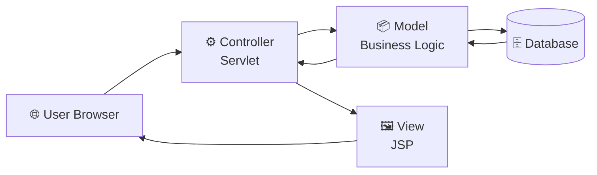

### 🔍 Diagram Deep Explanation

Upper diagram step-by-step flow:

| Step | From | To | શું થાય છે? |
|------|------|-----|------------|
| 1 | User Browser | Controller (Servlet) | User browser માં URL type કરે છે. HTTP Request Controller ને જાય છે. |
| 2 | Controller | Model | Controller Model ને data fetch કરવા request કરે છે. |
| 3 | Model | Database | Model SQL query ચલાવે છે Database ઉપર. |
| 4 | Database | Model | Database data return કરે છે Model ને. |
| 5 | Model | Controller | Model processed data Controller ને પાઠવે છે. |
| 6 | Controller | View (JSP) | Controller data forward કરે છે JSP View ને. |
| 7 | View | User Browser | JSP HTML generate કરીને browser ને response મોકલે છે. |

> **Key Point:** User ક્યારેય directly Model સાથે interact કરતો નથી. Controller middle-man (bridge) ની ભૂમિકા ભજવે છે.

---

# MVC Components

## 1. Model

The Model contains:

- Business Logic
- Data Processing
- Database Operations
  **Responsibilities:**
  |
  Operation
  |
  Description
  |
  |

---

## |

|
|
Store Data
|
Save data to database
|
|
Retrieve Data
|
Fetch data from database
|
|
Update Data
|
Modify existing records
|
|
Delete Data
|
Remove records
|
|
Business Logic
|
Perform validations and calculations
|

### Example

```java
public class Student
{
    private int id;
    private String name;
    public Student(int id, String name)
    {
        this.id   = id;
        this.name = name;
    }
    public int getId()
    {
        return id;
    }
    public String getName()
    {
        return name;
    }
}
```

---

## 2. View

The View is responsible for **displaying data** to users.
Usually implemented using:

- JSP Pages
- HTML Templates
- CSS Stylesheets
- JavaScript

### Example

```jsp
<h2>Welcome User</h2>
```

> ⚠️ View does **NOT** contain business logic.

---

## 3. Controller

The Controller acts as a bridge between **Model and View**.
**Responsibilities:**
|
Task
|
Details
|
|

---

## |

|
|
Receive Requests
|
Accept HTTP requests from browser
|
|
Process Requests
|
Validate and route the request
|
|
Call Model
|
Get data from Model layer
|
|
Send Data to View
|
Forward data to JSP for rendering
|
Usually implemented using:

```java
Servlet
```

---

# MVC Request Flow

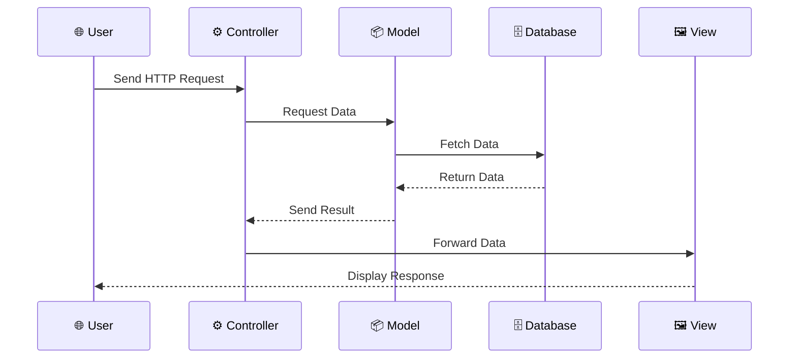

### 🔍 Sequence Diagram Deep Explanation

Sequence Diagram time-based order દર્શાવે છે:

**1. User → Controller:**
- User browser માં `http://localhost/student` type કરે છે.
- Browser HTTP GET Request server ને મોકલે છે.
- Request directly `StudentController.doGet()` method call કરે છે.

**2. Controller → Model:**
- Controller business logic perform કરવા `Student` class ને call કરે છે.
- Controller decide કરે છે **what data** fetch કરવી છે.

**3. Model → Database:**
- Model JDBC/Hibernate use કરીને SQL query execute કરે છે.
- Example: `SELECT * FROM student WHERE id = 101`

**4. Database → Model (Return):**
- Database query result (ResultSet) return કરે છે.
- Model data ને Java Object (Student) માં convert કરે છે.

**5. Model → Controller (Return):**
- Processed Java Object Controller ને return થાય છે.

**6. Controller → View:**
- Controller `request.setAttribute()` use કરી data store કરે છે.
- `RequestDispatcher.forward()` JSP ને request forward કરે છે.

**7. View → User:**
- JSP `request.getAttribute()` વડે data retrieve કરે છે.
- HTML generate કરીને browser ને response મોકલે છે.

> **Dashed arrows (-->>):** Response (return) flow show કરે છે.
> **Solid arrows (->>):** Request flow show કરે છે.

---

# Real-Life Example

Consider a **Student Management System**.

### Step 1 — User Request

```
Browser sends GET /student
```

### Step 2 — Controller

```
StudentController.doGet() is triggered
```

### Step 3 — Model Fetches Data

```
ID     = 101
Name   = Rohan
Course = BCA
```

### Step 4 — View Displays

```html
Student ID : 101 Student Name : Rohan Course : BCA
```

---

# Advantages of MVC

## 1. Separation of Concerns

```
Model      → Business Logic
View       → User Interface
Controller → Request Handling
```

## 2. Better Maintenance

Each component can be modified **independently** without affecting others.

## 3. Reusability

Same Model can be used with **multiple Views** (web, mobile, API).

## 4. Scalability

Large applications become easier to manage and extend over time.

## 5. Easier Testing

## Business logic in the Model can be **unit-tested** in complete isolation.

# Implementation of MVC Architecture

## MVC Project Structure

```
MVCProject/
│
├── model/
│   └── Student.java             ← Business Logic / Data
│
├── controller/
│   └── StudentController.java   ← Request Handler (Servlet)
│
├── view/
│   └── student.jsp              ← User Interface (JSP)
│
└── web.xml                      ← Servlet Configuration
```

---

# Step 1 : Create Model

## Model Class Diagram

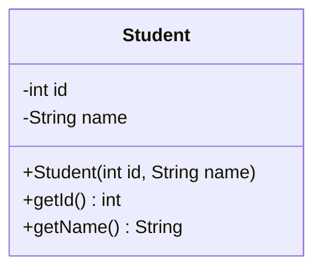

## Student.java

```java
package model;
public class Student
{
    private int    id;
    private String name;
    // Constructor
    public Student(int id, String name)
    {
        this.id   = id;
        this.name = name;
    }
    // Getter for ID
    public int getId()
    {
        return id;
    }
    // Getter for Name
    public String getName()
    {
        return name;
    }
}
```

---

# Step 2 : Create Controller

## Controller Working Diagram

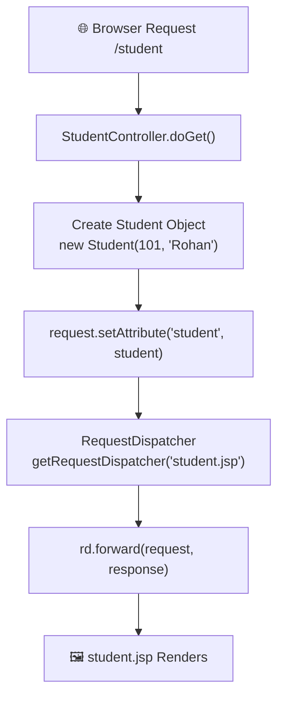

## StudentController.java

```java
package controller;
import model.Student;
import java.io.*;
import javax.servlet.*;
import javax.servlet.http.*;
public class StudentController
    extends HttpServlet
{
    protected void doGet(
        HttpServletRequest  request,
        HttpServletResponse response
    )
    throws ServletException, IOException
    {
        // Step 1: Create Model object
        Student student = new Student(101, "Rohan");
        // Step 2: Store in request scope
        request.setAttribute("student", student);
        // Step 3: Forward to View (JSP)
        RequestDispatcher rd =
            request.getRequestDispatcher("student.jsp");
        rd.forward(request, response);
    }
}
```

---

# Step 3 : Create View

## student.jsp

```jsp
<%@ page import="model.Student" %>
<%
    // Retrieve student object from request
    Student student =
        (Student) request.getAttribute("student");
%>
<h2>Student Details</h2>
ID   : <%= student.getId()   %> <br/>
Name : <%= student.getName() %>
```

---

# Output

```
Student Details
ID   : 101
Name : Rohan
```

---

# Complete MVC Flow

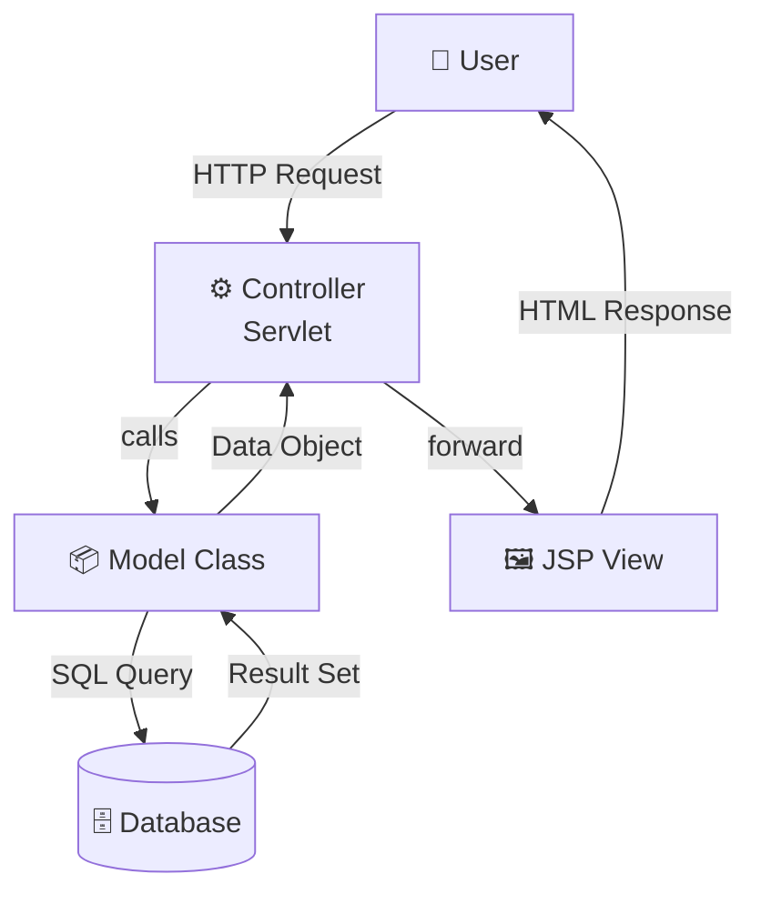

### 🔍 Complete MVC Flow Deep Explanation

Diagram ના arrows ઉપર labels છે — એ labels ખૂબ important છે:

| Arrow Label | અર્થ |
|-------------|------|
| **HTTP Request** | Browser server ને GET/POST request send કરે |
| **calls** | Controller Model class ના methods call કરે |
| **SQL Query** | Model database ઉપર SQL execute કરે |
| **Result Set** | Database rows/columns return કરે |
| **Data Object** | Model ડેટાને Java Object (Student, Employee...) માં wrap કરીને return કરે |
| **forward** | Controller JSP ને `RequestDispatcher.forward()` call કરે |
| **HTML Response** | JSP final HTML page generate કરે user ને |

**DAO (Data Access Object) Layer ક્યારે add કરાય?**
Medium-Large applications માં, Model ને directly database access ન કરાવતા, DAO layer વાપરે. DAO layer :
- SQL queries isolate (separate) કરે
- Testing easy બને
- Code reusability વધે

---

# MVC with DAO Layer

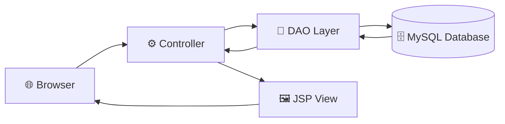

---

# Request Processing Lifecycle

|
Step
|
Who
|
Action
|
|

---

## |

## |

|
|
1
|
User
|
Sends request to
`/student`
|
|
2
|
Controller
|
`doGet()`
method is called
|
|
3
|
Controller
|
Calls Model to get data
|
|
4
|
Model
|
Fetches data from database
|
|
5
|
Controller
|
Sets data as request attribute
|
|
6
|
Controller
|
Forwards to JSP via RequestDispatcher
|
|
7
|
View (JSP)
|
Renders HTML and sends response to browser
|

---

# MVC vs Traditional Approach

|

#

|
Traditional
|
MVC
|
|

---

## |

## |

|
|
1
|
All code in one file
|
Separate layers
|
|
2
|
Difficult to maintain
|
Easy to maintain
|
|
3
|
Code not reusable
|
Highly reusable
|
|
4
|
Poor scalability
|
High scalability
|
|
5
|
Difficult to test
|
Easy to test
|
|
6
|
Tight coupling
|
Loose coupling
|

---

# Real World Applications Using MVC

|
Framework
|
Language
|
Type
|
|

---

## |

## |

|
|
Spring MVC
|
Java
|
Enterprise Web Framework
|
|
Struts
|
Java
|
MVC Framework
|
|
JSF
|
Java
|
Component-based MVC
|
|
ASP.NET MVC
|
C#
|
Microsoft Web Framework
|
|
Laravel
|
PHP
|
MVC Web Framework
|
|
Django
|
Python
|
MVT (similar to MVC)
|

---

# Interview Questions

## Q1. What does MVC stand for?

> **Answer:** Model – View – Controller

---

## Q2. Which component handles requests in MVC?

> **Answer:** The **Controller** (implemented as a Servlet in Java EE) handles all incoming HTTP requests.

---

## Q3. Which component interacts with the database?

> **Answer:** The **Model** is responsible for all data access, database queries, and business logic.

---

## Q4. Which component displays data to the user?

> **Answer:** The **View** (JSP, HTML) is responsible for rendering the user interface and displaying data.

---

## Q5. Why is MVC used?

> **Answer:** MVC separates business logic, user interface, and request handling into distinct layers. This improves **maintainability, testability, reusability, and scalability** of web applications.

---

## Q6. What is RequestDispatcher?

> **Answer:** `RequestDispatcher` is used in the Controller (Servlet) to **forward** the request and response to a JSP View after setting the required attributes on the request object.

---

# Introduction to EJB

## What is EJB?

EJB (Enterprise JavaBeans) is a server-side component architecture provided by Java for building large-scale, distributed, secure, and transactional enterprise applications.

EJB is a part of Jakarta EE (formerly Java EE) and runs inside an EJB Container provided by an Application Server such as:

- JBoss
- GlassFish
- WildFly
- WebLogic
- WebSphere

EJB simplifies enterprise application development by handling:

- Security
- Transactions
- Concurrency
- Object Lifecycle
- Remote Access
- Resource Management

Developers can focus on business logic while the EJB Container manages the technical infrastructure.

---

# Full Form of EJB

```text
EJB = Enterprise JavaBeans
```

---

# Why EJB Was Introduced?

Before EJB, developers had to manually manage:

```text
Database Transactions

Security

Thread Management

Object Creation

Resource Allocation

Remote Communication
```

This increased complexity and development time.

EJB was introduced to solve these problems automatically.

---

# Enterprise Application Without EJB

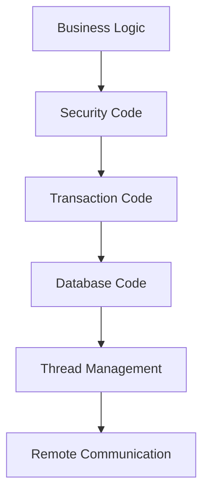

### 🔍 Without EJB — Deep Explanation

EJB **પહેલા**, developer ને **manually** બધી infrastructure manage કરવી પડતી:

| Component | Developer ને શું કરવું પડે? |
|-----------|-----------------------------|
| **Business Logic** | Application ની main logic code |
| **Security Code** | Login check, permission check manually |
| **Transaction Code** | Database commit/rollback manually handle |
| **Database Code** | JDBC connection, statement, resultset manually |
| **Thread Management** | Multiple users handle કરવા threads manually |
| **Remote Communication** | RMI/CORBA use કરી remote calls manually |

**Problem:** Codebase ખૂબ complex બની જાય. Bug prone. Developer ful focus business logic ઉપર ના કરી શકે.

**Developer = Business Logic Writer + System Admin + DBA + Security Expert**

---

# Enterprise Application With EJB

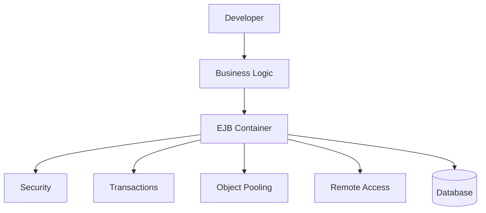

### 🔍 With EJB — Deep Explanation

EJB **સાથે**, developer ફક્ત **Business Logic** ઉપર ધ્યાન આપે:

| Service | EJB Container automatically manage કરે |
|---------|----------------------------------------|
| **Security** | @RolesAllowed annotation - Container check કરે user role |
| **Transactions** | @TransactionAttribute - Container auto commit/rollback |
| **Object Pooling** | Container bean objects pool maintain કરે (reuse) |
| **Remote Access** | Container JNDI/RMI handle કરે |
| **Database** | Container connection pool manage કરે |

**ફાયદો:** Developer ફક્ત:
```java
@Stateless
@TransactionAttribute(TransactionAttributeType.REQUIRED)
public class BankBean {
    public void transfer(int from, int to, double amount) {
        // ફક્ત business logic — transaction EJB handle કરે!
        debit(from, amount);
        credit(to, amount);
    }
}
```

---

# EJB Architecture

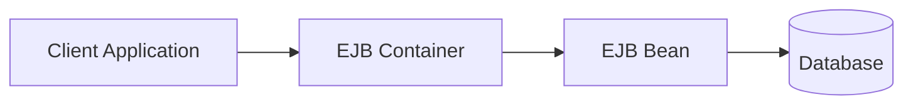

### 🔍 EJB Architecture Deep Explanation

EJB Architecture 4 main layers ધરાવે છે:

```
┌────────────────────────────────────────────────────────┐
│                   Application Server                   │
│  ┌──────────────┐    ┌───────────────────────────────┐ │
│  │    Client    │───▶│        EJB Container          │ │
│  │  (JSP/Web)   │    │  ┌───────────────────────┐   │ │
│  └──────────────┘    │  │      EJB Bean          │   │ │
│                       │  │  (Business Logic)      │   │ │
│                       │  └───────────────────────┘   │ │
│                       │  Security, TX, Pooling...     │ │
│                       └──────────────┬────────────────┘ │
└──────────────────────────────────────┼─────────────────┘
                                       ▼
                                ┌────────────┐
                                │  Database  │
                                └────────────┘
```

**Layers Detail:**
- **Client:** Web Browser, JSP, Servlet, Mobile App, Desktop App
- **EJB Container:** JBoss/GlassFish/WildFly application server. Container = supervisor of beans.
- **EJB Bean:** Actual business logic Java class (Session Bean / Entity Bean / MDB)
- **Database:** MySQL, Oracle, PostgreSQL - persistent data storage

---

# Components of EJB Architecture

## Client

The user or application requesting services.

Examples:

```text
JSP

Servlet

Desktop Application

Web Application

Mobile Application
```

---

## EJB Container

The most important component.

Responsibilities:

```text
Bean Management

Transactions

Security

Lifecycle Management

Resource Allocation

Concurrency
```

---

## Enterprise Bean

Contains business logic.

Examples:

```text
Banking Operations

Payment Processing

Order Management

Employee Management
```

---

## Database

Stores application data.

Examples:

```text
MySQL

Oracle

PostgreSQL

SQL Server
```

---

# Working of EJB

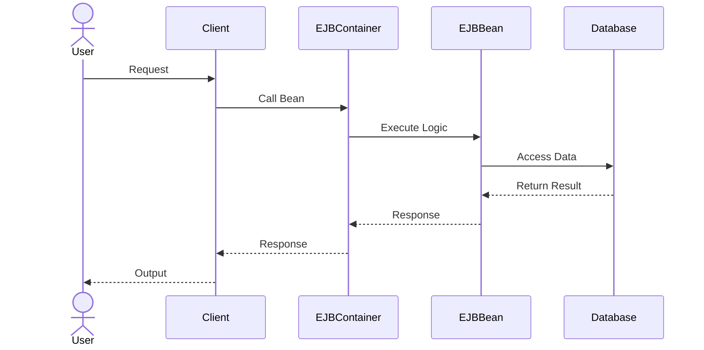

---

# Features of EJB

- Distributed Computing Support
- Transaction Management
- Security Management
- Object Pooling
- Lifecycle Management
- Scalability
- Remote Access
- High Performance
- Persistence Support

---

# Benefits of EJB

EJB provides many advantages for enterprise applications.

---

## 1. Simplified Development

Developers focus only on business logic.

Container handles:

```text
Transactions

Security

Threading

Lifecycle
```

---

## 2. Automatic Transaction Management

Transactions are managed automatically.

Example:

```text
Money Transfer

Debit Account A

Credit Account B

Commit Transaction
```

If an error occurs:

```text
Rollback Transaction
```

---

### Transaction Diagram

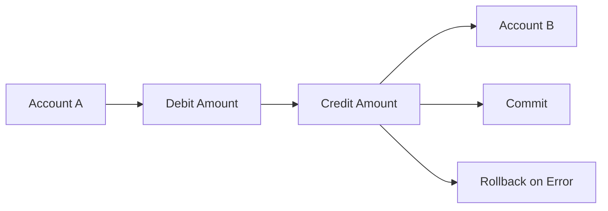

### 🔍 Transaction Deep Explanation

**Transaction = All or Nothing (ACID Properties)**

Bank Transfer Example — Rohan Account A (₹10,000) → Account B (₹10,000):

```
Step 1: Debit Account A  (A: 10,000 → 0)   ✅
Step 2: Credit Account B (B: 0 → 10,000)    ✅
Step 3: Commit Transaction                  ✅ Success!
```

**Error Scenario (Rollback):**
```
Step 1: Debit Account A  (A: 10,000 → 0)   ✅
Step 2: Credit Account B → ERROR occurs!    ❌
Step 3: ROLLBACK → A ફરી 10,000 થઈ જાય    ↩️ Restored!
```

**ACID Properties:**
| Property | Meaning |
|----------|--------|
| **A**tomicity | All operations succeed OR all fail together |
| **C**onsistency | Data always in valid state |
| **I**solation | Concurrent transactions interfere ન કરે |
| **D**urability | Committed data permanent રહે |

EJB Container આ automatically handle કરે — developer ને manually code ન લખવો!

---

## 3. Security Management

EJB supports:

```text
Authentication

Authorization

Role-Based Access
```

Example:

```text
Admin

Manager

Employee
```

Different users get different permissions.

---

## 4. Scalability

EJB applications can handle thousands of users simultaneously.

Example:

```text
Banking System

E-Commerce Website

ERP System
```

---

## 5. Reusability

Same EJB can be reused by multiple applications.

Example:

```text
Payment Bean

Used by:

Website

Mobile App

Desktop App
```

---

## 6. Remote Access

EJB can be called from remote machines.

```text
Client A

Client B

Client C

All use same Bean
```

---

## 7. Container Managed Services

Container automatically manages:

```text
Transactions

Security

Pooling

Lifecycle
```

---

## Benefits Diagram

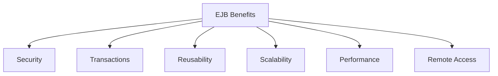

---

# Types of EJB

EJB is divided into three main types.

```text
1. Session Bean

2. Entity Bean

3. Message-Driven Bean
```

---

# EJB Classification

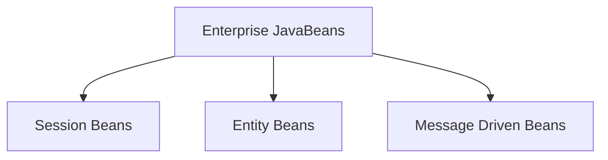

---

# 1. Session Beans

## Introduction

Session Beans perform business operations for clients.

Used when a client requests some service.

Examples:

```text
Login

Payment Processing

Order Placement

Calculation
```

---

## Characteristics

- Temporary
- Non-Persistent
- Client-Oriented
- Contains Business Logic

---

## Types of Session Beans

```text
Stateless Session Bean

Stateful Session Bean
```

---

# Stateless Session Bean

Does not maintain client state.

Each request is independent.

---

### Example

```text
Calculator Service

Addition

Subtraction

Multiplication
```

Every request is treated separately.

---

### Diagram

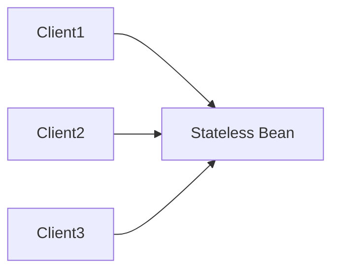

### 🔍 Stateless Bean Deep Explanation

**Stateless = State-less = No Memory of Previous Requests**

Ek best analogy: **Calculator** — calculator ne previous calculation yaad nathi rahetu.

```
Client1 → add(5, 3)    → Bean → returns 8   (No memory kept)
Client2 → add(10, 20)  → Bean → returns 30  (Fresh request)
Client1 → add(2, 2)    → Bean → returns 4   (Client1 ने याद नहीं कि previous 8 था)
```

**Same Bean instance multiple clients reuse:** Container bean pool maintain kare. Jyare koi client request kare, tyare ek available bean assign thay, request poori thay etle bean pool ma paachhu.

| Feature | Detail |
|---------|--------|
| **State** | No state maintained |
| **Memory** | Less memory - one bean = many clients |
| **Speed** | Fast - no session data to maintain |
| **Scalability** | High - pool of beans reused |
| **Example** | Calculator, Currency Converter, Weather API |

---

### Advantages

- Faster
- Less Memory Usage
- High Scalability

---

# Stateful Session Bean

Maintains client-specific state.

Remembers previous interactions.

---

### Example

```text
Shopping Cart

Add Product

Add Product

Checkout
```

Bean remembers cart items.

---

### Diagram

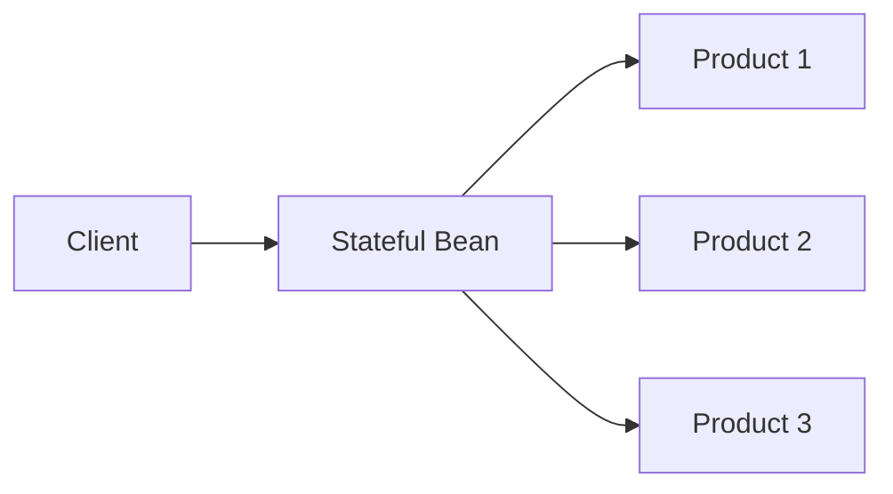

### 🔍 Stateful Bean Deep Explanation

**Stateful = State-full = Remembers Previous Interactions**

Ek best analogy: **Shopping Cart** — cart e yaad rakhe shu shu add karyu che.

```
Client → addToCart(Laptop)   → Cart: [Laptop]             ✅ Remembered
Client → addToCart(Mobile)   → Cart: [Laptop, Mobile]     ✅ Remembered
Client → addToCart(Headphones) → Cart: [Laptop, Mobile, Headphones] ✅
Client → checkout()          → Total calculated           ✅
```

**State maintain kari ne rakhay che** — har ek client mate alag bean instance.

| Feature | Detail |
|---------|--------|
| **State** | Maintains client-specific data |
| **Memory** | More memory - one bean per client |
| **Lifecycle** | Bean jivay chhe client session joduyu |
| **Example** | Shopping Cart, Booking Wizard, Multi-step Form |

**Stateless vs Stateful Comparison:**

| Feature | Stateless | Stateful |
|---------|-----------|----------|
| Memory per User | Very Low | Higher |
| Scalability | Very High | Moderate |
| Use Case | Calculator, Login Check | Shopping Cart, Booking |
| Bean Reuse | Multiple users share | One bean per user |

---

### Advantages

- Maintains User Data
- Personalized Sessions

---

# Session Bean Example

```java
@Stateless

public class CalculatorBean
{
    public int add(int a, int b)
    {
        return a + b;
    }
}
```

---

# 2. Entity Beans

## Introduction

Entity Beans represent persistent data stored in databases.

They survive server shutdowns because data is stored permanently.

---

### Example

```text
Student

Employee

Product

Customer
```

---

### Diagram

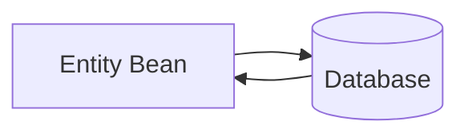

---

### Characteristics

```text
Persistent

Database Mapping

Reusable

Object-Oriented
```

---

### Example

```java
@Entity

public class Student
{
    private int id;

    private String name;
}
```

---

## Note

Modern applications usually use:

```text
JPA

Hibernate
```

instead of traditional Entity Beans.

---

# 3. Message-Driven Beans (MDB)

## Introduction

Message-Driven Beans process messages asynchronously.

They work with messaging systems.

---

### Example

```text
Email Notification

SMS Notification

Order Queue

Payment Queue
```

---

### Characteristics

```text
Asynchronous

No Direct Client Interaction

Event Driven

Queue Based
```

---

### MDB Architecture

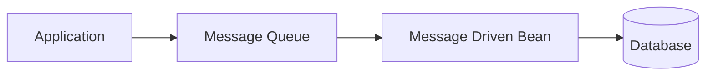

### 🔍 MDB Architecture Deep Explanation

**MDB = Asynchronous Message Consumer**

MDB ek special bean che je **message queue** माथी messages process kare che.

**Real Life Analogy:** Post Office!
- **Sender** = Koi person letter moklave (application message moklaye)
- **Message Queue** = Post Office box (message temporarily store thay)
- **MDB** = Postman (message deliver kare / process kare)
- **Database** = Final destination

**Synchronous vs Asynchronous:**

```
❌ Synchronous (Without MDB):
User places order → WAIT for email → WAIT for SMS → WAIT for DB → Response
(User 30 seconds wait kare!)

✅ Asynchronous (With MDB):
User places order → Response immediately!
         ↓ (background ma)
Message Queue → MDB → Email sent
                    → SMS sent
                    → Database updated
```

**JMS (Java Message Service):**
MDB works with JMS which provides:
- **Queue:** One sender, one receiver (Point-to-Point)
- **Topic:** One sender, many receivers (Publish-Subscribe)

| Feature | Detail |
|---------|--------|
| **Triggering** | Automatic jyare message Queue ma aave |
| **Client Interaction** | No direct interaction - async |
| **Performance** | Application slow nathi thato |
| **Example** | Email notifications, Order processing, Logging |

---

### Real Life Example

Online Shopping Website

```text
Customer Places Order

↓

Message Queue

↓

MDB Processes Order

↓

Email Sent

↓

Database Updated
```

---

### Example

```java
@MessageDriven

public class OrderMDB
{
    public void onMessage(Message msg)
    {
        System.out.println(
        "Order Received"
        );
    }
}
```

---

# Comparison of EJB Types

| Feature            | Session Bean   | Entity Bean     | Message Driven Bean |
| ------------------ | -------------- | --------------- | ------------------- |
| Purpose            | Business Logic | Persistent Data | Message Processing  |
| Database Storage   | No             | Yes             | Optional            |
| Client Interaction | Direct         | Direct          | Indirect            |
| State Management   | Possible       | Persistent      | No                  |
| Example            | Login          | Student Record  | Email Queue         |

---

# Real World Example

Online Shopping System

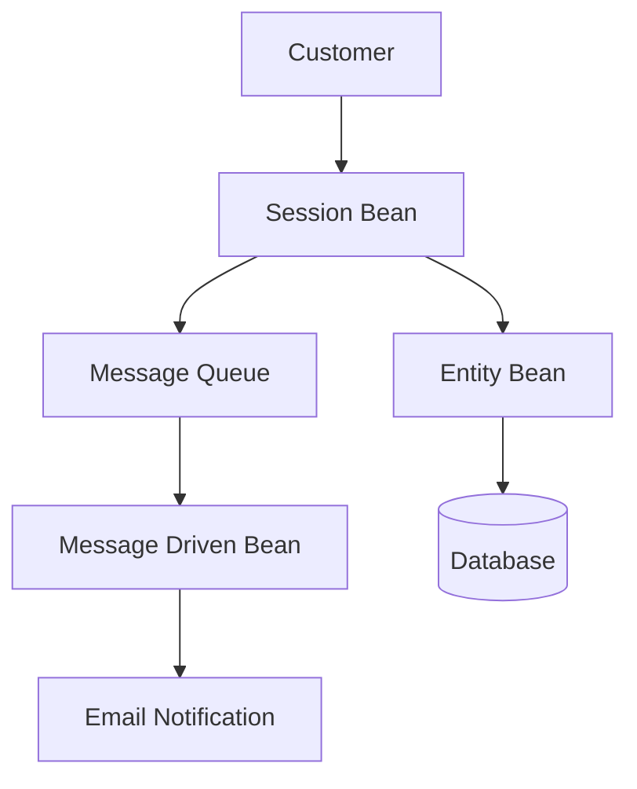

---

# Interview Questions

## Q1. What is EJB?

```text
Enterprise JavaBeans is a server-side component architecture used for building enterprise applications.
```

---

## Q2. What are the three types of EJB?

```text
Session Beans

Entity Beans

Message Driven Beans
```

---

## Q3. Which EJB stores persistent data?

```text
Entity Bean
```

---

## Q4. Which EJB processes messages asynchronously?

```text
Message Driven Bean
```

---

## Q5. Which Session Bean remembers client state?

```text
Stateful Session Bean
```

---

## Q6. Which Session Bean does not remember client state?

```text
Stateless Session Bean
```

---

# Introduction to Hibernate

## What is Hibernate?

Hibernate is an **Open Source Object Relational Mapping (ORM)** framework for Java.

It simplifies database operations by allowing developers to interact with databases using Java Objects instead of writing large amounts of SQL code.

Hibernate acts as a bridge between:

```text
Java Application

and

Relational Database
```

---

# Full Form of ORM

```text
ORM = Object Relational Mapping
```

---

# What is Object Relational Mapping?

ORM is a technique that maps Java classes to database tables.

Example:

### Java Class

```java
public class Student
{
    private int id;
    private String name;
}
```

### Database Table

```text
STUDENT
----------------
ID
NAME
```

Hibernate automatically maps:

```text
Student Class  <---->  STUDENT Table
```

---

# ORM Mapping Diagram

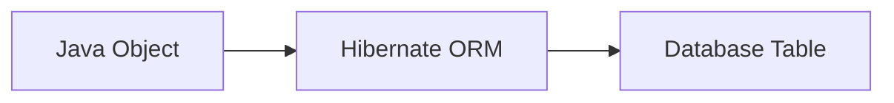

### 🔍 ORM (Object Relational Mapping) Deep Explanation

**ORM = Bridge between Java World and Database World**

Java Object-Oriented chhe, Database Relational chhe — banne alag worlds:

```
┌──────────────────┐          ┌──────────────────────┐
│  Java World      │          │  Database World        │
│  (OOP)           │          │  (Relational)          │
├──────────────────┤          ├──────────────────────┤
│  Class           │◀──ORM──▶│  Table                │
│  Object          │          │  Row                  │
│  Field/Attribute │          │  Column               │
│  Data Type (int) │          │  Data Type (INT)      │
│  Reference       │          │  Foreign Key          │
└──────────────────┘          └──────────────────────┘
```

**Without ORM (JDBC):**
```java
// 10+ lines just to save one object!
Connection con = DriverManager.getConnection(url, user, pass);
PreparedStatement ps = con.prepareStatement("INSERT INTO student VALUES(?,?)");
ps.setInt(1, student.getId());
ps.setString(2, student.getName());
ps.executeUpdate();
con.close();
```

**With ORM (Hibernate):**
```java
// 1 line to save same object!
session.save(student);
```

Hibernate internally generate kare chhe:
`INSERT INTO student (id, name) VALUES (101, 'Rohan')`

---

# Why Hibernate is Needed?

Before Hibernate, developers used JDBC.

Problems with JDBC:

```text
Large Amount of SQL Code

Manual Connection Management

Manual Result Processing

More Development Time

Poor Maintainability
```

Hibernate solves these problems.

---

# JDBC vs Hibernate

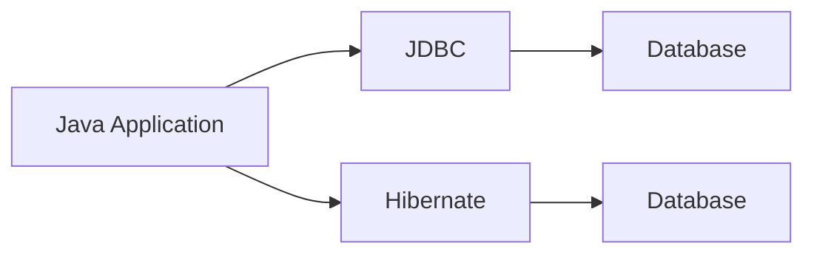

### 🔍 JDBC vs Hibernate Deep Explanation

**JDBC Flow:**
```
Java App → Write SQL manually → JDBC Driver → Database
(Developer SQL jaane joiye!)
```

**Hibernate Flow:**
```
Java App → Java methods call → Hibernate → Auto SQL → Database
(Developer SQL jaanva ni jaroor nathi!)
```

| Feature | JDBC | Hibernate |
|---------|------|-----------|
| SQL Writing | Developer manually | Hibernate automatically |
| Code Lines | 10-15 lines per operation | 1-2 lines |
| Database Change | Rewrite all SQL | Only config change |
| Learning Curve | Lower | Higher initially |
| Performance | Slightly faster (direct) | Optimized with cache |
| ORM Support | No | Yes |
| Caching | Manual | Built-in |

---

# Working of Hibernate

```mermaid
flowchart LR

JavaProgram["Java Program"]

--> Hibernate

--> SQL["Generated SQL"]

--> Database["Database"]
```

### 🔍 Hibernate Working Deep Explanation

Hibernate internally keva SQL generate kare chhe:

| Java Operation | Generated SQL |
|----------------|---------------|
| `session.save(student)` | `INSERT INTO student VALUES(...)` |
| `session.get(Student.class, 1)` | `SELECT * FROM student WHERE id=1` |
| `session.update(student)` | `UPDATE student SET ... WHERE id=...` |
| `session.delete(student)` | `DELETE FROM student WHERE id=...` |
| `from Student` (HQL) | `SELECT * FROM student` |

**Hibernate Internal Process:**
```
1. Java Code → session.save(student)
2. Hibernate checks mapping (hbm.xml / annotations)
3. Hibernate generates SQL: INSERT INTO student (name, course) VALUES ('Rohan', 'BCA')
4. Hibernate sends SQL to JDBC
5. JDBC sends to Database
6. Database confirms → Hibernate returns success
```

---

# Example Without Hibernate

```java
Connection con =
DriverManager.getConnection(...);

Statement stmt =
con.createStatement();

ResultSet rs =
stmt.executeQuery(
"SELECT * FROM student"
);
```

---

# Example With Hibernate

```java
Student student =
session.get(
Student.class,
1
);
```

Hibernate internally generates SQL.

---

# Advantages of Hibernate

- Reduces SQL Coding
- Faster Development
- Database Independent
- Better Performance
- Automatic Table Mapping
- Easy Maintenance
- Supports Transactions
- Supports Caching

---

# Hibernate Architecture Overview

```mermaid
flowchart TD

Application["Java Application"]

--> Hibernate["Hibernate Framework"]

--> Database["Database"]
```

---

# Features of Hibernate

Hibernate provides many advanced features that make enterprise application development easier.

---

# 1. Object Relational Mapping (ORM)

Maps Java Objects with Database Tables.

Example:

```text
Student Object

↓

Student Table
```

---

# ORM Feature Diagram

```mermaid
flowchart LR

Object["Java Object"]

--> ORM["ORM Mapping"]

--> Table["Database Table"]
```

---

# 2. Database Independence

Hibernate works with multiple databases.

Examples:

```text
MySQL

Oracle

PostgreSQL

SQL Server

MariaDB
```

Changing the database usually requires only configuration changes.

---

# 3. Automatic SQL Generation

Hibernate automatically creates:

```text
SELECT

INSERT

UPDATE

DELETE
```

queries.

Developer writes Java code instead of SQL.

---

# SQL Generation Flow

```mermaid
flowchart LR

JavaCode["Java Code"]

--> Hibernate

--> SQLQuery["Generated SQL"]

--> Database
```

---

# 4. Caching Support

Hibernate stores frequently used data in cache.

Benefits:

```text
Fewer Database Calls

Faster Performance

Reduced Load
```

---

# Cache Architecture

```mermaid
flowchart LR

Application

--> Cache

--> Database

Cache --> Application
```

### 🔍 Hibernate Cache Deep Explanation

**Cache = Fast Memory Storage (RAM-based)**

Database calls expensive che (time + resources). Cache frequently used data RAM ma rakhay:

```
1st Request:  App → Cache (miss) → Database → data → Cache ma store → App
2nd Request:  App → Cache (HIT!) → data directly return (No DB call!) ⚡
```

**Hibernate has 2 levels of cache:**

| Cache Level | Scope | Duration | Default |
|-------------|-------|----------|----------|
| **1st Level Cache** | Per Session | Session close thay tyar sudhi | Always ON |
| **2nd Level Cache** | Per SessionFactory | Application chalti hoy tyar sudhi | Optional (EHCache, Redis) |

**1st Level Cache Example:**
```java
Session session = factory.openSession();
Student s1 = session.get(Student.class, 1); // DB hit!
Student s2 = session.get(Student.class, 1); // Cache hit! No DB call
// s1 == s2 (same object)
```

**2nd Level Cache:** EHCache, Infinispan, Redis use thay chhe — multiple sessions ane servers vahche share thay.

---

# 5. Transaction Management

Hibernate supports transactions.

Example:

```text
Bank Transfer

Debit Account

Credit Account

Commit Transaction
```

If an error occurs:

```text
Rollback Transaction
```

---

# Transaction Flow

```mermaid
flowchart TD

Start

--> Transaction

--> Commit

Transaction --> Rollback
```

---

# 6. Lazy Loading

Data is loaded only when required.

Example:

```text
Student Data Loaded

Address Data Loaded Only When Accessed
```

This improves performance.

### 🔍 Lazy Loading Deep Explanation

**Lazy Loading = Load data only when you actually need it**

**Real Life Analogy:** Book library — tame saara books ghare nathi lavata, fakat je joie te laavo cho.

```java
// Without Lazy Loading (EAGER):
Student student = session.get(Student.class, 1);
// Immediately loads: student data + ALL addresses + ALL courses + ALL marks...
// = Very slow! Even if you only need student name.

// With Lazy Loading:
Student student = session.get(Student.class, 1);
// Loads only: student data  ← Fast!

List<Address> addresses = student.getAddresses();
// Only NOW database query for addresses → On demand!
```

**Lazy vs Eager Loading:**

| Type | Loads When | Performance | Use Case |
|------|-----------|-------------|----------|
| **Lazy** (default) | Actually accessed | Better | Large related data |
| **Eager** | Parent loaded | Slower | Always needed data |

```java
// Lazy Loading annotation:
@OneToMany(fetch = FetchType.LAZY)  // default
private List<Address> addresses;

// Eager Loading annotation:
@OneToMany(fetch = FetchType.EAGER)
private List<Address> addresses;
```

---

# 7. HQL (Hibernate Query Language)

Hibernate provides its own query language.

Example:

```java
from Student
```

instead of:

```sql
SELECT * FROM student
```

---

# 8. Annotation Support

Hibernate supports annotations.

Example:

```java
@Entity

@Table(name="student")
```

No XML mapping required.

---

# 9. Association Mapping

Supports relationships.

Examples:

```text
One To One

One To Many

Many To One

Many To Many
```

---

# Hibernate Features Diagram

```mermaid
flowchart TD

Hibernate

--> ORM

--> Caching

--> HQL

--> Transactions

--> LazyLoading

--> Annotations

--> DatabaseIndependence
```

---

# Exploring Hibernate Architecture

## Introduction

Hibernate Architecture defines how different components interact to perform database operations.

The architecture consists of several important components.

---

# Hibernate Architecture Diagram

```mermaid
flowchart LR

Application["Java Application"]

--> Configuration["Configuration"]

--> SessionFactory["SessionFactory"]

--> Session["Session"]

--> Transaction["Transaction"]

--> Database["Database"]
```

### 🔍 Hibernate Architecture Deep Explanation (Overview)

**Hierarchy (top to bottom):**

```
Java Application
     ↓
Configuration Object   ← hibernate.cfg.xml vaanchhe
     ↓
SessionFactory         ← One per app (Heavy, Thread-safe)
     ↓
Session                ← One per request (Lightweight)
     ↓
Transaction            ← One per operation
     ↓
Generated SQL
     ↓
Database
```

**Memory Model:**
- **Configuration:** Application start thay tyare ek vaar create thay
- **SessionFactory:** Application memory ma rehay (Singleton pattern)
- **Session:** Request aave tyare create, khatam thay tyare close
- **Transaction:** Session ma open, commit/rollback thay tyare close

---

# Detailed Hibernate Architecture

```mermaid
flowchart TD

Application["Java Application"]

--> Config["hibernate.cfg.xml"]

--> SessionFactory["SessionFactory"]

--> Session["Session"]

--> Transaction["Transaction"]

--> SQL["Generated SQL"]

--> Database["Database"]
```

### 🔍 Detailed Architecture Step-by-Step

| Step | Component | Kaam |
|------|-----------|------|
| 1 | `hibernate.cfg.xml` | DB URL, username, password, dialect specify kare |
| 2 | `Configuration` | Config file vaanche, settings load kare |
| 3 | `SessionFactory` | `buildSessionFactory()` — heavy object, once created |
| 4 | `Session` | `openSession()` — DB connection mile |
| 5 | `Transaction` | `beginTransaction()` — DB operations start |
| 6 | SQL | Hibernate auto generate kare |
| 7 | Database | Actual data save/fetch |
| 8 | Commit/Rollback | Transaction end |
| 9 | Close | `session.close()`, `factory.close()` |

---

# Components of Hibernate Architecture

## 1. Configuration Object

Loads Hibernate configuration file.

File:

```text
hibernate.cfg.xml
```

Responsibilities:

```text
Database URL

Username

Password

Dialect

Driver Class
```

---

# Configuration Flow

```mermaid
flowchart LR

ConfigFile["hibernate.cfg.xml"]

--> ConfigurationObject["Configuration Object"]

--> SessionFactory
```

---

## 2. SessionFactory

Creates Session objects.

Characteristics:

```text
Heavy Object

Created Once

Thread Safe
```

Usually one SessionFactory per application.

---

# SessionFactory Diagram

```mermaid
flowchart TD

SessionFactory

--> Session1

--> Session2

--> Session3
```

---

## 3. Session

Most important Hibernate object.

Represents a connection between:

```text
Application

and

Database
```

Responsibilities:

```text
Save Data

Update Data

Delete Data

Retrieve Data
```

---

### Example

```java
Session session =
factory.openSession();
```

---

# Session Working

```mermaid
flowchart LR

Application

--> Session

--> Database
```

---

## 4. Transaction

Ensures data consistency.

Example:

```java
Transaction tx =
session.beginTransaction();

tx.commit();
```

---

# Transaction Flow

```mermaid
flowchart TD

BeginTransaction

--> DatabaseOperation

--> Commit

DatabaseOperation --> Rollback
```

---

## 5. Query Object

Used for data retrieval.

Example:

```java
Query q =
session.createQuery(
"from Student"
);
```

---

## 6. Persistent Objects

Objects that are mapped to database tables.

Example:

```java
Student student =
new Student();
```

Mapped to:

```text
STUDENT TABLE
```

---

# Hibernate Data Flow

```mermaid
flowchart LR

JavaObject["Student Object"]

--> Session

--> Hibernate

--> SQL

--> Database
```

---

# Complete Hibernate Architecture Flow

```mermaid
flowchart TD

Application

--> Configuration

--> SessionFactory

--> Session

--> Transaction

--> Hibernate

--> Database

Database --> Hibernate

Hibernate --> Application
```

---

# Real Life Example

Consider a Student Management System.

### Step 1

Create Student Object

```java
Student s =
new Student();
```

---

### Step 2

Open Session

```java
Session session =
factory.openSession();
```

---

### Step 3

Begin Transaction

```java
Transaction tx =
session.beginTransaction();
```

---

### Step 4

Save Object

```java
session.save(s);
```

---

### Step 5

Commit Transaction

```java
tx.commit();
```

---

### Step 6

Data Stored in Database

```text
STUDENT TABLE
```

---

# Architecture Summary Diagram

```mermaid
flowchart LR

StudentObject["Student Object"]

--> Session

--> Transaction

--> Hibernate

--> Database
```

---

# Hibernate vs JDBC

| Feature               | JDBC      | Hibernate |
| --------------------- | --------- | --------- |
| SQL Writing           | Manual    | Automatic |
| ORM Support           | No        | Yes       |
| Caching               | No        | Yes       |
| Database Independence | Limited   | High      |
| Development Speed     | Slower    | Faster    |
| Maintenance           | Difficult | Easier    |

---

# Interview Questions

## Q1. What is Hibernate?

```text
Hibernate is an ORM framework used to simplify database operations in Java applications.
```

---

## Q2. What does ORM stand for?

```text
Object Relational Mapping
```

---

## Q3. Which file contains Hibernate configuration?

```text
hibernate.cfg.xml
```

---

## Q4. Which object creates Session objects?

```text
SessionFactory
```

---

## Q5. Which Hibernate object interacts directly with the database?

```text
Session
```

---

## Q6. What is HQL?

```text
Hibernate Query Language
```

---

# Hibernate Configuration File

## Introduction

The Hibernate Configuration File is the main configuration file used by Hibernate to establish a connection with the database and define Hibernate settings.

The configuration file is usually named:

```text
hibernate.cfg.xml
```

It contains:

- Database Connection Information
- JDBC Driver Details
- Database URL
- Username and Password
- SQL Dialect
- Mapping File Information
- Hibernate Properties

---

# Why Configuration File is Needed?

Without configuration, Hibernate does not know:

```text
Which Database to Connect

Which Driver to Use

Which Tables are Mapped

Which Dialect to Use
```

The configuration file provides all these details.

---

# Configuration File Architecture

```mermaid
flowchart LR

Application

--> Hibernate

--> ConfigurationFile["hibernate.cfg.xml"]

--> Database
```

### 🔍 Configuration File Role Deep Explanation

`hibernate.cfg.xml` = Hibernate no **passport + address book**

Jevu driver ने car chalava petrol joie, Hibernate ne DB connect karva configuration joie.

**File without it? Error occurs:**
```
org.hibernate.HibernateException: /hibernate.cfg.xml not found
```

**Configuration file 3 main sections have:**

```xml
<hibernate-configuration>
  <session-factory>

    <!-- 1. DATABASE CONNECTION -->
    <property name="connection.driver_class">com.mysql.jdbc.Driver</property>
    <property name="connection.url">jdbc:mysql://localhost:3306/mydb</property>
    <property name="connection.username">root</property>
    <property name="connection.password">root</property>

    <!-- 2. HIBERNATE PROPERTIES -->
    <property name="dialect">org.hibernate.dialect.MySQL8Dialect</property>
    <property name="show_sql">true</property>
    <property name="hbm2ddl.auto">update</property>

    <!-- 3. MAPPING INFORMATION -->
    <mapping resource="student.hbm.xml"/>

  </session-factory>
</hibernate-configuration>
```

---

# Structure of Configuration File

```mermaid
flowchart TD

Configuration["hibernate.cfg.xml"]

--> DatabaseSettings

--> HibernateProperties

--> MappingInformation
```

### 🔍 Configuration File Structure Explained

**Section 1: Database Settings**
| Property | Example Value | Purpose |
|----------|---------------|--------|
| `driver_class` | `com.mysql.cj.jdbc.Driver` | JDBC driver class |
| `connection.url` | `jdbc:mysql://localhost:3306/db` | Database URL |
| `connection.username` | `root` | DB username |
| `connection.password` | `root` | DB password |

**Section 2: Hibernate Properties**
| Property | Values | Purpose |
|----------|--------|--------|
| `dialect` | `MySQL8Dialect`, `OracleDialect` | DB-specific SQL generate |
| `show_sql` | `true`/`false` | Console ma SQL print kare |
| `hbm2ddl.auto` | `create`, `update`, `validate` | Table create/update automatically |

**Section 3: Mapping**
```xml
<mapping resource="Student.hbm.xml"/>   <!-- XML mapping -->
<!-- OR annotation use karo to mapping aap-maele thay -->
```

---

# Basic Hibernate Configuration File

## hibernate.cfg.xml

```xml
<?xml version="1.0" encoding="UTF-8"?>

<!DOCTYPE hibernate-configuration PUBLIC
"-//Hibernate/Hibernate Configuration DTD 3.0//EN"
"http://hibernate.sourceforge.net/hibernate-configuration-3.0.dtd">

<hibernate-configuration>

    <session-factory>

        <property name="hibernate.connection.driver_class">
            com.mysql.cj.jdbc.Driver
        </property>

        <property name="hibernate.connection.url">
            jdbc:mysql://localhost:3306/studentdb
        </property>

        <property name="hibernate.connection.username">
            root
        </property>

        <property name="hibernate.connection.password">
            root
        </property>

        <property name="hibernate.dialect">
            org.hibernate.dialect.MySQL8Dialect
        </property>

        <property name="show_sql">
            true
        </property>

        <mapping resource="student.hbm.xml"/>

    </session-factory>

</hibernate-configuration>
```

---

# Important Properties

| Property            | Purpose             |
| ------------------- | ------------------- |
| driver_class        | JDBC Driver         |
| connection.url      | Database URL        |
| connection.username | Database Username   |
| connection.password | Database Password   |
| dialect             | Database Dialect    |
| show_sql            | Display SQL Queries |
| mapping             | Mapping File        |

---

# Configuration File Working

```mermaid
flowchart TD

Config["hibernate.cfg.xml"]

--> SessionFactory

--> Session

--> Database
```

---

# Hibernate Mapping File

## Introduction

The Mapping File defines the relationship between:

```text
Java Class

and

Database Table
```

Hibernate uses mapping files to understand:

```text
Which Class

is mapped to

Which Table
```

---

# Mapping Architecture

```mermaid
flowchart LR

JavaClass["Student.java"]

--> MappingFile["student.hbm.xml"]

--> DatabaseTable["STUDENT Table"]
```

---

# Why Mapping File is Needed?

Hibernate must know:

```text
Class Name

Table Name

Primary Key

Column Names

Data Types
```

The mapping file provides this information.

---

# Basic Mapping File

## student.hbm.xml

```xml
<?xml version="1.0"?>

<!DOCTYPE hibernate-mapping PUBLIC
"-//Hibernate/Hibernate Mapping DTD 3.0//EN"
"http://hibernate.sourceforge.net/hibernate-mapping-3.0.dtd">

<hibernate-mapping>

    <class
        name="com.model.Student"
        table="student">

        <id
            name="id"
            column="id">

            <generator class="native"/>

        </id>

        <property
            name="name"
            column="name"/>

        <property
            name="course"
            column="course"/>

    </class>

</hibernate-mapping>
```

---

# Mapping File Structure

```mermaid
flowchart TD

Mapping["student.hbm.xml"]

--> Class["Class Mapping"]

--> Id["Primary Key Mapping"]

--> Property["Column Mapping"]
```

---

# Mapping Elements

## Class Element

Maps Java Class to Table.

```xml
<class
name="com.model.Student"
table="student">
```

---

## ID Element

Defines Primary Key.

```xml
<id
name="id"
column="id">
```

---

## Generator Element

Generates ID values.

```xml
<generator class="native"/>
```

---

## Property Element

Maps Class Properties to Columns.

```xml
<property
name="name"
column="name"/>
```

---

# Java Class Used in Mapping

## Student.java

```java
package com.model;

public class Student
{
    private int id;

    private String name;

    private String course;

    public Student()
    {

    }

    public int getId()
    {
        return id;
    }

    public void setId(int id)
    {
        this.id = id;
    }

    public String getName()
    {
        return name;
    }

    public void setName(String name)
    {
        this.name = name;
    }

    public String getCourse()
    {
        return course;
    }

    public void setCourse(String course)
    {
        this.course = course;
    }
}
```

---

# Mapping Flow

```mermaid
flowchart LR

StudentClass["Student Class"]

--> Mapping["student.hbm.xml"]

--> StudentTable["student Table"]
```

---

# Basic Example of Hibernate

## Objective

Insert a Student Record into MySQL Database using Hibernate.

---

# Project Structure

```text
HibernateProject

│
├── src
│   ├── Student.java
│   ├── Main.java
│
├── hibernate.cfg.xml
│
└── student.hbm.xml
```

---

# Database Table

```sql
CREATE TABLE student
(
    id INT PRIMARY KEY AUTO_INCREMENT,
    name VARCHAR(50),
    course VARCHAR(50)
);
```

---

# Step 1: Create Student Class

## Student.java

```java
package com.model;

public class Student
{
    private int id;

    private String name;

    private String course;

    public Student()
    {

    }

    public int getId()
    {
        return id;
    }

    public void setId(int id)
    {
        this.id = id;
    }

    public String getName()
    {
        return name;
    }

    public void setName(String name)
    {
        this.name = name;
    }

    public String getCourse()
    {
        return course;
    }

    public void setCourse(String course)
    {
        this.course = course;
    }
}
```

---

# Step 2: Create Mapping File

## student.hbm.xml

```xml
<hibernate-mapping>

    <class
        name="com.model.Student"
        table="student">

        <id
            name="id"
            column="id">

            <generator class="native"/>

        </id>

        <property
            name="name"
            column="name"/>

        <property
            name="course"
            column="course"/>

    </class>

</hibernate-mapping>
```

---

# Step 3: Create Configuration File

## hibernate.cfg.xml

```xml
<hibernate-configuration>

    <session-factory>

        <property name="hibernate.connection.driver_class">
            com.mysql.cj.jdbc.Driver
        </property>

        <property name="hibernate.connection.url">
            jdbc:mysql://localhost:3306/studentdb
        </property>

        <property name="hibernate.connection.username">
            root
        </property>

        <property name="hibernate.connection.password">
            root
        </property>

        <mapping resource="student.hbm.xml"/>

    </session-factory>

</hibernate-configuration>
```

---

# Step 4: Create Main Program

## Main.java

```java
package com.main;

import org.hibernate.Session;
import org.hibernate.SessionFactory;
import org.hibernate.Transaction;
import org.hibernate.cfg.Configuration;

import com.model.Student;

public class Main
{
    public static void main(String[] args)
    {

        Configuration cfg =
        new Configuration();

        cfg.configure(
        "hibernate.cfg.xml"
        );

        SessionFactory factory =
        cfg.buildSessionFactory();

        Session session =
        factory.openSession();

        Transaction tx =
        session.beginTransaction();

        Student s =
        new Student();

        s.setName("Rohan");

        s.setCourse("BCA");

        session.save(s);

        tx.commit();

        session.close();

        factory.close();

        System.out.println(
        "Record Inserted Successfully"
        );
    }
}
```

---

# Execution Flow

```mermaid
flowchart TD

Start

--> LoadConfig["Load hibernate.cfg.xml"]

--> SessionFactory["Create SessionFactory"]

--> Session["Open Session"]

--> Transaction["Begin Transaction"]

--> CreateObject["Create Student Object"]

--> Save["session.save()"]

--> Commit["Commit Transaction"]

--> Database["Insert Into Database"]

--> End
```

---

# Hibernate Insert Operation Flow

```mermaid
flowchart LR

StudentObject["Student Object"]

--> Session

--> Hibernate

--> SQL["INSERT Query"]

--> Database
```

---

# Output

```text
Record Inserted Successfully
```

---

# Database Result

| id  | name  | course |
| --- | ----- | ------ |
| 1   | Rohan | BCA    |

---

# Advantages of Using Hibernate

- Less SQL Coding
- Faster Development
- Automatic Table Mapping
- Better Maintainability
- Database Independence
- Transaction Support
- Caching Support

---

# Configuration File vs Mapping File

| Feature   | Configuration File  | Mapping File               |
| --------- | ------------------- | -------------------------- |
| File Name | hibernate.cfg.xml   | student.hbm.xml            |
| Purpose   | Configure Hibernate | Map Class to Table         |
| Contains  | DB Settings         | Class Mapping              |
| Required  | Yes                 | Yes (XML Mapping Approach) |
| Used For  | Connection Setup    | ORM Mapping                |

---

# Interview Questions

## Q1. What is the name of Hibernate Configuration File?

```text
hibernate.cfg.xml
```

---

## Q2. What is the purpose of Mapping File?

```text
To map Java Classes with Database Tables.
```

---

## Q3. Which object creates Sessions?

```java
SessionFactory
```

---

## Q4. Which method saves data in Hibernate?

```java
session.save()
```

---

## Q5. Which file contains database connection information?

```text
hibernate.cfg.xml
```

---

# Annotation in Hibernate

## Introduction

Annotations are special metadata used in Java code to provide information to Hibernate.

Before annotations, Hibernate used XML Mapping Files (`.hbm.xml`) for mapping classes with database tables.

With annotations, mapping information is written directly inside Java classes.

This makes the application:

- Simpler
- More Readable
- Easier to Maintain
- Less Dependent on XML Files

---

# What is an Annotation?

An annotation is a special marker beginning with `@`.

Example:

```java
@Entity
```

```java
@Table(name="student")
```

Annotations tell Hibernate how a Java class should be mapped to a database.

---

# Annotation Architecture

```mermaid
flowchart LR

JavaClass["Java Class"]

--> Annotation["Hibernate Annotations"]

--> DatabaseTable["Database Table"]
```

### 🔍 Annotations vs XML Mapping Deep Explanation

**Old Way (XML Mapping):**
```
Student.java  +  student.hbm.xml  →  Database
(Two files manage karva padta)
```

**New Way (Annotations):**
```
Student.java (with @Entity, @Table...)  →  Database
(Ek j file!)
```

**Annotation keva ritu kaam kare chhe:**

```java
@Entity          // → Hibernate: "aa class ne table sathe map karo"
@Table(name="student")  // → "student naam ni table use karo"
public class Student {

    @Id                    // → "aa field primary key chhe"
    @GeneratedValue        // → "auto-increment use karo"
    private int id;        // → maps to 'id' column

    @Column(name="sname")  // → "Java field 'name' = DB column 'sname'"
    private String name;
}
```

**Hibernate annotation scan kare che ne:**
1. Class `@Entity` chhe? → Table create/use karo
2. `@Table` name? → Table naam
3. `@Id` field? → Primary key
4. `@Column` → Column naam mapping
5. SQL ready!

---

# Why Use Annotations?

Without annotations:

```text
Student.java

+

student.hbm.xml
```

With annotations:

```text
Student.java Only
```

Mapping information remains inside the class itself.

---

# Common Hibernate Annotations

| Annotation      | Purpose                      |
| --------------- | ---------------------------- |
| @Entity         | Marks a class as Entity      |
| @Table          | Maps class to table          |
| @Id             | Defines Primary Key          |
| @Column         | Maps field to column         |
| @GeneratedValue | Generates ID Automatically   |
| @Transient      | Field not stored in DB       |
| @Inheritance    | Defines inheritance strategy |

---

# @Entity Annotation

Marks a Java class as a Hibernate Entity.

### Example

```java
@Entity

public class Student
{

}
```

Hibernate treats the class as a database entity.

---

# @Table Annotation

Maps a class to a database table.

### Example

```java
@Entity

@Table(name="student")
public class Student
{

}
```

---

# @Id Annotation

Defines the primary key.

### Example

```java
@Id

private int id;
```

---

# @GeneratedValue Annotation

Generates IDs automatically.

### Example

```java
@Id

@GeneratedValue

private int id;
```

---

# @Column Annotation

Maps a field to a table column.

### Example

```java
@Column(name="student_name")

private String name;
```

---

# Complete Annotation Example

```java
import jakarta.persistence.*;

@Entity

@Table(name="student")

public class Student
{
    @Id

    @GeneratedValue

    private int id;

    @Column(name="student_name")

    private String name;

    @Column(name="course")

    private String course;

    public Student()
    {

    }

    public int getId()
    {
        return id;
    }

    public void setId(int id)
    {
        this.id = id;
    }

    public String getName()
    {
        return name;
    }

    public void setName(String name)
    {
        this.name = name;
    }

    public String getCourse()
    {
        return course;
    }

    public void setCourse(String course)
    {
        this.course = course;
    }
}
```

---

# Annotation Mapping Flow

```mermaid
flowchart TD

StudentClass["Student Class"]

--> Entity["@Entity"]

--> Table["@Table"]

--> Id["@Id"]

--> Column["@Column"]

--> Database["Database Table"]
```

---

# Benefits of Annotations

- Less XML Configuration
- Better Readability
- Easy Maintenance
- Faster Development
- Object-Oriented Design

---

# Hibernate Inheritance

## Introduction

Inheritance is an Object-Oriented Programming concept where one class acquires properties and methods of another class.

Hibernate supports inheritance mapping between:

```text
Java Classes

and

Database Tables
```

---

# Real-Life Example

Consider:

```text
Employee
      |
-------------------
|                 |
Manager        Developer
```

Both Manager and Developer inherit Employee properties.

---

# Inheritance Diagram

```mermaid
flowchart TD

Employee

--> Manager

--> Developer
```

---

# Why Hibernate Inheritance?

Without inheritance:

```text
Manager Table

Developer Table

Duplicate Columns
```

With inheritance:

```text
Common Data Stored Once
```

This reduces redundancy.

---

# Example Class Structure

```java
public class Employee
{
    private int id;

    private String name;
}
```

---

```java
public class Manager
extends Employee
{
    private String department;
}
```

---

```java
public class Developer
extends Employee
{
    private String technology;
}
```

---

# Hibernate Inheritance Strategies

Hibernate supports three inheritance strategies.

```text
1. Single Table Strategy

2. Joined Table Strategy

3. Table Per Class Strategy
```

---

# Inheritance Strategies Diagram

```mermaid
flowchart TD

Inheritance

--> SingleTable["Single Table"]

--> JoinedTable["Joined Table"]

--> TablePerClass["Table Per Class"]
```

---

# 1. Single Table Strategy

## Introduction

All classes are stored in a single database table.

---

### Class Structure

```text
Employee

Manager

Developer
```

---

### Database Table

```text
EMPLOYEE

------------------------------------------
ID | NAME | DEPARTMENT | TECHNOLOGY | TYPE
------------------------------------------
1  | Amit | HR         | NULL       | M
2  | Raj  | NULL       | Java       | D
```

---

# Single Table Diagram

```mermaid
flowchart TD

Employee

--> EmployeeTable["Single EMPLOYEE Table"]
```

---

# Advantages

- Fast Queries
- Simple Structure

---

# Disadvantages

- Many NULL Values
- Large Table Size

---

# 2. Joined Table Strategy

## Introduction

Each class gets a separate table.

Parent table stores common fields.

Child tables store specific fields.

---

### Tables

```text
EMPLOYEE

ID
NAME
```

---

```text
MANAGER

ID
DEPARTMENT
```

---

```text
DEVELOPER

ID
TECHNOLOGY
```

---

# Joined Strategy Diagram

```mermaid
flowchart TD

Employee

--> EmployeeTable["EMPLOYEE"]

Manager

--> ManagerTable["MANAGER"]

Developer

--> DeveloperTable["DEVELOPER"]
```

---

# Advantages

- No Redundant Data
- Normalized Structure

---

# Disadvantages

- More JOIN Operations

---

# 3. Table Per Class Strategy

## Introduction

Each class gets its own table.

---

### Tables

```text
MANAGER

ID
NAME
DEPARTMENT
```

---

```text
DEVELOPER

ID
NAME
TECHNOLOGY
```

---

# Table Per Class Diagram

```mermaid
flowchart TD

Manager

--> ManagerTable["MANAGER"]

Developer

--> DeveloperTable["DEVELOPER"]
```

---

# Advantages

- Simple Tables
- Independent Storage

---

# Disadvantages

- Data Duplication
- Larger Database Size

---

# Inheritance Annotations

Hibernate uses annotations to define inheritance strategies.

---

# @Inheritance Annotation

Used to specify inheritance strategy.

### Syntax

```java
@Inheritance(
strategy =
InheritanceType.SINGLE_TABLE
)
```

---

# Inheritance Annotation Diagram

```mermaid
flowchart LR

InheritanceAnnotation["@Inheritance"]

--> SingleTable

--> Joined

--> TablePerClass
```

---

# 1. Single Table Annotation

```java
@Entity

@Inheritance(
strategy =
InheritanceType.SINGLE_TABLE
)

public class Employee
{

}
```

---

# 2. Joined Table Annotation

```java
@Entity

@Inheritance(
strategy =
InheritanceType.JOINED
)

public class Employee
{

}
```

---

# 3. Table Per Class Annotation

```java
@Entity

@Inheritance(
strategy =
InheritanceType.TABLE_PER_CLASS
)

public class Employee
{

}
```

---

# Example Using Annotations

## Parent Class

```java
import jakarta.persistence.*;

@Entity

@Inheritance(
strategy =
InheritanceType.JOINED
)

public class Employee
{
    @Id

    private int id;

    private String name;
}
```

---

## Child Class

```java
@Entity

public class Manager
extends Employee
{
    private String department;
}
```

---

# Working Flow

```mermaid
flowchart TD

EmployeeClass

--> InheritanceAnnotation

--> Hibernate

--> DatabaseTables
```

---

# Comparison of Inheritance Strategies

| Feature            | Single Table | Joined Table | Table Per Class |
| ------------------ | ------------ | ------------ | --------------- |
| Tables             | One          | Multiple     | Multiple        |
| Performance        | Fast         | Medium       | Medium          |
| Redundancy         | High         | Low          | High            |
| Normalization      | Low          | High         | Medium          |
| Storage Efficiency | Low          | High         | Medium          |

---

# Real-Life Example

Company Management System

```text
Employee

Manager

Developer

Tester
```

Common data:

```text
ID

Name

Salary
```

Specific data:

```text
Manager → Department

Developer → Technology

Tester → Testing Tool
```

Hibernate inheritance helps store this efficiently.

---

# Interview Questions

## Q1. What is Annotation in Hibernate?

```text
Metadata used to map Java classes with database tables.
```

---

## Q2. Which annotation marks an entity class?

```java
@Entity
```

---

## Q3. Which annotation defines a primary key?

```java
@Id
```

---

## Q4. Which annotation maps a class to a table?

```java
@Table
```

---

## Q5. How many inheritance strategies does Hibernate support?

```text
Three
```

- Single Table
- Joined Table
- Table Per Class

---

## Q6. Which annotation defines inheritance strategy?

```java
@Inheritance
```

---

# Introduction of Spring Framework

## What is Spring Framework?

Spring Framework is one of the most popular Java frameworks used for developing enterprise-level applications.

It is an open-source framework developed to simplify Java application development by providing:

- Dependency Injection (DI)
- Inversion of Control (IoC)
- Transaction Management
- MVC Architecture
- Security
- Database Integration
- REST API Development

Spring helps developers build:

```text
Web Applications

Enterprise Applications

Microservices

REST APIs

Cloud Applications
```

---

# Definition of Spring

```text
Spring is a lightweight, powerful, and modular Java framework used for building enterprise applications.
```

---

# Why Spring Framework Was Introduced?

Before Spring, Enterprise Java applications mainly used EJB.

Problems with EJB:

```text
Complex Configuration

Heavyweight Architecture

Difficult Testing

Large XML Files

High Development Time
```

Spring was introduced to overcome these limitations.

---

# Traditional Java Development

```mermaid
flowchart TD

Application

--> ObjectCreation

--> DependencyManagement

--> BusinessLogic

--> Database
```

### 🔍 Traditional Java vs Spring Deep Explanation

**Traditional Java Problem — Tight Coupling:**

```java
// Traditional approach — manual object creation
public class OrderService {
    // OrderService khud j EmailService create kare
    private EmailService emailService = new EmailService();  
    // OrderService khud j DatabaseService create kare
    private DatabaseService db = new DatabaseService();
    
    public void placeOrder(Order order) {
        db.save(order);
        emailService.sendEmail(order.getEmail());
    }
}
// Problem: OrderService EmailService par tightly depend chhe!
// Test karva? Impossible without real EmailService!
```

**Issues with Traditional:**
| Issue | Problem |
|-------|--------|
| **Tight Coupling** | Class A creates Class B — change B means change A |
| **Testing** | Real objects joie, mock impossible |
| **Flexibility** | Service change karo to code change |

---

# Spring Based Development

```mermaid
flowchart TD

Application

--> SpringContainer

SpringContainer --> DependencyInjection

SpringContainer --> BeanManagement

SpringContainer --> TransactionManagement

SpringContainer --> Database
```

### 🔍 Spring Dependency Injection (IoC) Deep Explanation

**Spring Solution — Loose Coupling via DI:**

```java
// Spring approach — DI (Dependency Injection)
@Service
public class OrderService {
    // Spring container inject karshhe — aame create nathi karta!
    @Autowired
    private EmailService emailService;
    
    @Autowired
    private DatabaseService db;
    
    public void placeOrder(Order order) {
        db.save(order);
        emailService.sendEmail(order.getEmail());
    }
}
// Spring Container: "OrderService ne EmailService joie? Lejo! Hu create karu."
```

**IoC (Inversion of Control):**
- Traditional: Class A → creates → Class B (A controls)
- Spring IoC: Container → creates → Class A & B → injects B into A (Container controls)

**Benefits:**
| Benefit | Explanation |
|---------|-------------|
| **Loose Coupling** | Classes ek-bija thi independent |
| **Easy Testing** | Mock objects inject kari shakay |
| **Flexible** | Implementation change → just config change |
| **Reusability** | Same bean multiple places inject thay |

---

# Features of Spring Framework

## Core Features

```text
Lightweight

Modular

Flexible

Open Source

Platform Independent
```

---

## Enterprise Features

```text
Dependency Injection

Aspect Oriented Programming

Transaction Management

Security

MVC Support

ORM Integration
```

---

# Modules of Spring Framework

```mermaid
flowchart TD

SpringFramework

--> CoreContainer

--> SpringMVC

--> SpringORM

--> SpringJDBC

--> SpringSecurity

--> SpringAOP

--> SpringData
```

---

# Advantages of Spring Framework

## Lightweight

Spring applications require less code.

---

## Loose Coupling

Objects are independent of each other.

---

## Easy Testing

Supports:

```text
JUnit

Mockito

Integration Testing
```

---

## Better Maintainability

Applications become easier to update.

---

## Integration Support

Works with:

```text
Hibernate

JPA

MySQL

MongoDB

REST APIs
```

---

# Real Life Applications Using Spring

- Banking Systems
- E-Commerce Applications
- ERP Software
- Healthcare Systems
- Learning Management Systems

---

# Spring Architecture

## Introduction

Spring Architecture consists of multiple modules organized into layers.

Each module performs a specific task.

---

# Spring Architecture Diagram

```mermaid
flowchart TD

SpringFramework

--> CoreContainer

--> DataAccess

--> WebLayer

--> AOPLayer

--> SecurityLayer

--> TestLayer
```

### 🔍 Spring Architecture Layers Deep Explanation

**Spring = Modular Framework — Need only what you want!**

```
┌────────────────────────────────────────────────┐
│              SPRING FRAMEWORK                   │
│  ┌──────────────────────────────────────────┐  │
│  │         WEB LAYER                         │  │
│  │  Spring MVC | Spring WebFlux | REST       │  │
│  ├──────────────────────────────────────────┤  │
│  │         DATA ACCESS LAYER                 │  │
│  │  Spring JDBC | ORM (Hibernate) | JPA      │  │
│  ├──────────────────────────────────────────┤  │
│  │         AOP LAYER                         │  │
│  │  Logging | Security | Transactions        │  │
│  ├──────────────────────────────────────────┤  │
│  │         CORE CONTAINER (Foundation)       │  │
│  │  BeanFactory | ApplicationContext | DI    │  │
│  └──────────────────────────────────────────┘  │
└────────────────────────────────────────────────┘
```

---

# Detailed Spring Architecture

```mermaid
flowchart TD

SpringFramework

--> Core["Core Container"]

--> AOP["AOP Module"]

--> DAO["Data Access Layer"]

--> ORM["ORM Integration"]

--> Web["Web Layer"]

--> MVC["Spring MVC"]

--> Security["Security"]

--> Test["Testing Module"]
```

### 🔍 Each Module Detail

| Module | Key Classes/Annotations | Purpose |
|--------|------------------------|---------|
| **Core Container** | `@Bean`, `@Component`, `ApplicationContext` | IoC, DI — Foundation |
| **AOP** | `@Aspect`, `@Before`, `@After` | Cross-cutting concerns (logging, security) |
| **Data Access/JDBC** | `JdbcTemplate`, `@Transactional` | Simplified DB operations |
| **ORM** | `HibernateTemplate`, `@Entity` | Hibernate/JPA integration |
| **Web Layer** | `DispatcherServlet`, `@RequestMapping` | HTTP request handling |
| **Spring MVC** | `@Controller`, `@RestController` | Web MVC implementation |
| **Security** | `@EnableWebSecurity`, `@PreAuthorize` | Authentication & Authorization |
| **Testing** | `@SpringBootTest`, `@MockBean` | Unit & Integration testing |

---

# 1. Core Container

The Core Container is the heart of Spring.

Contains:

```text
BeanFactory

ApplicationContext

Core

Expression Language
```

Responsibilities:

```text
Bean Creation

Dependency Injection

Object Management
```

---

# Core Container Diagram

```mermaid
flowchart LR

Application

--> ApplicationContext

--> Beans
```

---

# 2. AOP Module

AOP stands for:

```text
Aspect Oriented Programming
```

Used for:

```text
Logging

Security

Exception Handling

Auditing
```

---

# AOP Diagram

```mermaid
flowchart LR

BusinessLogic

--> AOP

--> Logging

--> Security
```

---

# 3. Data Access Layer

Provides database connectivity.

Includes:

```text
JDBC

Transactions

DAO Support
```

---

# Data Access Flow

```mermaid
flowchart LR

Application

--> SpringJDBC

--> Database
```

---

# 4. ORM Module

Supports ORM frameworks:

```text
Hibernate

JPA

MyBatis
```

---

# ORM Integration Diagram

```mermaid
flowchart LR

Spring

--> Hibernate

--> Database
```

---

# 5. Web Layer

Supports web application development.

Includes:

```text
Servlet Integration

Web Context

REST Support
```

---

# Web Layer Flow

```mermaid
flowchart LR

Browser

--> SpringWeb

--> Controller
```

---

# 6. Spring MVC Module

Provides MVC architecture implementation.

Responsible for:

```text
Request Handling

Controller Management

View Rendering
```

---

# MVC Module Diagram

```mermaid
flowchart LR

User

--> Controller

--> Model

--> View

--> User
```

---

# 7. Security Module

Provides:

```text
Authentication

Authorization

Role Management
```

---

# Security Flow

```mermaid
flowchart LR

User

--> Login

--> Authentication

--> Authorization

--> Application
```

---

# Spring Architecture Summary

```mermaid
flowchart TD

Spring

--> Core

--> AOP

--> JDBC

--> ORM

--> MVC

--> Security

--> Testing
```

---

# Spring & MVC

## Introduction

Spring MVC is a web framework built on top of the Spring Framework.

It follows the MVC Design Pattern:

```text
Model

View

Controller
```

Spring MVC helps create:

```text
Dynamic Websites

Enterprise Web Applications

REST APIs
```

---

# What is MVC?

MVC stands for:

```text
Model

View

Controller
```

---

# MVC Components

## Model

Stores:

```text
Business Logic

Application Data

Database Operations
```

---

## View

Displays data to users.

Examples:

```text
JSP

HTML

Thymeleaf
```

---

## Controller

Handles:

```text
User Requests

Business Logic Calls

Response Generation
```

---

# Spring MVC Architecture

```mermaid
flowchart LR

User

--> DispatcherServlet

--> Controller

--> Service

--> DAO

--> Database

Database --> DAO

DAO --> Service

Service --> Controller

Controller --> View

View --> User
```

### 🔍 Spring MVC Architecture Deep Explanation

**Spring MVC = Traditional MVC + DispatcherServlet (Front Controller)**

**DispatcherServlet ni bhoomika (role) samjo:**

```
User Request
     ↓
DispatcherServlet (Front Controller - Traffic Police!)
     ├── HandlerMapping (kayo Controller vaapro?)
     │       ↓
     ├── Controller (request process karo)
     │       ↓
     ├── Service Layer (business logic)
     │       ↓
     ├── DAO Layer (database query)
     │       ↓
     ├── Database (data fetch/save)
     │       ↑ (return path)
     ├── ModelAndView (data + view name)
     │       ↓
     ├── ViewResolver ("student" → student.jsp dhundho)
     │       ↓
     └── JSP/Thymeleaf → HTML Response → User
```

**Layer by Layer Responsibility:**

| Layer | Annotation | Responsibility |
|-------|------------|----------------|
| **DispatcherServlet** | (Auto-configured) | Request route kare, Front Controller |
| **Controller** | `@Controller` | HTTP request accept kare, response decide kare |
| **Service** | `@Service` | Business logic contain kare |
| **DAO / Repository** | `@Repository` | Database operations (CRUD) |
| **View** | JSP / Thymeleaf | HTML UI generate kare |

**Real Code Example:**
```java
// Controller
@Controller
public class StudentController {
    @Autowired
    StudentService service;  // Spring inject karshhe
    
    @GetMapping("/students")
    public String getStudents(Model model) {
        List<Student> list = service.getAllStudents();
        model.addAttribute("students", list);
        return "studentList";  // ViewResolver → studentList.jsp
    }
}

// Service
@Service
public class StudentService {
    @Autowired
    StudentDAO dao;  // Spring inject karshhe
    
    public List<Student> getAllStudents() {
        return dao.findAll();
    }
}

// DAO
@Repository
public class StudentDAO {
    public List<Student> findAll() {
        // Hibernate/JDBC query
    }
}
```

---

# Main Components of Spring MVC

## DispatcherServlet

Acts as Front Controller.

Responsibilities:

```text
Receives Requests

Routes Requests

Calls Controllers
```

---

# DispatcherServlet Flow

```mermaid
flowchart TD

Request

--> DispatcherServlet

--> Controller

--> View

--> Response
```

---

## Controller

Processes user requests.

### Example

```java
@Controller

public class HomeController
{
    @RequestMapping("/home")

    public String home()
    {
        return "home";
    }
}
```

---

## Service Layer

Contains business logic.

Example:

```java
@Service

public class StudentService
{

}
```

---

## DAO Layer

Handles database operations.

Example:

```java
@Repository

public class StudentDAO
{

}
```

---

## View Layer

Responsible for UI.

Examples:

```text
JSP

HTML

Thymeleaf
```

---

# Spring MVC Request Flow

```mermaid
sequenceDiagram

participant User
participant DispatcherServlet
participant Controller
participant Service
participant DAO
participant Database
participant View

User->>DispatcherServlet: Request

DispatcherServlet->>Controller: Forward Request

Controller->>Service: Business Logic

Service->>DAO: Database Call

DAO->>Database: Query

Database-->>DAO: Data

DAO-->>Service: Result

Service-->>Controller: Result

Controller->>View: Send Model

View-->>User: Response
```

---

# Complete Spring MVC Flow

```mermaid
flowchart TD

User

--> DispatcherServlet

--> Controller

--> Service

--> DAO

--> Database

Database --> DAO

DAO --> Service

Service --> Controller

Controller --> View

View --> User
```

---

# Example Spring MVC Project Structure

```text
SpringMVCProject

│
├── controller
│   └── HomeController.java
│
├── service
│   └── StudentService.java
│
├── dao
│   └── StudentDAO.java
│
├── model
│   └── Student.java
│
└── views
    └── home.jsp
```

---

# Advantages of Spring MVC

## Clear Separation

```text
Model

View

Controller
```

are separated.

---

## Easy Maintenance

Code is organized properly.

---

## Reusability

Business logic can be reused.

---

## Scalability

Suitable for large applications.

---

## Better Testing

Each layer can be tested independently.

---

# Spring MVC Real Life Example

Online Shopping Website

```mermaid
flowchart LR

Customer

--> ProductController

--> ProductService

--> ProductDAO

--> Database

Database --> ProductDAO

ProductDAO --> ProductService

ProductService --> ProductController

ProductController --> ProductView

ProductView --> Customer
```

---

# Spring Framework vs Spring MVC

| Spring Framework      | Spring MVC           |
| --------------------- | -------------------- |
| Complete Framework    | Web Module           |
| Provides DI           | Provides MVC         |
| Supports ORM          | Handles Web Requests |
| Supports Security     | Manages Controllers  |
| Supports Transactions | Manages Views        |

---

# Interview Questions

## Q1. What is Spring Framework?

```text
An open-source Java framework used for enterprise application development.
```

---

## Q2. What is the core feature of Spring?

```text
Dependency Injection (DI)
```

---

## Q3. What is Spring MVC?

```text
A web framework based on the MVC architecture pattern.
```

---

## Q4. What is DispatcherServlet?

```text
Front Controller of Spring MVC.
```

---

## Q5. Which layer contains business logic?

```text
Service Layer
```

---

## Q6. Which layer communicates with the database?

```text
DAO Layer
```

# Understanding Struts Framework

## Introduction

Struts is an open-source Java web application framework used for developing enterprise-level web applications based on the MVC (Model-View-Controller) architecture.

It was developed by the Apache Software Foundation and is widely used to create scalable and maintainable Java web applications.

Struts helps developers separate:

```text
Business Logic

Presentation Layer

Request Processing
```

This makes applications easier to develop and maintain.

---

# What is Struts?

```text
Struts is an MVC-based web framework that simplifies the development of Java EE web applications.
```

---

# Why Struts is Used?

Before Struts, developers often mixed:

```text
HTML

JSP

Java Code

Database Logic
```

inside the same file.

This created:

```text
Complex Code

Poor Maintenance

Difficult Testing

Low Reusability
```

Struts solves these problems by implementing MVC architecture.

---

# Traditional Web Application

```mermaid
flowchart TD

User

--> JSP

--> JavaCode

--> Database

--> JSP

--> User
```

All logic is mixed together.

---

# Struts Based Application

```mermaid
flowchart TD

User

--> Controller

--> Model

--> Database

--> View

--> User
```

Each component has a separate responsibility.

---

# Features of Struts Framework

## MVC Architecture

Provides clear separation between:

```text
Model

View

Controller
```

---

## Centralized Request Handling

All requests are handled through a central controller.

---

## Form Validation

Supports automatic validation of user input.

---

## Reusable Components

Promotes code reusability.

---

## Easy Integration

Can be integrated with:

```text
Hibernate

Spring

JPA

JDBC
```

---

## Tag Libraries

Provides built-in JSP tags.

Example:

```jsp
<html:form>

<html:text>

<html:submit>
```

---

# Struts Architecture

## Main Components

```text
Client

Controller

Action Class

Model

View
```

---

# Struts Architecture Diagram

```mermaid
flowchart LR

Client

--> ActionServlet

--> ActionClass

--> BusinessLogic

--> Database

Database --> BusinessLogic

BusinessLogic --> ActionClass

ActionClass --> JSPView

JSPView --> Client
```

### 🔍 Struts Architecture Deep Explanation

**Struts = MVC Framework for Java Web Apps (Apache)**

```
┌─────────────────────────────────────────────────────────┐
│                    STRUTS FRAMEWORK                       │
│                                                           │
│  Browser ──▶  ActionServlet  ──▶  ActionClass            │
│                    │                   │                  │
│                    │              Business Logic          │
│                    │                   │                  │
│                 struts-           Database Query          │
│                config.xml             │                  │
│                    │              Data Return             │
│                    │                   │                  │
│                    └──────▶ JSP View ◀─┘                 │
│                                 │                        │
│                             HTML Response                 │
│                                 │                        │
│                             Browser                       │
└─────────────────────────────────────────────────────────┘
```

**Components ne detail ma samjo:**

| Component | Struts ma | Kaam |
|-----------|-----------|------|
| **Front Controller** | `ActionServlet` | Spring MVC ni DispatcherServlet jaavuj |
| **Action Mapping** | `struts-config.xml` | URL → Action class mapping |
| **Business Logic** | `Action Class` extends `Action` | Request process |
| **Data** | `ActionForm` | Form data hold kare |
| **View** | JSP + Struts Tag Library | HTML output |

**Struts vs Spring MVC Key Difference:**
- Struts: **XML-heavy** configuration (`struts-config.xml`)
- Spring MVC: **Annotation-based** (`@Controller`, `@GetMapping`)

---

# Components of Struts Framework

## 1. Client

The user who sends requests through a browser.

Example:

```text
Login Request

Registration Request

Product Search
```

---

## 2. Controller

The Controller in Struts is:

```text
ActionServlet
```

Responsibilities:

```text
Receive Requests

Process Requests

Call Action Classes

Forward Responses
```

---

# Controller Diagram

```mermaid
flowchart LR

User

--> ActionServlet

--> ActionClass
```

---

## 3. Action Class

Action Classes contain application logic.

Example:

```java
public class LoginAction
extends Action
{

}
```

Responsibilities:

```text
Process User Requests

Call Business Logic

Return Results
```

---

## 4. Model

Contains:

```text
Business Logic

Database Operations

Data Processing
```

Examples:

```text
DAO Classes

Service Classes

Hibernate Classes
```

---

## 5. View

Responsible for displaying output.

Usually implemented using:

```text
JSP

HTML

CSS
```

---

# Struts MVC Architecture

```mermaid
flowchart TD

View["JSP View"]

--> Controller["ActionServlet"]

--> Action["Action Class"]

--> Model["Business Logic"]

--> Database

Database --> Model

Model --> Action

Action --> View
```

---

# Struts Configuration File

Struts uses:

```text
struts-config.xml
```

This file defines:

```text
Action Mappings

Form Beans

Forward Paths
```

---

# Example Structure

```xml
<action-mappings>

    <action
        path="/login"
        type="com.action.LoginAction">

        <forward
            name="success"
            path="/success.jsp"/>

    </action>

</action-mappings>
```

---

# Project Structure

```text
StrutsProject

│
├── action
│   └── LoginAction.java
│
├── model
│   └── UserDAO.java
│
├── form
│   └── LoginForm.java
│
├── jsp
│   ├── login.jsp
│   └── success.jsp
│
└── struts-config.xml
```

---

# Struts Flow of Control

## Introduction

Flow of Control describes how a request travels through the Struts framework.

Whenever a user sends a request:

```text
Browser

↓

ActionServlet

↓

Action Class

↓

Model

↓

Database

↓

View

↓

Browser
```

---

# Struts Flow of Control Diagram

```mermaid
flowchart LR

User

--> Browser

--> ActionServlet

--> ActionClass

--> Model

--> Database

Database --> Model

Model --> ActionClass

ActionClass --> JSP

JSP --> Browser

Browser --> User
```

### 🔍 Struts Flow of Control Deep Explanation

**Complete Request-Response Cycle:**

```
┌─────────────────────────────────────────────────────────────┐
│                STRUTS REQUEST LIFECYCLE                       │
│                                                               │
│  1. User types: http://localhost:8080/login.do               │
│                          ↓                                    │
│  2. Browser sends HTTP GET/POST request                       │
│                          ↓                                    │
│  3. ActionServlet receives request                            │
│     → Reads struts-config.xml                                │
│     → Finds: /login → LoginAction                            │
│                          ↓                                    │
│  4. ActionServlet calls LoginAction.execute()                 │
│                          ↓                                    │
│  5. LoginAction calls Model/DAO                              │
│     → UserDAO.validateUser(username, password)               │
│                          ↓                                    │
│  6. DAO runs SQL: SELECT * FROM users WHERE username=?       │
│                          ↓                                    │
│  7. Database returns result                                   │
│                          ↓                                    │
│  8. LoginAction receives result                               │
│     → Success? → return mapping.findForward("success")       │
│     → Failure? → return mapping.findForward("failure")       │
│                          ↓                                    │
│  9. ActionServlet forwards to success.jsp / error.jsp        │
│                          ↓                                    │
│  10. JSP generates HTML response                              │
│                          ↓                                    │
│  11. Browser displays page to User                            │
└─────────────────────────────────────────────────────────────┘
```

**Key Configuration File (struts-config.xml):**
```xml
<action-mappings>
  <action
    path="/login"              <!-- URL pattern -->
    type="LoginAction"          <!-- Action class to call -->
    name="loginForm"            <!-- Form bean -->
    validate="true">            <!-- Validate form? -->
    
    <forward name="success" path="/success.jsp"/>  <!-- On success -->
    <forward name="failure" path="/login.jsp"/>     <!-- On failure -->
  </action>
</action-mappings>
```

---

# Detailed Flow of Control

## Step 1: User Sends Request

Example:

```text
http://localhost:8080/login.do
```

Browser sends request to the server.

---

## Step 2: ActionServlet Receives Request

The request first reaches:

```text
ActionServlet
```

which acts as the Front Controller.

Responsibilities:

```text
Receive Request

Read Configuration

Find Action Mapping
```

---

# Request Handling Diagram

```mermaid
flowchart LR

UserRequest

--> ActionServlet

--> ActionMapping
```

---

## Step 3: Action Mapping Lookup

ActionServlet checks:

```text
struts-config.xml
```

to determine which Action Class should handle the request.

Example:

```xml
<action
path="/login"
type="LoginAction"/>
```

---

## Step 4: Action Class Execution

The corresponding Action Class executes.

Example:

```java
public class LoginAction
extends Action
{
    public ActionForward execute(...)
    {

    }
}
```

Responsibilities:

```text
Validate Request

Call Model

Process Logic
```

---

## Step 5: Model Processing

Model performs:

```text
Business Logic

Database Operations
```

Example:

```text
Check Username

Check Password

Retrieve User Data
```

---

# Model Processing Diagram

```mermaid
flowchart LR

ActionClass

--> ServiceLayer

--> DAO

--> Database
```

---

## Step 6: Result Returned to Action Class

After processing:

```text
Database

↓

Model

↓

Action Class
```

returns the result.

---

## Step 7: Action Forward

Action Class decides which page should be displayed.

Example:

```java
return mapping.findForward(
"success"
);
```

---

# Forward Diagram

```mermaid
flowchart LR

ActionClass

--> SuccessPage

ActionClass --> ErrorPage
```

---

## Step 8: JSP View Displays Output

The selected JSP page generates HTML.

Example:

```jsp
<h2>
Welcome User
</h2>
```

---

## Step 9: Response Sent to Browser

The generated page is sent back to the user.

---

# Complete Struts Request Lifecycle

```mermaid
sequenceDiagram

participant User
participant Browser
participant ActionServlet
participant ActionClass
participant Model
participant Database
participant JSP

User->>Browser: Request

Browser->>ActionServlet: HTTP Request

ActionServlet->>ActionClass: Execute Action

ActionClass->>Model: Call Logic

Model->>Database: Query

Database-->>Model: Data

Model-->>ActionClass: Result

ActionClass->>JSP: Forward

JSP-->>Browser: HTML Response

Browser-->>User: Display Page
```

---

# Login Example Using Struts

## User Input

```text
Username

Password
```

---

## Flow

```text
login.jsp

↓

ActionServlet

↓

LoginAction

↓

UserDAO

↓

Database

↓

success.jsp
```

---

# Login Flow Diagram

```mermaid
flowchart TD

LoginPage

--> ActionServlet

--> LoginAction

--> UserDAO

--> Database

Database --> UserDAO

UserDAO --> LoginAction

LoginAction --> SuccessPage
```

---

# Advantages of Struts

## MVC Based

Clear separation of application layers.

---

## Centralized Control

Single controller handles all requests.

---

## Better Maintainability

Code becomes organized.

---

## Reusable Components

Action classes can be reused.

---

## Scalability

Suitable for enterprise applications.

---

# Struts vs Spring MVC

| Feature        | Struts        | Spring MVC        |
| -------------- | ------------- | ----------------- |
| Controller     | ActionServlet | DispatcherServlet |
| Configuration  | XML Based     | Annotation Based  |
| Learning Curve | Moderate      | Easier            |
| Flexibility    | Good          | Very High         |
| Popularity     | Less Today    | More Popular      |

---

# Real World Applications

Struts has been used in:

```text
Banking Systems

ERP Applications

Government Portals

Large Enterprise Applications
```

---
