# 📚 BCA Semester - 5

## 💻 Web Development Using ASP.NET

> **Subject Code:** BCA-101  
> **Course:** Bachelor of Computer Applications (BCA)  
> **Semester:** 5

---

# 📑 Unit 1 : Introduction to ASP.NET Framework

## _Topics_

- Overview of ASP.NET Framework
- Client Server Architecture
- ASP.NET Life Cycle
- Types of Files in ASP.NET
- Types of Controls in ASP.NET
- Page Architecture

### Introduction to Standard Controls

- Button Control
- TextBox Control
- CheckBox Control
- Label Control
- Panel Control
- ListBox Control
- DropDownList Control
- FileUpload Control
- AdRotator Control
- CheckBoxList Control
- RadioButtonList Control
- ImageMap Control
- Wizard Control
- Calendar Control
- File Upload Control

### Validation in ASP.NET

- What is Validation?
- Client Side Validation
- Server Side Validation

### Types of Validation Controls

- RequiredFieldValidator
- RangeValidator
- CompareValidator
- RegularExpressionValidator
- CustomValidator
- ValidationSummary Control

# 1. Overview of ASP.NET Framework

## Introduction

ASP.NET (Active Server Pages .NET) is a web application framework developed by Microsoft for building dynamic websites, web applications, web services, and enterprise applications.

It is a part of the .NET Framework and allows developers to create powerful web applications using programming languages such as:

- C#
- VB.NET
- F#

ASP.NET applications execute on the server and send HTML output to the client browser.

---

## Definition

ASP.NET is a server-side web development framework that enables developers to build dynamic and data-driven web applications.

---

## Evolution of ASP.NET

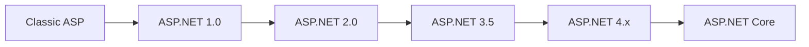

---

## Features of ASP.NET

### 1. Server Side Processing

Business logic executes on the server.

```text
Browser Request
       │
       ▼
ASP.NET Server
       │
       ▼
Process Request
       │
       ▼
HTML Response
```

---

### 2. Language Independence

ASP.NET supports:

- C#
- VB.NET
- F#

---

### 3. Object Oriented Programming

Supports:

- Classes
- Objects
- Encapsulation
- Inheritance
- Polymorphism
- Abstraction

---

### 4. Rich Server Controls

Examples:

```text
Button
Textbox
Label
GridView
Calendar
FileUpload
DropDownList
```

---

### 5. State Management

Maintains user information using:

```text
ViewState
Session
Cookies
Application
Cache
```

---

### 6. Security

Provides:

```text
Authentication
Authorization
Role Management
Data Encryption
```

---

### 7. High Performance

Uses:

```text
Caching
JIT Compilation
CLR Optimization
```

---

# ASP.NET Framework Architecture

## Diagram

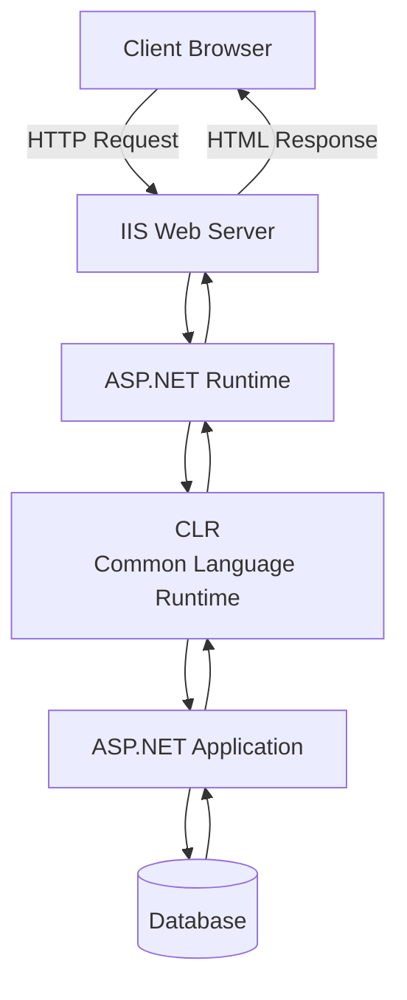

---

## Components of Architecture

### Client Browser

Examples:

- Chrome
- Firefox
- Edge

Responsibilities:

- Send request
- Display response

---

### IIS

Internet Information Services

Responsibilities:

- Receive requests
- Forward ASP.NET pages
- Manage application execution

---

### ASP.NET Runtime

Responsibilities:

- Request Processing
- Session Management
- Security
- Page Execution

---

### CLR

Common Language Runtime

Responsibilities:

- Code Compilation
- Memory Management
- Garbage Collection
- Exception Handling

---

### Database

Stores application data.

Examples:

- SQL Server
- Oracle
- MySQL

---

# Complete Request Processing Flow

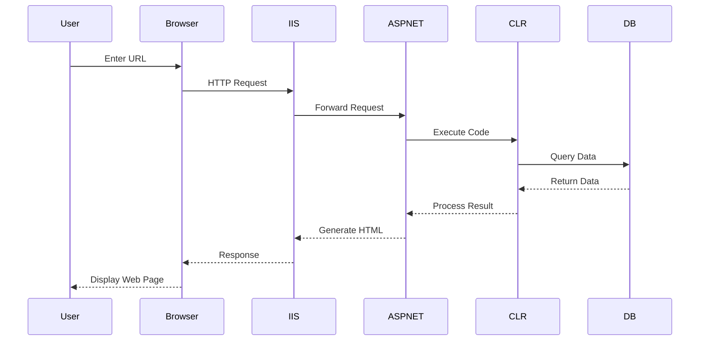

---

# 2. Client Server Architecture

---

## Introduction

Client Server Architecture is a network model in which clients request services and a server processes those requests and returns responses.

---

## Components

### Client

Examples:

- Browser
- Mobile App
- Desktop Application

### Server

Examples:

- IIS
- Apache
- Nginx

### Database Server

Examples:

- SQL Server
- Oracle
- MySQL

---

# Client Server Architecture Diagram

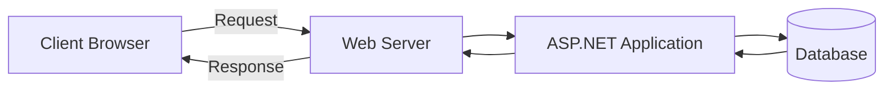

---

# Three Tier Architecture

ASP.NET applications generally follow a Three Tier Architecture.

## Diagram

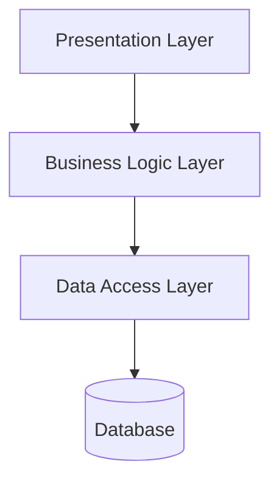

---

## Layer Explanation

### Presentation Layer

Contains:

- ASPX Pages
- Controls
- User Interface

### Business Logic Layer

Contains:

- Business Rules
- Validations
- Calculations

### Data Access Layer

Contains:

- Database Connectivity
- SQL Queries

---

# Request Response Cycle

## Diagram

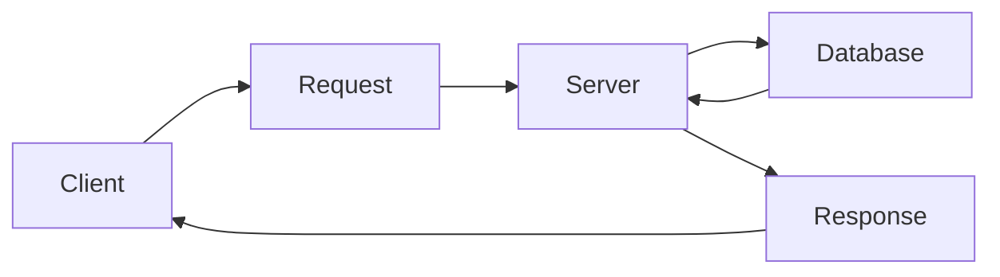

---

# Advantages of Client Server Architecture

1. Centralized Data Management

2. Better Security

3. Easy Maintenance

4. Scalability

5. Resource Sharing

6. Reliability

7. Faster Processing

---

# Disadvantages

1. Server Failure affects all users

2. Higher Setup Cost

3. Network Dependency

4. Maintenance Cost

---

# 3. ASP.NET Life Cycle

---

## Introduction

The ASP.NET Page Life Cycle is a sequence of events that occur from the time a page is requested until it is unloaded from memory.

Every ASP.NET page passes through multiple stages before displaying output to the user.

---

# Complete ASP.NET Life Cycle Diagram

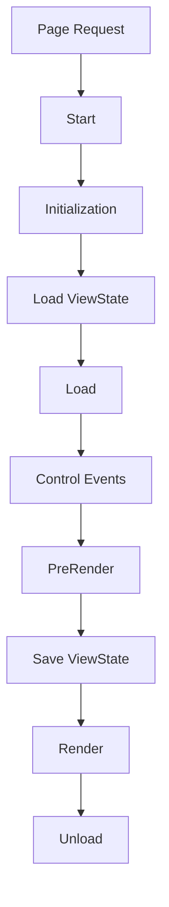

---

# Stage 1 : Page Request

When the browser requests an ASP.NET page.

Example:

```text
http://localhost/Login.aspx
```

### Diagram

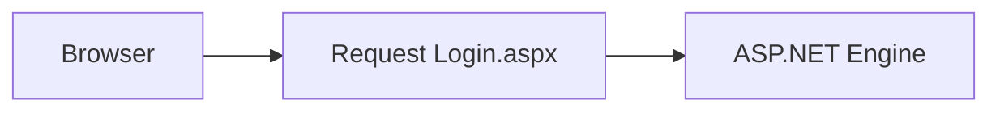

---

# Stage 2 : Start

ASP.NET creates:

- Request Object
- Response Object

### Diagram

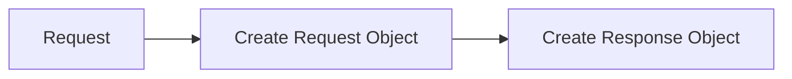

---

# Stage 3 : Initialization (Init)

Controls are initialized.

Event:

```csharp
Page_Init()
```

### Diagram

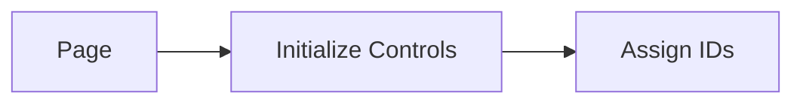

---

# Stage 4 : Load ViewState

Restores previous control values.

### Diagram

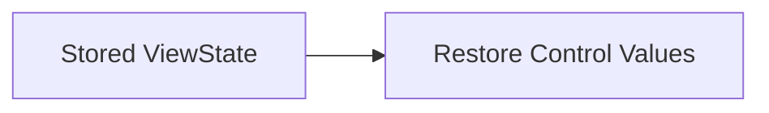

---

# Stage 5 : Load

Page data loads.

Event:

```csharp
Page_Load()
```

### Diagram

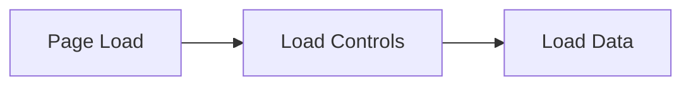

---

# Stage 6 : Control Events

User interaction occurs.

Examples:

- Button Click
- Checkbox Change
- Dropdown Selection

### Diagram

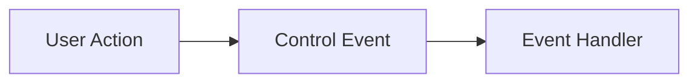

---

# Stage 7 : PreRender

Final modifications before page rendering.

### Diagram

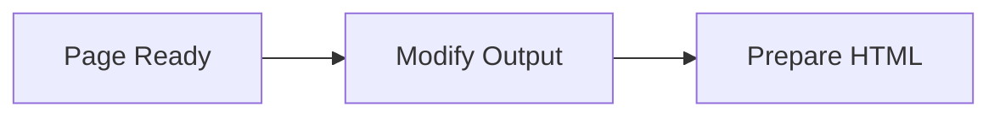

---

# Stage 8 : Save ViewState

Current page state is stored.

### Diagram

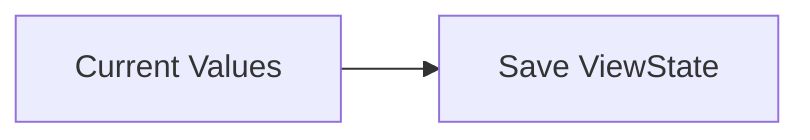

---

# Stage 9 : Render

Controls are converted into HTML.

### Diagram

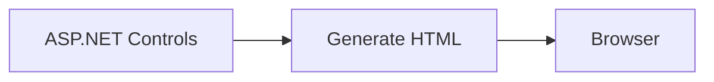

---

# Stage 10 : Unload

Resources are released.

### Diagram

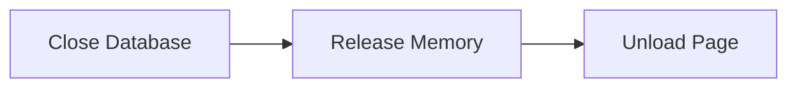

---

# ASP.NET Life Cycle Summary Diagram

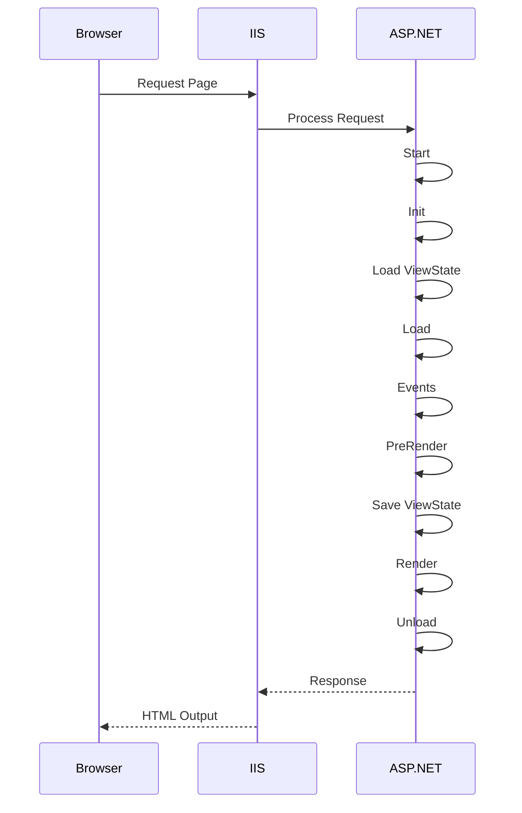

---

# 📚 Types of Files in ASP.NET

## Introduction

ASP.NET application contains various types of files. Each file has a specific purpose such as user interface design, code implementation, configuration, database connectivity, and application settings.

---

# ASP.NET File Structure

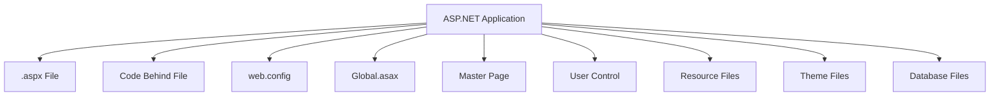

---

# 1. ASPX File (Web Form)

## Definition

The .aspx file is the main web page that contains:

- HTML
- ASP.NET Controls
- Page Layout
- User Interface

### Example

```aspx
<%@ Page Language="C#" %>

<html>
<body>

<asp:Label ID="lblMsg"
runat="server"
Text="Welcome">
</asp:Label>

</body>
</html>
```

---

## ASPX File Architecture

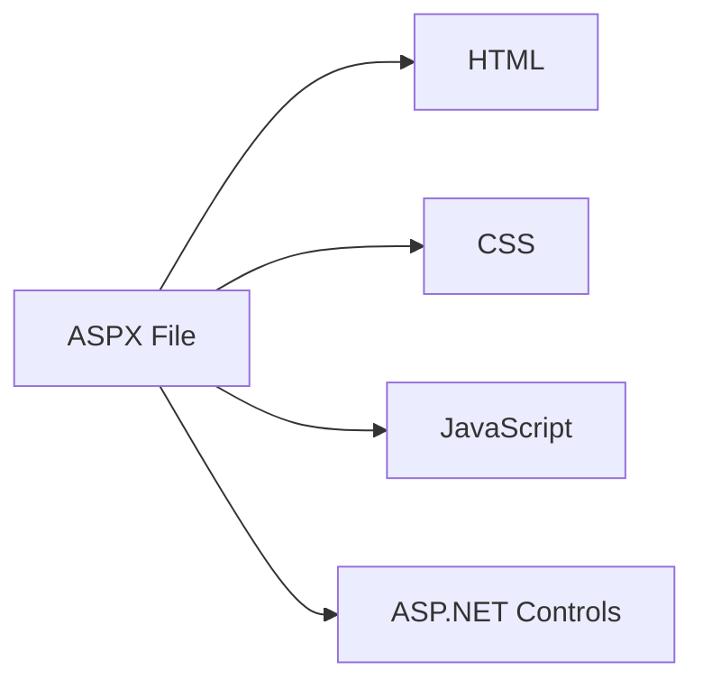

---

# 2. Code Behind File (.aspx.cs)

## Definition

Contains business logic written in C#.

Used to separate UI and programming code.

### Example

```csharp
protected void Button1_Click(object sender, EventArgs e)
{
    Label1.Text = "Welcome";
}
```

---

## Working

```mermaid
flowchart LR

A[User Click]

B[ASPX Page]

C[Code Behind]

D[Response]

A --> B

B --> C

C --> D
```

---

# 3. Web.Config File

## Definition

Stores application configuration settings.

Extension:

```text
web.config
```

---

## Uses

- Database Connection String
- Authentication
- Authorization
- Session Settings
- Custom Errors

---

### Example

```xml
<configuration>

<connectionStrings>

<add name="db"/>

</connectionStrings>

</configuration>
```

---

## Diagram

```mermaid
flowchart TB

A[Web.Config]

A --> B[Database Settings]

A --> C[Authentication]

A --> D[Authorization]

A --> E[Session Settings]

A --> F[Error Handling]
```

---

# 4. Global.asax File

## Definition

Handles application-level events.

Also called:

```text
Application File
```

---

## Events

- Application_Start
- Application_End
- Session_Start
- Session_End

---

## Diagram

```mermaid
flowchart TB

A[Global.asax]

A --> B[Application Start]

A --> C[Session Start]

A --> D[Session End]

A --> E[Application End]
```

---

# 5. Master Page (.master)

## Definition

Provides a common layout for all pages.

Example:

- Header
- Footer
- Navigation Menu

---

## Diagram

```mermaid
flowchart TB

A[Master Page]

A --> B[Header]

A --> C[Menu]

A --> D[Content Area]

A --> E[Footer]
```

---

## Working

```mermaid
flowchart LR

A[Master Page]

B[Page1.aspx]

C[Page2.aspx]

D[Page3.aspx]

A --> B

A --> C

A --> D
```

---

# 6. User Control (.ascx)

## Definition

Reusable UI component.

Examples:

- Login Form
- Header
- Footer
- Menu

---

## Diagram

```mermaid
flowchart LR

A[User Control]

A --> B[Header]

A --> C[Footer]

A --> D[Menu]

A --> E[Login Form]
```

---

# 7. Resource Files (.resx)

## Definition

Used for multilingual applications.

Stores text for different languages.

---

## Diagram

```mermaid
flowchart LR

A[Resource File]

A --> B[English]

A --> C[Gujarati]

A --> D[Hindi]

A --> E[French]
```

---

# 8. Theme Files

## Definition

Used for application appearance.

Contains:

- CSS
- Images
- Skins

---

## Diagram

```mermaid
flowchart LR

A[Theme]

A --> B[CSS]

A --> C[Images]

A --> D[Skin Files]
```

---

# Summary of ASP.NET Files

```mermaid
flowchart TB

A[ASP.NET Files]

A --> B[ASPX]

A --> C[Code Behind]

A --> D[Web.Config]

A --> E[Global.asax]

A --> F[Master Page]

A --> G[User Control]

A --> H[Resource File]

A --> I[Theme]
```

---

# 📚 Types of Controls in ASP.NET

## Introduction

Controls are components used to interact with users and build web page interfaces.

---

# Classification of Controls

```mermaid
flowchart TB

A[ASP.NET Controls]

A --> B[HTML Controls]

A --> C[Standard Controls]

A --> D[Validation Controls]

A --> E[Rich Controls]

A --> F[Navigation Controls]

A --> G[Login Controls]

A --> H[Data Controls]
```

---

# 1. HTML Controls

Standard HTML elements.

Examples:

```html
<input>
<select>
<textarea>
<button>
```

---

## Diagram

```mermaid
flowchart LR

A[HTML Controls]

A --> B[Input]

A --> C[Button]

A --> D[Select]

A --> E[Textarea]
```

---

# 2. Standard Controls

Most commonly used controls.

Examples:

- Label
- TextBox
- Button
- CheckBox
- RadioButton
- ListBox
- DropDownList

---

## Diagram

```mermaid
flowchart TB

A[Standard Controls]

A --> B[Label]

A --> C[TextBox]

A --> D[Button]

A --> E[CheckBox]

A --> F[RadioButton]

A --> G[ListBox]

A --> H[DropDownList]
```

---

# 3. Validation Controls

Used for input validation.

---

## Types

```mermaid
flowchart TB

A[Validation Controls]

A --> B[RequiredFieldValidator]

A --> C[RangeValidator]

A --> D[CompareValidator]

A --> E[RegularExpressionValidator]

A --> F[CustomValidator]

A --> G[ValidationSummary]
```

---

# 4. Rich Controls

Advanced controls.

Examples:

- Calendar
- AdRotator
- Wizard
- FileUpload

---

## Diagram

```mermaid
flowchart LR

A[Rich Controls]

A --> B[Calendar]

A --> C[Wizard]

A --> D[AdRotator]

A --> E[FileUpload]
```

---

# 5. Navigation Controls

Used for website navigation.

Examples:

- Menu
- TreeView
- SiteMapPath

---

## Diagram

```mermaid
flowchart LR

A[Navigation Controls]

A --> B[Menu]

A --> C[TreeView]

A --> D[SiteMapPath]
```

---

# 6. Login Controls

Used for authentication.

Examples:

- Login
- LoginStatus
- ChangePassword

---

## Diagram

```mermaid
flowchart LR

A[Login Controls]

A --> B[Login]

A --> C[LoginStatus]

A --> D[ChangePassword]
```

---

# 7. Data Controls

Used for displaying database records.

Examples:

- GridView
- DetailsView
- FormView
- Repeater

---

## Diagram

```mermaid
flowchart TB

A[Data Controls]

A --> B[GridView]

A --> C[DetailsView]

A --> D[FormView]

A --> E[Repeater]
```

---

# Complete Control Hierarchy

```mermaid
flowchart TB

A[ASP.NET Controls]

A --> B[HTML Controls]

A --> C[Standard Controls]

A --> D[Validation Controls]

A --> E[Rich Controls]

A --> F[Navigation Controls]

A --> G[Login Controls]

A --> H[Data Controls]
```

---

# 📚 Page Architecture in ASP.NET

## Introduction

Page Architecture defines how an ASP.NET page is structured internally.

An ASP.NET page consists of:

- Directives
- Server Controls
- HTML
- Code Behind
- ViewState
- Event Handling

---

# ASP.NET Page Architecture

```mermaid
flowchart TB

A[ASP.NET Page]

A --> B[Page Directive]

A --> C[HTML Elements]

A --> D[Server Controls]

A --> E[ViewState]

A --> F[Code Behind]

A --> G[Events]
```

---

# Detailed Page Architecture

```mermaid
flowchart TB

A[Browser Request]

B[ASPX Page]

C[Page Directive]

D[Server Controls]

E[Code Behind]

F[ASP.NET Runtime]

G[CLR]

H[(Database)]

I[HTML Output]

A --> B

B --> C

B --> D

D --> E

E --> F

F --> G

G --> H

H --> G

G --> F

F --> I

I --> A
```

---

# Components of ASP.NET Page

## 1. Page Directive

Appears at top of page.

Example:

```aspx
<%@ Page Language="C#" %>
```

### Purpose

- Language Selection
- Compilation Settings
- Page Configuration

---

## 2. HTML Section

Provides page structure.

Example:

```html
<html>
  <body></body>
</html>
```

---

## 3. Server Controls

Interactive controls executed on server.

Example:

```aspx
<asp:Button
ID="btnSave"
runat="server"
Text="Save" />
```

---

## 4. ViewState

Stores page data between postbacks.

---

### ViewState Diagram

```mermaid
flowchart LR

A[Page]

B[ViewState]

C[PostBack]

D[Restore Data]

A --> B

B --> C

C --> D
```

---

## 5. Code Behind

Contains business logic.

```text
Page.aspx
      │
      ▼
Page.aspx.cs
```

---

## Diagram

```mermaid
flowchart LR

A[Page UI]

B[Code Behind]

C[Business Logic]

A --> B

B --> C
```

---

## 6. Event Handling

User actions generate events.

Examples:

- Click
- Load
- TextChanged

---

### Event Flow

```mermaid
flowchart LR

A[User Action]

B[Server Control]

C[Event Raised]

D[Event Handler]

A --> B

B --> C

C --> D
```

---

# Complete Page Processing Architecture

```mermaid
sequenceDiagram

participant User
participant Browser
participant ASPX
participant CodeBehind
participant Database

User->>Browser: Open Page

Browser->>ASPX: Request

ASPX->>CodeBehind: Execute Logic

CodeBehind->>Database: Fetch Data

Database-->>CodeBehind: Return Data

CodeBehind-->>ASPX: Bind Data

ASPX-->>Browser: Generate HTML

Browser-->>User: Display Page
```

---

# 📚 Introduction to Standard Controls in ASP.NET

## What are Standard Controls?

Standard Controls are pre-built ASP.NET server controls used to create user interfaces and interact with users.

These controls run on the server and generate HTML automatically.

---

# Standard Controls Hierarchy

```mermaid
flowchart TB

A[ASP.NET Standard Controls]

A --> B[Button]

A --> C[TextBox]

A --> D[Label]

A --> E[CheckBox]

A --> F[Panel]

A --> G[RadioButton]

A --> H[ListBox]

A --> I[DropDownList]
```

---

# Ways to Add Controls in ASP.NET

There are mainly **2 methods** to add controls.

## Method 1 : Drag and Drop

### Steps

```text
Toolbox
   │
   ▼
Select Control
   │
   ▼
Drag & Drop
   │
   ▼
Designer Page
```

### Example

1. Open Visual Studio
2. Toolbox → Standard
3. Select Button
4. Drag Button on Form

Visual Studio automatically generates:

```aspx
<asp:Button ID="Button1"
runat="server"
Text="Button" />
```

---

## Method 2 : Manual Coding

Developer directly writes code.

Example:

```aspx
<asp:Button
ID="btnSubmit"
runat="server"
Text="Submit" />
```

---

# 📚 Button Control

## Introduction

Button Control is used to perform an action when clicked by the user.

Examples:

- Submit Form
- Save Data
- Delete Record
- Update Information

---

# Button Control Diagram

```mermaid
flowchart LR

A[User Click]

B[Button]

C[Click Event]

D[Server Code]

A --> B

B --> C

C --> D
```

---

# Syntax

```aspx
<asp:Button
ID="btnSubmit"
runat="server"
Text="Submit" />
```

---

# Drag & Drop Method

```text
Toolbox
   │
   ▼
Button Control
   │
   ▼
Drag To Form
```

---

# Manual Method

```aspx
<asp:Button
ID="btnSave"
runat="server"
Text="Save Data" />
```

---

# Button Event Example

## ASPX

```aspx
<asp:Button
ID="btnClick"
runat="server"
Text="Click Me"
OnClick="btnClick_Click" />

<asp:Label
ID="lblResult"
runat="server" />
```

---

## Code Behind

```csharp
protected void btnClick_Click(object sender, EventArgs e)
{
    lblResult.Text = "Button Clicked";
}
```

---

# Important Properties of Button

| Property  | Description       |
| --------- | ----------------- |
| ID        | Unique Identifier |
| Text      | Button Caption    |
| Enabled   | Enable/Disable    |
| Visible   | Show/Hide         |
| Width     | Width of Button   |
| Height    | Height of Button  |
| BackColor | Background Color  |
| ForeColor | Text Color        |
| Font      | Font Style        |
| ToolTip   | Tooltip Message   |
| CssClass  | CSS Class Name    |
| OnClick   | Click Event       |

---

# Button Properties Diagram

```mermaid
flowchart TB

A[Button]

A --> B[ID]

A --> C[Text]

A --> D[Enabled]

A --> E[Visible]

A --> F[Width]

A --> G[Height]

A --> H[BackColor]

A --> I[ForeColor]

A --> J[OnClick]
```

---

# 📚 TextBox Control

## Introduction

TextBox Control is used to receive input from users.

Examples:

- Name
- Email
- Password
- Address

---

# TextBox Diagram

```mermaid
flowchart LR

A[User]

B[TextBox]

C[Input Data]

A --> B

B --> C
```

---

# Syntax

```aspx
<asp:TextBox
ID="txtName"
runat="server">
</asp:TextBox>
```

---

# Drag & Drop Method

```text
Toolbox
   │
   ▼
TextBox
   │
   ▼
Drag To Form
```

---

# Manual Method

```aspx
<asp:TextBox
ID="txtEmail"
runat="server">
</asp:TextBox>
```

---

# Example

```aspx
Name :

<asp:TextBox
ID="txtName"
runat="server">
</asp:TextBox>

<asp:Button
ID="btnShow"
runat="server"
Text="Show"
OnClick="btnShow_Click" />

<asp:Label
ID="lblName"
runat="server">
</asp:Label>
```

---

## Code Behind

```csharp
protected void btnShow_Click(object sender, EventArgs e)
{
    lblName.Text = txtName.Text;
}
```

---

# TextBox Properties

| Property  | Description                     |
| --------- | ------------------------------- |
| Text      | Text Value                      |
| MaxLength | Maximum Characters              |
| TextMode  | SingleLine, MultiLine, Password |
| ReadOnly  | Read Only Mode                  |
| Enabled   | Enable/Disable                  |
| Width     | Width                           |
| Height    | Height                          |
| Visible   | Show/Hide                       |
| ToolTip   | Hint Message                    |

---

# TextMode Types

```mermaid
flowchart TB

A[TextMode]

A --> B[SingleLine]

A --> C[MultiLine]

A --> D[Password]
```

---

# Example

Password Box

```aspx
<asp:TextBox
ID="txtPassword"
runat="server"
TextMode="Password">
</asp:TextBox>
```

---

# 📚 CheckBox Control

## Introduction

CheckBox allows users to select or deselect an option.

Used for:

- Accept Terms
- Subscription
- Notifications

---

# Diagram

```mermaid
flowchart LR

A[Unchecked]

B[Checked]

A --> B

B --> A
```

---

# Syntax

```aspx
<asp:CheckBox
ID="chkTerms"
runat="server"
Text="Accept Terms" />
```

---

# Example

```aspx
<asp:CheckBox
ID="chkAgree"
runat="server"
Text="I Agree" />

<asp:Button
ID="btnCheck"
runat="server"
Text="Submit"
OnClick="btnCheck_Click" />
```

---

## Code Behind

```csharp
protected void btnCheck_Click(object sender, EventArgs e)
{
    if(chkAgree.Checked)
    {
        Response.Write("Accepted");
    }
}
```

---

# CheckBox Properties

| Property     | Description        |
| ------------ | ------------------ |
| Checked      | True/False         |
| Text         | Caption            |
| AutoPostBack | Automatic PostBack |
| Enabled      | Enable/Disable     |
| Visible      | Show/Hide          |

---

# CheckBox Working

```mermaid
flowchart LR

A[User Click]

B[CheckBox]

C[Checked Property]

A --> B

B --> C
```

---

# 📚 Label Control

## Introduction

Label Control displays output or messages.

Used for:

- Welcome Message
- Error Message
- Status Message

---

# Syntax

```aspx
<asp:Label
ID="lblMessage"
runat="server"
Text="Welcome">
</asp:Label>
```

---

# Example

```aspx
<asp:Label
ID="lblMsg"
runat="server"
Text="Hello ASP.NET">
</asp:Label>
```

---

# Label Properties

| Property  | Description      |
| --------- | ---------------- |
| Text      | Display Text     |
| ForeColor | Text Color       |
| BackColor | Background Color |
| Font      | Font Style       |
| Visible   | Show/Hide        |
| Width     | Width            |
| Height    | Height           |

---

# Label Diagram

```mermaid
flowchart TB

A[Label]

A --> B[Text]

A --> C[Color]

A --> D[Font]

A --> E[Visibility]
```

---

# 📚 Panel Control

## Introduction

Panel Control acts as a container that groups multiple controls together.

Used for:

- Login Section
- Registration Section
- Dashboard Cards
- Grouping Controls

---

# Panel Diagram

```mermaid
flowchart TB

A[Panel]

A --> B[Label]

A --> C[TextBox]

A --> D[Button]
```

---

# Syntax

```aspx
<asp:Panel
ID="Panel1"
runat="server">

</asp:Panel>
```

---

# Example

```aspx
<asp:Panel
ID="pnlLogin"
runat="server">

<asp:Label
ID="lblUser"
runat="server"
Text="Username">
</asp:Label>

<br />

<asp:TextBox
ID="txtUser"
runat="server">
</asp:TextBox>

<br />

<asp:Button
ID="btnLogin"
runat="server"
Text="Login">
</asp:Button>

</asp:Panel>
```

---

# Output Structure

```text
+----------------------+
| Username             |
| [______________]     |
|                      |
| [ Login ]            |
+----------------------+
```

---

# Panel Properties

| Property     | Description      |
| ------------ | ---------------- |
| GroupingText | Panel Title      |
| ScrollBars   | Scrollbar        |
| BackColor    | Background Color |
| BorderColor  | Border Color     |
| BorderWidth  | Border Width     |
| Width        | Width            |
| Height       | Height           |
| Visible      | Show/Hide        |

---

# Panel Working Diagram

```mermaid
flowchart LR

A[Panel]

A --> B[TextBox]

A --> C[Button]

A --> D[Label]

A --> E[CheckBox]
```

---

# Comparison of Controls

| Control  | Purpose        |
| -------- | -------------- |
| Button   | Perform Action |
| TextBox  | Input Data     |
| CheckBox | Select Option  |
| Label    | Display Output |
| Panel    | Group Controls |

---

# Standard Controls Summary

```mermaid
flowchart TB

A[Standard Controls]

A --> B[Button]

A --> C[TextBox]

A --> D[CheckBox]

A --> E[Label]

A --> F[Panel]

B --> G[Perform Action]

C --> H[Input Data]

D --> I[Select Option]

E --> J[Display Output]

F --> K[Group Controls]
```

---

# 📚 ListBox Control

## Introduction

ListBox Control is used to display a list of items from which the user can select one or multiple items.

### Uses

- Country Selection
- Course Selection
- Skill Selection
- Product Categories

---

# ListBox Structure

```text
+------------------+
| Java             |
| Python           |
| C#               |
| PHP              |
| JavaScript       |
+------------------+
```

---

# ListBox Architecture

```mermaid
flowchart TB

A[ListBox]

A --> B[Item 1]

A --> C[Item 2]

A --> D[Item 3]

A --> E[Item N]
```

---

# Syntax

```aspx
<asp:ListBox
ID="lstCourses"
runat="server">
</asp:ListBox>
```

---

# Drag & Drop Method

```text
Toolbox
   │
   ▼
ListBox
   │
   ▼
Drag To Form
```

---

# Manual Coding Method

```aspx
<asp:ListBox
ID="lstLanguage"
runat="server">

<asp:ListItem>C#</asp:ListItem>

<asp:ListItem>Java</asp:ListItem>

<asp:ListItem>Python</asp:ListItem>

</asp:ListBox>
```

---

# Example

## ASPX

```aspx
<asp:ListBox
ID="lstCourse"
runat="server">

<asp:ListItem>BCA</asp:ListItem>

<asp:ListItem>BBA</asp:ListItem>

<asp:ListItem>B.Com</asp:ListItem>

</asp:ListBox>

<asp:Button
ID="btnShow"
runat="server"
Text="Show"
OnClick="btnShow_Click"/>

<asp:Label
ID="lblResult"
runat="server"/>
```

---

## Code Behind

```csharp
protected void btnShow_Click(object sender, EventArgs e)
{
    lblResult.Text = lstCourse.SelectedItem.Text;
}
```

---

# Multiple Selection

```aspx
<asp:ListBox
ID="lstSkills"
runat="server"
SelectionMode="Multiple">
</asp:ListBox>
```

---

# Important Properties

| Property      | Description            |
| ------------- | ---------------------- |
| Items         | Collection of Items    |
| SelectedIndex | Selected Item Position |
| SelectedItem  | Selected Item          |
| SelectionMode | Single/Multiple        |
| Rows          | Visible Rows           |
| AutoPostBack  | Automatic PostBack     |
| Enabled       | Enable/Disable         |

---

# Working Diagram

```mermaid
flowchart LR

A[User Select Item]

B[ListBox]

C[Selected Item]

D[Display Result]

A --> B

B --> C

C --> D
```

---

# 📚 DropDownList Control

## Introduction

DropDownList displays a list of items in a drop-down menu.

Only one item can be selected at a time.

---

# Structure

```text
+------------------+
| Select Course ▼  |
+------------------+

After Click

+------------------+
| BCA              |
| BBA              |
| B.Com            |
+------------------+
```

---

# Architecture

```mermaid
flowchart TB

A[DropDownList]

A --> B[Option 1]

A --> C[Option 2]

A --> D[Option 3]
```

---

# Syntax

```aspx
<asp:DropDownList
ID="ddlCourse"
runat="server">
</asp:DropDownList>
```

---

# Drag & Drop

```text
Toolbox
   │
   ▼
DropDownList
   │
   ▼
Drag To Form
```

---

# Manual Coding

```aspx
<asp:DropDownList
ID="ddlCourse"
runat="server">

<asp:ListItem>BCA</asp:ListItem>

<asp:ListItem>BBA</asp:ListItem>

<asp:ListItem>B.Com</asp:ListItem>

</asp:DropDownList>
```

---

# Example

## ASPX

```aspx
<asp:DropDownList
ID="ddlCity"
runat="server">

<asp:ListItem>Rajkot</asp:ListItem>

<asp:ListItem>Ahmedabad</asp:ListItem>

<asp:ListItem>Surat</asp:ListItem>

</asp:DropDownList>

<asp:Button
ID="btnShow"
runat="server"
Text="Show"
OnClick="btnShow_Click"/>
```

---

## Code Behind

```csharp
protected void btnShow_Click(object sender, EventArgs e)
{
    Response.Write(ddlCity.SelectedItem.Text);
}
```

---

# Important Properties

| Property      | Description        |
| ------------- | ------------------ |
| Items         | List Collection    |
| SelectedItem  | Selected Item      |
| SelectedIndex | Selected Position  |
| AutoPostBack  | Automatic PostBack |
| DataSource    | Bind Data          |
| Enabled       | Enable/Disable     |

---

# Working Diagram

```mermaid
flowchart LR

A[User]

B[DropDownList]

C[Select Item]

D[Display Output]

A --> B

B --> C

C --> D
```

---

# 📚 FileUpload Control

## Introduction

FileUpload Control is used to upload files from client computer to web server.

---

# Upload Process

```mermaid
flowchart LR

A[User]

B[Select File]

C[FileUpload Control]

D[Server]

A --> B

B --> C

C --> D
```

---

# Syntax

```aspx
<asp:FileUpload
ID="FileUpload1"
runat="server"/>
```

---

# Drag & Drop Method

```text
Toolbox
   │
   ▼
FileUpload
   │
   ▼
Drag To Form
```

---

# Example

## ASPX

```aspx
<asp:FileUpload
ID="fuImage"
runat="server"/>

<asp:Button
ID="btnUpload"
runat="server"
Text="Upload"
OnClick="btnUpload_Click"/>
```

---

## Code Behind

```csharp
protected void btnUpload_Click(object sender, EventArgs e)
{
    if(fuImage.HasFile)
    {
        fuImage.SaveAs(
        Server.MapPath("~/Uploads/")
        + fuImage.FileName);
    }
}
```

---

# Important Properties

| Property   | Description        |
| ---------- | ------------------ |
| HasFile    | File Selected?     |
| FileName   | Uploaded File Name |
| PostedFile | File Object        |
| SaveAs()   | Save File          |
| FileBytes  | File Data          |

---

# File Upload Flow

```mermaid
flowchart TB

A[Choose File]

B[Upload]

C[Server]

D[Store File]

A --> B

B --> C

C --> D
```

---

# 📚 AdRotator Control

## Introduction

AdRotator Control displays advertisements randomly.

Useful for:

- Advertisement Banners
- Promotional Images
- Offers

---

# Architecture

```mermaid
flowchart TB

A[AdRotator]

A --> B[Ad 1]

A --> C[Ad 2]

A --> D[Ad 3]

A --> E[Ad N]
```

---

# Syntax

```aspx
<asp:AdRotator
ID="AdRotator1"
runat="server"
AdvertisementFile="Ads.xml"/>
```

---

# Advertisement XML File

```xml
<Advertisements>

<Ad>
<ImageUrl>ad1.jpg</ImageUrl>
<NavigateUrl>https://example.com</NavigateUrl>
</Ad>

</Advertisements>
```

---

# Example

```aspx
<asp:AdRotator
ID="AdRotator1"
runat="server"
AdvertisementFile="Ads.xml"/>
```

---

# Important Properties

| Property          | Description   |
| ----------------- | ------------- |
| AdvertisementFile | XML Source    |
| ImageUrlField     | Image Field   |
| NavigateUrlField  | Link Field    |
| KeywordFilter     | Filter Ads    |
| Target            | Open Location |

---

# Working Diagram

```mermaid
flowchart LR

A[XML Ads]

B[AdRotator]

C[Random Ad]

D[Browser]

A --> B

B --> C

C --> D
```

---

# 📚 CheckBoxList Control

## Introduction

CheckBoxList is a group of multiple CheckBoxes.

Allows users to select multiple options.

---

# Structure

```text
☐ Cricket

☐ Football

☐ Hockey

☐ Volleyball
```

---

# Architecture

```mermaid
flowchart TB

A[CheckBoxList]

A --> B[Option 1]

A --> C[Option 2]

A --> D[Option 3]

A --> E[Option 4]
```

---

# Syntax

```aspx
<asp:CheckBoxList
ID="chkSports"
runat="server">
</asp:CheckBoxList>
```

---

# Drag & Drop

```text
Toolbox
   │
   ▼
CheckBoxList
   │
   ▼
Drag To Form
```

---

# Manual Coding

```aspx
<asp:CheckBoxList
ID="chkSports"
runat="server">

<asp:ListItem>Cricket</asp:ListItem>

<asp:ListItem>Football</asp:ListItem>

<asp:ListItem>Hockey</asp:ListItem>

</asp:CheckBoxList>
```

---

# Example

## ASPX

```aspx
<asp:CheckBoxList
ID="chkSports"
runat="server">

<asp:ListItem>Cricket</asp:ListItem>

<asp:ListItem>Football</asp:ListItem>

<asp:ListItem>Hockey</asp:ListItem>

</asp:CheckBoxList>

<asp:Button
ID="btnShow"
runat="server"
Text="Show"
OnClick="btnShow_Click"/>
```

---

## Code Behind

```csharp
protected void btnShow_Click(object sender, EventArgs e)
{
    foreach(ListItem item in chkSports.Items)
    {
        if(item.Selected)
        {
            Response.Write(item.Text + "<br>");
        }
    }
}
```

---

# Important Properties

| Property        | Description         |
| --------------- | ------------------- |
| Items           | List Collection     |
| Selected        | Selected Item       |
| RepeatColumns   | Number of Columns   |
| RepeatDirection | Horizontal/Vertical |
| AutoPostBack    | Automatic PostBack  |
| Enabled         | Enable/Disable      |

---

# Working Diagram

```mermaid
flowchart LR

A[User Select]

B[CheckBoxList]

C[Multiple Items]

D[Display Output]

A --> B

B --> C

C --> D
```

---

# Comparison Table

| Control      | Purpose             | Multiple Selection |
| ------------ | ------------------- | ------------------ |
| ListBox      | Display List        | Yes                |
| DropDownList | Drop Down Menu      | No                 |
| FileUpload   | Upload Files        | No                 |
| AdRotator    | Display Ads         | No                 |
| CheckBoxList | Multiple CheckBoxes | Yes                |

---

# Complete Relationship Diagram

```mermaid
flowchart TB

A[ASP.NET Standard Controls]

A --> B[ListBox]

A --> C[DropDownList]

A --> D[FileUpload]

A --> E[AdRotator]

A --> F[CheckBoxList]

B --> G[Select Items]

C --> H[Single Selection]

D --> I[Upload Files]

E --> J[Display Advertisements]

F --> K[Multiple Selection]
```

---

# 📚 RadioButtonList Control

## Introduction

RadioButtonList Control is used to display a group of Radio Buttons where the user can select only one option at a time.

Examples:

- Gender Selection
- Payment Method
- Course Type
- Language Selection

---

# RadioButtonList Structure

```text
( ) Male

( ) Female

( ) Other
```

---

# Architecture

```mermaid
flowchart TB

A[RadioButtonList]

A --> B[Option 1]

A --> C[Option 2]

A --> D[Option 3]

Only One Option Can Be Selected
```

---

# Syntax

```aspx
<asp:RadioButtonList
ID="rblGender"
runat="server">
</asp:RadioButtonList>
```

---

# Drag & Drop Method

```text
Toolbox
   │
   ▼
RadioButtonList
   │
   ▼
Drag To Form
```

---

# Manual Coding Method

```aspx
<asp:RadioButtonList
ID="rblGender"
runat="server">

<asp:ListItem>Male</asp:ListItem>

<asp:ListItem>Female</asp:ListItem>

<asp:ListItem>Other</asp:ListItem>

</asp:RadioButtonList>
```

---

# Example

## ASPX

```aspx
<asp:RadioButtonList
ID="rblGender"
runat="server">

<asp:ListItem>Male</asp:ListItem>

<asp:ListItem>Female</asp:ListItem>

</asp:RadioButtonList>

<asp:Button
ID="btnShow"
runat="server"
Text="Show"
OnClick="btnShow_Click"/>
```

---

## Code Behind

```csharp
protected void btnShow_Click(object sender, EventArgs e)
{
    Response.Write(
    rblGender.SelectedItem.Text);
}
```

---

# Important Properties

| Property        | Description           |
| --------------- | --------------------- |
| Items           | Collection of Items   |
| SelectedItem    | Selected Item         |
| SelectedIndex   | Selected Position     |
| RepeatDirection | Horizontal / Vertical |
| RepeatColumns   | Number of Columns     |
| AutoPostBack    | Automatic PostBack    |

---

# Working Diagram

```mermaid
flowchart LR

A[User Select Option]

B[RadioButtonList]

C[Selected Item]

D[Display Output]

A --> B

B --> C

C --> D
```

---

# 📚 ImageMap Control

## Introduction

ImageMap Control allows users to click different areas of an image.

Each area can perform different actions.

---

# Real Life Example

```text
India Map

Click Gujarat → Gujarat Information

Click Rajasthan → Rajasthan Information

Click Maharashtra → Maharashtra Information
```

---

# Architecture

```mermaid
flowchart TB

A[Image]

A --> B[Clickable Area 1]

A --> C[Clickable Area 2]

A --> D[Clickable Area 3]
```

---

# Syntax

```aspx
<asp:ImageMap
ID="ImageMap1"
runat="server">

</asp:ImageMap>
```

---

# Example

```aspx
<asp:ImageMap
ID="ImageMap1"
runat="server"
ImageUrl="india.png">

<asp:RectangleHotSpot
Top="10"
Left="10"
Right="100"
Bottom="100"
NavigateUrl="Gujarat.aspx" />

</asp:ImageMap>
```

---

# HotSpot Types

```mermaid
flowchart TB

A[HotSpot]

A --> B[RectangleHotSpot]

A --> C[CircleHotSpot]

A --> D[PolygonHotSpot]
```

---

# Rectangle HotSpot

```text
+---------------+
|               |
| Click Area    |
|               |
+---------------+
```

---

# Circle HotSpot

```text
      *****
   **       **
  *  Click    *
   **       **
      *****
```

---

# Polygon HotSpot

```text
      /\
     /  \
    /____\
```

---

# Important Properties

| Property      | Description      |
| ------------- | ---------------- |
| ImageUrl      | Image Path       |
| HotSpots      | Clickable Areas  |
| NavigateUrl   | Redirect URL     |
| Target        | Open Target      |
| AlternateText | Alternative Text |

---

# Working Diagram

```mermaid
flowchart LR

A[Image]

B[HotSpot]

C[User Click]

D[Open Page]

A --> B

B --> C

C --> D
```

---

# 📚 Wizard Control

## Introduction

Wizard Control is used to divide a large form into multiple steps.

Examples:

- Registration Form
- Online Admission Form
- Online Shopping Checkout
- Job Application Form

---

# Real Example

```text
Step 1 → Personal Details

Step 2 → Education Details

Step 3 → Address Details

Step 4 → Confirmation
```

---

# Wizard Architecture

```mermaid
flowchart LR

A[Step 1]

B[Step 2]

C[Step 3]

D[Step 4]

A --> B

B --> C

C --> D
```

---

# Syntax

```aspx
<asp:Wizard
ID="Wizard1"
runat="server">
</asp:Wizard>
```

---

# Example

```aspx
<asp:Wizard
ID="Wizard1"
runat="server">

<WizardSteps>

<asp:WizardStep
Title="Personal Info">

Name:
<asp:TextBox
ID="txtName"
runat="server" />

</asp:WizardStep>

<asp:WizardStep
Title="Education">

Course:
<asp:TextBox
ID="txtCourse"
runat="server" />

</asp:WizardStep>

</WizardSteps>

</asp:Wizard>
```

---

# Important Properties

| Property                 | Description        |
| ------------------------ | ------------------ |
| ActiveStepIndex          | Current Step       |
| DisplaySideBar           | Show Sidebar       |
| FinishCompleteButtonText | Finish Button Text |
| StartNextButtonText      | Next Button Text   |
| HeaderText               | Header Title       |

---

# Wizard Flow

```mermaid
flowchart LR

A[Personal]

B[Education]

C[Address]

D[Finish]

A --> B

B --> C

C --> D
```

---

# Advantages

- User Friendly
- Easy Navigation
- Organized Form Design
- Better User Experience

---

# 📚 Calendar Control

## Introduction

Calendar Control is used to display a calendar and allow users to select dates.

Examples:

- Date of Birth
- Booking Date
- Appointment Date
- Event Date

---

# Calendar Structure

```text
+----------------------+

     June 2026

Su Mo Tu We Th Fr Sa

01 02 03 04 05 06

07 08 09 10 11 12

+----------------------+
```

---

# Calendar Architecture

```mermaid
flowchart TB

A[Calendar]

A --> B[Month]

A --> C[Year]

A --> D[Date Selection]
```

---

# Syntax

```aspx
<asp:Calendar
ID="Calendar1"
runat="server">
</asp:Calendar>
```

---

# Drag & Drop Method

```text
Toolbox

   ▼

Calendar

   ▼

Drag To Form
```

---

# Example

## ASPX

```aspx
<asp:Calendar
ID="Calendar1"
runat="server">

</asp:Calendar>

<asp:Button
ID="btnShow"
runat="server"
Text="Show Date"
OnClick="btnShow_Click"/>
```

---

## Code Behind

```csharp
protected void btnShow_Click(
object sender,
EventArgs e)
{
    Response.Write(
    Calendar1.SelectedDate);
}
```

---

# Important Properties

| Property      | Description          |
| ------------- | -------------------- |
| SelectedDate  | Selected Date        |
| VisibleDate   | Current Visible Date |
| DayNameFormat | Day Format           |
| SelectionMode | Selection Type       |
| BackColor     | Background Color     |
| ForeColor     | Text Color           |

---

# Calendar Working

```mermaid
flowchart LR

A[Select Date]

B[Calendar]

C[SelectedDate]

D[Display Output]

A --> B

B --> C

C --> D
```

---

# 📚 File Upload Control

## Introduction

FileUpload Control is used to upload files from client machine to web server.

Supported Files:

- Images
- PDF
- Word Files
- Excel Files
- Videos

---

# Upload Architecture

```mermaid
flowchart LR

A[Client]

B[Choose File]

C[FileUpload]

D[Server]

E[Storage]

A --> B

B --> C

C --> D

D --> E
```

---

# Syntax

```aspx
<asp:FileUpload
ID="FileUpload1"
runat="server" />
```

---

# Example

## ASPX

```aspx
<asp:FileUpload
ID="fuDocument"
runat="server" />

<asp:Button
ID="btnUpload"
runat="server"
Text="Upload"
OnClick="btnUpload_Click"/>
```

---

## Code Behind

```csharp
protected void btnUpload_Click(
object sender,
EventArgs e)
{
    if(fuDocument.HasFile)
    {
        fuDocument.SaveAs(
        Server.MapPath("~/Files/")
        + fuDocument.FileName);

        Response.Write(
        "File Uploaded Successfully");
    }
}
```

---

# Upload Process

```mermaid
sequenceDiagram

participant User

participant Browser

participant Server

User->>Browser: Select File

Browser->>Server: Upload File

Server->>Server: Save File

Server-->>Browser: Success Message
```

---

# Important Properties

| Property   | Description        |
| ---------- | ------------------ |
| HasFile    | File Selected?     |
| FileName   | Uploaded File Name |
| PostedFile | File Object        |
| FileBytes  | File Data          |
| SaveAs()   | Save File          |

---

# Control Comparison

| Control         | Purpose               |
| --------------- | --------------------- |
| RadioButtonList | Single Selection      |
| ImageMap        | Clickable Image Areas |
| Wizard          | Multi-Step Forms      |
| Calendar        | Date Selection        |
| FileUpload      | Upload Files          |

---

# Complete Relationship Diagram

```mermaid
flowchart TB

A[Advanced Standard Controls]

A --> B[RadioButtonList]

A --> C[ImageMap]

A --> D[Wizard]

A --> E[Calendar]

A --> F[FileUpload]

B --> G[Single Choice]

C --> H[Clickable Image]

D --> I[Multi Step Form]

E --> J[Date Selection]

F --> K[Upload Files]
```

---

# 📚 Validation in ASP.NET

---

# Introduction to Validation

Validation is the process of checking whether the data entered by the user is correct, complete, and acceptable before processing it.

In web applications, users can enter:

- Wrong Data
- Incomplete Data
- Invalid Data
- Malicious Data

Validation helps prevent these problems.

---

# Why Validation is Required?

Imagine a Registration Form:

```text
Name      : ________

Email     : ________

Age       : ________

Password  : ________
```

Without validation users can enter:

```text
Name      : 123456

Email     : abc

Age       : -10

Password  :
```

Such data can cause errors in the application.

Therefore validation is necessary.

---

# Objectives of Validation

```mermaid
flowchart TB

A[Validation]

A --> B[Data Accuracy]

A --> C[Data Integrity]

A --> D[Security]

A --> E[Prevent Errors]

A --> F[Better User Experience]
```

---

# What is Validation?

## Definition

Validation is the process of verifying that user input satisfies predefined rules before it is accepted by the application.

---

## Example

Rule:

```text
Name cannot be empty
```

Valid Input:

```text
Rohan
```

Invalid Input:

```text

(Blank)
```

---

## Validation Process

```mermaid
flowchart LR

A[User Input]

B[Validation Rules]

C{Valid?}

D[Accept Data]

E[Show Error]

A --> B

B --> C

C -->|Yes| D

C -->|No| E
```

---

# Types of Validation in ASP.NET

ASP.NET mainly supports two types of validation.

```mermaid
flowchart TB

A[Validation]

A --> B[Client Side Validation]

A --> C[Server Side Validation]
```

---

# Client Side Validation

---

## Introduction

Client Side Validation is performed in the user's browser before data is sent to the server.

The browser checks the entered values and displays errors immediately.

---

## Definition

Client Side Validation validates user input on the client machine without sending the request to the server.

---

# Client Side Validation Architecture

```mermaid
flowchart LR

A[User]

B[Browser]

C[Validation Check]

D[Server]

A --> B

B --> C

C -->|Valid| D

C -->|Invalid| B
```

---

# Working Process

```mermaid
sequenceDiagram

participant User

participant Browser

participant Server

User->>Browser: Enter Data

Browser->>Browser: Validate Input

alt Valid Input

Browser->>Server: Submit Form

else Invalid Input

Browser-->>User: Display Error

end
```

---

# Example

Suppose a textbox should not remain empty.

```text
Name : __________
```

User clicks Submit.

Browser checks:

```text
Is Name Empty?
```

If yes:

```text
Please Enter Name
```

The request is not sent to the server.

---

# Example using JavaScript

```html
<script>
  function validate() {
    var name = document.getElementById("txtName").value;

    if (name == "") {
      alert("Name Required");
      return false;
    }

    return true;
  }
</script>
```

---

# ASP.NET Client Side Validation Flow

```mermaid
flowchart TB

A[User Input]

B[Browser]

C[JavaScript Validation]

D{Valid?}

E[Send To Server]

F[Show Error]

A --> B

B --> C

C --> D

D -->|Yes| E

D -->|No| F
```

---

# Advantages of Client Side Validation

### 1. Faster Validation

No communication with server.

```text
Browser
   │
   ▼
Immediate Result
```

---

### 2. Reduced Server Load

Invalid requests never reach server.

---

### 3. Better User Experience

Instant error messages.

---

### 4. Faster Form Submission

Less network traffic.

---

# Disadvantages of Client Side Validation

### 1. Security Risk

JavaScript can be disabled.

---

### 2. Easy to Bypass

Attackers can manipulate browser requests.

---

### 3. Cannot Be Trusted Alone

Server validation is still required.

---

# Client Side Validation Diagram

```mermaid
flowchart LR

A[User]

B[Browser Validation]

C[Error Message]

D[Server]

A --> B

B -->|Invalid| C

B -->|Valid| D
```

---

# Server Side Validation

---

## Introduction

Server Side Validation is performed on the web server after the form is submitted.

The server verifies all user inputs before processing them.

---

## Definition

Server Side Validation checks user data on the server before storing, updating, or processing it.

---

# Server Side Validation Architecture

```mermaid
flowchart LR

A[User]

B[Browser]

C[Web Server]

D[Validation Logic]

E[(Database)]

A --> B

B --> C

C --> D

D --> E
```

---

# Working Process

```mermaid
sequenceDiagram

participant User

participant Browser

participant Server

participant Database

User->>Browser: Submit Form

Browser->>Server: Send Data

Server->>Server: Validate Data

alt Valid

Server->>Database: Save Data

Server-->>User: Success

else Invalid

Server-->>User: Error Message

end
```

---

# Example

Registration Form:

```text
Name

Email

Age
```

User enters:

```text
Age = -5
```

Server checks:

```text
Age must be greater than 0
```

Result:

```text
Validation Failed
```

Data is not stored.

---

# ASP.NET Example

## ASPX

```aspx
<asp:TextBox
ID="txtName"
runat="server">
</asp:TextBox>

<asp:Button
ID="btnSubmit"
runat="server"
Text="Submit"
OnClick="btnSubmit_Click"/>
```

---

## Code Behind

```csharp
protected void btnSubmit_Click(
object sender,
EventArgs e)
{
    if(txtName.Text == "")
    {
        Response.Write(
        "Name Required");
    }
}
```

---

# Server Side Validation Flow

```mermaid
flowchart TB

A[User Input]

B[Submit Form]

C[Server Receives Data]

D[Validation Logic]

E{Valid?}

F[Process Data]

G[Show Error]

A --> B

B --> C

C --> D

D --> E

E -->|Yes| F

E -->|No| G
```

---

# Advantages of Server Side Validation

### 1. More Secure

Validation cannot be bypassed easily.

---

### 2. Trusted Validation

Server always verifies data.

---

### 3. Better Data Integrity

Only valid data enters database.

---

### 4. Business Rule Enforcement

Complex validations possible.

Example:

```text
Age > 18

Salary > 10000

Username Unique
```

---

# Disadvantages of Server Side Validation

### 1. Slower

Requires server communication.

---

### 2. Increased Server Load

Every request reaches server.

---

### 3. Additional Processing Time

Server must validate every request.

---

# Server Side Validation Diagram

```mermaid
flowchart LR

A[User]

B[Browser]

C[Server]

D[Validation]

E[Database]

A --> B

B --> C

C --> D

D -->|Valid| E

D -->|Invalid| B
```

---

# Client Side vs Server Side Validation

| Feature         | Client Side Validation | Server Side Validation |
| --------------- | ---------------------- | ---------------------- |
| Location        | Browser                | Server                 |
| Speed           | Fast                   | Slower                 |
| Security        | Low                    | High                   |
| Server Load     | Low                    | Higher                 |
| Network Usage   | Less                   | More                   |
| User Experience | Better                 | Slightly Slower        |
| Reliability     | Less Reliable          | Highly Reliable        |

---

# Complete Validation Workflow

```mermaid
flowchart TB

A[User Enter Data]

B[Client Side Validation]

C{Valid?}

D[Show Error]

E[Submit To Server]

F[Server Side Validation]

G{Valid?}

H[Store In Database]

I[Show Error]

A --> B

B --> C

C -->|No| D

C -->|Yes| E

E --> F

F --> G

G -->|Yes| H

G -->|No| I
```

---

# Important Interview Question

## Which Validation Should Be Used?

### Correct Answer

Use Both.

Reason:

```text
Client Side Validation
        +
Server Side Validation
        =
Best Security
Best Performance
Best User Experience
```

Client Side Validation improves speed.

Server Side Validation ensures security.

Professional ASP.NET applications always use both validation methods together.

---

# 📚 Types of Validation Controls in ASP.NET

---

# Introduction

ASP.NET provides built-in Validation Controls that automatically validate user input without writing large amounts of code.

These controls help ensure that users enter correct and valid data before form submission.

---

# Validation Controls Hierarchy

```mermaid
flowchart TB

A[ASP.NET Validation Controls]

A --> B[RequiredFieldValidator]

A --> C[RangeValidator]

A --> D[CompareValidator]

A --> E[RegularExpressionValidator]

A --> F[CustomValidator]

A --> G[ValidationSummary]
```

---

# Why Validation Controls are Used?

Without Validation Controls:

```text
Developer writes manual code
for every validation.
```

With Validation Controls:

```text
ASP.NET automatically validates
user input.
```

---

# Validation Process

```mermaid
flowchart LR

A[User Input]

B[Validation Control]

C{Valid?}

D[Accept Data]

E[Display Error]

A --> B

B --> C

C -->|Yes| D

C -->|No| E
```

---

# 📚 1. RequiredFieldValidator

---

# Introduction

RequiredFieldValidator ensures that a control is not left empty.

Used when a field is mandatory.

---

# Real Life Example

Registration Form:

```text
Name *

Email *

Password *
```

User cannot leave these fields blank.

---

# Working Diagram

```mermaid
flowchart LR

A[Textbox]

B{Empty?}

C[Error]

D[Valid]

A --> B

B -->|Yes| C

B -->|No| D
```

---

# Syntax

```aspx
<asp:RequiredFieldValidator
ID="rfvName"
runat="server"
ControlToValidate="txtName"
ErrorMessage="Name Required">
</asp:RequiredFieldValidator>
```

---

# Example

## ASPX

```aspx
Name :

<asp:TextBox
ID="txtName"
runat="server">
</asp:TextBox>

<asp:RequiredFieldValidator
ID="rfvName"
runat="server"
ControlToValidate="txtName"
ErrorMessage="Please Enter Name">
</asp:RequiredFieldValidator>
```

---

# Output

If textbox is empty:

```text
Please Enter Name
```

---

# Important Properties

| Property          | Description      |
| ----------------- | ---------------- |
| ControlToValidate | Control Name     |
| ErrorMessage      | Error Text       |
| Text              | Short Error Text |
| Display           | Dynamic/Static   |
| ForeColor         | Error Color      |

---

# 📚 2. RangeValidator

---

# Introduction

RangeValidator checks whether a value falls within a specified range.

---

# Real Life Example

Age:

```text
18 to 60
```

Marks:

```text
0 to 100
```

Salary:

```text
5000 to 100000
```

---

# Working Diagram

```mermaid
flowchart LR

A[Input Value]

B[Check Range]

C{Within Range?}

D[Valid]

E[Error]

A --> B

B --> C

C -->|Yes| D

C -->|No| E
```

---

# Syntax

```aspx
<asp:RangeValidator
ID="rvAge"
runat="server"
ControlToValidate="txtAge"
MinimumValue="18"
MaximumValue="60"
Type="Integer"
ErrorMessage="Age Must Be Between 18 and 60">
</asp:RangeValidator>
```

---

# Example

```aspx
Age :

<asp:TextBox
ID="txtAge"
runat="server">
</asp:TextBox>

<asp:RangeValidator
ID="rvAge"
runat="server"
ControlToValidate="txtAge"
MinimumValue="18"
MaximumValue="60"
Type="Integer"
ErrorMessage="Invalid Age">
</asp:RangeValidator>
```

---

# Output

Valid:

```text
25
```

Invalid:

```text
70
```

Error:

```text
Invalid Age
```

---

# Important Properties

| Property     | Description   |
| ------------ | ------------- |
| MinimumValue | Minimum Limit |
| MaximumValue | Maximum Limit |
| Type         | Data Type     |
| ErrorMessage | Error Message |

---

# 📚 3. CompareValidator

---

# Introduction

CompareValidator compares one control value with another control value.

---

# Real Life Example

Password Confirmation:

```text
Password

Confirm Password
```

Both values must match.

---

# Working Diagram

```mermaid
flowchart LR

A[Password]

B[Confirm Password]

C{Match?}

D[Valid]

E[Error]

A --> C

B --> C

C -->|Yes| D

C -->|No| E
```

---

# Syntax

```aspx
<asp:CompareValidator
ID="cvPassword"
runat="server"
ControlToValidate="txtConfirm"
ControlToCompare="txtPassword"
ErrorMessage="Password Not Match">
</asp:CompareValidator>
```

---

# Example

```aspx
Password

<asp:TextBox
ID="txtPassword"
runat="server">
</asp:TextBox>

Confirm Password

<asp:TextBox
ID="txtConfirm"
runat="server">
</asp:TextBox>

<asp:CompareValidator
ID="cvPassword"
runat="server"
ControlToValidate="txtConfirm"
ControlToCompare="txtPassword"
ErrorMessage="Passwords Must Match">
</asp:CompareValidator>
```

---

# Output

```text
Password = admin123

Confirm = admin123

Valid
```

---

```text
Password = admin123

Confirm = abc123

Error
```

---

# Important Properties

| Property          | Description         |
| ----------------- | ------------------- |
| ControlToValidate | Control to Validate |
| ControlToCompare  | Compare With        |
| Operator          | Comparison Type     |
| ErrorMessage      | Error Text          |

---

# 📚 4. RegularExpressionValidator

---

# Introduction

RegularExpressionValidator validates input using patterns called Regular Expressions.

---

# Real Life Examples

Validate:

- Email
- Mobile Number
- PAN Number
- Password
- PIN Code

---

# Working Diagram

```mermaid
flowchart LR

A[User Input]

B[Regex Pattern]

C{Match?}

D[Valid]

E[Error]

A --> B

B --> C

C -->|Yes| D

C -->|No| E
```

---

# Email Validation Example

Expected:

```text
abc@gmail.com
```

Invalid:

```text
abcgmail
```

---

# Syntax

```aspx
<asp:RegularExpressionValidator
ID="revEmail"
runat="server"
ControlToValidate="txtEmail"
ValidationExpression="\w+@\w+\.\w+"
ErrorMessage="Invalid Email">
</asp:RegularExpressionValidator>
```

---

# Example

```aspx
Email :

<asp:TextBox
ID="txtEmail"
runat="server">
</asp:TextBox>

<asp:RegularExpressionValidator
ID="revEmail"
runat="server"
ControlToValidate="txtEmail"
ValidationExpression="\w+@\w+\.\w+"
ErrorMessage="Enter Valid Email">
</asp:RegularExpressionValidator>
```

---

# Important Properties

| Property             | Description  |
| -------------------- | ------------ |
| ValidationExpression | Pattern      |
| ControlToValidate    | Control Name |
| ErrorMessage         | Error Text   |

---

# 📚 5. CustomValidator

---

# Introduction

CustomValidator is used when built-in validators cannot perform the required validation.

Developer writes custom validation logic.

---

# Real Life Example

Check:

```text
Username must start with "BCA"
```

Example:

```text
BCA101

Valid
```

---

```text
Admin101

Invalid
```

---

# Working Diagram

```mermaid
flowchart LR

A[User Input]

B[Custom Logic]

C{Valid?}

D[Success]

E[Error]

A --> B

B --> C

C -->|Yes| D

C -->|No| E
```

---

# Syntax

```aspx
<asp:CustomValidator
ID="cvUser"
runat="server"
ControlToValidate="txtUser"
OnServerValidate="ValidateUser"
ErrorMessage="Invalid User">
</asp:CustomValidator>
```

---

# Example

## ASPX

```aspx
<asp:TextBox
ID="txtUser"
runat="server">
</asp:TextBox>

<asp:CustomValidator
ID="cvUser"
runat="server"
ControlToValidate="txtUser"
OnServerValidate="ValidateUser"
ErrorMessage="User Must Start With BCA">
</asp:CustomValidator>
```

---

## Code Behind

```csharp
protected void ValidateUser(
object source,
ServerValidateEventArgs args)
{
    args.IsValid =
    args.Value.StartsWith("BCA");
}
```

---

# Important Properties

| Property                 | Description         |
| ------------------------ | ------------------- |
| OnServerValidate         | Server Function     |
| ClientValidationFunction | JavaScript Function |
| ErrorMessage             | Error Text          |

---

# 📚 6. ValidationSummary Control

---

# Introduction

ValidationSummary displays all validation errors at one place.

Instead of showing errors beside every control, all errors appear in a summary box.

---

# Without ValidationSummary

```text
Name Required

Email Required

Password Required
```

Displayed separately.

---

# With ValidationSummary

```text
Validation Errors

• Name Required

• Email Required

• Password Required
```

---

# Working Diagram

```mermaid
flowchart TB

A[RequiredFieldValidator]

B[RangeValidator]

C[CompareValidator]

D[ValidationSummary]

A --> D

B --> D

C --> D
```

---

# Syntax

```aspx
<asp:ValidationSummary
ID="ValidationSummary1"
runat="server">
</asp:ValidationSummary>
```

---

# Example

```aspx
<asp:ValidationSummary
ID="ValidationSummary1"
runat="server"
HeaderText="Please Correct Following Errors">
</asp:ValidationSummary>
```

---

# Output

```text
Please Correct Following Errors

• Name Required

• Email Required

• Password Required
```

---

# Important Properties

| Property       | Description        |
| -------------- | ------------------ |
| HeaderText     | Summary Heading    |
| ShowMessageBox | Popup Message      |
| ShowSummary    | Show Summary       |
| DisplayMode    | List/Bullet/Single |

---

# Complete Validation Controls Diagram

```mermaid
flowchart TB

A[Validation Controls]

A --> B[RequiredFieldValidator]

A --> C[RangeValidator]

A --> D[CompareValidator]

A --> E[RegularExpressionValidator]

A --> F[CustomValidator]

A --> G[ValidationSummary]

B --> H[Mandatory Fields]

C --> I[Range Check]

D --> J[Compare Values]

E --> K[Pattern Matching]

F --> L[Custom Rules]

G --> M[Display All Errors]
```

---

# Validation Controls Comparison

| Validator                  | Purpose               |
| -------------------------- | --------------------- |
| RequiredFieldValidator     | Field Cannot Be Empty |
| RangeValidator             | Value Within Range    |
| CompareValidator           | Compare Two Values    |
| RegularExpressionValidator | Pattern Matching      |
| CustomValidator            | Custom Logic          |
| ValidationSummary          | Display All Errors    |

---

# Validation Flow

```mermaid
flowchart LR

A[User Input]

B[RequiredFieldValidator]

C[RangeValidator]

D[CompareValidator]

E[RegularExpressionValidator]

F[CustomValidator]

G[ValidationSummary]

H[Submit Data]

A --> B

B --> C

C --> D

D --> E

E --> F

F --> G

G --> H
```

---
