# 📚 BCA Semester - 5

## 💻 Web Development Using ASP.NET

> **Subject Code:** BCA-101
> **Course:** Bachelor of Computer Applications (BCA)
> **Semester:** 5

---

# 📑 Unit 2 : AJAX, State Management and Website Designing in ASP.NET

## Topics

### AJAX in ASP.NET
- Setting up AJAX
- ASP.NET AJAX Control Toolkit with Basic Controls

### State Management in ASP.NET
- What is State?
- Why is State Required in ASP.NET?
- Client Side State Management
- Server Side State Management
- View State, Query String, Cookie, Session State, Application State

### Master Page in ASP.NET
- What is Master Page?
- Requirement of a Master Page

### CSS3
- Overview of CSS3

### Bootstrap
- Overview of Bootstrap

### Website Designing in ASP.NET
- Designing Website with Master Page, Theme and CSS

---

# 1. AJAX in ASP.NET

## What is AJAX?

**AJAX** stands for:

```
A → Asynchronous
J → JavaScript
A → And
X → XML
```

> Today **JSON** is more commonly used than XML, but the term AJAX is still used.

AJAX is a web development technique that allows a web page to communicate with the server **asynchronously** — without refreshing the **entire** page. Only the required portion of the page is updated.

---

## Definition

> AJAX is a technique that enables web pages to update asynchronously by exchanging small amounts of data with the server behind the scenes, without reloading the whole page.

---

## Traditional ASP.NET vs AJAX

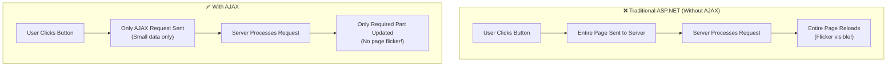

| Feature | Traditional | AJAX |
|---------|------------|------|
| Page Refresh | Full page reload | Partial update only |
| Speed | Slow | Fast |
| User Experience | Poor (flicker) | Smooth |
| Data Transfer | Entire page | Only needed data |
| Server Load | High | Low |

---

## AJAX Architecture

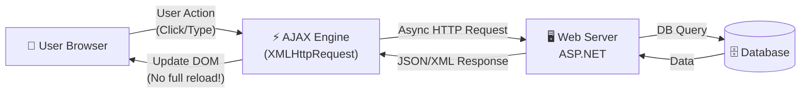

---

## AJAX Working Process

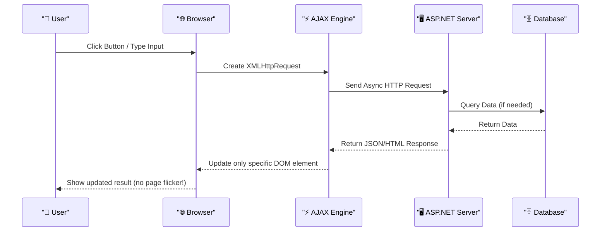

---

## Why AJAX is Needed?

**Real Life Example — Google Search:**

Without AJAX:
```
User types "India" → Press Search
         ↓
Entire Google page reloads
         ↓
Shows suggestions (slow, flickering)
```

With AJAX (actual Google behavior):
```
User types "I" → "In" → "Ind"
         ↓
Instant suggestions appear below
(NO page reload — smooth experience!)
```

---

## Advantages of AJAX

| # | Advantage | Explanation |
|---|-----------|-------------|
| 1 | **Faster Response** | Only required data transferred, not entire page |
| 2 | **Better UX** | No full page refresh = no flicker |
| 3 | **Reduced Server Load** | Less data sent per request |
| 4 | **Bandwidth Saving** | Partial content exchange |
| 5 | **Interactive Apps** | Like Gmail, Facebook, Google Maps |

**Real World AJAX Examples:**
- 🔍 **Google Search** — instant suggestions as you type
- 📧 **Gmail** — auto-save drafts without refresh
- 👍 **Facebook** — like/comment without page reload
- 🛒 **Amazon** — add to cart without reload
- 📍 **Google Maps** — pan/zoom without full reload

## Disadvantages of AJAX

| # | Disadvantage | Explanation |
|---|-------------|-------------|
| 1 | **JavaScript Dependency** | If JS disabled, AJAX won't work |
| 2 | **Complex Development** | Async programming is harder to understand |
| 3 | **Debugging Difficulty** | AJAX requests harder to trace/debug |
| 4 | **Browser History Issue** | Back button may not work as expected |
| 5 | **SEO Challenges** | Search engines may not index AJAX content |

---

## AJAX Components in ASP.NET

ASP.NET provides 4 built-in AJAX controls:

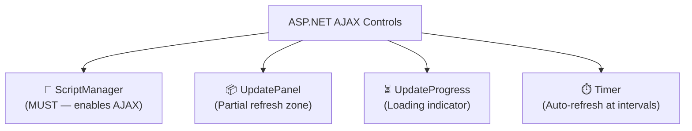

---

## 1. ScriptManager Control

**The heart of AJAX in ASP.NET** — must be placed on every AJAX page.

**What it does:**
- Loads AJAX JavaScript libraries automatically
- Manages partial page updates
- Enables communication between browser and server
- **Without ScriptManager → AJAX controls won't work!**

**Syntax:**
```aspx
<asp:ScriptManager
    ID="ScriptManager1"
    runat="server"
    EnablePageMethods="true"
    EnablePartialRendering="true">
</asp:ScriptManager>
```

**Rule:** Only **ONE** ScriptManager per page. Place it at the top of the form.

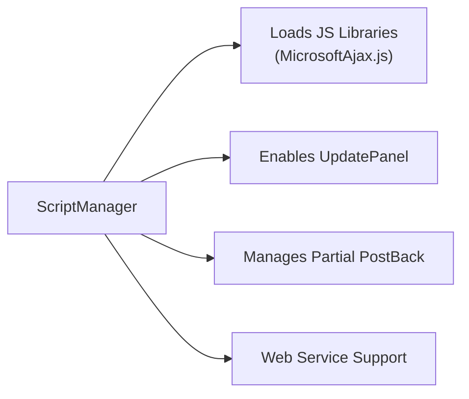

---

## 2. UpdatePanel Control

Defines the **zone on the page that will refresh partially** — without refreshing the rest.

**How it works:**
- Controls inside UpdatePanel → update via AJAX
- Controls outside UpdatePanel → NOT affected

**Syntax:**
```aspx
<asp:UpdatePanel ID="UpdatePanel1" runat="server">
    <ContentTemplate>
        <!-- Controls here update without full page refresh -->
        <asp:Label  ID="lblTime" runat="server"/>
        <br/>
        <asp:Button ID="btnTime" runat="server"
                    Text="Get Time" OnClick="btnTime_Click"/>
    </ContentTemplate>
</asp:UpdatePanel>
```

**Working:**
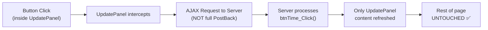

**Without AJAX vs With AJAX UpdatePanel:**

| | Without AJAX | With UpdatePanel |
|--|-------------|-----------------|
| Click Button | Entire page reloads | Only panel content updates |
| Page flicker | YES | NO |
| Data sent | Entire page | Only panel data |

---

## 3. UpdateProgress Control

Shows a **loading message/spinner** while AJAX request is processing.

**Syntax:**
```aspx
<asp:UpdateProgress ID="UpdateProgress1" runat="server"
                    AssociatedUpdatePanelID="UpdatePanel1">
    <ProgressTemplate>
        <div style="color:blue;">
            ⏳ Please Wait... Loading...
        </div>
    </ProgressTemplate>
</asp:UpdateProgress>
```

**Working:**
```
User Clicks Button
       ↓
UpdateProgress shows "Loading..."
       ↓
Server processes request
       ↓
Response received → UpdateProgress hides automatically
       ↓
UpdatePanel content updated
```

---

## 4. Timer Control

Automatically sends AJAX requests at **regular time intervals** — without user clicking anything.

**Use Cases:**
- Live clocks and countdowns
- Stock market price updates
- Auto-refresh news feed
- Chat application message polling
- Server status monitoring

**Syntax:**
```aspx
<asp:Timer ID="Timer1" runat="server"
           Interval="5000"
           OnTick="Timer1_Tick">
</asp:Timer>
```

> `Interval="5000"` = fires every 5000 milliseconds = every **5 seconds**

**Code-Behind:**
```csharp
protected void Timer1_Tick(object sender, EventArgs e)
{
    // Fires every 5 seconds automatically!
    lblTime.Text = "Current Time: " + DateTime.Now.ToString("hh:mm:ss tt");
    lblDate.Text = "Date: " + DateTime.Now.ToString("dd/MM/yyyy");
}
```

**Timer Working:**
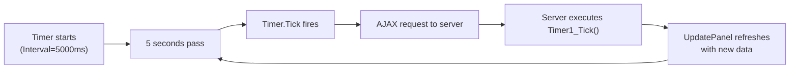

---

## Setting Up AJAX in ASP.NET — Step by Step

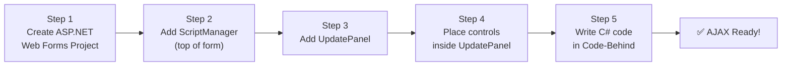

---

## Complete AJAX Example — Show Current Time

### ASPX Page:
```aspx
<%@ Page Language="C#" AutoEventWireup="true" CodeBehind="Default.aspx.cs" Inherits="MyApp.Default" %>

<!DOCTYPE html>
<html>
<head>
    <title>AJAX Demo</title>
</head>
<body>
    <form id="form1" runat="server">

        <!-- STEP 1: ScriptManager (mandatory!) -->
        <asp:ScriptManager ID="ScriptManager1" runat="server"/>

        <h2>AJAX Time Example</h2>

        <!-- STEP 2: UpdatePanel = AJAX zone -->
        <asp:UpdatePanel ID="UpdatePanel1" runat="server">
            <ContentTemplate>

                Current Time:
                <asp:Label ID="lblTime" runat="server"
                           ForeColor="Blue" Font-Bold="true"/>
                <br/><br/>

                <asp:Button ID="btnTime" runat="server"
                            Text="🕐 Get Current Time"
                            OnClick="btnTime_Click"/>

            </ContentTemplate>
        </asp:UpdatePanel>

        <!-- STEP 3: UpdateProgress = loading indicator -->
        <asp:UpdateProgress ID="UpdateProgress1" runat="server">
            <ProgressTemplate>
                <span style="color:orange;">⏳ Loading...</span>
            </ProgressTemplate>
        </asp:UpdateProgress>

        <p>This paragraph is OUTSIDE UpdatePanel — it will NOT refresh!</p>

    </form>
</body>
</html>
```

### Code-Behind:
```csharp
protected void btnTime_Click(object sender, EventArgs e)
{
    // Only lblTime gets updated — no full page refresh!
    lblTime.Text = DateTime.Now.ToString("dd/MM/yyyy hh:mm:ss tt");
}
```

**Execution Flow:**
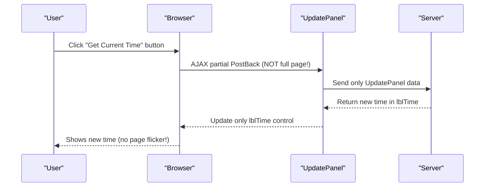

---

## ASP.NET AJAX Control Toolkit

### What is AJAX Control Toolkit?

AJAX Control Toolkit is a **collection of ready-made, rich AJAX controls** provided by Microsoft. It extends ASP.NET AJAX functionality with advanced UI components.

**Installing via NuGet:**
```powershell
Install-Package AjaxControlToolkit
```

**Register in ASPX:**
```aspx
<%@ Register Assembly="AjaxControlToolkit"
             Namespace="AjaxControlToolkit"
             TagPrefix="ajaxToolkit" %>
```

### Toolkit Components

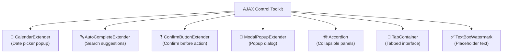

---

## Toolkit Control 1: CalendarExtender

**Purpose:** Attach a calendar date-picker popup to any TextBox.

**Without CalendarExtender:** User manually types date (error-prone: wrong formats).

**With CalendarExtender:** User clicks TextBox → Calendar popup appears → Click date → Auto-filled!

```aspx
Date of Birth:
<asp:TextBox ID="txtDOB" runat="server" ReadOnly="true"/>

<ajaxToolkit:CalendarExtender
    ID="CalendarExtender1"
    runat="server"
    TargetControlID="txtDOB"
    Format="dd/MM/yyyy"
    PopupPosition="BottomLeft">
</ajaxToolkit:CalendarExtender>
```

**Working:**
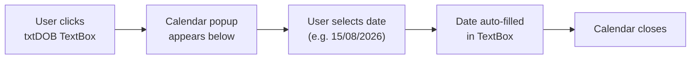

---

## Toolkit Control 2: AutoCompleteExtender

**Purpose:** Show live search suggestions as user types (like Google search).

**How it works:**
1. User types in TextBox
2. After 2+ characters, AJAX request goes to server
3. Server returns matching suggestions
4. Dropdown shows suggestions
5. User selects one

```aspx
Search:
<asp:TextBox ID="txtSearch" runat="server"/>

<ajaxToolkit:AutoCompleteExtender
    ID="AutoCompleteExtender1"
    runat="server"
    TargetControlID="txtSearch"
    ServicePath="~/AutoComplete.asmx"
    ServiceMethod="GetSuggestions"
    MinimumPrefixLength="2"
    CompletionInterval="500"
    CompletionSetCount="10">
</ajaxToolkit:AutoCompleteExtender>
```

**Web Service Code (AutoComplete.asmx.cs):**
```csharp
[WebMethod]
public string[] GetSuggestions(string prefixText, int count)
{
    // Fetch from database
    List<string> suggestions = new List<string>();
    string query = "SELECT Name FROM Students WHERE Name LIKE @prefix";

    using (SqlConnection conn = new SqlConnection(connStr))
    {
        SqlCommand cmd = new SqlCommand(query, conn);
        cmd.Parameters.AddWithValue("@prefix", prefixText + "%");
        conn.Open();
        SqlDataReader dr = cmd.ExecuteReader();
        while (dr.Read())
            suggestions.Add(dr["Name"].ToString());
    }
    return suggestions.ToArray();
}
```

**Working:**
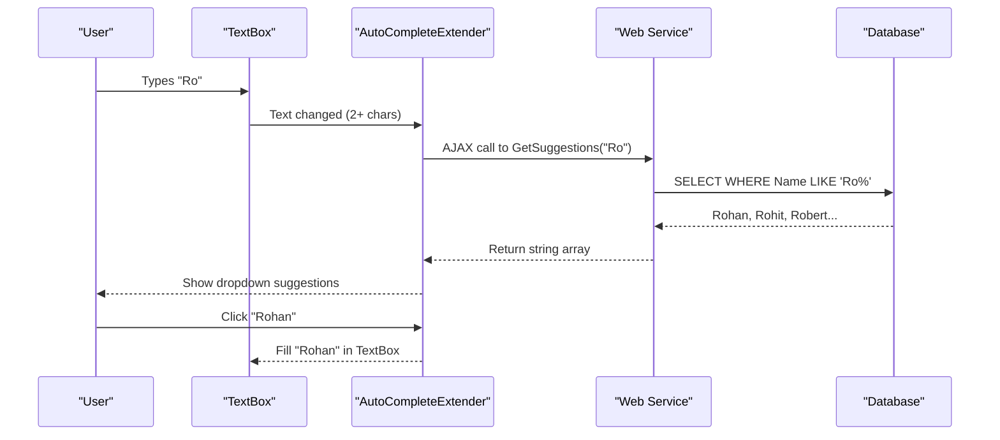

---

## Toolkit Control 3: ConfirmButtonExtender

**Purpose:** Show a confirmation dialog before executing a button action.

**Without ConfirmButtonExtender:** User accidentally clicks Delete → Record gone!

**With ConfirmButtonExtender:** Confirmation dialog appears → User must confirm → Safer!

```aspx
<asp:Button ID="btnDelete" runat="server"
            Text="🗑️ Delete Record"
            OnClick="btnDelete_Click"/>

<ajaxToolkit:ConfirmButtonExtender
    ID="ConfirmButtonExtender1"
    runat="server"
    TargetControlID="btnDelete"
    ConfirmText="⚠️ Are you sure you want to delete this record?
                 This action cannot be undone!">
</ajaxToolkit:ConfirmButtonExtender>
```

**Code-Behind:**
```csharp
protected void btnDelete_Click(object sender, EventArgs e)
{
    // Only executes if user clicked OK in confirmation dialog
    DeleteRecord(Convert.ToInt32(ViewState["StudentID"]));
    lblMessage.Text = "✅ Record deleted successfully!";
}
```

**Working:**
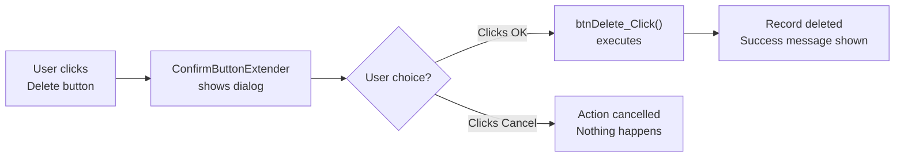

---

## Toolkit Control 4: ModalPopupExtender

**Purpose:** Show a modal popup dialog window over the current page.

**Use Cases:** Login form popup, image preview, confirmation dialog, terms & conditions.

```aspx
<!-- Trigger button -->
<asp:Button ID="btnShowLogin" runat="server"
            Text="🔐 Login" />

<!-- Hidden panel that becomes popup -->
<asp:Panel ID="pnlLoginPopup" runat="server"
           Style="display:none; background:white; padding:20px;
                  border:2px solid #007bff; border-radius:10px;">
    <h3>Login</h3>
    Username: <asp:TextBox ID="txtUser" runat="server"/><br/><br/>
    Password: <asp:TextBox ID="txtPass" runat="server" TextMode="Password"/><br/><br/>
    <asp:Button ID="btnLogin"  runat="server" Text="Login" OnClick="btnLogin_Click"/>
    <asp:Button ID="btnClose"  runat="server" Text="Close"/>
</asp:Panel>

<!-- ModalPopupExtender -->
<ajaxToolkit:ModalPopupExtender
    ID="ModalPopupExtender1"
    runat="server"
    TargetControlID="btnShowLogin"
    PopupControlID="pnlLoginPopup"
    CancelControlID="btnClose"
    BackgroundCssClass="modalBackground">
</ajaxToolkit:ModalPopupExtender>
```

**Working:**
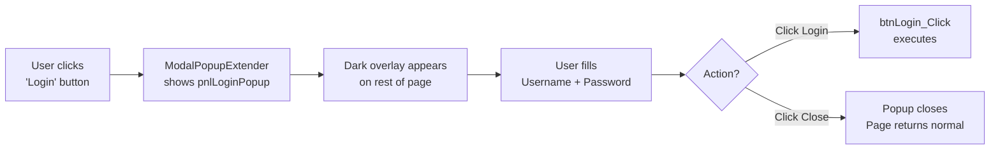

---

## AJAX Toolkit Benefits Summary

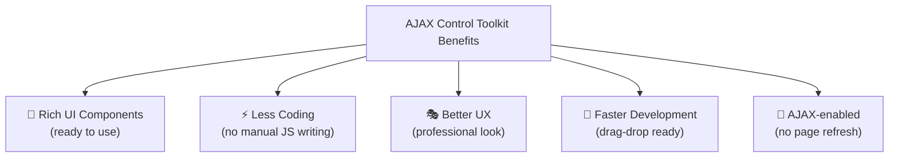

---

# 2. State Management in ASP.NET

## What is State?

**HTTP is a Stateless Protocol.** This means:
- The server processes each request independently
- After sending a response, the server **forgets** who made the request
- The server does NOT remember previous requests

**This creates a problem!**

```
Request 1: User logs in as "Rohan"
Request 2: User opens Profile page
           → Server asks: "Who are you??" (forgot!)
```

**State** is the **data/information that needs to be preserved** between multiple requests.

> **Definition:** State is the information or data that is preserved across multiple HTTP requests during a user's interaction with a web application.

---

## Real Life Analogy

```
Shopping Cart Analogy:

Page 1: Add Laptop to cart  → Cart: [Laptop]
Page 2: Add Mouse to cart   → Cart: [Laptop, Mouse]
Page 3: Go to Checkout      → Cart should still have [Laptop, Mouse]

Without State Management:
  Page 3: Cart = EMPTY! (Server forgot!)

With State Management:
  Page 3: Cart = [Laptop, Mouse] ✅
```

---

## Why is State Required in ASP.NET?

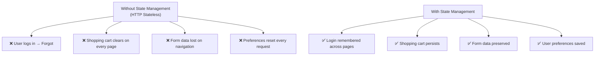

**Practical Needs:**

| Need | Why State Required |
|------|-------------------|
| User Authentication | Remember who is logged in |
| Shopping Cart | Keep selected items across pages |
| Wizard Forms | Preserve data across multi-step forms |
| Personalization | Remember theme, language, settings |
| User Tracking | Track user activity and page visits |

---

## Types of State Management

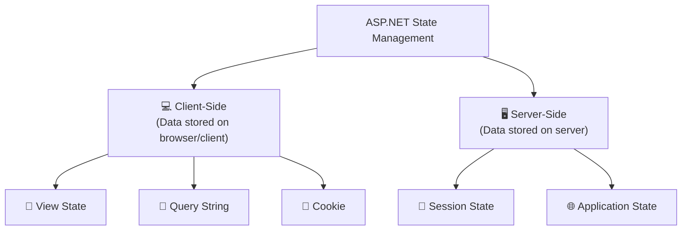

---

## Client-Side State Management

**Definition:** State data is stored **on the user's browser/client machine**. Server does NOT hold the data.

**Architecture:**
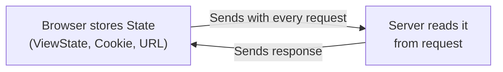

**Advantages:**
- Reduces server memory usage
- Fast access (no server DB query needed)
- Works well for small, non-sensitive data

**Disadvantages:**
- Limited storage capacity
- Security risk (user can see/modify data)
- Depends on browser settings

---

## Client-Side Technique 1: ViewState

**Definition:** ViewState stores page and control values in a **hidden HTML field** (`__VIEWSTATE`) on the same page. It preserves control values between PostBacks.

**How ViewState works:**
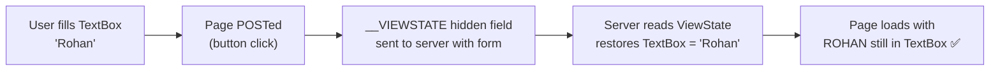

**Generated HTML (ViewState hidden field):**
```html
<input type="hidden" name="__VIEWSTATE"
       value="dDwtMTM4NTMwMDczO3Q8O2w8aTwx..." />
```

**Example — Counter using ViewState:**

**ASPX:**
```aspx
<asp:Label  ID="lblCount" runat="server" Text="0"/>
<br/>
<asp:Button ID="btnIncrement" runat="server"
            Text="Click to Count" OnClick="btnIncrement_Click"/>
```

**Code-Behind:**
```csharp
protected void Page_Load(object sender, EventArgs e)
{
    // Initialize ViewState counter on first load
    if (!IsPostBack)
    {
        ViewState["Counter"] = 0;
    }
}

protected void btnIncrement_Click(object sender, EventArgs e)
{
    // Read from ViewState, increment, store back
    int count = Convert.ToInt32(ViewState["Counter"]);
    count++;
    ViewState["Counter"] = count;
    lblCount.Text = "Count: " + count.ToString();
}
```

**ViewState Life Cycle:**
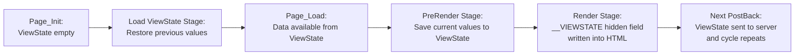

**Advantages:**
- Automatic — no extra code needed
- Preserves control values across PostBacks
- Works on same page

**Disadvantages:**
- Increases page size (large base64 string in HTML)
- Works only on same page (not across pages)
- Can be decoded (not for sensitive data)

**Disable ViewState (when not needed):**
```aspx
<asp:GridView EnableViewState="false" .../>
```

---

## Client-Side Technique 2: Query String

**Definition:** Query String stores data in the **URL itself**, appended after a `?` symbol.

**URL Format:**
```
Page2.aspx?paramName=value&param2=value2
```

**Example URLs:**
```
Profile.aspx?id=101
Student.aspx?id=201&name=Rohan&course=BCA
Search.aspx?query=ASP.NET&page=2
```

**Flow Diagram:**
```mermaid
flowchart LR
    A["Page1.aspx"] -->|"Response.Redirect\n('Page2.aspx?id=101')"| B["URL contains: ?id=101"]
    B -->|"Browser navigates"| C["Page2.aspx loads"]
    C --> D["Request.QueryString['id']\nreads '101'"]
    D --> E["Show student with ID 101"]
```

**Sending Data (Page1.aspx.cs):**
```csharp
// Simple redirect with query string
Response.Redirect("Profile.aspx?id=101");

// Multiple parameters
Response.Redirect("Student.aspx?id=201&name=Rohan&course=BCA");

// Dynamic values
int studentID = 305;
string studentName = "Rohan Patel";
Response.Redirect($"Profile.aspx?id={studentID}&name={studentName}");
```

**Receiving Data (Profile.aspx.cs):**
```csharp
protected void Page_Load(object sender, EventArgs e)
{
    // Read query string values
    string id   = Request.QueryString["id"];
    string name = Request.QueryString["name"];

    // Null check is important!
    if (id != null && name != null)
    {
        lblStudentID.Text   = "ID: " + id;
        lblStudentName.Text = "Name: " + name;

        // Load data from DB using id
        LoadStudentData(Convert.ToInt32(id));
    }
    else
    {
        Response.Redirect("Default.aspx"); // invalid access
    }
}
```

**Advantages:**
- Simple, easy to implement
- Works across pages (page navigation)
- Bookmarkable URLs (user can save the URL)
- No server memory needed

**Disadvantages:**
- **Visible in URL** — anyone can see and modify!
- Limited size (~2048 characters max)
- Not secure (no encryption)
- Cannot pass objects, only strings

> **Never store sensitive data (password, user role etc.) in Query String!**

---

## Client-Side Technique 3: Cookie

**Definition:** A Cookie is a **small text file** stored on the **user's browser/computer** by the web server. It can be sent back with every subsequent request.

**Cookie Analogy:**
```
Like a membership card:
- Restaurant gives you a card (server gives cookie)
- Next visit, show card (browser sends cookie with request)
- Restaurant knows you are a member (server reads cookie)
```

**Types of Cookies:**

```mermaid
flowchart TB
    A["Cookies"] --> B["🕐 Session Cookie\n(Deleted when browser closes)"]
    A --> C["📅 Persistent Cookie\n(Survives browser close\nuntil expiry date)"]
```

| Feature | Session Cookie | Persistent Cookie |
|---------|---------------|------------------|
| Storage | Browser memory | Client hard disk |
| Survives close | NO | YES |
| Expiry | When browser closes | Set expiry date |
| Use case | Login session | Remember Me, preferences |

**Create Cookie:**
```csharp
// Simple cookie (session cookie - deleted on browser close)
Response.Cookies["UserName"].Value = "Rohan";

// Persistent cookie (survives 30 days)
HttpCookie myCookie = new HttpCookie("UserPrefs");
myCookie["UserName"] = "Rohan";
myCookie["Theme"]    = "DarkMode";
myCookie["Language"] = "English";
myCookie.Expires     = DateTime.Now.AddDays(30); // Expires in 30 days
Response.Cookies.Add(myCookie);
```

**Read Cookie:**
```csharp
protected void Page_Load(object sender, EventArgs e)
{
    // Check if cookie exists
    if (Request.Cookies["UserPrefs"] != null)
    {
        string userName = Request.Cookies["UserPrefs"]["UserName"];
        string theme    = Request.Cookies["UserPrefs"]["Theme"];

        lblWelcome.Text = "Welcome back, " + userName + "!";
        ApplyTheme(theme);
    }
    else
    {
        // First visit — no cookie
        lblWelcome.Text = "Welcome, new visitor!";
    }
}
```

**Delete Cookie:**
```csharp
// Delete by setting expiry to past date
HttpCookie expiredCookie = new HttpCookie("UserPrefs");
expiredCookie.Expires = DateTime.Now.AddDays(-1); // Yesterday = expired
Response.Cookies.Add(expiredCookie);
```

**Cookie Working:**
```mermaid
sequenceDiagram
    participant B as "Browser"
    participant S as "ASP.NET Server"

    B->>S: First Visit (no cookie)
    S-->>B: Set-Cookie: UserName=Rohan; Expires=...
    Note over B: Cookie saved in browser

    B->>S: Next Request → sends Cookie: UserName=Rohan
    S-->>B: "Welcome back, Rohan!"

    B->>S: Another Request → still sends cookie
    S-->>B: Knows who the user is ✅
```

**Advantages:**
- Persists across browser sessions (persistent cookie)
- Works across all pages of the website
- Good for preferences and "Remember Me"

**Disadvantages:**
- User can **disable cookies** in browser settings
- Size limit (~4KB per cookie)
- Security concern — can be stolen (use HTTPS!)
- Privacy issues (user can delete them)

---

## Server-Side State Management

**Definition:** State data is stored **on the server** rather than the browser. Server holds the data in memory or database.

**Architecture:**
```mermaid
flowchart LR
    A["Browser"] -->|"HTTP Request\n(with Session ID)"| B["Server\n(holds state data\nin memory)"]
    B -->|"Reads session data\nfor THIS user"| C["Process Request"]
    C -->|"Response"| A
```

**Advantages:**
- More **secure** (data not in browser)
- Can store **large amounts** of data
- Cannot be modified by user
- Works with complex objects (not just strings)

**Disadvantages:**
- Uses **server memory** (scalability concern)
- Higher server load with many users

---

## Server-Side Technique 1: Session State

**Definition:** Session State stores **user-specific** data on the server. Each user gets their own **separate session**.

**Session ID:**
- When user first visits, server creates a unique Session ID
- Session ID is sent to browser (as cookie or URL parameter)
- Browser sends Session ID with every request
- Server uses Session ID to find that user's data

**Architecture:**
```mermaid
flowchart LR
    A["User A\nSessionID=ABC"] --> B["Server Memory"]
    C["User B\nSessionID=XYZ"] --> B
    D["User C\nSessionID=PQR"] --> B

    B --> E["Session_ABC:\n{UserName=Rohan\nCart=[Laptop]}"]
    B --> F["Session_XYZ:\n{UserName=Priya\nCart=[Phone]}"]
    B --> G["Session_PQR:\n{UserName=Raj\nCart=[Tablet]}"]
```

**Store Session:**
```csharp
// After successful login
protected void btnLogin_Click(object sender, EventArgs e)
{
    if (ValidateUser(txtUser.Text, txtPass.Text))
    {
        Session["UserName"]  = txtUser.Text;
        Session["UserID"]    = GetUserID(txtUser.Text);
        Session["UserRole"]  = "Admin";
        Session["LoginTime"] = DateTime.Now;

        Response.Redirect("Dashboard.aspx");
    }
    else
    {
        lblError.Text = "Invalid credentials!";
    }
}
```

**Read Session:**
```csharp
protected void Page_Load(object sender, EventArgs e)
{
    // Check if user is logged in
    if (Session["UserName"] == null)
    {
        // Not logged in → redirect to login
        Response.Redirect("Login.aspx");
        return;
    }

    // User is logged in
    string userName = Session["UserName"].ToString();
    string role     = Session["UserRole"].ToString();

    lblWelcome.Text = "Welcome, " + userName + "! Role: " + role;
}
```

**Remove Specific Session:**
```csharp
Session.Remove("CartItems");     // Remove one key
```

**Clear All Sessions:**
```csharp
Session.Clear();       // Clear all values but keep session alive
Session.Abandon();     // Destroy entire session (used at logout)
```

**Logout Example:**
```csharp
protected void btnLogout_Click(object sender, EventArgs e)
{
    Session.Abandon();             // Destroy session
    Response.Redirect("Login.aspx");
}
```

**Session Life Cycle:**
```mermaid
flowchart LR
    A["User Opens Browser\n+ Visits Site"] --> B["Server creates\nnew Session\n(unique SessionID)"]
    B --> C["User navigates\nmultiple pages\n(Session persists)"]
    C --> D{"Session ends?"}
    D -->|"User logs out\n(Session.Abandon)"| E["Session Destroyed"]
    D -->|"20 min no activity\n(timeout)"| E
    D -->|"Browser closed"| E
```

**Set Session Timeout (web.config):**
```xml
<configuration>
  <system.web>
    <sessionState timeout="30"/>  <!-- 30 minutes timeout -->
  </system.web>
</configuration>
```

**Advantages:**
- User-specific (private per user)
- Secure (stored on server, not in browser)
- Supports complex objects (not just strings)
- Not visible to user

**Disadvantages:**
- Uses server memory (1 session per user = can be a lot!)
- Can affect performance with many concurrent users
- Lost if server restarts (unless using SQL/Redis storage)

---

## Server-Side Technique 2: Application State

**Definition:** Application State stores data **shared by ALL users** of the entire application. Single copy — shared globally.

**Architecture:**
```mermaid
flowchart LR
    A["User A"] --> D["Application State\n(Shared by Everyone)"]
    B["User B"] --> D
    C["User C"] --> D

    D --> E["VisitorCount = 1547\nCompanyName = 'ABC Ltd'\nAppVersion = '2.5'"]
```

**Use Cases:**
- Website visitor counter
- Global application settings
- Company name or logo URL
- Application start time
- Cached data shared across all users

**Store Application Data:**
```csharp
// Usually done in Global.asax
void Application_Start(object sender, EventArgs e)
{
    Application["CompanyName"] = "ABC Pvt Ltd";
    Application["AppVersion"]  = "2.5.0";
    Application["VisitorCount"] = 0;
    Application["AppStartTime"] = DateTime.Now;
}

void Session_Start(object sender, EventArgs e)
{
    // Increment visitor count for each new user
    Application.Lock();   // Prevent concurrent modification!
    Application["VisitorCount"] =
        Convert.ToInt32(Application["VisitorCount"]) + 1;
    Application.UnLock();
}
```

**Read Application Data:**
```csharp
protected void Page_Load(object sender, EventArgs e)
{
    lblCompany.Text = Application["CompanyName"].ToString();
    lblVisitors.Text = "Total Visitors: " +
                       Application["VisitorCount"].ToString();
}
```

> **Important:** Always use `Application.Lock()` and `Application.UnLock()` when modifying Application State to prevent race conditions (multiple users updating simultaneously).

**Application State Life Cycle:**
```mermaid
flowchart LR
    A["Application Starts\n(Application_Start)"] --> B["Application State\nCreated + Initialized"]
    B --> C["All users read/write\nshared data"]
    C --> D{"Application ends?"}
    D -->|"Server restart / IIS reset"| E["Application State\nDestroyed"]
    D -->|"Server running"| C
```

**Advantages:**
- Shared by all users (global data)
- Easy and fast access
- Good for global settings/counters

**Disadvantages:**
- Not user-specific (everyone sees same data)
- Concurrent access needs locking
- Lost on application restart
- Not suitable for sensitive user data

---

## State Management Comparison

| Technique | Storage | Scope | Capacity | Security | Survives Restart |
|-----------|---------|-------|----------|----------|-----------------|
| **ViewState** | Browser (hidden field) | Same page | ~limited | Medium | N/A (per page) |
| **Query String** | URL | Cross-page | Very small | Low (visible) | Yes (in URL) |
| **Cookie** | Browser (client) | Cross-page | ~4KB | Medium | Persistent possible |
| **Session** | Server memory | Per user | Large | High | No (default) |
| **Application** | Server memory | All users | Large | High | No (resets) |

```mermaid
flowchart TB
    A["ASP.NET State Management"] --> B["Client Side"]
    A --> C["Server Side"]

    B --> D["ViewState\n📄 Hidden Field\nSame Page Only"]
    B --> E["Query String\n🔗 In URL\nCross-Page\nNot Secure"]
    B --> F["Cookie\n🍪 Browser Storage\nCross-Page\nPersistent Option"]

    C --> G["Session\n👤 Server Memory\nPer User\nSecure"]
    C --> H["Application\n🌐 Server Memory\nAll Users\nGlobal Data"]
```

---

# 3. Master Page in ASP.NET

## What is Master Page?

**Problem:** In a website with 100 pages, every page has:
- Same Header (logo, company name)
- Same Navigation Menu
- Same Footer (copyright, links)

Without Master Page:
```
Copy-paste Header code on all 100 pages
Copy-paste Footer code on all 100 pages
         ↓
When menu changes → Update 100 pages manually!
         ↓
Very difficult, time consuming, error-prone!
```

**Solution — Master Page:**
```
Create ONE Master Page with common layout
         ↓
All 100 pages use this master template
         ↓
When menu changes → Update ONLY Master Page
         ↓
All 100 pages automatically updated! ✅
```

---

## Definition

> **Master Page** is a special ASP.NET page (`.master` extension) that defines the **common layout template** for multiple web pages. Content pages inherit this layout and only provide their own unique content.

**Simple formula:**
```
Master Page = Website Template
Content Page = Pages using that template
```

---

## Master Page Architecture

```mermaid
flowchart TB
    A["📋 Site.master\n(Master Page Template)"] --> B["Common Header\n(Logo + Company Name)"]
    A --> C["Navigation Menu\n(Home, About, Contact...)"]
    A --> D["📦 ContentPlaceHolder\n(Dynamic area — different per page)"]
    A --> E["Common Footer\n(Copyright, Links)"]

    D --> F["Home.aspx content"]
    D --> G["About.aspx content"]
    D --> H["Contact.aspx content"]
    D --> I["Services.aspx content"]
```

**Multiple Content Pages using ONE Master:**
```mermaid
flowchart LR
    MP["Site.master\n(One template)"] --> H["Home.aspx"]
    MP --> A["About.aspx"]
    MP --> C["Contact.aspx"]
    MP --> S["Services.aspx"]
    MP --> P["Products.aspx"]

    H --> R1["Full rendered page\nwith common layout"]
    A --> R2["Full rendered page\nwith common layout"]
```

---

## File Extension

```
Master Page file: Site.master
Content Page file: Home.aspx (with MasterPageFile="~/Site.master")
```

---

## ContentPlaceHolder Control

**ContentPlaceHolder** is a special control placed in the Master Page. It marks the **area where content pages insert their own unique content**.

```mermaid
flowchart TB
    A["Master Page HTML"] --> B["Header (fixed)"]
    A --> C["Navigation (fixed)"]
    A --> D["ContentPlaceHolder\n(Dynamic slot for page content)"]
    A --> E["Footer (fixed)"]

    F["Home.aspx"] -->|"fills this slot"| D
    G["About.aspx"] -->|"fills this slot"| D
```

---

## Creating a Master Page — Step by Step

### Step 1: Create Master Page (Site.master)

```aspx
<%@ Master Language="C#" AutoEventWireup="true"
           CodeBehind="Site.master.cs" Inherits="MyApp.SiteMaster" %>

<!DOCTYPE html>
<html>
<head runat="server">
    <title>My College Website</title>
    <link rel="stylesheet" href="~/Content/bootstrap.min.css"/>
    <link rel="stylesheet" href="~/Content/Site.css"/>
</head>
<body>
    <form id="form1" runat="server">

        <!-- ===== HEADER (same on every page) ===== -->
        <div class="header" style="background:#003366; color:white; padding:15px;">
            <h1>🎓 ABC College of Technology</h1>
            <p>Excellence in Education Since 1995</p>
        </div>

        <!-- ===== NAVIGATION MENU (same on every page) ===== -->
        <nav style="background:#0066cc; padding:10px;">
            <a href="Home.aspx"    style="color:white; margin:10px;">🏠 Home</a>
            <a href="About.aspx"   style="color:white; margin:10px;">ℹ️ About</a>
            <a href="Courses.aspx" style="color:white; margin:10px;">📚 Courses</a>
            <a href="Contact.aspx" style="color:white; margin:10px;">📞 Contact</a>
        </nav>

        <!-- ===== CONTENT PLACEHOLDER (changes per page) ===== -->
        <div style="padding:20px; min-height:400px;">
            <asp:ContentPlaceHolder ID="MainContent" runat="server">
                <!-- Each content page fills this area -->
            </asp:ContentPlaceHolder>
        </div>

        <!-- ===== FOOTER (same on every page) ===== -->
        <div style="background:#003366; color:white; padding:10px; text-align:center;">
            <p>© 2026 ABC College. All Rights Reserved.</p>
        </div>

    </form>
</body>
</html>
```

### Step 2: Create Content Page (Home.aspx)

```aspx
<%@ Page Language="C#"
         MasterPageFile="~/Site.master"
         AutoEventWireup="true"
         CodeBehind="Home.aspx.cs"
         Inherits="MyApp.Home" %>

<asp:Content ID="Content1"
             ContentPlaceHolderID="MainContent"
             runat="server">

    <!-- Only the UNIQUE content for Home page goes here! -->
    <h2>Welcome to ABC College!</h2>
    <p>We offer BCA, MCA, B.Tech, M.Tech courses.</p>

    <div style="background:#e8f4fd; padding:15px; border-radius:8px;">
        <h3>📢 Latest Announcements</h3>
        <ul>
            <li>Admission Open for 2026-27</li>
            <li>Exam Schedule Published</li>
            <li>Annual Sports Day on 15th August</li>
        </ul>
    </div>

</asp:Content>
```

### Step 3: Create Another Content Page (About.aspx)

```aspx
<%@ Page Language="C#"
         MasterPageFile="~/Site.master"
         AutoEventWireup="true"
         CodeBehind="About.aspx.cs"
         Inherits="MyApp.About" %>

<asp:Content ID="Content1"
             ContentPlaceHolderID="MainContent"
             runat="server">

    <!-- Different content for About page -->
    <h2>About Our College</h2>
    <p>ABC College was established in 1995...</p>
    <p>We have 50+ experienced faculty members.</p>

</asp:Content>
```

**Result — What user sees:**

```
+----------------------------------------+
| 🎓 ABC College of Technology            |  ← Header (from Site.master)
|   Excellence in Education Since 1995   |
+----------------------------------------+
| 🏠 Home | ℹ️ About | 📚 Courses | 📞 Contact| ← Nav (from Site.master)
+----------------------------------------+
|                                        |
| Welcome to ABC College!                |  ← Content (from Home.aspx)
| We offer BCA, MCA, B.Tech, M.Tech...  |
| 📢 Latest Announcements:               |
|   • Admission Open for 2026-27         |
|                                        |
+----------------------------------------+
| © 2026 ABC College. All Rights Reserved| ← Footer (from Site.master)
+----------------------------------------+
```

---

## Master Page Working — Internal Process

```mermaid
sequenceDiagram
    participant B as "Browser"
    participant CP as "Home.aspx (Content Page)"
    participant MP as "Site.master (Master Page)"
    participant R as "ASP.NET Runtime"

    B->>CP: Request Home.aspx
    CP->>MP: Load Site.master template
    MP-->>R: Provide common layout (Header, Nav, Footer)
    CP-->>R: Provide page-specific content (Home content)
    R->>R: Merge: Master layout + Home content
    R-->>B: Single complete HTML page sent
```

**Internal Merge:**
```mermaid
flowchart LR
    A["Site.master\n(Header+Nav+Footer)"] --> C["Merge Process\n(ASP.NET Runtime)"]
    B["Home.aspx\n(Only home content)"] --> C
    C --> D["Final HTML Page\n(Header+Nav+HomeContent+Footer)"]
    D --> E["Sent to Browser"]
```

---

## Requirement of Master Page in ASP.NET

| # | Requirement | Explanation |
|---|-------------|-------------|
| 1 | **Common Layout** | Same header/footer on all pages automatically |
| 2 | **Code Reusability** | Write layout code once, reuse on 100s of pages |
| 3 | **Easy Maintenance** | Change master = all pages updated automatically |
| 4 | **Consistent UI** | Uniform look and feel across entire website |
| 5 | **Faster Development** | Focus only on page content, not layout |
| 6 | **Better Management** | Large websites (1000+ pages) easy to manage |
| 7 | **Professional Design** | Standard structure like real websites |

---

## Advantages and Disadvantages

| Advantages | Disadvantages |
|-----------|--------------|
| ✅ Code Reusability | ❌ Slightly complex for beginners |
| ✅ Easy Maintenance | ❌ Content pages depend on master |
| ✅ Consistent Design | ❌ Some pages may need different layouts |
| ✅ Faster Development | ❌ Nested masters can be complex |
| ✅ Reduced Coding | |
| ✅ Professional Layout | |

---

## Master Page Life Cycle

```mermaid
flowchart LR
    A["Browser\nRequests Page"] --> B["Content Page\n(Home.aspx) created"]
    B --> C["Master Page\n(Site.master) loaded"]
    C --> D["Master Page controls\ninitialized (Init)"]
    D --> E["Content Page controls\ninitialized (Init)"]
    E --> F["Page_Load events\nfire (Master first, then Content)"]
    F --> G["Both merged\nHTML generated"]
    G --> H["HTML sent\nto Browser"]
```

---

# 4. CSS3

## What is CSS?

```
CSS = Cascading Style Sheets
```

CSS is used to control the **appearance and layout** of HTML web pages. HTML creates structure, CSS makes it attractive.

---

## What is CSS3?

**CSS3** is the latest major version of CSS with advanced features for creating modern, responsive, and interactive websites.

**Evolution:**
```mermaid
flowchart LR
    A["CSS1\n(1996)"] --> B["CSS2\n(1998)"]
    B --> C["CSS2.1\n(2004)"]
    C --> D["CSS3\n(2011+)\n(Current Standard)"]
```

---

## CSS Syntax

```css
selector {
    property: value;
    property2: value2;
}
```

**Example:**
```css
h1 {
    color: #003366;
    font-size: 36px;
    font-family: 'Arial', sans-serif;
    text-align: center;
}
```

---

## Types of CSS

```mermaid
flowchart TB
    A["CSS Types"] --> B["1️⃣ Inline CSS\n(Inside HTML tag)"]
    A --> C["2️⃣ Internal CSS\n(<style> in <head>)"]
    A --> D["3️⃣ External CSS\n(Separate .css file)"]
```

**1. Inline CSS** — applied directly to one element:
```html
<h1 style="color: red; font-size: 30px;">Hello World</h1>
```

**2. Internal CSS** — inside `<style>` tag in `<head>`:
```html
<head>
    <style>
        h1 { color: red; }
        p  { font-size: 16px; }
    </style>
</head>
```

**3. External CSS** — separate `.css` file:
```html
<link rel="stylesheet" href="Style.css" type="text/css"/>
```

**Style.css:**
```css
body { font-family: Arial, sans-serif; }
h1   { color: #003366; }
.header { background-color: #0066cc; color: white; }
```

> **Best Practice:** Always use **External CSS** for large projects — single change updates all pages.

---

## CSS3 Features

```mermaid
flowchart TB
    A["CSS3 Features"] --> B["🔵 Rounded Corners\nborder-radius"]
    A --> C["🌑 Shadows\nbox-shadow, text-shadow"]
    A --> D["🌈 Gradients\nlinear-gradient, radial-gradient"]
    A --> E["⚡ Transitions\nSmooth property changes"]
    A --> F["🎬 Animations\n@keyframes"]
    A --> G["📱 Media Queries\nResponsive design"]
    A --> H["📐 Flexbox\nFlexible layouts"]
    A --> I["🔲 Grid Layout\n2D grid system"]
```

---

### Feature 1: Rounded Corners

```css
div {
    border: 2px solid #003366;
    border-radius: 20px;         /* All corners rounded */
    padding: 15px;
    width: 200px;
}

/* Individual corners */
div {
    border-radius: 10px 20px 15px 5px; /* top-left top-right bottom-right bottom-left */
}
```

---

### Feature 2: Box Shadow

```css
div {
    box-shadow: 5px 5px 15px rgba(0,0,0,0.3);
    /* offset-x  offset-y  blur  color */
}

/* Multiple shadows */
div {
    box-shadow: 2px 2px 10px blue,
               -2px -2px 10px red;
}
```

### Feature 3: Text Shadow

```css
h1 {
    text-shadow: 3px 3px 5px rgba(0,0,0,0.5);
    /* offset-x offset-y blur color */
}
```

---

### Feature 4: Gradients

```css
/* Linear gradient (top to bottom) */
div {
    background: linear-gradient(to bottom, #003366, #0066cc);
}

/* Linear gradient (left to right) */
div {
    background: linear-gradient(to right, red, orange, yellow);
}

/* Radial gradient (circular) */
div {
    background: radial-gradient(circle, white, #003366);
}
```

---

### Feature 5: Transitions

Smooth animation when CSS property changes (like hover):

```css
button {
    background-color: #003366;
    color: white;
    padding: 10px 20px;
    border: none;
    border-radius: 5px;
    transition: all 0.3s ease;   /* Smooth transition */
}

button:hover {
    background-color: #0066cc;  /* Changes smoothly in 0.3s */
    transform: scale(1.05);      /* Slightly larger on hover */
    box-shadow: 0 4px 10px rgba(0,0,0,0.3);
}
```

---

### Feature 6: CSS Animations

```css
/* Define animation */
@keyframes slideIn {
    0%   { transform: translateX(-100px); opacity: 0; }
    100% { transform: translateX(0);      opacity: 1; }
}

/* Apply animation */
.welcome-banner {
    animation: slideIn 0.8s ease-in-out forwards;
}

/* Rotating animation */
@keyframes rotate {
    from { transform: rotate(0deg); }
    to   { transform: rotate(360deg); }
}

.loader {
    animation: rotate 1s linear infinite;
}
```

---

### Feature 7: Media Queries (Responsive Design)

```css
/* Default (desktop) styles */
.container {
    width: 1200px;
    font-size: 16px;
}

/* Tablet (max-width 992px) */
@media screen and (max-width: 992px) {
    .container {
        width: 768px;
        font-size: 15px;
    }
}

/* Mobile (max-width 576px) */
@media screen and (max-width: 576px) {
    .container {
        width: 100%;
        font-size: 14px;
    }
    .sidebar { display: none; }  /* Hide sidebar on mobile */
}
```

**Responsive Diagram:**
```mermaid
flowchart LR
    A["Desktop\n1200px+"] --> D["Full layout\nSidebar visible"]
    B["Tablet\n768-992px"] --> E["Reduced layout\nSmaller fonts"]
    C["Mobile\n<576px"] --> F["Single column\nSidebar hidden"]
```

---

### Feature 8: Flexbox

```css
/* Flexbox container */
.navbar {
    display: flex;
    justify-content: space-between;   /* Spread items evenly */
    align-items: center;              /* Vertically centered */
    padding: 10px;
    background: #003366;
}

/* Flex items */
.navbar a {
    color: white;
    text-decoration: none;
    padding: 8px 15px;
}
```

---

## CSS3 in ASP.NET

**Link CSS file in Master Page:**
```aspx
<head runat="server">
    <link rel="stylesheet" href="~/Content/Style.css"/>
</head>
```

**Apply CSS class to ASP.NET control:**
```aspx
<asp:Button ID="btn1" runat="server"
            Text="Submit"
            CssClass="btn-primary rounded-button"/>
```

**CSS:**
```css
.btn-primary {
    background: linear-gradient(to right, #003366, #0066cc);
    color: white;
    padding: 10px 25px;
    border: none;
    border-radius: 25px;
    cursor: pointer;
    transition: all 0.3s ease;
    font-size: 16px;
}

.btn-primary:hover {
    transform: translateY(-2px);
    box-shadow: 0 5px 15px rgba(0,0,255,0.4);
}
```

---

## Advantages of CSS3

| # | Advantage | Explanation |
|---|-----------|-------------|
| 1 | **Better Design** | Modern, attractive UI without images |
| 2 | **Responsive** | Works on desktop, tablet, mobile |
| 3 | **Faster Loading** | CSS effects replace images → less bandwidth |
| 4 | **Better UX** | Smooth animations and transitions |
| 5 | **Separation of Concerns** | HTML = structure, CSS = styling |
| 6 | **Easy Maintenance** | Change CSS = all pages update |

---

# 5. Bootstrap

## What is Bootstrap?

**Bootstrap** is a **free, open-source, front-end CSS framework** for developing responsive, mobile-first websites.

Created by: **Twitter** (now open-source)
Current version: **Bootstrap 5**

> **Definition:** Bootstrap is a collection of pre-designed CSS classes, JavaScript components, and a grid system that enables developers to build professional, responsive websites quickly.

---

## Why Bootstrap?

**Without Bootstrap:**
```css
/* Developer writes everything manually */
.button {
    display: inline-block;
    padding: 10px 20px;
    background-color: blue;
    color: white;
    border-radius: 5px;
    border: none;
    /* ... 20 more lines of CSS */
}
```

**With Bootstrap:**
```html
<!-- Just add class — Bootstrap handles all styling! -->
<button class="btn btn-primary">Submit</button>
```

---

## Bootstrap Architecture

```mermaid
flowchart TB
    A["Bootstrap Framework"] --> B["📐 Grid System\n12-column responsive grid"]
    A --> C["🎨 CSS Components\n(Buttons, Cards, Forms...)"]
    A --> D["⚙️ JavaScript Plugins\n(Modals, Tooltips, Dropdowns...)"]
    A --> E["🔤 Typography\n(Headings, text utilities)"]
    A --> F["🎭 Utilities\n(Colors, spacing, display...)"]
```

---

## Including Bootstrap

**Method 1 — CDN (easiest):**
```html
<head>
    <!-- Bootstrap CSS -->
    <link href="https://cdn.jsdelivr.net/npm/bootstrap@5.3.0/dist/css/bootstrap.min.css"
          rel="stylesheet"/>
</head>
<body>
    ...content...
    <!-- Bootstrap JS (for interactive components) -->
    <script src="https://cdn.jsdelivr.net/npm/bootstrap@5.3.0/dist/js/bootstrap.bundle.min.js"></script>
</body>
```

**Method 2 — NuGet in ASP.NET:**
```powershell
Install-Package bootstrap
```

---

## Bootstrap Grid System

Bootstrap uses a **12-column grid**. Divide page into columns:

```
|  1  |  2  |  3  |  4  |  5  |  6  |  7  |  8  |  9  | 10  | 11  | 12  |
```

**Grid Classes:**
- `col-12` = full width
- `col-6` = half width (2 items per row)
- `col-4` = one-third width (3 items per row)
- `col-3` = one-quarter width (4 items per row)

**Grid Example:**
```html
<div class="container">
    <!-- 2 equal columns -->
    <div class="row">
        <div class="col-6">Left Column</div>
        <div class="col-6">Right Column</div>
    </div>

    <!-- 3 equal columns -->
    <div class="row">
        <div class="col-4">Column 1</div>
        <div class="col-4">Column 2</div>
        <div class="col-4">Column 3</div>
    </div>

    <!-- Responsive: 3 on desktop, 1 on mobile -->
    <div class="row">
        <div class="col-lg-4 col-md-6 col-sm-12">Item 1</div>
        <div class="col-lg-4 col-md-6 col-sm-12">Item 2</div>
        <div class="col-lg-4 col-md-6 col-sm-12">Item 3</div>
    </div>
</div>
```

---

## Bootstrap Components

### 1. Buttons

```html
<button class="btn btn-primary">Primary</button>    <!-- Blue -->
<button class="btn btn-success">Success</button>    <!-- Green -->
<button class="btn btn-danger">Danger</button>      <!-- Red -->
<button class="btn btn-warning">Warning</button>    <!-- Yellow -->
<button class="btn btn-info">Info</button>          <!-- Cyan -->
<button class="btn btn-secondary">Secondary</button><!-- Grey -->
<button class="btn btn-dark">Dark</button>          <!-- Black -->

<!-- Button sizes -->
<button class="btn btn-primary btn-lg">Large</button>
<button class="btn btn-primary btn-sm">Small</button>

<!-- Outlined buttons -->
<button class="btn btn-outline-primary">Outline</button>
```

### 2. Alerts

```html
<div class="alert alert-success alert-dismissible fade show">
    <strong>✅ Success!</strong> Data saved successfully.
    <button type="button" class="btn-close" data-bs-dismiss="alert"></button>
</div>

<div class="alert alert-danger">
    <strong>❌ Error!</strong> Please check your input.
</div>

<div class="alert alert-warning">
    <strong>⚠️ Warning!</strong> Your session will expire soon.
</div>
```

### 3. Cards

```html
<div class="card" style="width:300px;">
    
    <div class="card-body">
        <h5 class="card-title">BCA Course</h5>
        <p class="card-text">3-year Bachelor's program in Computer Applications.</p>
        <a href="Details.aspx" class="btn btn-primary">View Details</a>
    </div>
</div>
```

### 4. Navbar

```html
<nav class="navbar navbar-expand-lg navbar-dark bg-dark">
    <div class="container">
        <a class="navbar-brand" href="#">🎓 ABC College</a>

        <button class="navbar-toggler" type="button"
                data-bs-toggle="collapse" data-bs-target="#navMenu">
            <span class="navbar-toggler-icon"></span>
        </button>

        <div class="collapse navbar-collapse" id="navMenu">
            <ul class="navbar-nav ms-auto">
                <li class="nav-item"><a class="nav-link" href="Home.aspx">Home</a></li>
                <li class="nav-item"><a class="nav-link" href="About.aspx">About</a></li>
                <li class="nav-item"><a class="nav-link" href="Contact.aspx">Contact</a></li>
            </ul>
        </div>
    </div>
</nav>
```

### 5. Forms

```html
<div class="container mt-4">
    <form>
        <div class="mb-3">
            <label class="form-label">Name</label>
            <input type="text" class="form-control" placeholder="Enter name">
        </div>

        <div class="mb-3">
            <label class="form-label">Email</label>
            <input type="email" class="form-control" placeholder="Enter email">
        </div>

        <div class="mb-3">
            <label class="form-label">Course</label>
            <select class="form-select">
                <option>Select Course</option>
                <option>BCA</option>
                <option>MCA</option>
            </select>
        </div>

        <button type="submit" class="btn btn-primary w-100">
            Submit Application
        </button>
    </form>
</div>
```

### 6. Tables

```html
<table class="table table-striped table-hover table-bordered">
    <thead class="table-dark">
        <tr>
            <th>#</th>
            <th>Name</th>
            <th>Course</th>
            <th>Marks</th>
        </tr>
    </thead>
    <tbody>
        <tr>
            <td>1</td>
            <td>Rohan Patel</td>
            <td>BCA</td>
            <td>85</td>
        </tr>
        <tr>
            <td>2</td>
            <td>Priya Shah</td>
            <td>MCA</td>
            <td>92</td>
        </tr>
    </tbody>
</table>
```

### 7. Bootstrap in ASP.NET Controls

```aspx
<!-- Use CssClass to apply Bootstrap classes -->
<asp:TextBox ID="txtName" runat="server"
             CssClass="form-control"
             placeholder="Enter your name"/>

<asp:Button ID="btnSubmit" runat="server"
            Text="Submit"
            CssClass="btn btn-primary w-100 mt-2"
            OnClick="btnSubmit_Click"/>

<asp:Label ID="lblError" runat="server"
           CssClass="text-danger fw-bold"/>
```

---

## CSS3 vs Bootstrap

| Feature | CSS3 | Bootstrap |
|---------|------|-----------|
| Type | Styling Language | CSS Framework |
| Design | Manual, custom | Pre-built, ready-made |
| Coding | More code required | Less code (use classes) |
| Customization | Fully customizable | Predefined styles |
| Learning | Basic knowledge needed | Know class names |
| Responsive | Manual media queries | Built-in grid system |
| Speed | Slower development | Faster development |
| File size | Small | Larger (entire framework) |

---

# 6. Website Designing in ASP.NET

## Designing with Master Page + Theme + CSS

Professional ASP.NET websites are built using a combination of:

```mermaid
flowchart TB
    A["Professional ASP.NET Website"] --> B["📋 Master Page\nCommon Layout Template"]
    A --> C["🎨 Theme\nApp-wide Visual Appearance"]
    A --> D["💅 CSS3\nCustom Styling"]
    A --> E["📱 Bootstrap\nResponsive Design Framework"]
```

---

## What is Theme in ASP.NET?

**Theme** is a collection of:
- **Skin files** (.skin) — define default appearance of server controls
- **CSS files** — page styling
- **Images** — visual assets

Theme applies a consistent visual appearance across the entire ASP.NET application.

**Theme Folder Structure:**
```
App_Themes/
 ├── BlueTheme/
 │    ├── Style.css
 │    ├── SkinFile.skin
 │    └── Images/
 │         ├── logo.png
 │         └── banner.jpg
 ├── GreenTheme/
 │    ├── Style.css
 │    └── SkinFile.skin
 └── DarkTheme/
      ├── Style.css
      └── SkinFile.skin
```

---

## Skin File (.skin)

Skin files define the **default appearance of ASP.NET server controls**.

**SkinFile.skin:**
```asp
<!-- Default style for ALL Button controls -->
<asp:Button runat="server"
            BackColor="#003366"
            ForeColor="White"
            Font-Bold="true"
            BorderRadius="5px"/>

<!-- Default style for ALL TextBox controls -->
<asp:TextBox runat="server"
             BackColor="#f8f9fa"
             BorderColor="#0066cc"
             BorderWidth="1px"/>

<!-- Named skin (use SkinID to apply specific skin) -->
<asp:Button runat="server"
            SkinID="DangerButton"
            BackColor="Red"
            ForeColor="White"/>
```

**Applying named skin:**
```aspx
<asp:Button ID="btnDelete" runat="server"
            SkinID="DangerButton"
            Text="Delete"/>
```

---

## Applying Theme

**Method 1 — In ASPX page directive:**
```aspx
<%@ Page Theme="BlueTheme" Language="C#" ... %>
```

**Method 2 — In web.config (applies to all pages):**
```xml
<configuration>
  <system.web>
    <pages theme="BlueTheme"/>
  </system.web>
</configuration>
```

**Method 3 — In Code-Behind (dynamic theme):**
```csharp
// Must be set in Page_PreInit (before controls created)
protected void Page_PreInit(object sender, EventArgs e)
{
    // Apply theme based on user preference from session
    string userTheme = Session["UserTheme"] as string ?? "BlueTheme";
    Page.Theme = userTheme;
}
```

---

## Complete Website Design Process

```mermaid
flowchart LR
    A["Step 1\nCreate Site.master\n(Master Page)"] --> B["Step 2\nCreate App_Themes\nfolder + skin files"]
    B --> C["Step 3\nCreate external CSS\n(Style.css)"]
    C --> D["Step 4\nAdd Bootstrap via CDN\nin Master Page"]
    D --> E["Step 5\nCreate Content Pages\n(Home.aspx, About.aspx...)"]
    E --> F["Step 6\nAdd content to\nContentPlaceHolder"]
    F --> G["✅ Professional\nWebsite Ready!"]
```

---

## Complete Example — Professional College Website

### Site.master (Master Page with Bootstrap)

```aspx
<%@ Master Language="C#" %>
<!DOCTYPE html>
<html>
<head runat="server">
    <title>ABC College - <%: Page.Title %></title>
    <!-- Bootstrap CSS -->
    <link href="https://cdn.jsdelivr.net/npm/bootstrap@5.3.0/dist/css/bootstrap.min.css"
          rel="stylesheet"/>
    <!-- Custom CSS -->
    <link href="~/App_Themes/BlueTheme/Style.css" rel="stylesheet"/>
</head>
<body>

    <!-- Navbar -->
    <nav class="navbar navbar-expand-lg navbar-dark bg-primary">
        <div class="container">
            <a class="navbar-brand fw-bold" href="Home.aspx">
                🎓 ABC College
            </a>
            <div class="navbar-nav ms-auto">
                <a class="nav-link text-white" href="Home.aspx">Home</a>
                <a class="nav-link text-white" href="About.aspx">About</a>
                <a class="nav-link text-white" href="Courses.aspx">Courses</a>
                <a class="nav-link text-white" href="Contact.aspx">Contact</a>
            </div>
        </div>
    </nav>

    <!-- Main Content Area -->
    <div class="container mt-4">
        <form id="form1" runat="server">
            <asp:ContentPlaceHolder ID="MainContent" runat="server"/>
        </form>
    </div>

    <!-- Footer -->
    <footer class="bg-dark text-white text-center py-3 mt-5">
        <p class="mb-0">© 2026 ABC College of Technology | All Rights Reserved</p>
    </footer>

    <!-- Bootstrap JS -->
    <script src="https://cdn.jsdelivr.net/npm/bootstrap@5.3.0/dist/js/bootstrap.bundle.min.js"></script>
</body>
</html>
```

### Home.aspx (Content Page)

```aspx
<%@ Page Title="Home" Language="C#" MasterPageFile="~/Site.master"
         AutoEventWireup="true" CodeBehind="Home.aspx.cs" Inherits="MyApp.Home" %>

<asp:Content ContentPlaceHolderID="MainContent" runat="server">

    <!-- Hero Banner -->
    <div class="card bg-primary text-white mb-4" style="border-radius:15px;">
        <div class="card-body text-center py-5">
            <h1 class="display-4">Welcome to ABC College!</h1>
            <p class="lead">Excellence in Education Since 1995</p>
            <a href="Courses.aspx" class="btn btn-light btn-lg">Explore Courses →</a>
        </div>
    </div>

    <!-- Stats Row -->
    <div class="row mb-4">
        <div class="col-md-4">
            <div class="card text-center border-primary">
                <div class="card-body">
                    <h2 class="text-primary">50+</h2>
                    <p>Experienced Faculty</p>
                </div>
            </div>
        </div>
        <div class="col-md-4">
            <div class="card text-center border-success">
                <div class="card-body">
                    <h2 class="text-success">5000+</h2>
                    <p>Students Graduated</p>
                </div>
            </div>
        </div>
        <div class="col-md-4">
            <div class="card text-center border-warning">
                <div class="card-body">
                    <h2 class="text-warning">10+</h2>
                    <p>Courses Offered</p>
                </div>
            </div>
        </div>
    </div>

    <!-- Announcements -->
    <h3>📢 Latest Announcements</h3>
    <div class="list-group">
        <a href="#" class="list-group-item list-group-item-action">
            🔵 Admission Open 2026-27 — Apply Before June 30
        </a>
        <a href="#" class="list-group-item list-group-item-action">
            🔵 Semester Exam Schedule Published
        </a>
        <a href="#" class="list-group-item list-group-item-action">
            🔵 Annual Sports Day — August 15, 2026
        </a>
    </div>

</asp:Content>
```

---

## Benefits of Master Page + Theme + CSS + Bootstrap

```mermaid
flowchart TB
    A["Benefits"] --> B["✅ Consistent Layout\nAll pages look same"]
    A --> C["✅ Easy Maintenance\nChange once = apply everywhere"]
    A --> D["✅ Responsive Design\nWorks on all devices"]
    A --> E["✅ Professional Look\nModern Bootstrap styling"]
    A --> F["✅ Code Reusability\nDRY principle followed"]
    A --> G["✅ Faster Development\nFocus on content, not layout"]
    A --> H["✅ Theme Switching\nChange entire look with one setting"]
```

---

## Final Complete Architecture

```mermaid
flowchart TB
    A["Professional ASP.NET Website"] --> B["Site.master\n(Layout Template)"]
    A --> C["App_Themes/BlueTheme\n(Visual Theme)"]
    A --> D["bootstrap.min.css\n(Responsive Framework)"]
    A --> E["Style.css\n(Custom Styling)"]

    B --> F["Header, Nav, Footer\nContentPlaceHolder"]
    C --> G["SkinFile.skin\n(Control defaults)\nStyle.css\n(Theme colors)"]
    D --> H["Grid, Cards, Buttons\nNavbar, Forms, Tables"]
    E --> I["Custom overrides\nBrand colors"]

    F --> J["Content Pages:\nHome.aspx\nAbout.aspx\nCourses.aspx\nContact.aspx"]
    G --> J
    H --> J
    I --> J

    J --> K["🌐 Final Professional\nResponsive Website"]
```

---

## Complete Summary Table

| Technology | Purpose | Key Feature |
|-----------|---------|-------------|
| **Master Page** | Layout template | Common header/footer, ContentPlaceHolder |
| **Theme** | Visual appearance | Skin files, app-wide CSS |
| **CSS3** | Custom styling | Animations, media queries, gradients |
| **Bootstrap** | Responsive design | Grid system, ready-made components |

---

## Interview Questions

**Q1. What is AJAX?**
> AJAX (Asynchronous JavaScript And XML) is a technique that enables partial page updates without full page reload. ASP.NET provides ScriptManager, UpdatePanel, UpdateProgress, and Timer controls for AJAX.

**Q2. What is ScriptManager?**
> ScriptManager is a mandatory ASP.NET control that enables AJAX functionality. It loads JavaScript libraries and manages partial page updates. One ScriptManager per page.

**Q3. What is UpdatePanel?**
> UpdatePanel defines the zone on the page that updates partially via AJAX without refreshing the rest of the page.

**Q4. What is State Management?**
> State Management is the technique of preserving user data between multiple HTTP requests in stateless HTTP protocol.

**Q5. What is ViewState?**
> ViewState stores control values in a hidden HTML field (`__VIEWSTATE`) to preserve them between PostBacks on the same page.

**Q6. Difference between Session and Application State?**
> Session stores user-specific data (one session per user). Application State stores global data shared by all users.

**Q7. What is a Cookie?**
> A Cookie is a small text file stored on the client's browser. Session cookies expire when browser closes; persistent cookies have a set expiry date.

**Q8. What is a Master Page?**
> Master Page (.master) is a template that provides common layout (header, nav, footer) for multiple content pages. ContentPlaceHolder is used for page-specific content.

**Q9. What is CSS3?**
> CSS3 is the latest version of Cascading Style Sheets with advanced features like animations, transitions, gradients, media queries, and flexbox for responsive design.

**Q10. What is Bootstrap?**
> Bootstrap is a free front-end CSS framework created by Twitter. It provides a 12-column responsive grid system and pre-built components for faster web development.

**Q11. What is a Theme in ASP.NET?**
> Theme is a collection of skin files (.skin), CSS files, and images stored in App_Themes folder. It defines the visual appearance of ASP.NET server controls globally.

**Q12. What is a Skin File?**
> A Skin file (.skin) in App_Themes defines default property values for ASP.NET server controls, applied application-wide without writing properties on each control.

---
