# 📚 BCA Semester - 5

## 💻 Web Development Using ASP.NET

> **Subject Code:** BCA-101  
> **Course:** Bachelor of Computer Applications (BCA)  
> **Semester:** 5

---

# 📑 Unit 3 : ADO.NET and Data Binding

## _Topics_

### Architecture of ADO.NET

- Introduction to ADO.NET
- Architecture of ADO.NET
- Connected Architecture
- DisConnected Architecture

### ADO.NET Classes

- Connection Class
- Command Class
- DataReader Class
- DataAdapter Class
- DataSet Class
- DataColumn Class
- DataRow Class
- DataConstraints
- DataView Class

### Data Bound Controls

- The GridView Control
- The Repeater Control
- Binding Data to DataBound Controls

### Data Source Controls

- Displaying Data in a Webpage using SQLDataSource Control

### Data Binding

- DataBinding Expressions

# 📑 Architecture of ADO.NET

## Introduction to ADO.NET

ADO.NET (ActiveX Data Objects .NET) is a data access technology provided by the .NET Framework that allows applications to connect with databases, retrieve data, update records, and manage database operations efficiently.

ADO.NET acts as a bridge between an ASP.NET application and a database such as SQL Server, Oracle, MySQL, or MS Access.

### Features of ADO.NET

- Fast Data Access
- XML Integration
- Connected and Disconnected Data Access
- Better Performance
- Scalable Architecture
- Secure Database Communication

---

## Architecture of ADO.NET

ADO.NET architecture consists of two main components:

### 1. .NET Data Provider

The .NET Data Provider is responsible for connecting an application to a database and executing commands.

#### Components

- Connection
- Command
- DataReader
- DataAdapter

### 2. DataSet

A DataSet is an in-memory collection of data that stores database records temporarily.

#### Components

- DataTable
- DataRow
- DataColumn
- DataRelation
- DataView
- Constraints

---

## ADO.NET Architecture Diagram

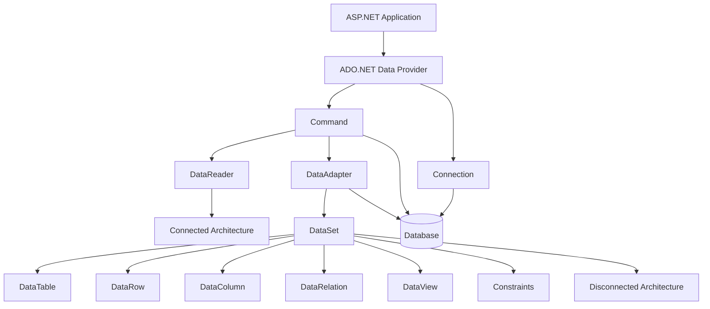

---

# Connected Architecture in ADO.NET

## Introduction

Connected Architecture is a data access model in ADO.NET where the application maintains a continuous connection with the database while data is being accessed. In this architecture, the connection remains open from the beginning of the database operation until all required data is retrieved and processed.

Connected Architecture is mainly used when real-time data access is required and the application needs immediate interaction with the database.

---

## Working of Connected Architecture

The following steps are performed in Connected Architecture:

### Step 1: Create Connection

A connection is established between the application and the database using the `SqlConnection` object.

### Step 2: Open Connection

The database connection is opened using the `Open()` method.

### Step 3: Execute Command

SQL queries or stored procedures are executed using the `SqlCommand` object.

### Step 4: Read Data

Data is retrieved using the `SqlDataReader` object. The DataReader reads records one by one in a forward-only and read-only manner.

### Step 5: Close Connection

After all operations are completed, the connection is closed using the `Close()` method.

---

## Connected Architecture Flow

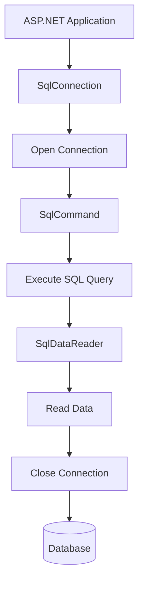

---

## Components Used in Connected Architecture

### 1. SqlConnection

The SqlConnection object is used to establish a connection between the application and the database.

**Responsibilities:**

- Connect to Database
- Open Connection
- Close Connection
- Manage Database Session

---

### 2. SqlCommand

The SqlCommand object is used to execute SQL statements and stored procedures.

**Functions:**

- INSERT Data
- UPDATE Data
- DELETE Data
- SELECT Data

---

### 3. SqlDataReader

The SqlDataReader object retrieves data from the database.

**Characteristics:**

- Read-Only
- Forward-Only
- High Performance
- Fast Data Retrieval

---

## Advantages of Connected Architecture

### 1. Fast Performance

DataReader directly communicates with the database, making data retrieval very fast.

### 2. Less Memory Consumption

Data is not stored in memory; therefore memory usage remains low.

### 3. Real-Time Data Access

Users always get the latest information from the database.

### 4. Suitable for Small Data Operations

Ideal for login systems, search operations, and report generation.

---

## Disadvantages of Connected Architecture

### 1. Continuous Database Connection

The database connection remains open during the entire operation.

### 2. High Server Load

Multiple users can create a heavy load on the database server.

### 3. Less Scalable

Not suitable for applications with thousands of simultaneous users.

### 4. Network Dependency

If the network connection fails, database operations may stop.

---

## Real-Life Example

Suppose a student logs into a college management system.

1. The application opens a database connection.
2. Student credentials are checked.
3. The result is returned immediately.
4. The connection is closed.

This is an example of Connected Architecture because the application communicates directly with the database while processing the request.

---

# Disconnected Architecture in ADO.NET

## Introduction

Disconnected Architecture is a data access model in ADO.NET where data is retrieved from the database, stored in memory, and the database connection is immediately closed.

The application then works with the stored data without maintaining a continuous database connection.

This architecture is widely used in web applications because it reduces database load and improves scalability.

---

## Working of Disconnected Architecture

### Step 1: Create Connection

A connection is established using SqlConnection.

### Step 2: Open Connection

The connection is opened.

### Step 3: Retrieve Data

DataAdapter retrieves data from the database.

### Step 4: Store Data

The retrieved data is stored in a DataSet.

### Step 5: Close Connection

The database connection is immediately closed.

### Step 6: Work Offline

The application works with the DataSet stored in memory.

### Step 7: Update Database

Changes are synchronized back to the database using DataAdapter.

---

## Disconnected Architecture Flow

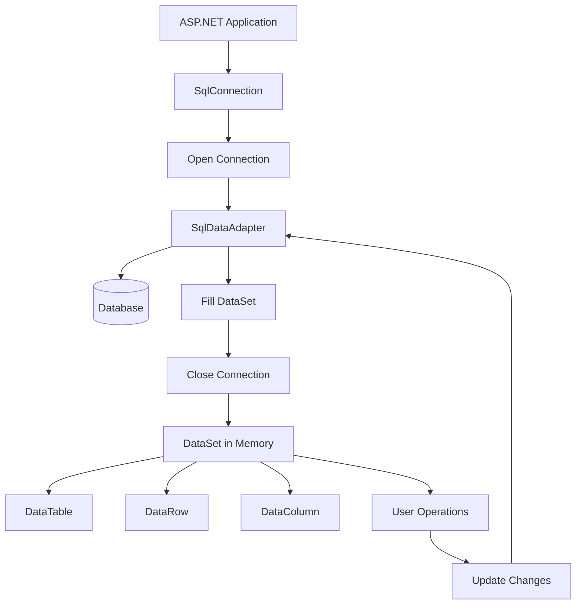

---

## Components Used in Disconnected Architecture

### 1. SqlConnection

Creates the connection between the application and database.

### 2. SqlDataAdapter

Acts as a bridge between the DataSet and the Database.

**Functions:**

- Fill DataSet
- Insert Data
- Update Data
- Delete Data

---

### 3. DataSet

A DataSet is an in-memory database that stores tables and records.

**Features:**

- Stores Multiple Tables
- Supports Relationships
- Works Offline
- Supports XML

---

### 4. DataTable

Represents a table inside a DataSet.

### 5. DataRow

Represents a row of a table.

### 6. DataColumn

Represents a column of a table.

---

## Advantages of Disconnected Architecture

### 1. Better Scalability

Since connections are not kept open, more users can access the application.

### 2. Reduced Database Load

The database is accessed only when required.

### 3. Offline Data Processing

Users can work with data even after the database connection is closed.

### 4. Suitable for Web Applications

Most ASP.NET applications use disconnected architecture.

### 5. Supports Multiple Tables

DataSet can store multiple related tables.

### 6. Better Resource Management

Database resources are used efficiently.

---

## Disadvantages of Disconnected Architecture

### 1. Higher Memory Usage

Data is stored in memory, increasing memory consumption.

### 2. Synchronization Issues

The data in the DataSet may become outdated if the database changes.

### 3. Slightly Slower

Because data must be copied into memory before processing.

### 4. Complex Updates

Changes must be synchronized back to the database.

---

## Real-Life Example

Consider an e-commerce website.

1. Product information is loaded from the database.
2. Data is stored in a DataSet.
3. Database connection is closed.
4. Users browse products from memory.
5. Only when an order is placed does the application reconnect to update the database.

This is an example of Disconnected Architecture.

---

# Difference Between Connected Architecture and Disconnected Architecture

| Basis                      | Connected Architecture                                                    | Disconnected Architecture                                                             |
| -------------------------- | ------------------------------------------------------------------------- | ------------------------------------------------------------------------------------- |
| **Definition**             | Maintains a continuous connection with the database while accessing data. | Retrieves data from the database and stores it in memory, then closes the connection. |
| **Connection Status**      | Connection remains open throughout the operation.                         | Connection is closed after data retrieval.                                            |
| **Main Component**         | DataReader                                                                | DataSet                                                                               |
| **Data Access Method**     | Directly accesses data from the database.                                 | Accesses data from memory (DataSet).                                                  |
| **Performance**            | Faster for reading data.                                                  | Slightly slower due to data storage in memory.                                        |
| **Memory Usage**           | Low memory consumption.                                                   | Higher memory consumption.                                                            |
| **Scalability**            | Less scalable.                                                            | Highly scalable.                                                                      |
| **Database Load**          | High database load because connections stay open.                         | Low database load because connections are closed quickly.                             |
| **Data Modification**      | Suitable for real-time operations.                                        | Suitable for offline data manipulation.                                               |
| **Network Dependency**     | Requires continuous network connection.                                   | Can work with data after connection is closed.                                        |
| **Multi-User Support**     | Less suitable for a large number of users.                                | Better suited for multi-user environments.                                            |
| **Data Storage**           | Data is not stored locally.                                               | Data is stored in a DataSet in memory.                                                |
| **Speed**                  | Very fast for immediate data retrieval.                                   | Slightly slower due to synchronization.                                               |
| **Resource Utilization**   | Consumes more database resources.                                         | Utilizes database resources efficiently.                                              |
| **Offline Support**        | Not supported.                                                            | Supported.                                                                            |
| **Suitable Applications**  | Login systems, search operations, real-time reporting.                    | Web applications, e-commerce systems, enterprise applications.                        |
| **Examples of Components** | SqlConnection, SqlCommand, SqlDataReader                                  | SqlConnection, SqlDataAdapter, DataSet                                                |
| **Data Navigation**        | Forward-only and Read-only.                                               | Supports editing, sorting, filtering, and navigation.                                 |
| **XML Support**            | Limited.                                                                  | Strong XML support through DataSet.                                                   |
| **Best Use Case**          | When real-time and immediate database access is required.                 | When scalability and offline processing are important.                                |

---

# ADO.NET Classes

ADO.NET provides a collection of classes that enable communication between .NET applications and databases. These classes are used to establish database connections, execute commands, retrieve data, store data in memory, and manipulate records efficiently.

---

# 1. Connection Class

## Introduction

The Connection class is used to establish a connection between an application and a database.

For SQL Server, the `SqlConnection` class is used.

The Connection object acts as a communication channel between the application and the database server.

---

## Purpose of Connection Class

- Connect to Database
- Open Database Connection
- Close Database Connection
- Manage Database Sessions

---

## Common Methods

| Method           | Description                    |
| ---------------- | ------------------------------ |
| Open()           | Opens the database connection  |
| Close()          | Closes the database connection |
| Dispose()        | Releases resources             |
| ChangeDatabase() | Changes the current database   |

---

## Example

```csharp
using System.Data.SqlClient;

SqlConnection con = new SqlConnection(
"Server=localhost;Database=StudentDB;Integrated Security=True");

con.Open();

Response.Write("Connection Successful");

con.Close();
```

---

## Working Diagram

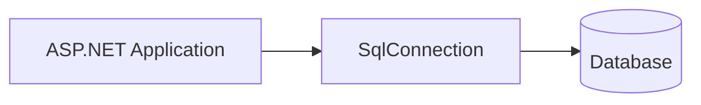

---

# 2. Command Class

## Introduction

The Command class is used to execute SQL queries and stored procedures.

For SQL Server, `SqlCommand` is used.

---

## Functions

- Execute SELECT Query
- Execute INSERT Query
- Execute UPDATE Query
- Execute DELETE Query
- Execute Stored Procedure

---

## Common Methods

| Method            | Description                     |
| ----------------- | ------------------------------- |
| ExecuteReader()   | Returns records                 |
| ExecuteScalar()   | Returns single value            |
| ExecuteNonQuery() | Executes INSERT, UPDATE, DELETE |

---

## Example

```csharp
SqlConnection con = new SqlConnection(cs);

con.Open();

SqlCommand cmd =
new SqlCommand(
"INSERT INTO Student VALUES(101,'Rahul')",
con);

cmd.ExecuteNonQuery();

con.Close();
```

---

## Working Diagram

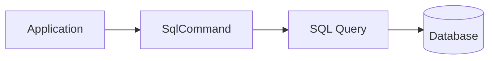

---

# 3. DataReader Class

## Introduction

The DataReader class provides fast and efficient read-only access to data.

For SQL Server, `SqlDataReader` is used.

It is a part of Connected Architecture.

---

## Features

- Read Only
- Forward Only
- Fastest Data Retrieval
- Low Memory Consumption

---

## Example

```csharp
SqlConnection con = new SqlConnection(cs);

con.Open();

SqlCommand cmd =
new SqlCommand(
"SELECT * FROM Student",
con);

SqlDataReader dr =
cmd.ExecuteReader();

while(dr.Read())
{
    Response.Write(
    dr["Name"].ToString());
}

con.Close();
```

---

## Working Diagram

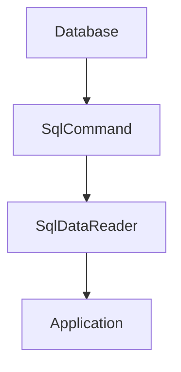

---

## Advantages

- High Speed
- Less Memory Usage
- Real-Time Data Access

---

## Limitations

- Read Only
- Cannot Modify Data
- Connection Must Remain Open

---

# 4. DataAdapter Class

## Introduction

DataAdapter acts as a bridge between DataSet and Database.

It is used in Disconnected Architecture.

---

## Functions

- Fetch Data
- Fill DataSet
- Update Database
- Insert Records
- Delete Records

---

## Main Methods

| Method   | Description             |
| -------- | ----------------------- |
| Fill()   | Loads data into DataSet |
| Update() | Updates database        |

---

## Example

```csharp
SqlConnection con =
new SqlConnection(cs);

SqlDataAdapter da =
new SqlDataAdapter(
"SELECT * FROM Student",
con);

DataSet ds =
new DataSet();

da.Fill(ds);
```

---

## Working Diagram

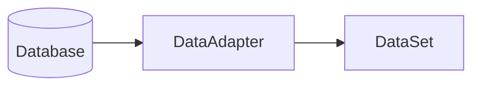

---

## Advantages

- Works Offline
- Better Scalability
- Reduces Database Load

---

# 5. DataSet Class

## Introduction

A DataSet is an in-memory database that stores data temporarily.

It can contain multiple tables and relationships.

---

## Features

- Stores Multiple Tables
- Supports Relations
- XML Integration
- Offline Processing

---

## Structure of DataSet

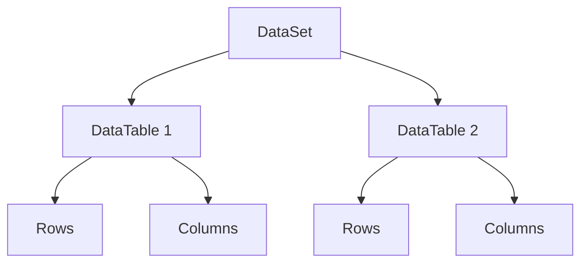

---

## Example

```csharp
DataSet ds =
new DataSet();

da.Fill(ds,"Student");
```

---

## Advantages

- Offline Data Processing
- Multiple Table Support
- Easy Data Manipulation

---

# 6. DataTable Class

## Introduction

A DataTable represents a single table inside a DataSet.

It contains rows and columns.

---

## Example

```csharp
DataTable dt =
ds.Tables["Student"];
```

---

## Structure

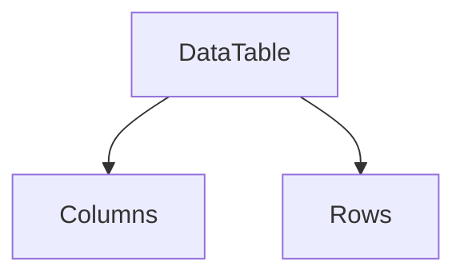

---

# 7. DataColumn Class

## Introduction

A DataColumn represents a column in a DataTable.

Each column stores a specific type of data.

---

## Example

Student Table

| StudentID | Name | City      |
| --------- | ---- | --------- |
| 101       | Amit | Ahmedabad |

Columns:

- StudentID
- Name
- City

---

## Example Code

```csharp
DataColumn dc =
new DataColumn();

dc.ColumnName = "Name";

dt.Columns.Add(dc);
```

---

## Diagram

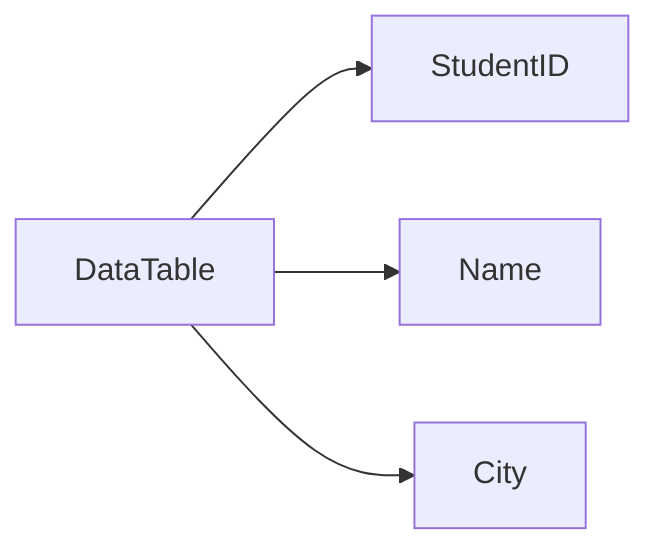

---

# 8. DataRow Class

## Introduction

A DataRow represents a single record inside a DataTable.

Each row stores values for all columns.

---

## Example

| StudentID | Name | City      |
| --------- | ---- | --------- |
| 101       | Amit | Ahmedabad |

This entire record is one DataRow.

---

## Example Code

```csharp
DataRow dr =
dt.NewRow();

dr["StudentID"] = 101;
dr["Name"] = "Amit";

dt.Rows.Add(dr);
```

---

## Diagram

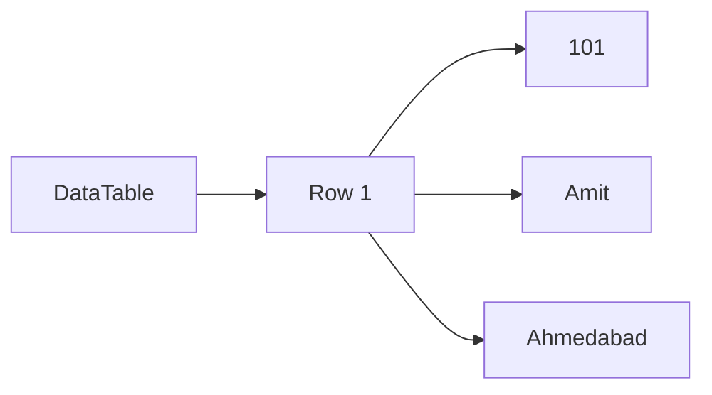

---

# 9. DataConstraints

## Introduction

Constraints are rules applied to tables to maintain data integrity.

They prevent invalid or duplicate data.

---

## Types of Constraints

### 1. UniqueConstraint

Ensures unique values.

Example:

StudentID cannot be duplicated.

### 2. ForeignKeyConstraint

Maintains relationships between tables.

Example:

Student Table linked with Course Table.

---

## Example

```csharp
UniqueConstraint uc =
new UniqueConstraint(
dt.Columns["StudentID"]);

dt.Constraints.Add(uc);
```

---

## Diagram


---

# 10. DataView Class

## Introduction

DataView provides customized views of DataTable data.

It allows sorting, filtering, and searching.

---

## Features

- Sorting
- Filtering
- Searching
- Custom Views

---

## Example

```csharp
DataView dv =
new DataView(dt);

dv.RowFilter =
"City='Ahmedabad'";

dv.Sort =
"Name ASC";
```

---

## Example Result

Original Table

| ID  | Name  | City      |
| --- | ----- | --------- |
| 101 | Amit  | Ahmedabad |
| 102 | Raj   | Surat     |
| 103 | Karan | Ahmedabad |

Filtered DataView

| ID  | Name  | City      |
| --- | ----- | --------- |
| 101 | Amit  | Ahmedabad |
| 103 | Karan | Ahmedabad |

---

## Working Diagram

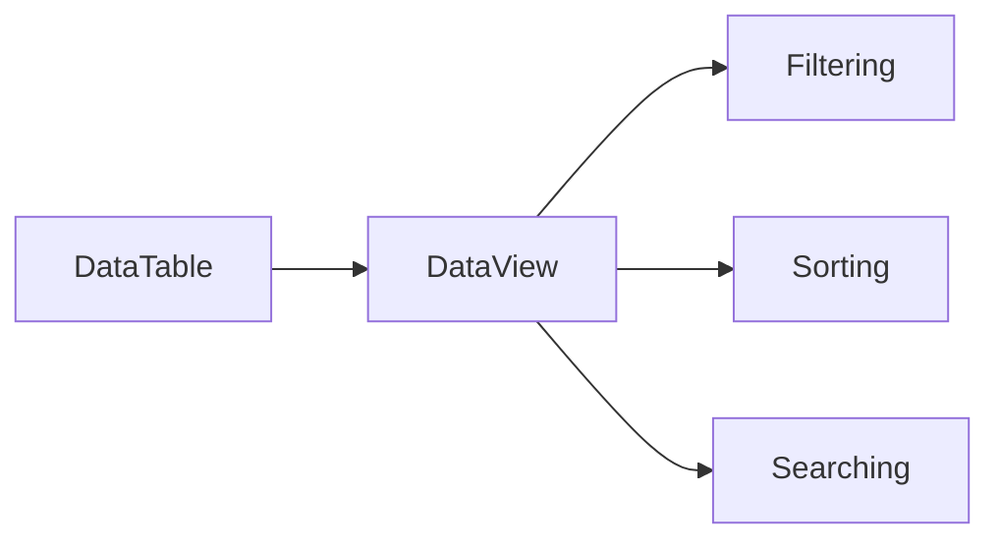

---

# Summary of ADO.NET Classes

| Class           | Purpose                              |
| --------------- | ------------------------------------ |
| SqlConnection   | Connects application to database     |
| SqlCommand      | Executes SQL queries                 |
| SqlDataReader   | Reads data in Connected Architecture |
| SqlDataAdapter  | Bridge between Database and DataSet  |
| DataSet         | Stores data in memory                |
| DataTable       | Represents a table                   |
| DataColumn      | Represents a column                  |
| DataRow         | Represents a row                     |
| DataConstraints | Maintains data integrity             |
| DataView        | Provides filtered and sorted views   |

---

# The GridView Control

## Introduction

The **GridView Control** is one of the most commonly used DataBound Controls in ASP.NET. It is used to display data in a tabular format (rows and columns). GridView can automatically display, edit, delete, sort, and paginate data from a database.

GridView is mainly used with ADO.NET and DataSource Controls such as SqlDataSource, ObjectDataSource, and DataSet.

---

# Features of GridView Control

- Displays data in tabular format
- Automatic column generation
- Supports Editing
- Supports Deleting
- Supports Sorting
- Supports Paging
- Supports Data Binding
- Customizable Appearance
- Event Handling Support

---

# Structure of GridView

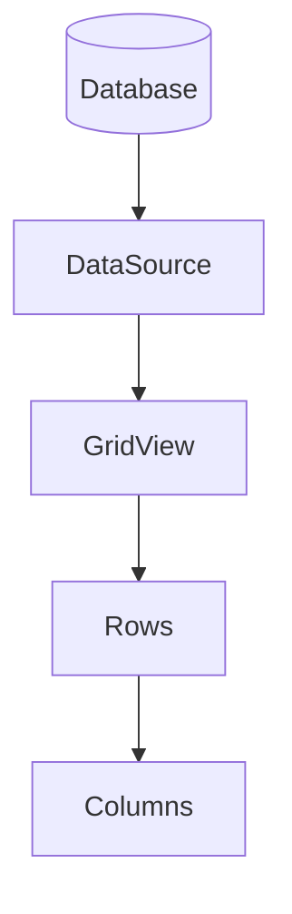

---

# Syntax of GridView

```aspx
<asp:GridView
    ID="GridView1"
    runat="server">
</asp:GridView>
```

---

# Example: Displaying Student Data

## ASPX Code

```aspx
<asp:GridView
    ID="GridView1"
    runat="server">
</asp:GridView>
```

## C# Code

```csharp
SqlConnection con =
new SqlConnection(cs);

SqlDataAdapter da =
new SqlDataAdapter(
"SELECT * FROM Student",
con);

DataSet ds =
new DataSet();

da.Fill(ds);

GridView1.DataSource =
ds;

GridView1.DataBind();
```

---

# Output Example

| StudentID | Name  | City      |
| --------- | ----- | --------- |
| 101       | Amit  | Ahmedabad |
| 102       | Raj   | Surat     |
| 103       | Karan | Vadodara  |

---

# Important Properties of GridView

| Property            | Description                   |
| ------------------- | ----------------------------- |
| DataSource          | Specifies source of data      |
| AutoGenerateColumns | Automatically creates columns |
| AllowPaging         | Enables paging                |
| AllowSorting        | Enables sorting               |
| PageSize            | Number of records per page    |
| ShowHeader          | Displays header row           |
| GridLines           | Displays grid lines           |

---

# AutoGenerateColumns Property

### Example

```aspx
<asp:GridView
ID="GridView1"
runat="server"
AutoGenerateColumns="True">
</asp:GridView>
```

### Result

Columns are automatically generated based on database fields.

---

# BoundField in GridView

BoundField is used to display specific database columns.

### Example

```aspx
<asp:GridView
ID="GridView1"
runat="server"
AutoGenerateColumns="False">

<Columns>

<asp:BoundField
DataField="StudentID"
HeaderText="Student ID"/>

<asp:BoundField
DataField="Name"
HeaderText="Student Name"/>

</Columns>

</asp:GridView>
```

---

# Editing Data in GridView

GridView can automatically provide Edit functionality.

### Example

```aspx
<asp:CommandField
ShowEditButton="True"/>
```

### Output

| ID  | Name | Edit |
| --- | ---- | ---- |
| 101 | Amit | Edit |

---

# Deleting Data in GridView

### Example

```aspx
<asp:CommandField
ShowDeleteButton="True"/>
```

### Output

| ID  | Name | Delete |
| --- | ---- | ------ |
| 101 | Amit | Delete |

---

# Sorting in GridView

Sorting allows records to be arranged in ascending or descending order.

### Example

```aspx
<asp:GridView
AllowSorting="True"
runat="server">
</asp:GridView>
```

---

# Paging in GridView

Paging divides records into multiple pages.

### Example

```aspx
<asp:GridView
runat="server"
AllowPaging="True"
PageSize="5">
</asp:GridView>
```

---

# GridView Working Process

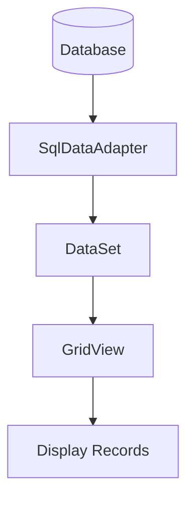

---

# Advantages of GridView

1. Easy Data Display
2. Supports CRUD Operations
3. Sorting and Paging Support
4. Rich User Interface
5. Easy Database Integration

---

# Disadvantages of GridView

1. Large HTML Output
2. More Memory Consumption
3. Slower with Huge Data

---

# Applications of GridView

- Student Management System
- Employee Records
- Product Management
- Inventory Systems
- Admin Panels

---

# The Repeater Control

## Introduction

The **Repeater Control** is a lightweight DataBound Control in ASP.NET used to display repeated data items. Unlike GridView, Repeater does not provide built-in features like editing, sorting, or paging.

It provides complete control over HTML layout and design.

---

# Features of Repeater Control

- Lightweight Control
- Faster than GridView
- Flexible Design
- Custom HTML Support
- Data Binding Support
- Better Performance

---

# Structure of Repeater

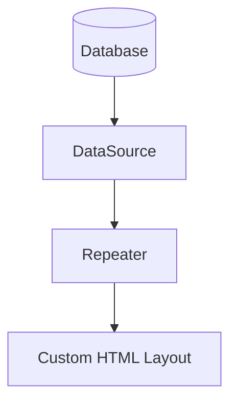

---

# Syntax of Repeater

```aspx
<asp:Repeater
ID="Repeater1"
runat="server">

</asp:Repeater>
```

---

# Repeater Templates

Repeater uses templates for displaying data.

### Main Templates

| Template                | Purpose              |
| ----------------------- | -------------------- |
| HeaderTemplate          | Displays header      |
| ItemTemplate            | Displays each record |
| AlternatingItemTemplate | Alternate row style  |
| FooterTemplate          | Displays footer      |
| SeparatorTemplate       | Separates records    |

---

# Example: Display Student Records

## ASPX Code

```aspx
<asp:Repeater
ID="Repeater1"
runat="server">

<ItemTemplate>

Student ID :
<%# Eval("StudentID") %>

<br/>

Name :
<%# Eval("Name") %>

<hr/>

</ItemTemplate>

</asp:Repeater>
```

---

## C# Code

```csharp
SqlConnection con =
new SqlConnection(cs);

SqlDataAdapter da =
new SqlDataAdapter(
"SELECT * FROM Student",
con);

DataSet ds =
new DataSet();

da.Fill(ds);

Repeater1.DataSource =
ds;

Repeater1.DataBind();
```

---

# Output Example

```
Student ID : 101
Name : Amit
------------------

Student ID : 102
Name : Raj
------------------

Student ID : 103
Name : Karan
------------------
```

---

# Repeater Working Process

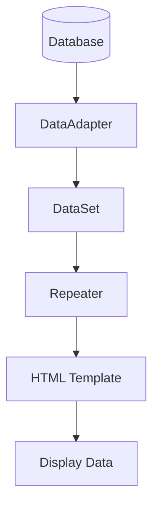

---

# Eval() Function

The Eval() method is used to display database field values inside Repeater.

### Example

```aspx
<%# Eval("Name") %>
```

### Meaning

Displays the value of the Name column.

---

# Advantages of Repeater

1. Fast Performance
2. Lightweight Control
3. Full HTML Control
4. Less Memory Usage
5. Better UI Design Flexibility

---

# Disadvantages of Repeater

1. No Built-in Paging
2. No Built-in Sorting
3. No Built-in Editing
4. More Coding Required

---

# GridView vs Repeater

| Feature        | GridView     | Repeater         |
| -------------- | ------------ | ---------------- |
| Display Format | Table        | Custom HTML      |
| Performance    | Slower       | Faster           |
| Paging         | Supported    | Not Supported    |
| Sorting        | Supported    | Not Supported    |
| Editing        | Supported    | Not Supported    |
| Deleting       | Supported    | Not Supported    |
| Memory Usage   | Higher       | Lower            |
| HTML Control   | Limited      | Complete Control |
| Best For       | Admin Panels | Custom UI Design |

---

# Binding Data to DataBound Controls

## Introduction

Data Binding is the process of connecting a DataBound Control with a data source so that data can be displayed automatically on a web page.

In ASP.NET, Data Binding allows controls such as GridView, Repeater, DetailsView, FormView, DropDownList, ListBox, and DataList to display data from databases, DataSet objects, DataTable objects, or DataSource Controls.

Data Binding reduces coding effort because data is automatically displayed in controls.

---

# What is a DataBound Control?

A DataBound Control is a control that can display data from a data source.

### Examples of DataBound Controls

- GridView
- Repeater
- DataList
- DetailsView
- FormView
- DropDownList
- ListBox
- CheckBoxList
- RadioButtonList

---

# Data Binding Architecture

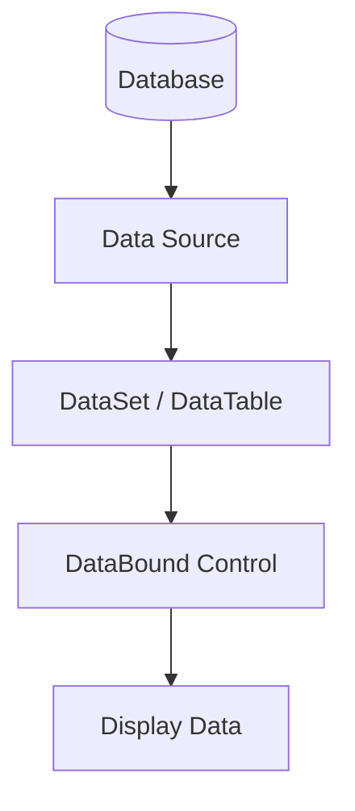

---

# Steps of Data Binding

### Step 1

Create a database connection.

### Step 2

Retrieve data using DataAdapter.

### Step 3

Store data in DataSet or DataTable.

### Step 4

Assign data to the DataSource property.

### Step 5

Call the DataBind() method.

---

# Data Binding with GridView

## ASPX Code

```aspx id="t73r0r"
<asp:GridView
ID="GridView1"
runat="server">
</asp:GridView>
```

---

## C# Code

```csharp id="8y8a5j"
SqlConnection con =
new SqlConnection(cs);

SqlDataAdapter da =
new SqlDataAdapter(
"SELECT * FROM Student",
con);

DataSet ds =
new DataSet();

da.Fill(ds);

GridView1.DataSource = ds;

GridView1.DataBind();
```

---

# Working Process

```mermaid id="25kjm0"
flowchart LR

A[(Database)]

A --> B[SqlDataAdapter]

B --> C[DataSet]

C --> D[GridView]

D --> E[DataBind()]
```

---

# Data Binding with Repeater

## ASPX Code

```aspx id="x7x7x7"
<asp:Repeater
ID="Repeater1"
runat="server">

<ItemTemplate>

<%# Eval("Name") %>

</ItemTemplate>

</asp:Repeater>
```

---

## C# Code

```csharp id="ifn4n6"
Repeater1.DataSource = ds;

Repeater1.DataBind();
```

---

# Data Binding with DropDownList

## ASPX Code

```aspx id="eqvtnz"
<asp:DropDownList
ID="DropDownList1"
runat="server">
</asp:DropDownList>
```

---

## C# Code

```csharp id="ylszom"
DropDownList1.DataSource =
ds.Tables[0];

DropDownList1.DataTextField =
"Name";

DropDownList1.DataValueField =
"StudentID";

DropDownList1.DataBind();
```

---

# Output Example

| StudentID | Name  |
| --------- | ----- |
| 101       | Amit  |
| 102       | Raj   |
| 103       | Karan |

DropDownList Output:

```text id="vqnvf3"
Amit
Raj
Karan
```

---

# DataSource Property

The DataSource property specifies the source of data for a control.

### Example

```csharp id="xhg6bz"
GridView1.DataSource = ds;
```

Here:

- GridView1 = DataBound Control
- ds = Data Source

---

# DataBind() Method

The DataBind() method binds data to the control and displays it on the webpage.

### Example

```csharp id="a7hhsq"
GridView1.DataBind();
```

Without DataBind(), data will not appear on the page.

---

# Advantages of Data Binding

### 1. Easy Data Display

Data can be displayed with minimal code.

### 2. Automatic Updates

Controls can automatically show updated data.

### 3. Reusable

Same data source can be used with multiple controls.

### 4. Reduced Coding

Less manual HTML generation.

### 5. Better Maintenance

Application becomes easier to manage.

---

# Disadvantages of Data Binding

### 1. Extra Processing

Data binding consumes server resources.

### 2. Large Data Issues

Binding huge datasets may reduce performance.

---

# Real-Life Example

A Student Management System displays student records in a GridView.

Database → DataSet → GridView → Student Records

This process is called Data Binding.

---

# Displaying Data in a Webpage using SQLDataSource Control

## Introduction

The SQLDataSource Control is a Data Source Control used to connect ASP.NET controls directly with a database without writing much C# code.

It provides a simple way to perform:

- SELECT
- INSERT
- UPDATE
- DELETE

operations directly from ASP.NET pages.

SQLDataSource works well with GridView, Repeater, DetailsView, FormView, and other DataBound Controls.

---

# SQLDataSource Architecture

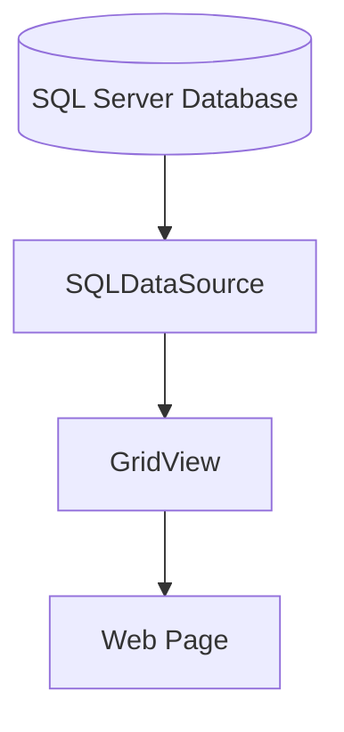

---

# Syntax of SQLDataSource

```aspx id="3a7rv8"
<asp:SqlDataSource
ID="SqlDataSource1"
runat="server"
ConnectionString="<%$ ConnectionStrings:MyDB %>"
SelectCommand="SELECT * FROM Student">
</asp:SqlDataSource>
```

---

# Main Properties of SQLDataSource

| Property         | Description                |
| ---------------- | -------------------------- |
| ConnectionString | Database connection string |
| SelectCommand    | Retrieves records          |
| InsertCommand    | Inserts records            |
| UpdateCommand    | Updates records            |
| DeleteCommand    | Deletes records            |
| ProviderName     | Database provider          |

---

# Example: Display Data using SQLDataSource and GridView

## ASPX Code

```aspx id="tfbdw7"
<asp:SqlDataSource
ID="SqlDataSource1"
runat="server"
ConnectionString="<%$ ConnectionStrings:MyDB %>"
SelectCommand="SELECT * FROM Student">
</asp:SqlDataSource>

<asp:GridView
ID="GridView1"
runat="server"
DataSourceID="SqlDataSource1">
</asp:GridView>
```

---

# Working Process

```mermaid id="vbm9bh"
flowchart LR

A[(Database)]

A --> B[SQL Query]

B --> C[SQLDataSource]

C --> D[GridView]

D --> E[Web Page]
```

---

# Output Example

| StudentID | Name  | City      |
| --------- | ----- | --------- |
| 101       | Amit  | Ahmedabad |
| 102       | Raj   | Surat     |
| 103       | Karan | Vadodara  |

---

# Insert Data using SQLDataSource

```aspx id="r5j7bh"
<asp:SqlDataSource
ID="SqlDataSource1"
runat="server"
ConnectionString="<%$ ConnectionStrings:MyDB %>"
InsertCommand=
"INSERT INTO Student(Name,City)
VALUES(@Name,@City)">
</asp:SqlDataSource>
```

---

# Update Data using SQLDataSource

```aspx id="5tgh53"
UpdateCommand=
"UPDATE Student
SET Name=@Name
WHERE StudentID=@StudentID"
```

---

# Delete Data using SQLDataSource

```aspx id="q9f9k7"
DeleteCommand=
"DELETE FROM Student
WHERE StudentID=@StudentID"
```

---

# Advantages of SQLDataSource

### 1. Less Coding

No need to write extensive ADO.NET code.

### 2. Rapid Development

Faster application development.

### 3. Easy Integration

Works directly with GridView and other controls.

### 4. Built-in CRUD Support

Supports Insert, Update, Delete, and Select operations.

### 5. Declarative Programming

Database operations can be defined directly in ASPX pages.

---

# Disadvantages of SQLDataSource

### 1. Less Flexible

Complex business logic is difficult to implement.

### 2. Security Risks

Poorly written queries may expose vulnerabilities.

### 3. Not Suitable for Large Applications

Enterprise applications usually prefer ADO.NET classes and business layers.

---

# Difference Between Data Binding and SQLDataSource

| Basis               | Data Binding                  | SQLDataSource                     |
| ------------------- | ----------------------------- | --------------------------------- |
| Purpose             | Connects data to controls     | Provides data source for controls |
| Coding              | Requires C# code              | Mostly declarative ASPX code      |
| Flexibility         | High                          | Limited                           |
| Performance Control | More Control                  | Less Control                      |
| Suitable For        | Medium and Large Applications | Small Applications                |
| Database Access     | Through ADO.NET objects       | Directly through SQLDataSource    |

---

# DataBinding Expressions in ASP.NET

## Introduction

DataBinding Expressions in ASP.NET are special expressions used to bind data dynamically from a data source (like DataSet, DataTable, or database fields) to web controls at runtime.

These expressions are written inside ASP.NET pages (ASPX) and help display database values directly in UI controls such as GridView, Repeater, Label, TextBox, etc.

---

# What is Data Binding Expression?

A DataBinding Expression is a special syntax used to extract and display data from a data source inside a web control.

It is executed when the `DataBind()` method is called.

---

# Syntax of DataBinding Expression

```aspx id="a1d2e3"
<%# Expression %>
```

---

# Types of DataBinding Expressions

## 1. Eval() Expression (Read-Only Binding)

### Introduction

`Eval()` is used for **one-way (read-only) data binding**. It is commonly used in GridView, Repeater, DataList, etc.

It cannot update data, only displays it.

---

### Syntax

```aspx id="e1v2a3"
<%# Eval("ColumnName") %>
```

---

### Example

```aspx id="b2c3d4"
<asp:Repeater ID="Repeater1" runat="server">

<ItemTemplate>

Name: <%# Eval("Name") %> <br/>
City: <%# Eval("City") %>

</ItemTemplate>

</asp:Repeater>
```

---

### Output

```
Name: Amit
City: Ahmedabad
```

---

### Features of Eval()

- Read-only binding
- Used in templates
- Easy to use
- Works with DataReader, DataSet, DataTable

---

## 2. Bind() Expression (Two-Way Binding)

### Introduction

`Bind()` is used for **two-way data binding**, mainly in editable controls like GridView (Edit mode).

It allows both display and update of data.

---

### Syntax

```aspx id="f4g5h6"
<%# Bind("ColumnName") %>
```

---

### Example (GridView Editing)

```aspx id="g7h8i9"
<asp:GridView ID="GridView1" runat="server" AutoGenerateEditButton="True">

<Columns>

<asp:TemplateField HeaderText="Name">

<ItemTemplate>
<%# Eval("Name") %>
</ItemTemplate>

<EditItemTemplate>
<asp:TextBox ID="txtName" runat="server" Text='<%# Bind("Name") %>' />
</EditItemTemplate>

</asp:TemplateField>

</Columns>

</asp:GridView>
```

---

### Features of Bind()

- Two-way data binding
- Used in edit/update operations
- Works in GridView, FormView, DetailsView

---

# Key Difference between Eval() and Bind()

| Feature     | Eval()                     | Bind()                |
| ----------- | -------------------------- | --------------------- |
| Type        | One-way binding            | Two-way binding       |
| Usage       | Display data               | Display + Update data |
| Performance | Faster                     | Slightly slower       |
| Editable    | No                         | Yes                   |
| Used In     | Repeater, GridView display | GridView edit mode    |

---

# DataBinding Expression Working Process

```mermaid id="k9l8m7"
flowchart LR

A[(Database)]
--> B[DataSet / DataTable]

B --> C[DataBound Control]

C --> D[DataBinding Expression Eval or Bind]

D --> E[Rendered Web Page]
```

---

# When DataBinding Expressions Work?

DataBinding expressions execute only when:

- `DataBind()` method is called
- Page lifecycle reaches Data Binding stage

---

# Example Flow

1. Data is fetched from database
2. Stored in DataSet
3. Bound to GridView or Repeater
4. Eval()/Bind() extracts values
5. Data is displayed on webpage

---

# Advantages of DataBinding Expressions

- Easy data display
- Reduces coding effort
- Clean and readable code
- Works with multiple controls
- Supports dynamic data rendering

---

# Disadvantages

- Requires DataBind() call
- Debugging can be difficult
- Limited control in complex logic

---
