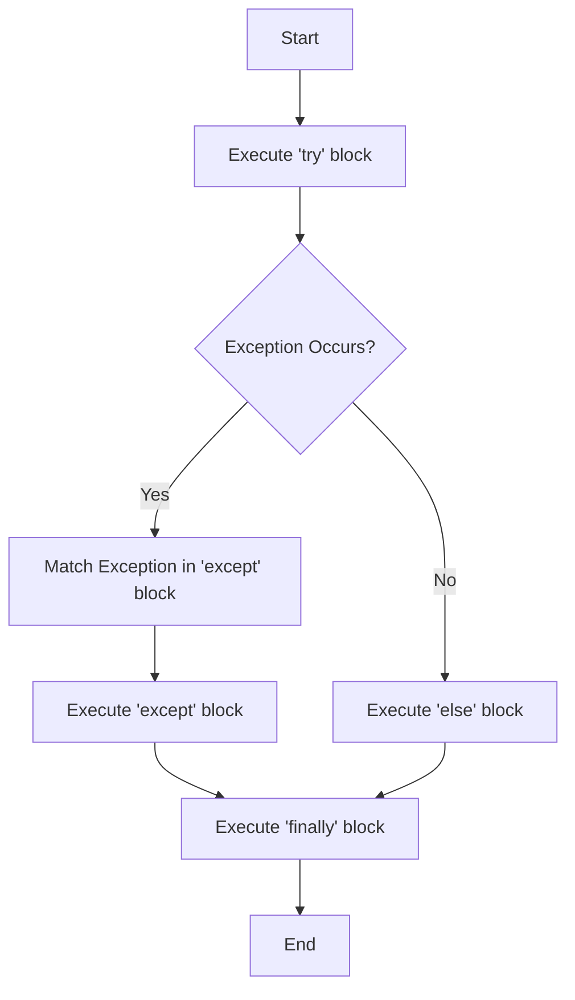
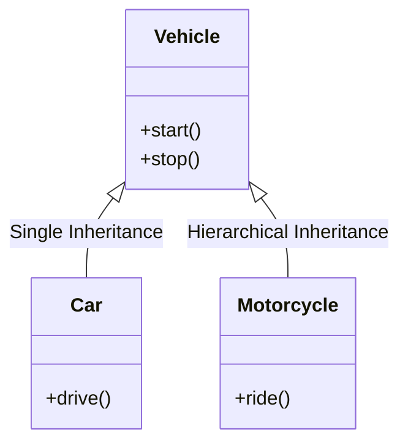
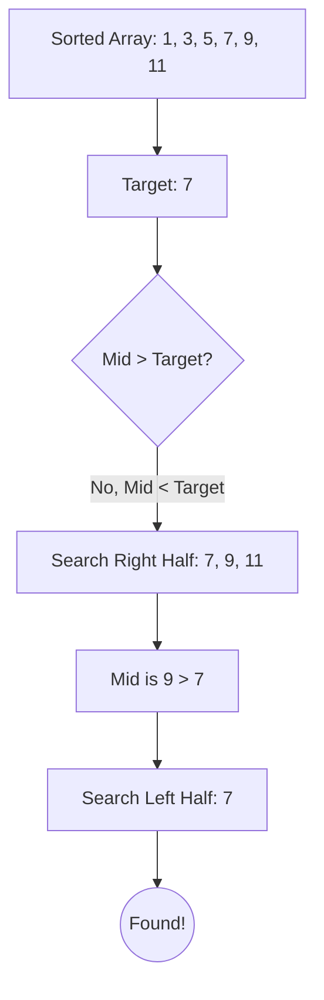
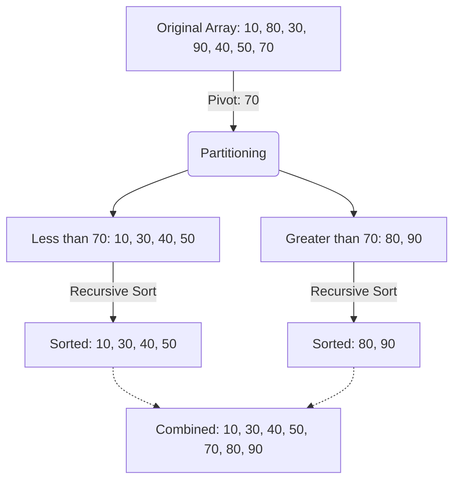

# 📚 BCA Semester - 5

## 🐍 Python Programming

> **Subject Code:** BCA-501  
> **Course:** Bachelor of Computer Applications (BCA)  
> **Semester:** 5

---

# 📑 Unit 3 : Exception Handling, OOP Concepts and Algorithms

## _Topics_

- Handling Exceptions
- Exceptions as a Control Flow Mechanism
- Assertions, Abstract Data Types and Classes
- Inheritance, Encapsulation and Information Hiding
- Search Algorithms
  - Linear Search
  - Binary Search
- Sorting Algorithms
  - Selection Sort
  - Bubble Sort
  - Insertion Sort
  - Shell Sort
  - Quick Sort

---

## 1. Handling Exceptions

### What is an Exception?
An **exception** is an unexpected event or error that occurs during the execution of a program (at runtime) which disrupts the normal flow of instructions. Examples include dividing by zero (`ZeroDivisionError`), accessing an invalid index in a list (`IndexError`), or trying to open a file that doesn't exist (`FileNotFoundError`).

### Exception Handling in Python
Exception handling allows us to gracefully manage these runtime errors without crashing the entire program. Python provides the `try`, `except`, `else`, and `finally` blocks for this purpose.

- **`try` block**: Contains the code that might throw an exception.
- **`except` block**: Contains the code that executes if an exception occurs in the `try` block.
- **`else` block**: Contains code that executes *only if* no exception was raised in the `try` block.
- **`finally` block**: Contains code that *always* executes, regardless of whether an exception occurred or not (often used for cleanup, like closing files).

**Example:**
```python
try:
    num = int(input("Enter a number: "))
    result = 10 / num
except ZeroDivisionError:
    print("Error: Cannot divide by zero!")
except ValueError:
    print("Error: Invalid input. Please enter an integer.")
else:
    print(f"Result is: {result}")
finally:
    print("Execution of try-except block completed.")
```

### Exception Handling Flow Diagram



---

## 2. Exceptions as a Control Flow Mechanism

While exceptions are mainly used for error handling, they can also be used as a control flow mechanism. In Python, an exception doesn't always represent a fatal error. Sometimes it indicates a specific state.

### `StopIteration` in Iterators
A classic example of exception-based control flow in Python is the `StopIteration` exception used by iterators and generator functions. When a `for` loop iterates over a collection, it repeatedly calls the `__next__()` method. When there are no more items, it raises a `StopIteration` exception, which the `for` loop automatically catches to terminate the loop cleanly.

```python
# Demonstrating StopIteration
my_list = [1, 2, 3]
iterator = iter(my_list)

while True:
    try:
        item = next(iterator)
        print(item)
    except StopIteration:
        # Expected exception used to break the loop
        break
```

---

## 3. Assertions, Abstract Data Types and Classes

### Assertions (`assert` keyword)
An **assertion** is a sanity-check that you can turn on or turn off when you are done with your testing of the program. It tests if a condition evaluates to `True`. If not, it raises an `AssertionError`.
Assertions are best used to check for internal bugs, validate inputs, or enforce logical constraints.

```python
def calculate_discount(price, discount):
    assert 0 <= discount <= 100, "Discount must be between 0 and 100"
    return price - (price * (discount / 100))

print(calculate_discount(1000, 20))  # Works fine
# print(calculate_discount(1000, 150)) # Raises AssertionError
```

### Abstract Data Types (ADTs)
An **Abstract Data Type (ADT)** is a theoretical concept that defines a data structure by its behavior (what operations can be performed on it) rather than its implementation details (how it works internally).
Examples of ADTs include Stacks, Queues, Lists, and Trees.

### Classes in Python
A **Class** is a blueprint or template for creating objects. It binds data (attributes/properties) and functions (methods) together into a single unit. Python implements ADTs using classes.

```python
# Implementing a simple Stack ADT using a Class
class Stack:
    def __init__(self):
        self.items = []

    def push(self, item):
        self.items.append(item)

    def pop(self):
        if not self.is_empty():
            return self.items.pop()
        return None

    def is_empty(self):
        return len(self.items) == 0
```

---

## 4. Inheritance, Encapsulation and Information Hiding

### Object-Oriented Programming (OOP) Concepts

#### Inheritance
**Inheritance** is a mechanism where a new class (derived/child class) acquires the properties and behaviors (methods) of an existing class (base/parent class). It promotes code reusability.

**Types of Inheritance:**
1. **Single Inheritance:** One child inherits from one parent.
2. **Multiple Inheritance:** One child inherits from multiple parents.
3. **Multilevel Inheritance:** A child inherits from a parent, which inherits from a grandparent.
4. **Hierarchical Inheritance:** Multiple children inherit from a single parent.



```python
# Single Inheritance Example
class Animal:
    def speak(self):
        return "Animal sound"

class Dog(Animal):
    def speak(self):
        return "Woof!"

my_dog = Dog()
print(my_dog.speak()) # Output: Woof!
```

#### Encapsulation and Information Hiding
**Encapsulation** is the bundling of data (attributes) and methods that operate on the data into a single unit (class).
**Information Hiding** restricts direct access to some of an object's components to prevent unintended interference and misuse. In Python, this is achieved using access modifiers.

- **Public:** Default. Accessible from anywhere. (`name`)
- **Protected:** Suggested to be accessed only within the class and its subclasses. Denoted by a single underscore prefix. (`_name`)
- **Private:** Accessible only within the class itself. Denoted by a double underscore prefix. (`__name`)

```python
class BankAccount:
    def __init__(self, owner, balance):
        self.owner = owner          # Public attribute
        self.__balance = balance    # Private attribute (Information Hiding)

    def deposit(self, amount):
        self.__balance += amount

    def get_balance(self):          # Public method to access private data
        return self.__balance

account = BankAccount("John", 500)
print(account.get_balance()) # Output: 500
# print(account.__balance)   # This will raise an AttributeError
```

---

## 5. Search Algorithms

Search algorithms are used to retrieve an element from a data structure.

### 5.1 Linear Search
**Definition:** A simple sequential search algorithm that starts at one end and goes through each element of a list until the desired element is found.
- **Time Complexity:** $O(N)$
- **Space Complexity:** $O(1)$

```python
def linear_search(arr, target):
    for i in range(len(arr)):
        if arr[i] == target:
            return i  # Element found at index i
    return -1         # Element not found
```

### 5.2 Binary Search
**Definition:** A highly efficient search algorithm used on **sorted arrays**. It works by repeatedly dividing the search interval in half. If the target value is less than the middle element, it searches the lower half; otherwise, it searches the upper half.
- **Time Complexity:** $O(\log N)$
- **Space Complexity:** $O(1)$ (Iterative), $O(\log N)$ (Recursive)



```python
def binary_search(arr, target):
    low = 0
    high = len(arr) - 1

    while low <= high:
        mid = (low + high) // 2
        if arr[mid] == target:
            return mid
        elif arr[mid] < target:
            low = mid + 1
        else:
            high = mid - 1
    return -1
```

---

## 6. Sorting Algorithms

Sorting algorithms arrange the elements of a list in a specific order (ascending or descending).

### 6.1 Selection Sort
**Definition:** Divides the list into a sorted and an unsorted region. It repeatedly selects the smallest element from the unsorted region and swaps it with the first element of the unsorted region.
- **Time Complexity:** $O(N^2)$

```python
def selection_sort(arr):
    n = len(arr)
    for i in range(n):
        min_idx = i
        for j in range(i+1, n):
            if arr[j] < arr[min_idx]:
                min_idx = j
        arr[i], arr[min_idx] = arr[min_idx], arr[i]
    return arr
```

### 6.2 Bubble Sort
**Definition:** Repeatedly steps through the list, compares adjacent elements, and swaps them if they are in the wrong order. The process is repeated until the list is sorted. Large elements "bubble up" to the end.
- **Time Complexity:** $O(N^2)$

```python
def bubble_sort(arr):
    n = len(arr)
    for i in range(n):
        # Last i elements are already sorted
        for j in range(0, n - i - 1):
            if arr[j] > arr[j + 1]:
                arr[j], arr[j + 1] = arr[j + 1], arr[j]
    return arr
```

### 6.3 Insertion Sort
**Definition:** Builds the final sorted array one item at a time. It takes an element from the unsorted portion and inserts it into its correct position in the sorted portion (similar to sorting playing cards in your hand).
- **Time Complexity:** $O(N^2)$

```python
def insertion_sort(arr):
    for i in range(1, len(arr)):
        key = arr[i]
        j = i - 1
        while j >= 0 and key < arr[j]:
            arr[j + 1] = arr[j]
            j -= 1
        arr[j + 1] = key
    return arr
```

### 6.4 Shell Sort
**Definition:** An optimization of Insertion Sort. Instead of comparing adjacent elements, it compares elements separated by a "gap". The gap is progressively reduced until it becomes 1 (which makes it a standard Insertion Sort, but the list is already almost sorted, so it's very fast).
- **Time Complexity:** Depends on gap sequence, typically $O(N \log N)$ to $O(N^{1.5})$

```python
def shell_sort(arr):
    n = len(arr)
    gap = n // 2
    
    while gap > 0:
        for i in range(gap, n):
            temp = arr[i]
            j = i
            while j >= gap and arr[j - gap] > temp:
                arr[j] = arr[j - gap]
                j -= gap
            arr[j] = temp
        gap //= 2
    return arr
```

### 6.5 Quick Sort
**Definition:** A Divide and Conquer algorithm. It picks an element as a "pivot" and partitions the given array around the picked pivot. Elements smaller than the pivot go to the left, and elements greater go to the right. It recursively sorts the sub-arrays.
- **Time Complexity:** Best/Average $O(N \log N)$, Worst $O(N^2)$



---
