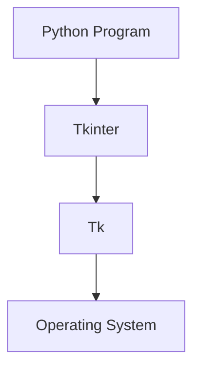
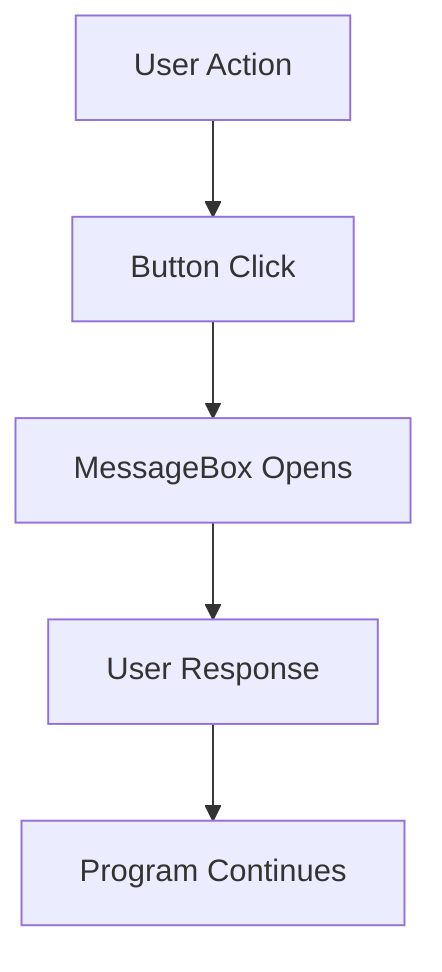

# 📚 BCA Semester – 5

## 🐍 Python Programming

> **Subject Code:** BCA-501  
> **Course:** Bachelor of Computer Applications (BCA)  
> **Semester:** 5

---

# 📑 Unit – 4 : Python Tkinter and Basic Python Libraries

## 📌 Topics

### Python Tkinter

- Tkinter Introduction

- Tkinter Widgets
  - Button
  - Canvas
  - Checkbutton
  - Entry
  - Frame
  - Label

- Tkinter Widgets (Advanced)
  - Listbox
  - Menubutton
  - Menu
  - Message
  - Radiobutton

- Tkinter Widgets (Additional)
  - Scale
  - Scrollbar
  - Text
  - Toplevel
  - Spinbox

- Tkinter Containers and Dialogs
  - PanedWindow
  - LabelFrame
  - MessageBox

### Basic Python Libraries

#### NumPy

- array()
- mean()
- max()
- reshape()
- arange()

#### Pandas

- read_csv()
- head()
- describe()
- dropna()
- sort_values()

#### OpenCV – Image Functions

- imread()
- imshow()
- imwrite()
- resize()
- cvtColor()

#### OpenCV – Video/Webcam Functions

- VideoCapture()
- read()
- waitKey()
- destroyAllWindows()
- release()

#### OpenCV – Drawing Functions

- line()
- rectangle()
- circle()
- putText()
- polylines()

#### Matplotlib (plt)

- plot()
- bar()
- scatter()
- xlabel()
- show()

#### Seaborn (sns)

- histplot()
- boxplot()
- countplot()
- heatmap()
- scatterplot()

#### Plotly Express (px)

- bar()
- line()
- scatter()
- pie()
- show()

---

# Python Tkinter

# Tkinter Introduction

## What is Tkinter?

Tkinter is Python's standard GUI (Graphical User Interface) library.

It is used to create desktop applications with graphical components such as:

- Buttons
- Labels
- Text Boxes
- Menus
- Checkboxes
- Radio Buttons
- Windows

Tkinter comes pre-installed with Python, so no additional installation is required.

---

# Why Use Tkinter?

Tkinter helps developers create user-friendly desktop applications.

### Applications of Tkinter

- Calculator
- Text Editor
- Login Form
- Student Management System
- Inventory System
- Quiz Application
- Banking Software

---

# Features of Tkinter

1. Easy to learn and use.
2. Built into Python.
3. Cross-platform support.
4. Supports event-driven programming.
5. Provides many GUI widgets.
6. Lightweight and efficient.

---

# Architecture of Tkinter



---

# Importing Tkinter

```python
import tkinter
```

OR

```python
from tkinter import *
```

---

# Creating First Tkinter Window

```python
from tkinter import *

root = Tk()

root.title("My First Window")

root.geometry("400x300")

root.mainloop()
```

### Output

```text
+----------------------+
|    My First Window   |
|                      |
|                      |
+----------------------+
```

---

# Important Methods

## title()

Sets window title.

```python
root.title("Student System")
```

---

## geometry()

Sets window size.

```python
root.geometry("500x300")
```

---

## mainloop()

Runs the application continuously.

```python
root.mainloop()
```

Without mainloop(), the window closes immediately.

---

# Tkinter Widget

## What is a Widget?

Widgets are GUI elements used to interact with users.

Examples:

- Button
- Label
- Entry
- Canvas
- Checkbutton

---

# Tkinter Button Widget

## Introduction

A Button widget creates a clickable button.

Users can click the button to perform actions.

---

# Syntax

```python
Button(
    parent,
    option=value
)
```

---

# Important Properties

| Property | Description         |
| -------- | ------------------- |
| text     | Button text         |
| command  | Function to execute |
| bg       | Background color    |
| fg       | Text color          |
| width    | Width               |
| height   | Height              |

---

# Example 1

```python
from tkinter import *

root = Tk()

btn = Button(
    root,
    text="Click Me"
)

btn.pack()

root.mainloop()
```

---

# Example 2 (Button Click Event)

```python
from tkinter import *

def show():
    print("Button Clicked")

root = Tk()

btn = Button(
    root,
    text="Click Me",
    command=show
)

btn.pack()

root.mainloop()
```

---

# Output

```text
[ Click Me ]
```

When clicked:

```text
Button Clicked
```

---

# Tkinter Canvas Widget

## Introduction

Canvas is used for drawing graphics.

Using Canvas we can draw:

- Lines
- Circles
- Rectangles
- Arcs
- Shapes
- Images

---

# Syntax

```python
Canvas(
    parent,
    option=value
)
```

---

# Example

```python
from tkinter import *

root = Tk()

canvas = Canvas(
    root,
    width=300,
    height=200,
    bg="white"
)

canvas.pack()

canvas.create_line(
    50,50,250,50
)

root.mainloop()
```

---

# Drawing Rectangle

```python
canvas.create_rectangle(
    50,50,200,150
)
```

---

# Drawing Circle

```python
canvas.create_oval(
    50,50,150,150
)
```

---

# Output

```text
 ---------------------
|        ○           |
|                    |
 ---------------------
```

---

# Tkinter Checkbutton Widget

## Introduction

A Checkbutton allows users to select one or more options.

Multiple checkbuttons can be selected simultaneously.

---

# Real-Life Example

```text
☑ Cricket
☑ Football
☐ Chess
```

---

# Syntax

```python
Checkbutton(
    parent,
    option=value
)
```

---

# Example

```python
from tkinter import *

root = Tk()

var = IntVar()

chk = Checkbutton(
    root,
    text="Python",
    variable=var
)

chk.pack()

root.mainloop()
```

---

# Getting Value

```python
print(var.get())
```

### Output

Checked:

```text
1
```

Unchecked:

```text
0
```

---

# Tkinter Entry Widget

## Introduction

Entry widget is used to accept single-line input from the user.

Examples:

- Username
- Password
- Email
- Mobile Number

---

# Syntax

```python
Entry(
    parent,
    option=value
)
```

---

# Example

```python
from tkinter import *

root = Tk()

entry = Entry(root)

entry.pack()

root.mainloop()
```

---

# Output

```text
+------------------+
|                  |
+------------------+
```

---

# Reading Input

```python
value = entry.get()
```

---

# Complete Example

```python
from tkinter import *

def show():

    print(entry.get())

root = Tk()

entry = Entry(root)

entry.pack()

btn = Button(
    root,
    text="Submit",
    command=show
)

btn.pack()

root.mainloop()
```

---

# Tkinter Frame Widget

## Introduction

Frame is a container widget.

It is used to group multiple widgets together.

Frames help organize GUI layouts.

---

# Example

```text
+---------------------+
| Frame               |
|                     |
| Button              |
| Label               |
+---------------------+
```

---

# Syntax

```python
Frame(
    parent,
    option=value
)
```

---

# Example

```python
from tkinter import *

root = Tk()

frame = Frame(
    root,
    bg="lightblue"
)

frame.pack()

Button(
    frame,
    text="Save"
).pack()

root.mainloop()
```

---

# Output

```text
+-------------+
|    Save     |
+-------------+
```

inside frame.

---

# Benefits of Frame

1. Organizes widgets.
2. Improves layout design.
3. Supports nested structures.
4. Makes GUI cleaner.

---

# Tkinter Label Widget

## Introduction

A Label widget displays text or images.

It is used to show information to users.

Labels are non-editable.

---

# Examples

```text
Student Name
Welcome User
Registration Successful
```

---

# Syntax

```python
Label(
    parent,
    option=value
)
```

---

# Important Properties

| Property | Description      |
| -------- | ---------------- |
| text     | Display text     |
| bg       | Background color |
| fg       | Text color       |
| font     | Font style       |
| width    | Width            |
| height   | Height           |

---

# Example

```python
from tkinter import *

root = Tk()

label = Label(
    root,
    text="Welcome to Python"
)

label.pack()

root.mainloop()
```

---

# Output

```text
Welcome to Python
```

---

# Styled Label

```python
from tkinter import *

root = Tk()

label = Label(
    root,
    text="Python Tkinter",
    bg="yellow",
    fg="red",
    font=("Arial",16)
)

label.pack()

root.mainloop()
```

---

# Output

```text
Python Tkinter
```

Displayed with custom colors and font.

---

# Difference Between Label and Entry

| Label         | Entry         |
| ------------- | ------------- |
| Displays Text | Accepts Input |
| Read Only     | Editable      |
| Output Widget | Input Widget  |

---

# Summary

## Tkinter

- Standard Python GUI library.
- Used to create desktop applications.
- Provides graphical widgets.

## Button

- Creates clickable buttons.
- Executes commands when clicked.

## Canvas

- Used for drawing graphics and shapes.

## Checkbutton

- Allows multiple selections.

## Entry

- Accepts single-line user input.

## Frame

- Container used to organize widgets.

## Label

- Displays text or images on the screen.

These widgets form the foundation of most Tkinter GUI applications and are frequently used while developing desktop software in Python.

# Tkinter Advanced Widgets

# Listbox Widget

## Introduction

The Listbox widget is used to display a list of items from which the user can select one or more items.

It is commonly used when a program needs to present multiple options in a compact form.

### Real-Life Examples

- List of Countries
- List of Courses
- Music Playlist
- Product Categories

---

# Syntax

```python
Listbox(
    parent,
    option=value
)
```

---

# Basic Example

```python
from tkinter import *

root = Tk()

listbox = Listbox(root)

listbox.pack()

listbox.insert(1, "Python")
listbox.insert(2, "Java")
listbox.insert(3, "C++")

root.mainloop()
```

---

# Output

```text
+------------+
| Python     |
| Java       |
| C++        |
+------------+
```

---

# Selecting an Item

```python
from tkinter import *

def show():
    print(listbox.get(listbox.curselection()))

root = Tk()

listbox = Listbox(root)

listbox.pack()

listbox.insert(1, "Python")
listbox.insert(2, "Java")
listbox.insert(3, "C++")

Button(
    root,
    text="Show",
    command=show
).pack()

root.mainloop()
```

---

# Important Methods

## insert()

Adds items.

```python
listbox.insert(END, "Python")
```

---

## delete()

Deletes item.

```python
listbox.delete(0)
```

---

## get()

Retrieves item.

```python
listbox.get(0)
```

---

## curselection()

Returns selected index.

```python
listbox.curselection()
```

---

# Advantages

1. Displays many items.
2. Easy selection.
3. Saves screen space.

---

# Menubutton Widget

## Introduction

Menubutton creates a button that displays a dropdown menu when clicked.

It combines the features of a button and a menu.

---

# Example

```text
File ▼
      New
      Open
      Save
```

---

# Syntax

```python
Menubutton(
    parent,
    option=value
)
```

---

# Example

```python
from tkinter import *

root = Tk()

mb = Menubutton(
    root,
    text="File"
)

mb.pack()

menu = Menu(mb, tearoff=0)

menu.add_command(label="New")
menu.add_command(label="Open")
menu.add_command(label="Save")

mb["menu"] = menu

root.mainloop()
```

---

# Output

```text
File ▼

New
Open
Save
```

---

# Important Properties

| Property | Description      |
| -------- | ---------------- |
| text     | Button text      |
| menu     | Attached menu    |
| bg       | Background color |
| fg       | Text color       |

---

# Applications

- File Menu
- Edit Menu
- Settings Menu
- Dropdown Navigation

---

# Menu Widget

## Introduction

The Menu widget is used to create menu bars and dropdown menus.

Menus are generally placed at the top of a window.

---

# Real-Life Example

```text
File  Edit  View  Help
```

---

# Syntax

```python
Menu(
    parent,
    option=value
)
```

---

# Basic Example

```python
from tkinter import *

root = Tk()

menubar = Menu(root)

root.config(menu=menubar)

filemenu = Menu(
    menubar,
    tearoff=0
)

menubar.add_cascade(
    label="File",
    menu=filemenu
)

filemenu.add_command(label="New")
filemenu.add_command(label="Open")
filemenu.add_command(label="Exit")

root.mainloop()
```

---

# Output

```text
File

  New
  Open
  Exit
```

---

# Important Methods

## add_command()

Adds menu item.

```python
menu.add_command(label="Open")
```

---

## add_separator()

Adds separator line.

```python
menu.add_separator()
```

---

## add_cascade()

Creates submenu.

```python
menu.add_cascade(
    label="File",
    menu=filemenu
)
```

---

# Menu Structure Diagram

```text
Menu Bar
│
├── File
│     ├── New
│     ├── Open
│     └── Exit
│
├── Edit
│     ├── Cut
│     ├── Copy
│     └── Paste
│
└── Help
      └── About
```

---

# Advantages

1. Professional GUI design.
2. Easy navigation.
3. Organizes application features.

---

# Message Widget

## Introduction

The Message widget is used to display long text messages.

Unlike Label, it automatically wraps text according to the specified width.

---

# Difference Between Label and Message

| Label                 | Message            |
| --------------------- | ------------------ |
| Single line text      | Multi-line text    |
| No automatic wrapping | Automatic wrapping |
| Fixed display         | Flexible display   |

---

# Syntax

```python
Message(
    parent,
    option=value
)
```

---

# Example

```python
from tkinter import *

root = Tk()

msg = Message(
    root,
    text="Welcome to Python Tkinter. This widget is used to display long messages.",
    width=200
)

msg.pack()

root.mainloop()
```

---

# Output

```text
Welcome to Python Tkinter.
This widget is used to
display long messages.
```

---

# Important Properties

| Property | Description      |
| -------- | ---------------- |
| text     | Message text     |
| width    | Wrap width       |
| bg       | Background color |
| fg       | Text color       |

---

# Applications

- Instructions
- Notifications
- Guidelines
- Information Panels

---

# Radiobutton Widget

## Introduction

Radiobutton allows users to select only one option from a group of options.

If one option is selected, the previously selected option is automatically deselected.

---

# Real-Life Examples

```text
Gender

(•) Male
( ) Female
( ) Other
```

Only one option can be selected.

---

# Syntax

```python
Radiobutton(
    parent,
    option=value
)
```

---

# Important Properties

| Property | Description         |
| -------- | ------------------- |
| text     | Option text         |
| value    | Option value        |
| variable | Shared variable     |
| command  | Function to execute |

---

# Example

```python
from tkinter import *

root = Tk()

choice = IntVar()

Radiobutton(
    root,
    text="Male",
    variable=choice,
    value=1
).pack()

Radiobutton(
    root,
    text="Female",
    variable=choice,
    value=2
).pack()

root.mainloop()
```

---

# Output

```text
( ) Male
( ) Female
```

User can choose only one.

---

# Getting Selected Value

```python
print(choice.get())
```

Output:

```text
1
```

or

```text
2
```

depending on selection.

---

# Complete Example

```python
from tkinter import *

def show():
    print("Selected:", choice.get())

root = Tk()

choice = IntVar()

Radiobutton(
    root,
    text="Python",
    variable=choice,
    value=1
).pack()

Radiobutton(
    root,
    text="Java",
    variable=choice,
    value=2
).pack()

Button(
    root,
    text="Submit",
    command=show
).pack()

root.mainloop()
```

---

# Output

```text
Python
Java

[Submit]
```

If Python is selected:

```text
Selected: 1
```

---

# Radiobutton vs Checkbutton

| Radiobutton      | Checkbutton           |
| ---------------- | --------------------- |
| Single Selection | Multiple Selection    |
| One option only  | Many options possible |
| Shared Variable  | Separate Variables    |
| Used for Choices | Used for Preferences  |

---

# Summary

## Listbox

- Displays a list of items.
- Supports item selection.
- Useful for large option lists.

## Menubutton

- Button with dropdown menu.
- Combines button and menu features.

## Menu

- Creates menu bars and dropdown menus.
- Commonly used in desktop applications.

## Message

- Displays long text messages.
- Supports automatic text wrapping.

## Radiobutton

- Allows selection of only one option.
- Useful for mutually exclusive choices.

These advanced widgets help create professional and interactive Tkinter GUI applications.

# Tkinter Additional Widgets

# Scale Widget

## Introduction

The Scale widget is used to select a numeric value from a specified range by moving a slider.

It provides a graphical way for users to choose values instead of typing them manually.

---

# Real-Life Examples

- Volume Control
- Brightness Adjustment
- Temperature Setting
- Zoom Level Selection

---

# Syntax

```python
Scale(
    parent,
    option=value
)
```

---

# Important Properties

| Property | Description            |
| -------- | ---------------------- |
| from\_   | Starting value         |
| to       | Ending value           |
| orient   | Horizontal or Vertical |
| length   | Length of scale        |
| variable | Stores selected value  |

---

# Basic Example

```python
from tkinter import *

root = Tk()

scale = Scale(
    root,
    from_=0,
    to=100,
    orient=HORIZONTAL
)

scale.pack()

root.mainloop()
```

---

# Output

```text
0 ------------------- 100
          ▲
```

User can move the slider.

---

# Getting Scale Value

```python
from tkinter import *

def show():
    print(scale.get())

root = Tk()

scale = Scale(
    root,
    from_=0,
    to=100,
    orient=HORIZONTAL
)

scale.pack()

Button(
    root,
    text="Show Value",
    command=show
).pack()

root.mainloop()
```

---

# Output

```text
75
```

(if slider is at 75)

---

# Advantages

1. Easy value selection.
2. Better user experience.
3. Prevents invalid input.

---

# Scrollbar Widget

## Introduction

Scrollbar is used when content exceeds the visible area.

It allows users to scroll vertically or horizontally.

---

# Real-Life Examples

- Web Pages
- Documents
- Chat Applications
- Text Editors

---

# Syntax

```python
Scrollbar(
    parent,
    option=value
)
```

---

# Example

```python
from tkinter import *

root = Tk()

scrollbar = Scrollbar(root)

scrollbar.pack(
    side=RIGHT,
    fill=Y
)

listbox = Listbox(
    root,
    yscrollcommand=scrollbar.set
)

for i in range(100):
    listbox.insert(END, "Item " + str(i))

listbox.pack()

scrollbar.config(
    command=listbox.yview
)

root.mainloop()
```

---

# Output

```text
Item 1
Item 2
Item 3
...
Item 100
│
│ Scroll
│
```

---

# Important Properties

| Property | Description      |
| -------- | ---------------- |
| orient   | Direction        |
| command  | Connects widget  |
| bg       | Background color |

---

# Advantages

1. Handles large data.
2. Saves screen space.
3. Improves navigation.

---

# Text Widget

## Introduction

The Text widget is used for multi-line text input and display.

Unlike Entry widget, Text widget supports multiple lines.

---

# Real-Life Examples

- Notes
- Text Editor
- Comments Section
- Blog Content

---

# Syntax

```python
Text(
    parent,
    option=value
)
```

---

# Example

```python
from tkinter import *

root = Tk()

txt = Text(
    root,
    height=5,
    width=30
)

txt.pack()

root.mainloop()
```

---

# Output

```text
+----------------------+
|                      |
|                      |
|                      |
|                      |
+----------------------+
```

---

# Insert Text

```python
txt.insert(
    END,
    "Welcome to Python"
)
```

---

# Get Text

```python
data = txt.get(
    "1.0",
    END
)
```

---

# Complete Example

```python
from tkinter import *

def show():

    print(
        txt.get(
            "1.0",
            END
        )
    )

root = Tk()

txt = Text(root)

txt.pack()

Button(
    root,
    text="Read",
    command=show
).pack()

root.mainloop()
```

---

# Entry vs Text

| Entry       | Text           |
| ----------- | -------------- |
| Single Line | Multi Line     |
| Small Input | Large Input    |
| Username    | Notes/Comments |

---

# Toplevel Widget

## Introduction

Toplevel widget creates a new independent window.

It behaves like a separate window but remains connected to the main application.

---

# Real-Life Examples

- Login Window
- Settings Window
- Help Window
- About Dialog

---

# Syntax

```python
Toplevel(
    parent
)
```

---

# Example

```python
from tkinter import *

root = Tk()

def open_window():

    top = Toplevel(root)

    top.title("New Window")

    Label(
        top,
        text="Welcome"
    ).pack()

Button(
    root,
    text="Open Window",
    command=open_window
).pack()

root.mainloop()
```

---

# Output

```text
Main Window

[Open Window]

Click

↓

New Window Opens
```

---

# Window Structure

```text
Main Window
     │
     ├── Login Window
     │
     ├── Help Window
     │
     └── Settings Window
```

---

# Advantages

1. Supports multiple windows.
2. Better application organization.
3. Improves user experience.

---

# Spinbox Widget

## Introduction

Spinbox allows users to select a value from a predefined range using up and down arrows.

It combines Entry and Button functionality.

---

# Real-Life Examples

- Quantity Selection
- Age Selection
- Number Selection
- Month Selection

---

# Syntax

```python
Spinbox(
    parent,
    option=value
)
```

---

# Important Properties

| Property  | Description    |
| --------- | -------------- |
| from\_    | Starting value |
| to        | Ending value   |
| increment | Step value     |
| width     | Width          |

---

# Basic Example

```python
from tkinter import *

root = Tk()

spin = Spinbox(
    root,
    from_=1,
    to=10
)

spin.pack()

root.mainloop()
```

---

# Output

```text
+-----+
|  1 ▲|
|    ▼|
+-----+
```

---

# Reading Value

```python
print(spin.get())
```

---

# Example

```python
from tkinter import *

def show():
    print(spin.get())

root = Tk()

spin = Spinbox(
    root,
    from_=1,
    to=100
)

spin.pack()

Button(
    root,
    text="Show",
    command=show
).pack()

root.mainloop()
```

---

# Output

```text
50
```

(if selected value is 50)

---

# Spinbox with String Values

```python
from tkinter import *

root = Tk()

spin = Spinbox(
    root,
    values=(
        "January",
        "February",
        "March"
    )
)

spin.pack()

root.mainloop()
```

---

# Output

```text
January ▲
        ▼
```

---

# Advantages

1. Restricts invalid input.
2. Easy number selection.
3. Supports fixed values.
4. User-friendly interface.

---

# Comparison of Widgets

| Widget    | Purpose                   |
| --------- | ------------------------- |
| Scale     | Select value using slider |
| Scrollbar | Scroll content            |
| Text      | Multi-line text input     |
| Toplevel  | Create new window         |
| Spinbox   | Select value using arrows |

---

# Summary

## Scale

- Slider-based input widget.
- Used for selecting numeric values.

## Scrollbar

- Enables scrolling of content.
- Useful for large datasets.

## Text

- Multi-line text input widget.
- Used in editors and forms.

## Toplevel

- Creates additional windows.
- Useful for dialogs and settings.

## Spinbox

- Allows selection from a range of values.
- Uses increment and decrement arrows.

These widgets provide advanced interaction capabilities and are widely used while developing professional desktop GUI applications using Tkinter.

# Tkinter Containers and Dialogs

# PanedWindow Widget

## Introduction

The PanedWindow widget is a container widget used to arrange multiple widgets in separate resizable panes.

Users can resize the panes by dragging the separator between them.

It is useful when different sections of an application need adjustable space.

---

# Real-Life Examples

- File Explorer
- Code Editors
- Database Management Tools
- IDEs (Integrated Development Environments)

Example:

```text
+-----------------------------+
| Navigation | Content Area   |
|             |               |
|             |               |
+-----------------------------+
```

The divider can be moved left or right.

---

# Syntax

```python
PanedWindow(
    parent,
    option=value
)
```

---

# Important Properties

| Property  | Description            |
| --------- | ---------------------- |
| orient    | Horizontal or Vertical |
| sashwidth | Width of divider       |
| bg        | Background color       |

---

# Horizontal PanedWindow

```python
from tkinter import *

root = Tk()

pw = PanedWindow(
    root,
    orient=HORIZONTAL
)

pw.pack(fill=BOTH, expand=1)

left = Label(
    pw,
    text="Left Pane"
)

right = Label(
    pw,
    text="Right Pane"
)

pw.add(left)
pw.add(right)

root.mainloop()
```

---

# Output

```text
+----------------------+
| Left | Right         |
| Pane | Pane          |
+----------------------+
```

---

# Vertical PanedWindow

```python
from tkinter import *

root = Tk()

pw = PanedWindow(
    root,
    orient=VERTICAL
)

pw.pack(fill=BOTH, expand=1)

top = Label(
    pw,
    text="Top Pane"
)

bottom = Label(
    pw,
    text="Bottom Pane"
)

pw.add(top)
pw.add(bottom)

root.mainloop()
```

---

# Output

```text
+-------------+
| Top Pane    |
+-------------+
| Bottom Pane |
+-------------+
```

---

# Advantages of PanedWindow

1. Adjustable layout.
2. Better space management.
3. User-friendly interface.
4. Supports multiple sections.

---

# LabelFrame Widget

## Introduction

LabelFrame is a special type of Frame that includes a title (label).

It is used to group related widgets together under a common heading.

---

# Real-Life Examples

### Student Form

```text
Student Information
-------------------
Name
Age
Course
```

### Login Form

```text
Login Details
-------------
Username
Password
```

---

# Syntax

```python
LabelFrame(
    parent,
    option=value
)
```

---

# Important Properties

| Property | Description        |
| -------- | ------------------ |
| text     | Frame title        |
| padx     | Horizontal padding |
| pady     | Vertical padding   |
| bg       | Background color   |

---

# Example

```python
from tkinter import *

root = Tk()

frame = LabelFrame(
    root,
    text="Student Details",
    padx=10,
    pady=10
)

frame.pack()

Label(
    frame,
    text="Name"
).pack()

Entry(frame).pack()

root.mainloop()
```

---

# Output

```text
+----------------------+
| Student Details      |
|                      |
| Name                 |
| [___________]        |
+----------------------+
```

---

# LabelFrame with Multiple Widgets

```python
from tkinter import *

root = Tk()

frame = LabelFrame(
    root,
    text="Login"
)

frame.pack()

Label(
    frame,
    text="Username"
).pack()

Entry(frame).pack()

Label(
    frame,
    text="Password"
).pack()

Entry(frame).pack()

root.mainloop()
```

---

# Output

```text
+----------------------+
| Login                |
|                      |
| Username             |
| [__________]         |
|                      |
| Password             |
| [__________]         |
+----------------------+
```

---

# Advantages of LabelFrame

1. Groups related controls.
2. Improves readability.
3. Creates organized forms.
4. Professional appearance.

---

# MessageBox

## Introduction

MessageBox is used to display popup dialog boxes containing messages, warnings, confirmations, or errors.

It helps applications communicate with users.

MessageBox is available through the `tkinter.messagebox` module.

---

# Importing MessageBox

```python
from tkinter import messagebox
```

---

# Types of Message Boxes

1. showinfo()
2. showwarning()
3. showerror()
4. askquestion()
5. askokcancel()
6. askyesno()
7. askretrycancel()

---

# showinfo()

Displays information messages.

---

## Syntax

```python
messagebox.showinfo(
    title,
    message
)
```

---

## Example

```python
from tkinter import *
from tkinter import messagebox

root = Tk()

messagebox.showinfo(
    "Information",
    "Data Saved Successfully"
)

root.mainloop()
```

---

# Output

```text
+----------------------+
| Information          |
|                      |
| Data Saved Successfully |
|                      |
|        OK            |
+----------------------+
```

---

# showwarning()

Displays warning messages.

---

## Example

```python
messagebox.showwarning(
    "Warning",
    "Low Disk Space"
)
```

---

# Output

```text
Warning!

Low Disk Space
```

---

# showerror()

Displays error messages.

---

## Example

```python
messagebox.showerror(
    "Error",
    "Invalid Username"
)
```

---

# Output

```text
Error!

Invalid Username
```

---

# askquestion()

Asks a question and returns a response.

---

## Example

```python
result = messagebox.askquestion(
    "Exit",
    "Do you want to exit?"
)

print(result)
```

---

# Output

```text
yes
```

or

```text
no
```

---

# askyesno()

Returns True or False.

---

## Example

```python
result = messagebox.askyesno(
    "Delete",
    "Delete this record?"
)

print(result)
```

---

# Output

```text
True
```

or

```text
False
```

---

# askokcancel()

Returns True if OK is pressed.

---

## Example

```python
result = messagebox.askokcancel(
    "Exit",
    "Close Application?"
)

print(result)
```

---

# askretrycancel()

Used when retrying an operation.

---

## Example

```python
result = messagebox.askretrycancel(
    "Connection Error",
    "Retry Connection?"
)

print(result)
```

---

# Complete Example

```python
from tkinter import *
from tkinter import messagebox

def save():

    messagebox.showinfo(
        "Success",
        "Record Saved Successfully"
    )

root = Tk()

Button(
    root,
    text="Save",
    command=save
).pack()

root.mainloop()
```

---

# Output

```text
+--------+
| Save   |
+--------+

Click

↓

+--------------------+
| Success            |
|                    |
| Record Saved       |
| Successfully       |
|                    |
|      OK            |
+--------------------+
```

---

# MessageBox Flow Diagram



---

# Advantages of MessageBox

1. Easy user communication.
2. Provides feedback.
3. Displays warnings and errors.
4. Supports confirmations.
5. Improves user experience.

---

# Comparison

| Widget      | Purpose                           |
| ----------- | --------------------------------- |
| PanedWindow | Creates resizable panes           |
| LabelFrame  | Groups related widgets with title |
| MessageBox  | Displays popup dialog boxes       |

---

# Summary

## PanedWindow

- Container widget.
- Creates adjustable panes.
- Useful for complex layouts.

## LabelFrame

- Frame with a title.
- Groups related widgets.
- Improves form organization.

## MessageBox

- Popup dialog window.
- Displays information, warnings, errors, and confirmations.
- Enhances interaction between user and application.

These widgets are commonly used in professional Tkinter applications to create organized interfaces and communicate effectively with users.

# NumPy Library

# Introduction to NumPy

## What is NumPy?

NumPy stands for **Numerical Python**.

It is one of the most powerful and widely used Python libraries for numerical computations and mathematical operations.

NumPy provides support for:

- Multi-dimensional Arrays
- Matrix Operations
- Mathematical Functions
- Statistical Functions
- Scientific Computing
- Data Analysis

---

# Why Use NumPy?

Normal Python lists are slower when working with large amounts of numerical data.

NumPy arrays:

- Use less memory
- Execute faster
- Support advanced mathematical operations
- Handle large datasets efficiently

---

# Installation

```bash
pip install numpy
```

---

# Importing NumPy

```python
import numpy as np
```

Here:

```python
np
```

is an alias for NumPy.

---

# NumPy Array

## What is an Array?

An array is a collection of similar data elements stored in contiguous memory locations.

Example:

```text
[10, 20, 30, 40, 50]
```

---

# array()

## Introduction

The `array()` function is used to create NumPy arrays.

---

# Syntax

```python
numpy.array(object)
```

or

```python
np.array(object)
```

---

# Example 1

```python
import numpy as np

arr = np.array([10, 20, 30, 40, 50])

print(arr)
```

### Output

```text
[10 20 30 40 50]
```

---

# Example 2

### Two-Dimensional Array

```python
import numpy as np

arr = np.array([
    [1, 2, 3],
    [4, 5, 6]
])

print(arr)
```

### Output

```text
[[1 2 3]
 [4 5 6]]
```

---

# Array Dimensions

```python
import numpy as np

arr = np.array([10,20,30])

print(arr.ndim)
```

### Output

```text
1
```

---

# Array Diagram

```text
Index

0    1    2    3    4

+----+----+----+----+----+
|10  |20  |30  |40  |50  |
+----+----+----+----+----+
```

---

# mean()

## Introduction

The `mean()` function calculates the average value of all elements in an array.

---

# Formula

```text
Mean = Sum of Elements / Number of Elements
```

---

# Syntax

```python
np.mean(array)
```

---

# Example

```python
import numpy as np

arr = np.array([10,20,30,40,50])

result = np.mean(arr)

print(result)
```

### Output

```text
30.0
```

---

# Calculation

```text
10 + 20 + 30 + 40 + 50
= 150

150 / 5

= 30
```

---

# Real-Life Example

Student Marks:

```text
80 70 90 60 100
```

Average Marks:

```python
import numpy as np

marks = np.array([80,70,90,60,100])

print(np.mean(marks))
```

### Output

```text
80.0
```

---

# max()

## Introduction

The `max()` function returns the largest value from an array.

---

# Syntax

```python
np.max(array)
```

---

# Example

```python
import numpy as np

arr = np.array([12,45,67,23,89])

print(np.max(arr))
```

### Output

```text
89
```

---

# Diagram

```text
12 45 67 23 89
             ↑
           Maximum
```

---

# Real-Life Example

Finding highest marks.

```python
import numpy as np

marks = np.array([80,90,70,65,95])

print(np.max(marks))
```

### Output

```text
95
```

---

# reshape()

## Introduction

The `reshape()` function changes the shape of an array without changing its data.

It converts a one-dimensional array into a multi-dimensional array.

---

# Syntax

```python
array.reshape(rows, columns)
```

---

# Example

```python
import numpy as np

arr = np.array([1,2,3,4,5,6])

new_arr = arr.reshape(2,3)

print(new_arr)
```

### Output

```text
[[1 2 3]
 [4 5 6]]
```

---

# Before Reshape

```text
1 2 3 4 5 6
```

---

# After Reshape (2 × 3)

```text
+---+---+---+
| 1 | 2 | 3 |
+---+---+---+
| 4 | 5 | 6 |
+---+---+---+
```

---

# Another Example

```python
import numpy as np

arr = np.array([1,2,3,4,5,6,7,8])

print(arr.reshape(4,2))
```

### Output

```text
[[1 2]
 [3 4]
 [5 6]
 [7 8]]
```

---

# Important Rule

```text
Rows × Columns
must equal
Total Elements
```

Example:

```text
8 Elements

4 × 2 = 8 ✔

2 × 4 = 8 ✔

3 × 3 = 9 ✘
```

---

# arange()

## Introduction

The `arange()` function creates an array containing a sequence of numbers.

It works similarly to Python's `range()` function.

---

# Syntax

```python
np.arange(start, stop, step)
```

---

# Parameters

| Parameter | Description             |
| --------- | ----------------------- |
| start     | Starting value          |
| stop      | Ending value (excluded) |
| step      | Increment value         |

---

# Example 1

```python
import numpy as np

arr = np.arange(5)

print(arr)
```

### Output

```text
[0 1 2 3 4]
```

---

# Example 2

```python
import numpy as np

arr = np.arange(1,10)

print(arr)
```

### Output

```text
[1 2 3 4 5 6 7 8 9]
```

---

# Example 3

```python
import numpy as np

arr = np.arange(2,20,2)

print(arr)
```

### Output

```text
[ 2  4  6  8 10 12 14 16 18]
```

---

# Diagram

```text
np.arange(2,20,2)

2 → 4 → 6 → 8 → 10 → 12 → 14 → 16 → 18
```

---

# Practical Example

Generating Roll Numbers:

```python
import numpy as np

roll_no = np.arange(1,11)

print(roll_no)
```

### Output

```text
[1 2 3 4 5 6 7 8 9 10]
```

---

# Complete NumPy Program

```python
import numpy as np

arr = np.array([10,20,30,40,50,60])

print("Array:")
print(arr)

print("Mean:")
print(np.mean(arr))

print("Maximum:")
print(np.max(arr))

print("Reshape:")
print(arr.reshape(2,3))

print("Arange:")
print(np.arange(1,11))
```

### Output

```text
Array:
[10 20 30 40 50 60]

Mean:
35.0

Maximum:
60

Reshape:
[[10 20 30]
 [40 50 60]]

Arange:
[1 2 3 4 5 6 7 8 9 10]
```

---

# Advantages of NumPy

1. Faster than Python Lists.
2. Efficient memory usage.
3. Supports multidimensional arrays.
4. Provides powerful mathematical functions.
5. Useful in Data Science and Machine Learning.

---

# Applications of NumPy

- Data Analysis
- Artificial Intelligence
- Machine Learning
- Scientific Computing
- Image Processing
- Statistical Analysis

---

# Summary

## array()

- Creates NumPy arrays.
- Supports 1D, 2D, and multi-dimensional arrays.

## mean()

- Calculates average value.
- Used in statistical analysis.

## max()

- Returns the largest value.
- Useful for finding maximum values.

## reshape()

- Changes array dimensions.
- Does not modify data.

## arange()

- Generates a sequence of numbers.
- Similar to Python's range().

NumPy is the foundation of scientific computing in Python and is extensively used in Data Science, Machine Learning, Artificial Intelligence, and Numerical Analysis.

# OpenCV – Video/Webcam Functions

# Introduction

OpenCV provides functions for:

- Accessing Webcam
- Capturing Video
- Reading Video Frames
- Displaying Live Video
- Closing Video Windows

These functions are widely used in:

- Face Detection
- Security Systems
- Video Surveillance
- Motion Detection
- AI Applications

---

# VideoCapture()

## Introduction

The `VideoCapture()` function is used to open a webcam or video file.

It creates a video capture object that allows OpenCV to access video frames.

---

# Syntax

```python
cv2.VideoCapture(source)
```

---

# Parameters

| Value       | Meaning         |
| ----------- | --------------- |
| 0           | Default Webcam  |
| 1           | External Webcam |
| "video.mp4" | Video File      |

---

# Example 1: Open Webcam

```python
import cv2

cap = cv2.VideoCapture(0)
```

---

# Example 2: Open Video File

```python
import cv2

cap = cv2.VideoCapture("video.mp4")
```

---

# Diagram

```text
Webcam
   │
   ▼
VideoCapture()
   │
   ▼
Capture Object
```

---

# Applications

- Webcam Access
- Video Recording
- Face Recognition
- CCTV Systems

---

# read()

## Introduction

The `read()` function reads a frame from the webcam or video.

Each frame is an image.

---

# Syntax

```python
ret, frame = cap.read()
```

---

# Return Values

| Variable | Description                         |
| -------- | ----------------------------------- |
| ret      | True if frame captured successfully |
| frame    | Captured image frame                |

---

# Example

```python
import cv2

cap = cv2.VideoCapture(0)

ret, frame = cap.read()

print(ret)
```

---

# Output

```text
True
```

---

# Diagram

```text
Webcam
   │
   ▼
read()
   │
   ▼
Frame Captured
```

---

# Continuous Video Capture

```python
while True:

    ret, frame = cap.read()

    cv2.imshow(
        "Video",
        frame
    )
```

---

# waitKey()

## Introduction

The `waitKey()` function waits for a keyboard key press.

It is mainly used:

- To keep image/video windows open.
- To detect keyboard input.

---

# Syntax

```python
cv2.waitKey(delay)
```

---

# Parameters

| Value | Meaning            |
| ----- | ------------------ |
| 0     | Wait forever       |
| 1     | Wait 1 millisecond |
| 1000  | Wait 1 second      |

---

# Example

```python
cv2.waitKey(0)
```

Waits until any key is pressed.

---

# Example

```python
cv2.waitKey(1000)
```

Waits 1 second.

---

# Exit Video Using Key

```python
if cv2.waitKey(1) == 27:
    break
```

---

# Key Codes

| Key   | ASCII Code |
| ----- | ---------- |
| ESC   | 27         |
| Enter | 13         |
| Space | 32         |

---

# Diagram

```text
Video Window

      │

waitKey()

      │

Key Press

      │

Continue / Exit
```

---

# destroyAllWindows()

## Introduction

The `destroyAllWindows()` function closes all OpenCV windows.

It cleans up resources after processing is complete.

---

# Syntax

```python
cv2.destroyAllWindows()
```

---

# Example

```python
cv2.destroyAllWindows()
```

---

# Diagram

```text
OpenCV Windows

      │

destroyAllWindows()

      │

All Windows Closed
```

---

# Applications

- Close image windows.
- Close video windows.
- Free GUI resources.

---

# release()

## Introduction

The `release()` function releases the webcam or video file.

It frees hardware resources.

---

# Syntax

```python
cap.release()
```

---

# Example

```python
cap.release()
```

---

# Why Needed?

Without release():

```text
Webcam remains occupied
```

Other programs may not access it properly.

---

# Diagram

```text
Webcam
   │
   ▼
release()
   │
   ▼
Resource Freed
```

---

# Complete Webcam Program

```python
import cv2

cap = cv2.VideoCapture(0)

while True:

    ret, frame = cap.read()

    cv2.imshow(
        "Webcam",
        frame
    )

    if cv2.waitKey(1) == 27:
        break

cap.release()

cv2.destroyAllWindows()
```

---

# Program Flow

```text
Start
  │
  ▼
VideoCapture()
  │
  ▼
read()
  │
  ▼
imshow()
  │
  ▼
waitKey()
  │
  ▼
ESC Pressed?
  │
 ┌┴┐
 │ │
No Yes
 │  │
 ▼  ▼
Loop End
      │
      ▼
release()
      │
      ▼
destroyAllWindows()
```

---

# Summary of Video Functions

| Function            | Purpose            |
| ------------------- | ------------------ |
| VideoCapture()      | Open webcam/video  |
| read()              | Read frame         |
| waitKey()           | Wait for key press |
| destroyAllWindows() | Close windows      |
| release()           | Release webcam     |

---

# OpenCV – Drawing Functions

# Introduction

OpenCV provides drawing functions to create shapes and text on images.

These functions are useful in:

- Object Detection
- Face Detection
- Image Annotation
- Computer Vision Projects
- AI Applications

---

# line()

## Introduction

The `line()` function draws a straight line on an image.

---

# Syntax

```python
cv2.line(
    image,
    start_point,
    end_point,
    color,
    thickness
)
```

---

# Example

```python
import cv2
import numpy as np

img = np.zeros(
    (400,400,3),
    dtype="uint8"
)

cv2.line(
    img,
    (50,50),
    (300,50),
    (0,255,0),
    3
)

cv2.imshow(
    "Line",
    img
)

cv2.waitKey(0)
```

---

# Diagram

```text
(50,50) ---------------- (300,50)
```

---

# rectangle()

## Introduction

The `rectangle()` function draws a rectangle.

---

# Syntax

```python
cv2.rectangle(
    image,
    start_point,
    end_point,
    color,
    thickness
)
```

---

# Example

```python
cv2.rectangle(
    img,
    (50,50),
    (250,200),
    (255,0,0),
    2
)
```

---

# Diagram

```text
+----------------+
|                |
|                |
+----------------+
```

---

# Applications

- Face Detection Box
- Object Tracking

---

# circle()

## Introduction

The `circle()` function draws a circle.

---

# Syntax

```python
cv2.circle(
    image,
    center,
    radius,
    color,
    thickness
)
```

---

# Example

```python
cv2.circle(
    img,
    (200,200),
    50,
    (0,0,255),
    3
)
```

---

# Diagram

```text
      *****
   **       **
  *           *
   **       **
      *****
```

---

# Applications

- Landmark Detection
- Point Highlighting

---

# putText()

## Introduction

The `putText()` function writes text on an image.

---

# Syntax

```python
cv2.putText(
    image,
    text,
    position,
    font,
    scale,
    color,
    thickness
)
```

---

# Example

```python
cv2.putText(
    img,
    "OpenCV",
    (50,50),
    cv2.FONT_HERSHEY_SIMPLEX,
    1,
    (255,255,255),
    2
)
```

---

# Output

```text
OpenCV
```

Displayed on image.

---

# Applications

- Labels
- Scores
- Detection Names
- Watermarks

---

# polylines()

## Introduction

The `polylines()` function draws multiple connected lines.

It is used to create polygons and custom shapes.

---

# Syntax

```python
cv2.polylines(
    image,
    points,
    isClosed,
    color,
    thickness
)
```

---

# Example

```python
import cv2
import numpy as np

img = np.zeros(
    (400,400,3),
    dtype="uint8"
)

points = np.array([
    [100,50],
    [200,150],
    [150,300],
    [50,150]
])

cv2.polylines(
    img,
    [points],
    True,
    (0,255,255),
    3
)

cv2.imshow(
    "Polygon",
    img
)

cv2.waitKey(0)
```

---

# Diagram

```text
      /\
     /  \
    /    \
    \    /
     \  /
      \/
```

---

# Applications

- Polygon Detection
- Shape Recognition
- Boundary Drawing

---

# Complete Drawing Program

```python
import cv2
import numpy as np

img = np.zeros(
    (500,500,3),
    dtype="uint8"
)

cv2.line(
    img,
    (50,50),
    (300,50),
    (0,255,0),
    3
)

cv2.rectangle(
    img,
    (50,100),
    (250,250),
    (255,0,0),
    2
)

cv2.circle(
    img,
    (350,200),
    60,
    (0,0,255),
    3
)

cv2.putText(
    img,
    "OpenCV",
    (50,350),
    cv2.FONT_HERSHEY_SIMPLEX,
    1,
    (255,255,255),
    2
)

cv2.imshow(
    "Drawing",
    img
)

cv2.waitKey(0)

cv2.destroyAllWindows()
```

---

# Comparison of Drawing Functions

| Function    | Purpose            |
| ----------- | ------------------ |
| line()      | Draw straight line |
| rectangle() | Draw rectangle     |
| circle()    | Draw circle        |
| putText()   | Display text       |
| polylines() | Draw polygons      |

---

# Summary

## Video/Webcam Functions

### VideoCapture()

- Opens webcam or video file.

### read()

- Captures video frame.

### waitKey()

- Waits for keyboard input.

### destroyAllWindows()

- Closes all OpenCV windows.

### release()

- Releases webcam resources.

---

## Drawing Functions

### line()

- Draws straight lines.

### rectangle()

- Draws rectangles.

### circle()

- Draws circles.

### putText()

- Writes text on images.

### polylines()

- Draws polygons and connected shapes.

These functions form the foundation of OpenCV-based Computer Vision, Image Processing, AI, and Real-Time Video Analysis applications.

# Data Visualization Libraries

Visualization means presenting data in graphical form so that it becomes easier to understand, analyze, and interpret.

Python provides several powerful visualization libraries:

1. Matplotlib
2. Seaborn
3. Plotly Express

---

# Matplotlib (plt)

# Introduction to Matplotlib

Matplotlib is one of the most popular Python libraries used for creating graphs, charts, and plots.

It is mainly used for:

- Data Visualization
- Statistical Analysis
- Scientific Research
- Machine Learning Projects
- Business Reports

---

# Importing Matplotlib

```python
import matplotlib.pyplot as plt
```

---

# plot()

## Introduction

The `plot()` function is used to create a line graph.

A line graph shows the relationship between two sets of values using connected points.

---

# Syntax

```python
plt.plot(x, y)
```

---

# Example

```python
import matplotlib.pyplot as plt

x = [1,2,3,4,5]
y = [10,20,30,40,50]

plt.plot(x,y)

plt.show()
```

---

# Output Diagram

```text
50 |                *
40 |             *
30 |          *
20 |       *
10 |    *
   +-------------------
     1  2  3  4  5
```

---

# Applications

- Sales Trends
- Temperature Changes
- Stock Market Analysis
- Population Growth

---

# bar()

## Introduction

The `bar()` function creates a bar chart.

A bar chart compares values using rectangular bars.

---

# Syntax

```python
plt.bar(x, y)
```

---

# Example

```python
import matplotlib.pyplot as plt

students = ["A","B","C","D"]

marks = [70,85,90,60]

plt.bar(students, marks)

plt.show()
```

---

# Output Diagram

```text
90 |       █
80 |    █  █
70 | █  █  █
60 | █  █  █  █
   +------------
     A  B  C  D
```

---

# Applications

- Student Marks
- Product Sales
- Department Comparison

---

# scatter()

## Introduction

The `scatter()` function creates a scatter plot.

It displays data points without connecting lines.

---

# Syntax

```python
plt.scatter(x, y)
```

---

# Example

```python
import matplotlib.pyplot as plt

x = [1,2,3,4,5]

y = [10,25,15,40,30]

plt.scatter(x,y)

plt.show()
```

---

# Output Diagram

```text
40 |          *
30 |               *
20 |      *
10 |  *
   +---------------
     1 2 3 4 5
```

---

# Applications

- Correlation Analysis
- Data Distribution
- Machine Learning

---

# xlabel()

## Introduction

The `xlabel()` function sets the label of the X-axis.

---

# Syntax

```python
plt.xlabel("Label")
```

---

# Example

```python
import matplotlib.pyplot as plt

x = [1,2,3,4]

y = [10,20,30,40]

plt.plot(x,y)

plt.xlabel("Months")

plt.show()
```

---

# Output

```text
Months
```

appears below X-axis.

---

# show()

## Introduction

The `show()` function displays the graph window.

Without `show()`, the graph may not appear.

---

# Syntax

```python
plt.show()
```

---

# Example

```python
plt.plot([1,2,3],[4,5,6])

plt.show()
```

---

# Summary of Matplotlib Functions

| Function  | Purpose       |
| --------- | ------------- |
| plot()    | Line Chart    |
| bar()     | Bar Chart     |
| scatter() | Scatter Plot  |
| xlabel()  | X-axis Label  |
| show()    | Display Graph |

---

# Seaborn (sns)

# Introduction to Seaborn

Seaborn is a statistical visualization library built on top of Matplotlib.

It provides beautiful and informative statistical graphics.

---

# Importing Seaborn

```python
import seaborn as sns
```

---

# histplot()

## Introduction

The `histplot()` function creates a histogram.

A histogram shows the frequency distribution of data.

---

# Syntax

```python
sns.histplot(data)
```

---

# Example

```python
import seaborn as sns
import matplotlib.pyplot as plt

marks = [50,60,70,80,90,90,70]

sns.histplot(marks)

plt.show()
```

---

# Output Diagram

```text
Frequency

█
█ █
█ █ █
---------
50 60 70 80 90
```

---

# Applications

- Data Distribution
- Frequency Analysis
- Statistical Analysis

---

# boxplot()

## Introduction

The `boxplot()` function displays statistical summaries of data.

It shows:

- Minimum
- Maximum
- Median
- Quartiles
- Outliers

---

# Syntax

```python
sns.boxplot(data)
```

---

# Example

```python
import seaborn as sns
import matplotlib.pyplot as plt

marks = [50,60,70,80,90]

sns.boxplot(marks)

plt.show()
```

---

# Output Diagram

```text
|----|====|----|
```

---

# Applications

- Detect Outliers
- Statistical Analysis
- Data Cleaning

---

# countplot()

## Introduction

The `countplot()` function counts occurrences of categorical values.

---

# Syntax

```python
sns.countplot(x=data)
```

---

# Example

```python
import seaborn as sns
import matplotlib.pyplot as plt

course = [
    "Python",
    "Java",
    "Python",
    "C++"
]

sns.countplot(x=course)

plt.show()
```

---

# Output

```text
Python  ███

Java    █

C++     █
```

---

# Applications

- Survey Results
- Category Counts
- Business Reports

---

# heatmap()

## Introduction

The `heatmap()` function displays values using colors.

Higher values use darker colors and lower values use lighter colors.

---

# Syntax

```python
sns.heatmap(data)
```

---

# Example

```python
import seaborn as sns
import matplotlib.pyplot as plt

data = [
    [1,2],
    [3,4]
]

sns.heatmap(data)

plt.show()
```

---

# Diagram

```text
1  2
3  4

Light → Dark
```

---

# Applications

- Correlation Matrix
- Machine Learning
- Data Analysis

---

# scatterplot()

## Introduction

The `scatterplot()` function creates scatter plots with advanced styling.

---

# Syntax

```python
sns.scatterplot(x=x, y=y)
```

---

# Example

```python
import seaborn as sns
import matplotlib.pyplot as plt

x = [1,2,3,4]

y = [10,20,30,40]

sns.scatterplot(
    x=x,
    y=y
)

plt.show()
```

---

# Applications

- Trend Analysis
- Correlation Analysis
- Machine Learning

---

# Summary of Seaborn Functions

| Function      | Purpose              |
| ------------- | -------------------- |
| histplot()    | Histogram            |
| boxplot()     | Statistical Box Plot |
| countplot()   | Category Count       |
| heatmap()     | Color-Based Matrix   |
| scatterplot() | Scatter Plot         |

---

# Plotly Express (px)

# Introduction to Plotly Express

Plotly Express is a high-level interactive visualization library.

It creates:

- Interactive Charts
- Zoomable Graphs
- Professional Dashboards
- Business Reports

---

# Importing Plotly Express

```python
import plotly.express as px
```

---

# bar()

## Introduction

Creates an interactive bar chart.

---

# Syntax

```python
px.bar(data)
```

---

# Example

```python
import plotly.express as px

data = {
    "Student":["A","B","C"],
    "Marks":[70,85,90]
}

fig = px.bar(
    data,
    x="Student",
    y="Marks"
)

fig.show()
```

---

# Applications

- Sales Analysis
- Student Performance
- Product Comparison

---

# line()

## Introduction

Creates an interactive line graph.

---

# Syntax

```python
px.line(data)
```

---

# Example

```python
import plotly.express as px

data = {
    "Month":[1,2,3,4],
    "Sales":[100,150,200,250]
}

fig = px.line(
    data,
    x="Month",
    y="Sales"
)

fig.show()
```

---

# Applications

- Trend Analysis
- Stock Prices
- Weather Reports

---

# scatter()

## Introduction

Creates an interactive scatter plot.

---

# Syntax

```python
px.scatter(data)
```

---

# Example

```python
import plotly.express as px

data = {
    "X":[1,2,3,4],
    "Y":[10,20,30,40]
}

fig = px.scatter(
    data,
    x="X",
    y="Y"
)

fig.show()
```

---

# Applications

- Correlation Analysis
- Data Science
- Machine Learning

---

# pie()

## Introduction

Creates a pie chart.

A pie chart represents percentages of categories.

---

# Syntax

```python
px.pie(data)
```

---

# Example

```python
import plotly.express as px

data = {
    "Course":["Python","Java","C++"],
    "Students":[50,30,20]
}

fig = px.pie(
    data,
    names="Course",
    values="Students"
)

fig.show()
```

---

# Output Diagram

```text
       Python
        50%

Java 30%   C++ 20%
```

---

# Applications

- Market Share
- Survey Results
- Budget Distribution

---

# show()

## Introduction

The `show()` function displays the Plotly chart.

---

# Syntax

```python
fig.show()
```

---

# Example

```python
fig = px.bar(data)

fig.show()
```

---

# Summary of Plotly Express Functions

| Function  | Purpose                  |
| --------- | ------------------------ |
| bar()     | Interactive Bar Chart    |
| line()    | Interactive Line Graph   |
| scatter() | Interactive Scatter Plot |
| pie()     | Pie Chart                |
| show()    | Display Chart            |

---

# Comparison of Libraries

| Feature            | Matplotlib | Seaborn   | Plotly Express |
| ------------------ | ---------- | --------- | -------------- |
| Ease of Use        | Medium     | Easy      | Easy           |
| Statistical Charts | Basic      | Excellent | Good           |
| Interactive Charts | No         | No        | Yes            |
| Customization      | High       | Medium    | High           |
| Dashboard Support  | No         | No        | Yes            |

---

# Final Summary

## Matplotlib

- Basic visualization library.
- Used for line, bar, and scatter charts.
- Foundation of many visualization tools.

### Functions

- plot()
- bar()
- scatter()
- xlabel()
- show()

---

## Seaborn

- Built on Matplotlib.
- Used for statistical visualization.
- Produces attractive graphs.

### Functions

- histplot()
- boxplot()
- countplot()
- heatmap()
- scatterplot()

---

## Plotly Express

- Interactive visualization library.
- Supports zooming and dynamic charts.
- Widely used in dashboards and business analytics.

### Functions

- bar()
- line()
- scatter()
- pie()
- show()

These three libraries are among the most important tools for Data Analysis, Machine Learning, Data Science, Business Intelligence, and Scientific Visualization in Python.
